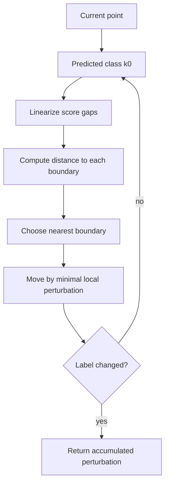

# DeepFool

DeepFool is a geometric white-box attack that estimates the smallest perturbation needed to cross a classifier's decision boundary. Instead of taking a fixed-budget step such as FGSM or PGD, it repeatedly linearizes the classifier around the current point and moves to the nearest linearized boundary. The result is an attack and diagnostic tool for measuring local boundary distance.

The key intuition is simple: if a nonlinear classifier is locally approximated by affine class scores, then the minimal $\ell_2$ perturbation to change the class can be computed from distances to hyperplanes. DeepFool applies that idea iteratively until the predicted label changes.

## Threat model

DeepFool is primarily a white-box, untargeted, digital evasion attack. The attacker can evaluate class scores and gradients with respect to the input. The classic version seeks a small perturbation:

$$
\min_r \|r\|_2
\quad \text{subject to} \quad
\hat{k}(x+r)\ne \hat{k}(x),
$$

where $\hat{k}(x)$ is the model's predicted class. Unlike PGD, DeepFool is usually framed as minimal-distortion search rather than fixed-budget maximization. Its output can later be checked against a chosen budget, but the algorithm itself asks "how far is the boundary?"

DeepFool is not a black-box attack and does not by itself model physical transformations. It is also not a proof of the true minimal distance for nonlinear networks; it is an iterative linear approximation.

## Method

For a binary affine classifier:

$$
f(x)=w^\top x+b,
$$

the decision boundary is $f(x)=0$. If $f(x)\gt 0$, the smallest $\ell_2$ perturbation to reach the boundary is:

$$
r^\star=-\frac{f(x)}{\|w\|_2^2}w.
$$

For multiclass scores $f_k(x)$, suppose the current class is:

$$
k_0=\arg\max_k f_k(x).
$$

For every other class $k$, linearize the score difference:

$$
f_k(x+r)-f_{k_0}(x+r)
\approx
(f_k(x)-f_{k_0}(x))+
(\nabla f_k(x)-\nabla f_{k_0}(x))^\top r.
$$

Define:

$$
w_k=\nabla f_k(x)-\nabla f_{k_0}(x),
\qquad
b_k=f_k(x)-f_{k_0}(x).
$$

The perturbation to reach class $k$'s linearized boundary has length:

$$
\frac{|b_k|}{\|w_k\|_2}.
$$

DeepFool chooses the nearest such boundary, adds the corresponding perturbation, and repeats. Many implementations multiply the final perturbation by a small overshoot factor so that the point crosses the boundary rather than landing numerically on it.

## Visual



| Attack | Objective style | Typical norm | What it estimates |
|---|---|---|---|
| FGSM | Fixed-budget loss increase | $\ell_\infty$ | Fast local vulnerability |
| PGD | Fixed-budget projected maximization | $\ell_\infty$, $\ell_2$ | Strong empirical worst case |
| DeepFool | Minimal boundary crossing | $\ell_2$ mainly | Local distance to decision boundary |
| C&W | Norm plus confidence penalty | $\ell_2$, $\ell_0$, $\ell_\infty$ variants | Low-distortion adversarial example |

## Worked example 1: Binary linear DeepFool step

Problem: Let:

$$
f(x)=w^\top x+b,\qquad w=(3,4),\quad b=-6,\quad x=(1,1).
$$

Compute the smallest $\ell_2$ perturbation to reach the boundary.

1. Evaluate the score:

$$
f(x)=3(1)+4(1)-6=1.
$$

2. Compute the squared norm:

$$
\|w\|_2^2=3^2+4^2=25.
$$

3. Use the binary formula:

$$
r^\star=-\frac{f(x)}{\|w\|_2^2}w
=-\frac{1}{25}(3,4)
=(-0.12,-0.16).
$$

4. Check that the boundary is reached:

$$
f(x+r^\star)
=3(0.88)+4(0.84)-6
=2.64+3.36-6
=0.
$$

5. Perturbation length:

$$
\|r^\star\|_2=\sqrt{0.12^2+0.16^2}=0.20.
$$

Checked answer: $r^\star=(-0.12,-0.16)$ reaches the boundary with length $0.20$.

## Worked example 2: Choosing the nearest multiclass boundary

Problem: A point is currently classified as class $0$. For two competing classes, the linearized gaps are:

$$
b_1=f_1(x)-f_0(x)=-2,\quad \|w_1\|_2=4,
$$

and:

$$
b_2=f_2(x)-f_0(x)=-3,\quad \|w_2\|_2=10.
$$

Which boundary should DeepFool move toward?

1. Compute the distance to class $1$ boundary:

$$
d_1=\frac{|b_1|}{\|w_1\|_2}=\frac{2}{4}=0.5.
$$

2. Compute the distance to class $2$ boundary:

$$
d_2=\frac{|b_2|}{\|w_2\|_2}=\frac{3}{10}=0.3.
$$

3. Compare:

$$
d_2<d_1.
$$

4. DeepFool chooses class $2$'s linearized boundary for this iteration.

Checked answer: even though class $2$ has a larger score gap in absolute value, its boundary is closer because the gradient difference is much larger.

## Implementation

```python
import torch

def deepfool_step_multiclass(model, x, num_classes=10):
    x = x.detach().clone().requires_grad_(True)
    logits = model(x)
    k0 = logits.argmax(dim=1).item()
    f0 = logits[0, k0]
    grad0 = torch.autograd.grad(f0, x, retain_graph=True)[0]

    best_dist = float("inf")
    best_r = None
    for k in range(num_classes):
        if k == k0:
            continue
        fk = logits[0, k]
        gradk = torch.autograd.grad(fk, x, retain_graph=True)[0]
        w = gradk - grad0
        gap = (fk - f0).detach()
        dist = gap.abs() / w.view(-1).norm(p=2).clamp_min(1e-12)
        if dist.item() < best_dist:
            best_dist = dist.item()
            best_r = (gap.abs() / w.view(-1).norm(p=2).pow(2).clamp_min(1e-12)) * w

    return best_r.detach()
```

This function shows one local step for one image. A full implementation accumulates steps, clips to the valid input range, checks whether the label changed, and applies a small overshoot at the end.

## Original paper results

Moosavi-Dezfooli, Fawzi, and Frossard introduced DeepFool at CVPR 2016. The paper compared DeepFool with earlier methods on image classifiers and emphasized that DeepFool often found smaller perturbations than then-standard baselines while remaining computationally efficient.

The safe headline is that DeepFool made boundary-distance estimation practical for deep classifiers and showed that small local perturbations could reliably cross the classifier boundary. The exact distortion numbers vary by architecture and dataset, so use the paper tables for numerical comparisons rather than treating one number as universal.

## Connections

- [White-box attacks](/cs/adversarial-attacks/white-box-attacks) places DeepFool among gradient-based methods.
- [Carlini-Wagner attack](/cs/adversarial-attacks/carlini-wagner-attack) is another low-distortion optimization attack.
- [Universal adversarial perturbations](/cs/adversarial-attacks/universal-adversarial-perturbations) uses DeepFool-style steps to build a dataset-level perturbation.
- [Mathematical formulation](/cs/adversarial-attacks/mathematical-formulation) explains constrained optimization and boundary geometry.
- [Evaluation and benchmarks](/cs/adversarial-attacks/evaluation-and-benchmarks) cautions against relying on a single attack.

## Common pitfalls / when this attack is used today

- Treating DeepFool's perturbation as a formal minimum for a nonlinear network.
- Forgetting to clip the final adversarial input to the valid input range.
- Comparing DeepFool distances across models trained with different preprocessing.
- Using only top few classes without checking whether that approximation misses a closer boundary.
- Evaluating defenses only with DeepFool when fixed-budget attacks such as PGD or AutoAttack are required.
- Using DeepFool today for geometric diagnostics, universal perturbation construction, and low-distortion baselines.

DeepFool is best read as a boundary-distance probe. It gives a local estimate of how far the current prediction is from changing under the model's geometry. That makes it useful for comparing margins, studying decision-boundary shape, and constructing universal perturbations. It is less suitable as the only attack in a robustness benchmark because a defense can increase DeepFool's estimated distance while still failing under a fixed-budget loss-maximizing attack.

The overshoot parameter is small but important. Without overshoot, a computed perturbation may land numerically on the linearized boundary, and floating-point or nonlinear curvature can leave the prediction unchanged. With too much overshoot, the reported perturbation norm is inflated. A careful implementation records whether the final perturbation includes overshoot and whether the norm reported is before or after clipping and overshoot.

Multiclass DeepFool also depends on how many competing classes are considered. Computing gradients for every class can be expensive for ImageNet-scale models. Considering only the top classes is faster, but it may miss a closer boundary associated with a lower-scoring class. If the page or paper reports DeepFool distances, it should state whether all classes or a subset were used. This matters when comparing architectures with different logit distributions.

Another subtlety is the label used for success. DeepFool often starts from the model's predicted label $\hat{k}(x)$ rather than the ground-truth label. That is appropriate when measuring distance to any decision change around a point, but it differs from robust accuracy, which usually asks whether a correctly classified clean input can be made incorrect relative to $y$. If the clean point is already misclassified, a boundary-distance number and a robust-accuracy number answer different questions.

For defenses, DeepFool can reveal whether the model has larger local margins, but it does not test every adaptive concern. A nondifferentiable preprocessing layer can break DeepFool gradients without improving real robustness. A randomized defense needs an expected objective. A certified defense should be judged by its certificate, not by DeepFool failing. Use DeepFool as one lens on geometry, then cross-check with PGD, C&W-style optimization, black-box attacks, and any certificate available for the same norm.

A compact DeepFool reporting checklist is:

| Field | What to write down |
|---|---|
| Norm | Usually $\ell_2$, but state the metric explicitly |
| Classes considered | All classes or top-$K$ competitors |
| Overshoot | Value used and whether reported norms include it |
| Stopping rule | Label change, max iterations, or margin threshold |
| Label convention | Clean prediction versus ground-truth label |
| Clipping | Whether adversarial examples are clipped to valid input range |

For reproduction, report the distribution of perturbation norms, not only the mean. Boundary-distance estimates can have a long tail: most examples may be near a boundary while a few are much farther away. Median, percentiles, and failure counts are more informative than a single average. If the attack fails to change the label within the iteration limit, those examples should not disappear from the table.

DeepFool is also useful for comparing robust and nonrobust models qualitatively. Robustly trained models often have larger estimated boundary distances, but the relation is not perfect. A model can have larger DeepFool distances under $\ell_2$ and still fail at small $\ell_\infty$ budgets. The page should therefore be read together with the threat-model page: the geometry measured is the geometry specified.

A final interpretation point is that DeepFool's name can overstate what it guarantees. It is "deep" in the sense that it attacks deep networks, but the local step is a linearized boundary calculation. That is why it is fast and interpretable, and also why it can miss nonlinear paths to closer adversarial examples. Use it as a geometric estimator, not an oracle.

For teaching, DeepFool is a strong companion to C&W. Both seek small perturbations, but DeepFool repeatedly solves local linear boundary problems while C&W optimizes a global penalty objective. Comparing their outputs on the same model helps separate boundary geometry from optimizer behavior.

## Further reading

- Moosavi-Dezfooli, Fawzi, and Frossard, "DeepFool: A Simple and Accurate Method to Fool Deep Neural Networks."
- Moosavi-Dezfooli et al., "Universal Adversarial Perturbations."
- Carlini and Wagner, "Towards Evaluating the Robustness of Neural Networks."
