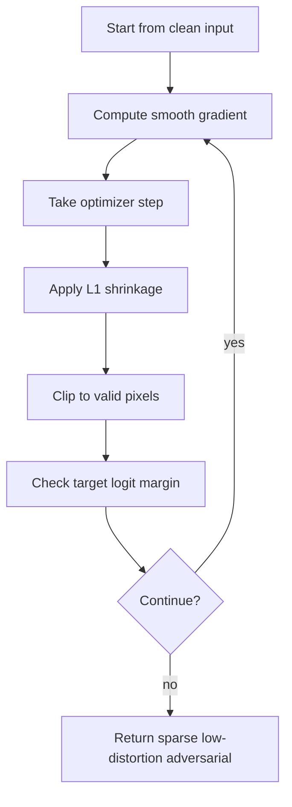

# EAD Elastic-Net Attack

The Elastic-Net Attack to Deep Neural Networks (EAD) extends C&W-style optimization by combining an $\ell_2$ penalty with an $\ell_1$ penalty. The $\ell_1$ term encourages sparse, concentrated perturbations; the $\ell_2$ term keeps the overall energy controlled. This makes EAD a bridge between low-distortion dense attacks and sparse attacks such as one-pixel or JSMA-style methods.

EAD matters because "small perturbation" depends on the metric. Two examples can have similar $\ell_2$ distortion while one changes many pixels slightly and the other changes fewer pixels more clearly. Elastic-net regularization lets the attack explore that tradeoff directly.

## Threat model

EAD is a white-box, optimization-based, digital evasion attack. The original formulation is targeted: given source input $x$ and target class $t$, find an adversarial input $x'$ that is classified as $t$ while remaining close to $x$.

The attacker knows the model logits and can optimize through them. The perturbation is constrained to valid input bounds:

$$
x'\in[0,1]^d.
$$

The objective includes both $\ell_1$ and $\ell_2$ terms:

$$
\|x'-x\|_1,\qquad \|x'-x\|_2^2.
$$

Like C&W, EAD is not a certificate. It is a strong attack family for exploring whether a model can be fooled under mixed sparse-and-dense distortion penalties.

## Method

A common targeted EAD objective is:

$$
\min_{x'}
c\,g(x')+\beta\|x'-x\|_1+\|x'-x\|_2^2
\quad \text{subject to} \quad x'\in[0,1]^d.
$$

Here $g$ is a targeted attack loss based on logits. For target $t$:

$$
g(x')=
\max\left(
\max_{i\ne t} Z_i(x')-Z_t(x'),\ -\kappa
\right).
$$

The hyperparameter $\beta$ controls sparsity. If $\beta=0$, the attack resembles the C&W $\ell_2$ attack. As $\beta$ grows, the optimizer is penalized for spreading small changes across many pixels.

The $\ell_1$ term is nonsmooth, so EAD uses an iterative shrinkage-thresholding style update. A gradient step handles the smooth part:

$$
c\,g(x')+\|x'-x\|_2^2,
$$

then a proximal step applies soft-thresholding around the original input. For a scalar coordinate $z_i$, the proximal update for $\ell_1$ shrinkage is:

$$
\mathrm{shrink}(z_i-x_i,\lambda)
=
\mathrm{sign}(z_i-x_i)\max(|z_i-x_i|-\lambda,0).
$$

The updated coordinate becomes $x_i+\mathrm{shrink}(z_i-x_i,\lambda)$, clipped to $[0,1]$.

## Visual



| Parameter | Effect when increased | Practical warning |
|---|---|---|
| $c$ | Prioritizes attack success | Too high can over-perturb |
| $\beta$ | Encourages sparsity through $\ell_1$ | Too high may prevent success |
| $\kappa$ | Requires larger target margin | Improves confidence but increases distortion |
| Iterations | Improves optimization search | Cost rises quickly |
| Binary search over $c$ | Finds better success-distortion balance | Needed for fair comparisons |

## Worked example 1: Elastic-net penalty comparison

Problem: Compare two perturbations:

$$
\delta_A=(0.1,0.1,0.1,0.1),\qquad
\delta_B=(0.2,0,0,0).
$$

Compute $\ell_1$ and squared $\ell_2$ penalties.

1. For $\delta_A$:

$$
\|\delta_A\|_1=0.1+0.1+0.1+0.1=0.4.
$$

2. Squared $\ell_2$:

$$
\|\delta_A\|_2^2=4(0.1)^2=0.04.
$$

3. For $\delta_B$:

$$
\|\delta_B\|_1=0.2.
$$

4. Squared $\ell_2$:

$$
\|\delta_B\|_2^2=(0.2)^2=0.04.
$$

Checked answer: the two perturbations have equal squared $\ell_2$ penalty but different $\ell_1$ penalty. EAD can prefer $\delta_B$ when sparsity matters.

## Worked example 2: One soft-thresholding coordinate

Problem: A clean pixel is $x_i=0.50$. After a gradient step the candidate is $z_i=0.57$. Use shrinkage threshold $\lambda=0.03$. What is the proximal $\ell_1$ update?

1. Compute the candidate difference:

$$
z_i-x_i=0.57-0.50=0.07.
$$

2. Apply soft thresholding:

$$
\max(|0.07|-0.03,0)=0.04.
$$

3. Keep the sign positive:

$$
\mathrm{shrink}(0.07,0.03)=0.04.
$$

4. Add back to the clean pixel:

$$
x_i+0.04=0.54.
$$

5. The value is already inside $[0,1]$.

Checked answer: the proximal step changes the gradient candidate from $0.57$ to $0.54$, pulling it toward the clean value to encourage sparsity.

## Implementation

```python
import torch
import torch.nn.functional as F

def soft_threshold(diff, lam):
    return diff.sign() * torch.clamp(diff.abs() - lam, min=0.0)

def ead_step(model, x_adv, x_clean, target, c=1.0, beta=0.01, lr=0.01, kappa=0.0):
    x_adv = x_adv.detach().clone().requires_grad_(True)
    logits = model(x_adv)
    target_logit = logits.gather(1, target[:, None]).squeeze(1)
    other = logits.clone()
    other.scatter_(1, target[:, None], -1e9)
    max_other = other.max(dim=1).values
    attack_loss = torch.clamp(max_other - target_logit, min=-kappa).sum()
    l2 = (x_adv - x_clean).pow(2).view(x_adv.size(0), -1).sum(dim=1).sum()
    smooth = c * attack_loss + l2
    grad = torch.autograd.grad(smooth, x_adv)[0]

    with torch.no_grad():
        z = x_adv - lr * grad
        diff = soft_threshold(z - x_clean, beta * lr)
        return (x_clean + diff).clamp(0.0, 1.0).detach()
```

This is one proximal-style step, not a full EAD implementation. A complete attack tracks best successful examples, searches over $c$, and runs many iterations.

## Original paper results

Chen, Sharma, Zhang, Yi, and Hsieh introduced EAD in 2017 and evaluated it on MNIST, CIFAR-10, and ImageNet. The paper reports that EAD produced adversarial examples with small $\ell_1$ distortion and attack performance comparable to state-of-the-art optimization attacks in several settings. It also emphasized improved transferability and the complementary role of $\ell_1$-oriented perturbations.

The conservative headline is that adding an $\ell_1$ term reveals adversarial examples with a different sparsity profile than pure $\ell_2$ attacks, not that one metric universally dominates.

## Connections

- [Carlini-Wagner attack](/cs/adversarial-attacks/carlini-wagner-attack) supplies the closest optimization template.
- [One-pixel attack](/cs/adversarial-attacks/one-pixel-attack) explores an extreme sparse black-box setting.
- [White-box attacks](/cs/adversarial-attacks/white-box-attacks) covers gradient-based optimization attacks.
- [Mathematical formulation](/cs/adversarial-attacks/mathematical-formulation) explains norms and constrained objectives.
- [Black-box and transfer attacks](/cs/adversarial-attacks/black-box-and-transfer-attacks) connects to EAD's transferability discussion.

## Common pitfalls / when this attack is used today

- Assuming $\ell_1$, $\ell_2$, and $\ell_\infty$ robustness are interchangeable.
- Setting $\beta=0$ and still describing the result as elastic-net sparse.
- Forgetting that proximal shrinkage is not the same as ordinary gradient descent.
- Reporting only success rate without distortion statistics.
- Comparing EAD with C&W without matching confidence, search, and iteration budgets.
- Using EAD today for sparse-versus-dense robustness diagnostics and metric-sensitive evaluations.

EAD is a reminder that robustness claims are metric-specific. A model can be relatively resistant to dense $\ell_2$ changes while remaining vulnerable to sparse, high-impact coordinate changes, or the reverse. Elastic-net regularization explores the middle of that spectrum. When reporting EAD, include $\ell_1$, $\ell_2$, and success statistics rather than a single distortion number. Otherwise the reader cannot see what the elastic-net term actually changed.

The $\beta$ parameter is the main interpretive knob. With very small $\beta$, EAD behaves close to a C&W $\ell_2$ attack and may distribute perturbation broadly. With very large $\beta$, the proximal step can zero out many coordinates but may fail to reach the target class. A sweep over $\beta$ can show whether the model is vulnerable to sparse perturbations, but each value changes the optimization problem. It is not fair to tune $\beta$ on the test set without saying so.

The decision rule for choosing the final adversarial example also matters. EAD papers often distinguish elastic-net decision rules and $\ell_1$ decision rules: should the selected candidate minimize the full elastic-net objective, or should it prioritize sparsity among successful examples? Different choices produce different examples. A page or experiment should state the selection rule along with the attack objective.

Transferability is one reason to care about sparse or $\ell_1$-oriented perturbations. Dense perturbations may exploit fine-grained source-model gradients, while sparse changes may hit more semantically or architecturally shared sensitivities. That is not guaranteed, but it is a useful hypothesis to test. Transfer experiments should report the source model, target model, whether the target is queried, and the distortion statistics measured on the transferred examples.

In modern evaluation, EAD is not usually the first attack to run. Start with PGD or AutoAttack for standard $\ell_\infty$ and $\ell_2$ robustness. Use EAD when the question is metric sensitivity, sparse perturbation behavior, or comparison with C&W-style low-distortion optimization. It earns its place when the report explains why $\ell_1$ structure is meaningful for the application.

A compact EAD reporting checklist is:

| Field | What to write down |
|---|---|
| Objective | Exact elastic-net loss, including $c$, $\beta$, and $\kappa$ |
| Search | Binary search over $c$ and sweep over $\beta$ if used |
| Optimizer | Iterations, learning rate, and proximal update details |
| Decision rule | Elastic-net rule or $\ell_1$ rule for final candidate selection |
| Distortion | $\ell_1$, $\ell_2$, and success-rate statistics |
| Comparison | Matched C&W settings for a fair baseline |

For reproduction, the proximal step should be specified carefully. Some implementations apply shrinkage relative to the clean input, while others apply a generic optimizer with an $\ell_1$ penalty approximation. Those choices can produce different sparsity patterns. If the code uses FISTA-style acceleration, momentum, or early abort, include that in the method section.

EAD is especially useful in applications where sparse changes are plausible: sensors with a few corrupted measurements, pixels controlled by a display artifact, or feature vectors where a small number of fields can be manipulated. It is less meaningful if the domain does not permit isolated coordinate changes. As always, the mathematical metric should be justified by the application, not chosen only because it gives an interesting number.

A final interpretation point is that EAD changes the shape of the search, not the basic security standard. A model that survives EAD at one $\beta$ has not been proven robust to all sparse perturbations, and a model that fails EAD has failed under a particular elastic-net objective. The result becomes meaningful when compared with C&W, PGD, and sparse baselines under matched success criteria.

For teaching, EAD is a good place to introduce proximal optimization. The $\ell_1$ term is nonsmooth, so the algorithm is not merely "take the gradient of everything." That distinction helps students see why adversarial attacks borrow from optimization theory rather than only from neural-network backpropagation.

If the application has structured features rather than pixels, the sparse penalty may need groups instead of individual coordinates. For example, changing one categorical feature after one-hot encoding can flip several binary coordinates. The metric should match the real action the attacker can take.

## Further reading

- Chen et al., "EAD: Elastic-Net Attacks to Deep Neural Networks via Adversarial Examples."
- Carlini and Wagner, "Towards Evaluating the Robustness of Neural Networks."
- Papernot et al., "The Limitations of Deep Learning in Adversarial Settings."
