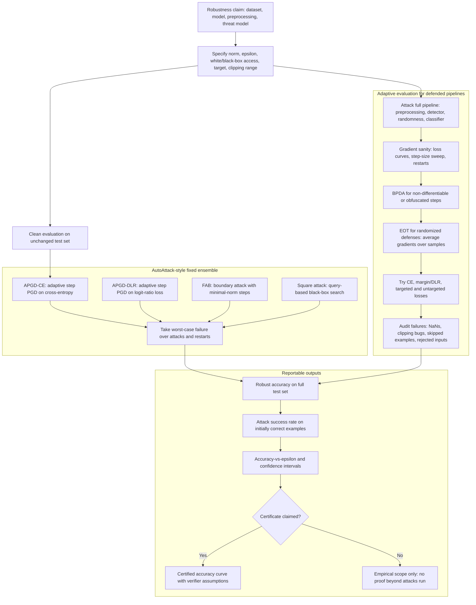

# Evaluation and Benchmarks

Adversarial robustness evaluation is unusually easy to get wrong. A model can look robust because the attack is weak, the threat model is underspecified, the preprocessing scale is inconsistent, gradients are masked, the query budget is too low, or the benchmark excludes failed examples. Good evaluation is therefore a core technical topic, not an administrative afterthought.


*Figure: The FGSM panda example shows that imperceptible perturbations can change model decisions. Image: [ar5iv](https://arxiv.org/abs/1412.6572), Goodfellow, Shlens, and Szegedy, educational use with attribution.*

This page gives a practical checklist for evaluating adversarial defenses. It covers robust accuracy, adaptive attacks, AutoAttack, RobustBench-style reporting, certified metrics, and common methodological errors. The goal is not to crown one benchmark as final, but to make robustness claims reproducible and threat-model-specific.

## Definitions

**Clean accuracy** is accuracy on unmodified test examples:

$$
\mathrm{Acc}_{\mathrm{clean}}
=
\frac{1}{n}\sum_{i=1}^n
\mathbf{1}[h(x_i)=y_i].
$$

**Robust accuracy** under an attack procedure $A$ is accuracy on adversarial examples produced by $A$:

$$
\mathrm{Acc}_{\mathrm{rob}}(A)
=
\frac{1}{n}\sum_{i=1}^n
\mathbf{1}[h(A(x_i,y_i))=y_i].
$$

This is an empirical metric. It depends on the attack. A more semantic definition under a perturbation set $\Delta(x)$ is:

$$
\mathrm{Acc}_{\mathrm{rob}}(\Delta)
=
\frac{1}{n}\sum_{i=1}^n
\mathbf{1}[\forall \delta \in \Delta(x_i),\ h(x_i+\delta)=y_i],
$$

but this quantity is usually not exactly computable for deep networks.

**Attack success rate** for untargeted attacks is:

$$
\mathrm{ASR}
=
\frac{\#\{i : h(x_i)=y_i \ \text{and}\ h(x_i') \ne y_i\}}
{\#\{i : h(x_i)=y_i\}},
$$

when measured only on initially correct examples. Reports should state whether initially incorrect examples are included.

An **adaptive attack** is designed with knowledge of the defense. It attacks the full defended pipeline and uses appropriate objectives, BPDA, EOT, restarts, query search, or detector-evasion terms as needed.

**AutoAttack** is an ensemble-style evaluation protocol combining diverse attacks with minimal manual tuning. **RobustBench** is a benchmark and leaderboard ecosystem that standardizes datasets, threat models, and evaluation protocols for adversarial and corruption robustness.

## Key results

The main evaluation principle is monotonic skepticism: a robustness number is an upper bound until stronger or better-adapted attacks fail. Empirical robust accuracy can only decrease as attacks improve. Therefore, a defense paper should welcome stronger attacks; if the number changes dramatically under a reasonable adaptive attack, the original claim was too broad.

A strong evaluation reports:

- Dataset, model architecture, training data, and preprocessing.
- Threat model: norm, $\epsilon$, clipping range, target type, query budget, and attacker knowledge.
- Attack suite: algorithms, steps, restarts, losses, step sizes, stopping rules, random seeds, and adaptive components.
- Metrics: clean accuracy, robust accuracy, attack success rate, certified accuracy if applicable, and compute or query cost.
- Scope limits: what is not covered, such as patches, common corruptions, distribution shift, or prompt injection.

AutoAttack-style evaluation is useful because it combines attacks with different failure modes. A single PGD configuration can be mis-tuned; an ensemble including APGD variants, targeted losses, FAB-style boundary search, and Square Attack is harder to fool accidentally. It is not magic: defenses with unusual preprocessing, randomness, detectors, or nonstandard threat models still need adaptive evaluation beyond a canned attack suite.

Benchmarks such as RobustBench improve comparability by fixing datasets, norms, radii, and evaluation code. They also reduce selective reporting. However, leaderboard numbers should still be read as numbers under a specific protocol. A high CIFAR-10 $\ell_\infty$ score does not establish physical robustness, language robustness, or unrestricted semantic robustness.

For certified defenses, evaluation changes from "what attack did we run?" to "what verifier and confidence assumptions produced the certificate?" Certified accuracy at radius $r$ is not the same as empirical robust accuracy at $\epsilon=r$, but both are useful. A certified model can have lower certified accuracy than empirical robust accuracy because certificates are conservative.

Reproducibility also matters because robustness evaluations can be expensive and sensitive. A useful report records the exact checkpoint, attack implementation, random seeds, batch size, precision mode, number of evaluated examples, and whether gradients were accumulated or approximated. For query-based attacks, it reports failed examples at the query limit rather than dropping them. For randomized defenses, it reports the number of samples used by the attacker and the number used by the defense. These details let another evaluator decide whether a different result reflects a real improvement or simply a different protocol.

Subsets require caution. Evaluating on 1000 examples can be reasonable for expensive attacks, but the subset should be fixed, representative, and disclosed. Otherwise a defense can look stronger simply because difficult examples were omitted or because initially misclassified examples were handled inconsistently.

A useful habit is to phrase every table caption as a threat-model statement. If the caption cannot fit the norm, radius, access model, attack suite, and data split, the table is probably underspecified.

## Adaptive attack suites

### Ensemble baselines for empirical robustness


*Figure: AutoAttack combines complementary attacks to reduce dependence on one manually tuned PGD configuration. From [Croce and Hein, 2020](https://arxiv.org/abs/2003.01690) — embedded under educational fair use with attribution.*

Croce and Hein [1] introduced AutoAttack as an ensemble-style protocol for reliable empirical evaluation under standard norm-bounded threat models. The point is not that any finite suite is exhaustive; it is that combining attacks with different losses and search behavior reduces the chance that a single mis-tuned PGD run gives a misleading robustness number.

The evaluation logic is:

$$
\mathrm{Acc}_{\mathrm{rob}}(\mathcal{A})
=
\frac{1}{n}\sum_{i=1}^{n}
\mathbf{1}\left[
\forall A\in\mathcal{A},\ h(A(x_i,y_i))=y_i
\right],
$$

where $\mathcal{A}$ is the chosen attack suite. If any attack in the suite finds a valid adversarial example, the example is counted as non-robust under that empirical protocol.

Compact pseudo-code:

```text
robust = initially_correct_examples
for attack in attack_suite:
    x_adv = attack(model, remaining_robust_examples)
    robust = robust AND model(x_adv) == y
report clean accuracy, robust accuracy, and threat model
```

This style of evaluation is useful for standard benchmarks, but unusual defenses with randomness, detectors, nondifferentiable preprocessing, or nonstandard threat models still require custom adaptive attacks.

### Budget-aware adaptive evaluation

Liu et al. [2] proposed Adaptive Auto Attack, often abbreviated A3, for practical robustness testing under finite attack budgets. Its contribution is evaluation efficiency: use adaptive direction initialization and online discarding so that computation is spent on examples more likely to reveal additional failures.

If a naive evaluation gives every example the same attack budget:

$$
T_i=T\quad\text{for all }i,
$$

an adaptive evaluator reallocates effort based on observed margins, progress, and prior successes:

$$
T_i \leftarrow T_i+\Delta T_i.
$$

The result is still empirical. If the attack finds $s$ failures among $n$ examples, the robust accuracy under that evaluation is:

$$
\widehat{\mathrm{Acc}}_{\mathrm{rob}}
=
\frac{n-s}{n}.
$$

Worked micro-example: on $1000$ images, if an adaptive attack finds adversarial examples for $430$, the empirical robust accuracy is $(1000-430)/1000=57\%$. The true robust accuracy under the threat model could be lower because a stronger future attack may find more failures.

Adaptive discarding must be reported carefully. A fair comparison specifies the discard rule, total iteration or gradient budget, active-set accounting, and how failed, discarded, and already-successful examples are counted.

## Visual



This diagram expands evaluation into the fixed AutoAttack ensemble and the adaptive path needed for unusual defenses. The outputs distinguish empirical robust accuracy from certified accuracy, and the failure-audit blocks make preprocessing, randomness, skipped examples, and gradient masking visible rather than hidden in a single score.

| Question | Bad answer | Better answer |
|---|---|---|
| What is the threat model? | "Small perturbations" | "$\ell_\infty$, $\epsilon=8/255$, white-box, untargeted, clipped to $[0,1]$" |
| What attack was used? | "PGD" | "PGD-50, 10 restarts, CE and margin losses, tuned step size" |
| Does the attack include the defense? | "We attacked the classifier" | "We attacked the full preprocessing plus classifier pipeline" |
| Are gradients reliable? | "The attack failed" | "Loss curves, restarts, BPDA/EOT checks, black-box sanity checks" |
| Is this certified? | "No attack found examples" | "Verifier proves radius $r$ with stated assumptions" |
| Can results be compared? | "Different datasets and epsilons" | "Same dataset, preprocessing, norm, radius, and evaluation code" |

## Worked example 1: Robust accuracy and attack success rate

Problem: A classifier is evaluated on 1000 examples. It correctly classifies 900 clean examples. An untargeted attack changes the prediction on 360 of those 900 initially correct examples. Compute robust accuracy on the full test set and attack success rate on initially correct examples.

1. Initially correct examples:

$$
n_{\mathrm{correct}}=900.
$$

2. Successful attacks among those:

$$
n_{\mathrm{success}}=360.
$$

3. Still correct after attack:

$$
900-360=540.
$$

4. Robust accuracy on the full 1000-example test set:

$$
\mathrm{Acc}_{\mathrm{rob}}=\frac{540}{1000}=0.54=54\%.
$$

5. Attack success rate on initially correct examples:

$$
\mathrm{ASR}=\frac{360}{900}=0.40=40\%.
$$

Checked answer: robust accuracy is $54\%$ on the full test set, while attack success rate is $40\%$ among initially correct examples. Both numbers are useful, but they answer different questions.

## Worked example 2: Detecting an unfair benchmark comparison

Problem: Model A reports $48\%$ robust accuracy on CIFAR-10 at $\ell_\infty$, $\epsilon=8/255$, evaluated with AutoAttack. Model B reports $55\%$ robust accuracy on CIFAR-10 at $\ell_\infty$, $\epsilon=4/255$, evaluated with PGD-10 and one restart. Can we conclude B is more robust?

1. Compare datasets:

$$
\text{Both use CIFAR-10.}
$$

2. Compare norms:

$$
\text{Both use } \ell_\infty.
$$

3. Compare radii:

$$
8/255 \ne 4/255.
$$

   B is evaluated at a smaller perturbation radius.

4. Compare attack strength:

$$
\text{AutoAttack} \ne \text{PGD-10 with one restart}.
$$

   A is evaluated with a stronger and more diverse protocol.

5. Since both $\epsilon$ and attack suite differ, the numbers are not directly comparable.

Checked answer: no, we cannot conclude B is more robust. A fair comparison needs the same preprocessing, radius, norm, and evaluation protocol.

## Code

```python
import torch

@torch.no_grad()
def accuracy(model, x, y):
    return model(x).argmax(dim=1).eq(y).float().mean().item()

def evaluate_attack(model, attack_fn, x, y):
    model.eval()
    with torch.no_grad():
        clean_pred = model(x).argmax(dim=1)
        initially_correct = clean_pred.eq(y)

    x_adv = attack_fn(model, x, y)
    with torch.no_grad():
        adv_pred = model(x_adv).argmax(dim=1)

    robust_correct = adv_pred.eq(y)
    robust_acc = robust_correct.float().mean().item()
    if initially_correct.any():
        asr = adv_pred[initially_correct].ne(y[initially_correct]).float().mean().item()
    else:
        asr = float("nan")

    return {
        "clean_acc": initially_correct.float().mean().item(),
        "robust_acc": robust_acc,
        "attack_success_rate_on_clean_correct": asr,
    }
```

This code separates clean accuracy, robust accuracy over the full batch, and attack success rate on initially correct examples. A real benchmark should also record threat-model parameters, attack hyperparameters, random seeds, and query counts.

## Common pitfalls

- Reporting only the best-looking metric: clean accuracy without robust accuracy, or robust accuracy without clean accuracy.
- Evaluating with a weaker attack than the one used in training.
- Omitting initially failed clean examples without saying so.
- Comparing different $\epsilon$ values, preprocessing scales, or datasets.
- Forgetting adaptive attacks for randomized, nondifferentiable, detector-based, or preprocessing-heavy defenses.
- Treating leaderboard performance under one norm as a general safety guarantee.
- Ignoring confidence intervals or variance when evaluation uses sampling or small test subsets.
- Reporting certified numbers and empirical numbers in the same table without labeling them clearly.

## Connections

- [Threat models and attack taxonomy](/cs/adversarial-attacks/threat-models-and-attack-taxonomy) is the starting point for every evaluation.
- [White-box attacks](/cs/adversarial-attacks/white-box-attacks) and [black-box and transfer attacks](/cs/adversarial-attacks/black-box-and-transfer-attacks) define attack suites.
- [Gradient masking and obfuscation](/cs/adversarial-attacks/gradient-masking-and-obfuscation) gives diagnostics for suspicious robustness.
- [Certified defenses and randomized smoothing](/cs/adversarial-attacks/certified-defenses-and-randomized-smoothing) explains certified accuracy.
- [Adversarial training](/cs/adversarial-attacks/adversarial-training) is the defense most commonly evaluated in robustness benchmarks.

## Further reading

- Croce and Hein, "Reliable Evaluation of Adversarial Robustness with an Ensemble of Diverse Parameter-free Attacks."
- RobustBench benchmark documentation and leaderboard.
- Carlini et al., work on adaptive attacks and evaluating defenses.
- Athalye, Carlini, and Wagner, "Obfuscated Gradients Give a False Sense of Security."
- Tramer et al., work on adaptive attacks against defenses.

## References

[1] F. Croce, M. Hein. *Reliable Evaluation of Adversarial Robustness with an Ensemble of Diverse Parameter-free Attacks*. ICML 2020.
[2] Y. Liu, Y. Cheng, L. Gao, X. Liu, Q. Zhang, J. Song. *Practical Evaluation of Adversarial Robustness via Adaptive Auto Attack*. CVPR 2022.
