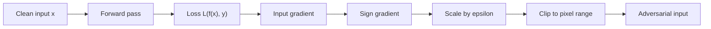

# FGSM

The Fast Gradient Sign Method (FGSM) is the canonical one-step white-box attack. It turns the local gradient of the loss with respect to the input into a perturbation by taking only the sign of each coordinate, then scaling by an $\ell_\infty$ budget. Its importance is not that it is the strongest attack today, but that it explains why high-dimensional linear behavior can make tiny per-pixel changes add up to a large change in model score.

FGSM sits at the start of the gradient-attack family that later includes BIM/I-FGSM, PGD, momentum iterative attacks, and adversarial training. It is useful as a teaching example, a fast baseline, and a component in fast training schemes, but a model that survives FGSM alone should not be called robust.

## Threat model

FGSM is usually stated as a white-box, untargeted, digital evasion attack on an image classifier. The attacker knows the model, loss, preprocessing, and label $y$, and can compute:

$$
\nabla_x \mathcal{L}(f_\theta(x), y).
$$

The standard budget is an $\ell_\infty$ ball:

$$
\Delta(x)=\{\delta:\|\delta\|_\infty \le \epsilon,\ x+\delta\in[0,1]^d\}.
$$

For an untargeted attack the goal is $f_\theta(x+\delta)\ne y$. For a targeted variant with target $y_t$, the attacker usually moves in the negative sign-gradient direction of $\mathcal{L}(f_\theta(x),y_t)$ so that the target label becomes more likely.

FGSM is not a black-box attack unless the gradient is replaced by a surrogate gradient. It is not a physical attack unless the image perturbation is optimized through printing, viewing, and camera transformations, which ordinary FGSM does not do.

## Method

FGSM follows from a first-order Taylor approximation:

$$
\mathcal{L}(f_\theta(x+\delta),y)
\approx
\mathcal{L}(f_\theta(x),y)+
\delta^\top \nabla_x\mathcal{L}(f_\theta(x),y).
$$

Let:

$$
g=\nabla_x\mathcal{L}(f_\theta(x),y).
$$

The linearized attack problem is:

$$
\max_{\|\delta\|_\infty\le\epsilon} g^\top\delta.
$$

This separates coordinate by coordinate. If $g_i\gt 0$, choose $\delta_i=\epsilon$; if $g_i\lt 0$, choose $\delta_i=-\epsilon$; if $g_i=0$, either sign gives no first-order change. Therefore:

$$
\delta^\star=\epsilon\,\mathrm{sign}(g),
$$

and the clipped adversarial image is:

$$
x_{\mathrm{adv}}
=
\Pi_{[0,1]^d}
\left(x+\epsilon\,\mathrm{sign}(\nabla_x\mathcal{L}(f_\theta(x),y))\right).
$$

For targeted FGSM:

$$
x_{\mathrm{adv}}
=
\Pi_{[0,1]^d}
\left(x-\epsilon\,\mathrm{sign}(\nabla_x\mathcal{L}(f_\theta(x),y_t))\right).
$$

The simplicity is the strength and weakness. One backward pass is enough, but the attack trusts the loss surface at exactly the clean input. If the decision boundary is curved or the model has been trained to resist one-step changes, an iterative method such as [PGD](/cs/adversarial-attacks/pgd) is a much stronger evaluation.

## Visual



| Variant | Update | Main use | Caveat |
|---|---|---|---|
| Untargeted FGSM | $x+\epsilon\mathrm{sign}(\nabla_x\mathcal{L}(x,y))$ | Fast baseline | Often too weak for evaluation |
| Targeted FGSM | $x-\epsilon\mathrm{sign}(\nabla_x\mathcal{L}(x,y_t))$ | Force a chosen class | Usually harder than untargeted |
| Surrogate FGSM | Use $\nabla_x$ from $\tilde f$ | Transfer baseline | Success depends on surrogate alignment |
| Random-start FGSM | Start inside ball, then one step | Fast training variant | Can still miss hard points |

## Worked example 1: Four-pixel FGSM step

Problem: A normalized grayscale input has four pixels:

$$
x=(0.20,0.50,0.90,0.10),
$$

and the loss gradient is:

$$
g=(-2.0,0.3,0.0,5.0).
$$

Compute untargeted FGSM with $\epsilon=0.05$.

1. Take the elementwise sign:

$$
\mathrm{sign}(g)=(-1,1,0,1).
$$

2. Scale by the budget:

$$
\delta=0.05(-1,1,0,1)=(-0.05,0.05,0,0.05).
$$

3. Add to the input:

$$
x+\delta=(0.15,0.55,0.90,0.15).
$$

4. Clip to $[0,1]$. No coordinate leaves the range.

Checked answer:

$$
x_{\mathrm{adv}}=(0.15,0.55,0.90,0.15).
$$

The third coordinate stays fixed because its gradient coordinate is zero. In a real network, a large number of zero gradients can indicate saturation or nondifferentiable preprocessing, so FGSM should be followed by stronger diagnostics.

## Worked example 2: Why the sign is optimal under $\ell_\infty$

Problem: Let:

$$
g=(3,-1,2),\qquad \epsilon=0.1.
$$

Solve:

$$
\max_{\|\delta\|_\infty\le 0.1} g^\top\delta.
$$

1. The constraint means each coordinate satisfies:

$$
-0.1\le \delta_i\le 0.1.
$$

2. Expand the dot product:

$$
g^\top\delta=3\delta_1-\delta_2+2\delta_3.
$$

3. Maximize each term independently. For $3\delta_1$, choose $\delta_1=0.1$. For $-\delta_2$, choose $\delta_2=-0.1$. For $2\delta_3$, choose $\delta_3=0.1$.

4. Thus:

$$
\delta^\star=(0.1,-0.1,0.1)=0.1\,\mathrm{sign}(g).
$$

5. The achieved first-order increase is:

$$
3(0.1)-(-0.1)+2(0.1)=0.6.
$$

Checked answer: the sign update is not a heuristic for the linearized $\ell_\infty$ problem. It is the exact maximizer of that local approximation.

## Implementation

```python
import torch
import torch.nn.functional as F

def fgsm(model, x, y, epsilon):
    model.eval()
    x_adv = x.detach().clone().requires_grad_(True)
    logits = model(x_adv)
    loss = F.cross_entropy(logits, y)
    grad = torch.autograd.grad(loss, x_adv)[0]
    with torch.no_grad():
        x_adv = x_adv + epsilon * grad.sign()
        x_adv = x_adv.clamp(0.0, 1.0)
    return x_adv.detach()

def targeted_fgsm(model, x, target, epsilon):
    model.eval()
    x_adv = x.detach().clone().requires_grad_(True)
    loss = F.cross_entropy(model(x_adv), target)
    grad = torch.autograd.grad(loss, x_adv)[0]
    with torch.no_grad():
        x_adv = x_adv - epsilon * grad.sign()
        return x_adv.clamp(0.0, 1.0).detach()
```

The snippet assumes pixel values already live in $[0,1]$. If the model expects channel normalization, attack the normalized computation while projecting the underlying image back to the valid pixel interval.

## Original paper results

Goodfellow, Shlens, and Szegedy introduced FGSM in "Explaining and Harnessing Adversarial Examples," posted in 2014 and published at ICLR 2015. The paper used neural networks on datasets including MNIST and ImageNet-scale examples, and argued that adversarial examples arise from linear behavior in high-dimensional spaces rather than only from extreme nonlinear quirks.

The conservative headline is the method itself: one backward pass can produce small $\ell_\infty$ perturbations that cause confident misclassification, and including adversarial examples during training improves robustness to similar examples. The exact numerical results depend on architecture, preprocessing, and $\epsilon$, so this page treats the paper as the origin of the one-step sign-gradient baseline rather than quoting a universal robustness number.

## Connections

- [White-box attacks](/cs/adversarial-attacks/white-box-attacks) gives the broader family containing FGSM.
- [Mathematical formulation](/cs/adversarial-attacks/mathematical-formulation) derives the dual-norm view behind the sign update.
- [PGD](/cs/adversarial-attacks/pgd) repeats projected gradient steps and is the stronger first-order evaluation baseline.
- [Adversarial training](/cs/adversarial-attacks/adversarial-training) uses generated adversarial examples during training.
- [Gradient masking and obfuscation](/cs/adversarial-attacks/gradient-masking-and-obfuscation) explains why FGSM failure can be misleading.
- [Deep learning](/cs/deep-learning/intro) supplies backpropagation and cross-entropy.

## Common pitfalls / when this attack is used today

- Treating FGSM accuracy as a complete robustness claim. It is a baseline and should be paired with iterative attacks.
- Forgetting that $\epsilon=8/255$ assumes pixel scaling to $[0,1]$.
- Attacking normalized tensors but clipping in normalized coordinates, which can silently use the wrong budget.
- Reporting targeted and untargeted FGSM together without labeling the goal.
- Assuming zero or tiny gradients mean safety; they may signal gradient masking.
- Using FGSM today for quick sanity checks, fast adversarial training variants, and teaching the local-linear explanation, not as a final benchmark.

FGSM is still useful because it fails quickly and informatively. If FGSM succeeds at a small budget, the model is plainly vulnerable under the stated threat model and there is no need to start with expensive attacks to establish that fact. If FGSM fails while iterative attacks succeed, the model may have a curved local loss surface, may have been trained against one-step attacks, or may simply require more than one step to leave the clean basin. If FGSM succeeds but PGD appears weaker, that is a warning sign: the PGD step size, projection, clipping, model mode, or loss implementation may be wrong.

One historical issue is label leaking. In some training setups, adversarial examples generated from the true label can accidentally encode information that the model learns to exploit, making FGSM adversarial training look better than it should. Random starts, careful loss choices, and stronger multi-step attacks reduce this failure mode. The broader lesson is that attack generation is part of the training distribution; if that distribution has artifacts, the model may learn the artifact instead of learning robust features.

For reporting, an FGSM result should include the pixel scale, $\epsilon$, whether the attack is targeted, whether gradients are taken through normalization, and whether the model is in training or evaluation mode. Batch normalization and dropout can change gradients. A model evaluated in a different mode from deployment is not being attacked under the stated system. If input preprocessing subtracts means and divides by standard deviations, the attack should still enforce the perturbation budget in the original input space unless the paper explicitly defines the budget in normalized coordinates.

FGSM is also a good way to teach dual norms. The sign update is the optimizer for a linear objective over an $\ell_\infty$ ball. If the threat set were $\ell_2$, the first-order optimizer would point in the normalized gradient direction; if the threat set were $\ell_1$, it would put mass on the largest-magnitude gradient coordinate. This is why the attack formula and the threat model are inseparable.

In modern robustness work, FGSM usually appears as a baseline row, a fast debugging check, or the inner step of fast adversarial training. A serious defense paper should not stop at FGSM. It should include iterative white-box attacks, restarts, adaptive attacks for any preprocessing or randomness, and ideally a standardized suite such as AutoAttack when the threat model matches.

A compact FGSM reporting checklist is:

| Field | What to write down |
|---|---|
| Input scale | Whether pixels are in $[0,1]$, $[0,255]$, or normalized coordinates |
| Budget | $\epsilon$ and the norm, almost always $\ell_\infty$ for FGSM |
| Goal | Targeted or untargeted, with target-label rule if targeted |
| Gradient path | Whether normalization, preprocessing, and defenses are differentiated through |
| Clipping | Whether projection is to pixel range only or also to a norm ball |
| Baselines | Which stronger attacks are run after FGSM |

For reproduction, store the exact model checkpoint, preprocessing code, random seed if any stochastic layers remain, and the clean accuracy of the attacked subset. An FGSM success rate on all test examples can differ from success rate on only clean-correct examples. Robust-accuracy reports usually restrict to examples the model classifies correctly before attack, or they count already-wrong examples separately. That convention should be explicit.

When FGSM is used inside training, log both clean and adversarial training losses. If adversarial loss suddenly collapses while stronger attacks still succeed, the model may have learned a degenerate response to the one-step generator. This is one route to catastrophic overfitting in fast adversarial training. The fix is not merely smaller learning rates; it is checking the training attack against stronger held-out attacks during training.

## Further reading

- Goodfellow, Shlens, and Szegedy, "Explaining and Harnessing Adversarial Examples."
- Kurakin, Goodfellow, and Bengio, "Adversarial Examples in the Physical World."
- Madry et al., "Towards Deep Learning Models Resistant to Adversarial Attacks."
- Dong et al., "Boosting Adversarial Attacks with Momentum."
