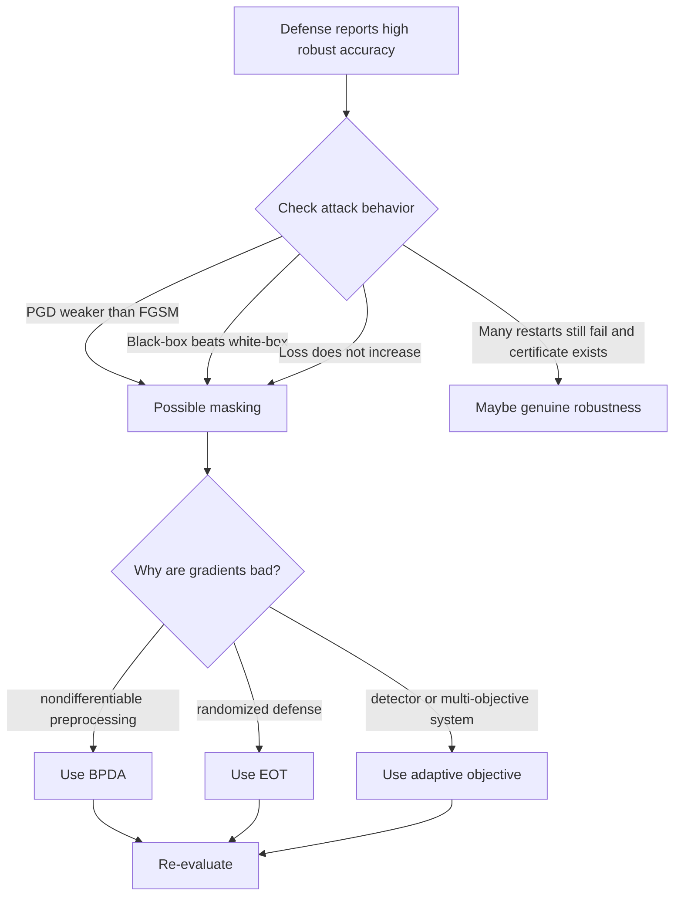

# Gradient Masking and Obfuscation

Gradient masking is the classic failure mode of adversarial defenses. A defense appears robust because common gradient attacks fail, but the model has not actually become robust inside the threat set. The gradients are missing, misleading, noisy, shattered, saturated, or hidden behind nondifferentiable operations. Once the attack is adapted, robustness collapses.


*Figure: The FGSM panda example shows that imperceptible perturbations can change model decisions. Image: [ar5iv](https://arxiv.org/abs/1412.6572), Goodfellow, Shlens, and Szegedy, educational use with attribution.*

This page explains why broken defenses can look strong, how to recognize the symptoms, and how adaptive attacks such as BPDA and EOT change the evaluation. It is the bridge between attack algorithms and benchmark discipline: every robustness claim should be checked for gradient masking before it is trusted.

## Definitions

**Gradient masking** is any situation where the gradient available to an attack does not provide useful information about adversarial directions, even though adversarial examples still exist. It can be accidental or intentionally caused by a defense.

**Obfuscated gradients** is a broader term popularized by Athalye, Carlini, and Wagner for defenses that cause gradient-based evaluation to fail without providing true robustness. Common types include:

- **Shattered gradients**: nondifferentiable or numerically unstable computations make gradients noisy or useless.
- **Stochastic gradients**: randomness causes a single gradient estimate to point in an unreliable direction.
- **Vanishing or exploding gradients**: saturated activations, quantization, or preprocessing lead to near-zero or unstable gradients.
- **Gradient hiding through preprocessing**: the attack differentiates through the wrong function or stops at a nondifferentiable step.

Let the defended system be:

$$
F(x)=f(T(x)),
$$

where $T$ is a preprocessing or defense transform. A naive attack may use $\nabla_x \mathcal{L}(f(x),y)$ or fail to differentiate through $T$. An adaptive attack instead targets:

$$
\nabla_x \mathcal{L}(f(T(x)),y).
$$

If $T$ is nondifferentiable, **Backward Pass Differentiable Approximation (BPDA)** uses the true forward pass but an approximate backward pass:

$$
\frac{\partial T}{\partial x} \approx \frac{\partial \tilde{T}}{\partial x},
$$

where $\tilde{T}$ is differentiable and close enough for gradient search. If the defense is randomized, **Expectation over Transformations (EOT)** attacks the expected loss:

$$
\nabla_x \mathbb{E}_{\omega}[\mathcal{L}(F(x,\omega),y)].
$$

## Key results

A basic warning sign is when weak attacks outperform strong ones. For example, if FGSM finds more adversarial examples than multi-step PGD, the PGD configuration may be broken or the defense may induce gradient masking. Stronger optimization should not generally make an attack worse when tuned correctly.

Another warning sign is a large gap between white-box and black-box attacks in the wrong direction. White-box attacks usually have at least as much information as black-box attacks. If transfer or score-based black-box attacks outperform naive white-box PGD, the white-box gradient may be uninformative. The correct response is not to claim black-box robustness; it is to adapt the white-box attack.

Loss curves are useful diagnostics. During a PGD attack, the adversarial loss should usually increase for untargeted attacks. If the loss is flat, erratic, or decreases while black-box attacks succeed, the gradient path is suspect. Random restarts should also matter: if one start fails, many starts may find a path unless the certificate is real.

Gradient masking differs from certified robustness. A certified defense proves no adversarial example exists in a specified region. Gradient masking only prevents a particular optimizer from finding one. The distinction is:

$$
\text{attack failure} \ne \text{nonexistence of adversarial examples}.
$$

Adaptive evaluation asks: what does the attacker know about the full system, and how can the attack optimize through or around that system? For nondifferentiable quantization, BPDA may use the identity function in the backward pass. For randomized defenses, EOT averages gradients over many random draws. For detectors, the attack objective may include both misclassification and detector evasion. For input transformations, the attack should include the transformation in the loop.

The practical attitude is to debug attacks the same way one debugs training. Inspect gradient norms, check whether adversarial loss increases over iterations, sweep step sizes, compare cross-entropy with logit-margin losses, try targeted attacks, and run multiple restarts. Then compare with black-box and transfer attacks. If a defense is genuinely robust, these checks should mostly agree. If only one brittle evaluation setting supports the claim, the result should be treated as unresolved until an adaptive attack or certificate settles it.

This does not mean every unusual gradient is malicious or useless. Quantization, randomized smoothing, discrete tokenization, and safety filters can all be legitimate system components. The requirement is that the evaluation account for them honestly and attack the actual defended system with methods suited to those components.

## Visual



| Symptom | Why it is suspicious | Evaluation response |
|---|---|---|
| FGSM succeeds more than PGD | Iterative attack may be trapped or misconfigured | Tune PGD, use restarts, inspect loss |
| Black-box attack beats white-box attack | Gradients may be misleading | Use BPDA, EOT, surrogate losses |
| Robustness disappears when $\epsilon$ grows slightly | Defense may rely on local artifacts | Plot robust accuracy across radii |
| Attack loss is flat or NaN | Preprocessing or saturation may break gradients | Attack logits/margins, check gradients numerically |
| Randomized defense resists single-sample PGD | Gradient estimate has high variance | Average gradients with EOT |
| Detector catches naive attacks only | Objective ignores detector evasion | Optimize classifier and detector losses jointly |

## Worked example 1: Diagnosing PGD weaker than FGSM

Problem: A defense reports the following robust accuracies at $\epsilon=8/255$: clean accuracy $88\%$, FGSM robust accuracy $42\%$, PGD-20 robust accuracy $70\%$. Is this a reliable sign that PGD is weaker than FGSM for this model?

1. Robust accuracy is the fraction still classified correctly after attack. Lower robust accuracy means a stronger attack.

2. FGSM robust accuracy:

$$
42\%.
$$

3. PGD-20 robust accuracy:

$$
70\%.
$$

4. Since $42\% \lt  70\%$, FGSM found more failures than PGD-20.

5. PGD-20 should usually be at least as strong as a one-step attack when step size, projection, and loss are configured correctly. The result is suspicious.

6. Likely checks:

$$
\text{step size},\ \text{random starts},\ \text{projection},\ \text{model eval mode},\ \text{loss curve},\ \text{gradient norms}.
$$

Checked answer: this is a gradient-masking or attack-configuration warning, not evidence that the defense is robust. The evaluation should be repeated with tuned PGD, restarts, and adaptive attacks.

## Worked example 2: EOT gradient averaging for a randomized defense

Problem: A randomized defense applies one of four random transformations. A single-sample attack sees gradients:

$$
g_1=(1,0),\quad g_2=(0,1),\quad g_3=(1,1),\quad g_4=(-1,1).
$$

Compute the EOT average gradient.

1. EOT estimates:

$$
\bar{g}=\frac{1}{4}(g_1+g_2+g_3+g_4).
$$

2. Sum coordinates:

$$
g_1+g_2+g_3+g_4
=
(1,0)+(0,1)+(1,1)+(-1,1).
$$

3. First coordinate:

$$
1+0+1-1=1.
$$

4. Second coordinate:

$$
0+1+1+1=3.
$$

5. Divide by 4:

$$
\bar{g}=(0.25,0.75).
$$

Checked answer: the EOT gradient estimate is $(0.25,0.75)$. Attacking with one random draw may look noisy, but averaging reveals a consistent ascent direction.

## Code

```python
import torch
import torch.nn.functional as F

def eot_pgd_linf(model, defense_transform, x, y, epsilon, step_size, steps, eot_samples=8):
    x0 = x.detach()
    x_adv = (x0 + torch.empty_like(x0).uniform_(-epsilon, epsilon)).clamp(0, 1)

    for _ in range(steps):
        x_adv.requires_grad_(True)
        losses = []
        for _ in range(eot_samples):
            defended_input = defense_transform(x_adv)
            losses.append(F.cross_entropy(model(defended_input), y))
        loss = torch.stack(losses).mean()
        grad = torch.autograd.grad(loss, x_adv)[0]

        with torch.no_grad():
            x_adv = x_adv + step_size * grad.sign()
            delta = (x_adv - x0).clamp(-epsilon, epsilon)
            x_adv = (x0 + delta).clamp(0, 1)

    return x_adv.detach()
```

This is an EOT attack skeleton. If `defense_transform` is nondifferentiable, a BPDA implementation would use the true transform in the forward pass and a differentiable approximation in the backward pass.

## Common pitfalls

- Treating failed vanilla PGD as a robustness proof.
- Evaluating only against attacks that do not include the defense preprocessing.
- Forgetting to average gradients for randomized defenses.
- Reporting white-box robustness when the attacker was not actually given the full defended computation graph.
- Ignoring black-box or transfer attacks that outperform naive white-box attacks.
- Using hard labels or argmax inside the model path during gradient attacks, which destroys useful gradients.
- Confusing gradient masking with regularization. Smooth gradients can help robustness, but unusable gradients alone do not prove robustness.

## Connections

- [White-box attacks](/cs/adversarial-attacks/white-box-attacks) gives the baseline gradient methods that masking disrupts.
- [Black-box and transfer attacks](/cs/adversarial-attacks/black-box-and-transfer-attacks) are important diagnostics when white-box gradients fail suspiciously.
- [Certified defenses and randomized smoothing](/cs/adversarial-attacks/certified-defenses-and-randomized-smoothing) explains what a proof looks like.
- [Evaluation and benchmarks](/cs/adversarial-attacks/evaluation-and-benchmarks) turns these diagnostics into an evaluation protocol.
- [Adversarial training](/cs/adversarial-attacks/adversarial-training) should be evaluated for masking, especially fast one-step variants.

## Further reading

- Athalye, Carlini, and Wagner, "Obfuscated Gradients Give a False Sense of Security."
- Carlini and Wagner, "Towards Evaluating the Robustness of Neural Networks."
- Tramer et al., "Ensemble Adversarial Training: Attacks and Defenses."
- Uesato et al., work on adversarial risk and evaluation under black-box attacks.
- Croce and Hein, "Reliable Evaluation of Adversarial Robustness with an Ensemble of Diverse Parameter-free Attacks."
