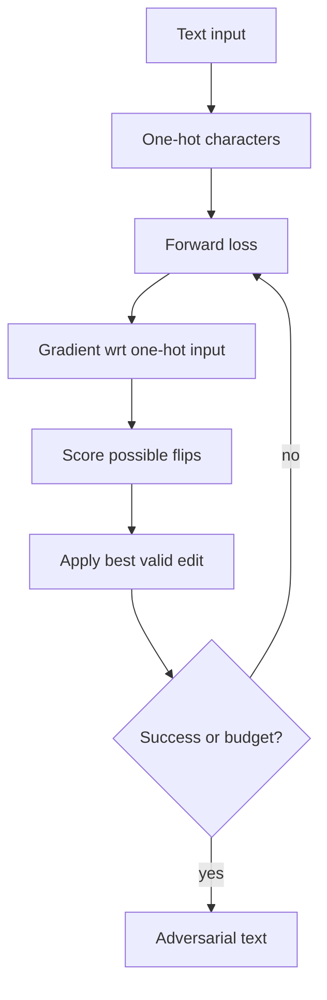

# HotFlip

HotFlip is a white-box text attack that uses gradients to choose character-level edits. It treats a character substitution, insertion, or deletion as a discrete change in a one-hot encoded input and estimates which edit will most increase the loss. The result is a bridge between continuous adversarial optimization and discrete NLP inputs.

The attack matters because text cannot usually be perturbed by tiny real-valued noise while preserving validity. A one-character flip can be visually small, semantically harmless, meaning-changing, or simply invalid depending on the task, so the threat model must define allowed edits carefully.

## Threat model

HotFlip is usually a white-box evasion attack on a text classifier or sequence model. The attacker can compute gradients with respect to one-hot character inputs. The goal may be untargeted:

$$
f(x')\ne y,
$$

or targeted:

$$
f(x')=t.
$$

The capability is a bounded number of discrete edits, such as character substitutions:

$$
\mathrm{edit}(x,x')\le B.
$$

Unlike image attacks, the budget is not an $\ell_p$ radius. It is edit count, edit type, semantic validity, grammar, and sometimes human perceptibility.

## Method

Represent token position $i$ and character $a$ with a one-hot vector. A flip from character $a$ to character $b$ changes the input by:

$$
\Delta x_{i,a\to b}=e_{i,b}-e_{i,a}.
$$

Using a first-order Taylor approximation:

$$
\mathcal{L}(x+\Delta x)-\mathcal{L}(x)
\approx
\nabla_x\mathcal{L}(x)^\top \Delta x.
$$

For a character substitution at position $i$, the estimated loss increase is:

$$
s(i,a,b)=
\frac{\partial \mathcal{L}}{\partial x_{i,b}}
-
\frac{\partial \mathcal{L}}{\partial x_{i,a}}.
$$

HotFlip chooses the flip with the largest score, applies it, recomputes gradients, and repeats until success or the edit budget is exhausted. Beam search can explore multiple edit sequences instead of greedily taking one edit at a time.

## Visual



| Text attack type | Unit changed | Knowledge | Main validity risk |
|---|---|---|---|
| HotFlip | Characters | White-box gradients | Nonsense strings or meaning change |
| TextFooler | Words | Black-box or score access | Semantic drift |
| BERT-Attack | Words/subwords | Masked-LM candidates plus queries | Fluency versus attack success |
| GCG-style jailbreak | Suffix tokens | White-box or surrogate LLM gradients | Policy and system-level validity |

## Worked example 1: Scoring a character flip

Problem: At one position, the current character is `a`. Candidate replacement is `b`. The gradient entries are:

$$
\frac{\partial\mathcal{L}}{\partial x_{i,a}}=-0.4,
\qquad
\frac{\partial\mathcal{L}}{\partial x_{i,b}}=0.7.
$$

Estimate the loss change for flipping `a` to `b`.

1. Use the HotFlip score:

$$
s(i,a,b)=
\frac{\partial \mathcal{L}}{\partial x_{i,b}}
-
\frac{\partial \mathcal{L}}{\partial x_{i,a}}.
$$

2. Substitute:

$$
s=0.7-(-0.4)=1.1.
$$

3. Positive score means the loss is estimated to increase.

Checked answer: the estimated first-order loss increase is $1.1$, so this is a strong untargeted candidate flip.

## Worked example 2: Edit-budget accounting

Problem: An attacker changes `movie` to `m0vie` and then to `m0v1e`. If only substitutions are allowed, how many edits have been used? If the budget is $B=1$, is the second string valid?

1. `movie` to `m0vie` changes `o` to `0`: one substitution.

2. `m0vie` to `m0v1e` changes `i` to `1`: a second substitution.

3. Total substitutions:

$$
2.
$$

4. Compare with budget:

$$
2>B=1.
$$

Checked answer: two edits have been used. The second string violates a one-substitution budget even if it fools the model.

## Implementation

```python
import torch

def best_hotflip(grad, token_ids, alphabet_size):
    # grad: [seq_len, alphabet_size], token_ids: [seq_len]
    current_scores = grad.gather(1, token_ids[:, None]).squeeze(1)
    scores = grad - current_scores[:, None]
    scores.scatter_(1, token_ids[:, None], -float("inf"))
    flat_idx = scores.view(-1).argmax().item()
    pos = flat_idx // alphabet_size
    new_char = flat_idx % alphabet_size
    return pos, new_char, scores[pos, new_char].item()
```

This assumes gradients with respect to one-hot character inputs are already available. A complete attack enforces allowed characters, recomputes gradients after edits, and checks task-specific validity.

## Original paper results

Ebrahimi et al.'s "HotFlip: White-Box Adversarial Examples for Text Classification" introduced gradient-based character flips for NLP models. The paper showed that first-order edit scoring can efficiently find adversarial character changes on text classification tasks, and also discussed multi-edit search with beam search.

The conservative headline is methodological: discrete text edits can be selected by gradient information when the input representation is one-hot or otherwise differentiable through embeddings.

## Connections

- [Attacks on LLMs and other modalities](/cs/adversarial-attacks/attacks-on-llms-and-other-modalities) gives the text and LLM overview.
- [TextFooler](/cs/adversarial-attacks/textfooler) moves from character flips to word substitutions.
- [BERT-Attack](/cs/adversarial-attacks/bert-attack) uses masked language models to propose fluent substitutions.
- [Threat models and attack taxonomy](/cs/adversarial-attacks/threat-models-and-attack-taxonomy) explains why text budgets differ from image norms.
- [White-box attacks](/cs/adversarial-attacks/white-box-attacks) supplies the gradient-attack analogy.

## Common pitfalls / when this attack is used today

- Counting any misspelling as valid without checking task semantics.
- Comparing edit distance to $\ell_\infty$ image budgets as if they were equivalent.
- Forgetting to recompute gradients after each edit.
- Reporting attack success without clean accuracy on the modified but semantically equivalent text.
- Assuming character attacks transfer to subword-tokenized LLMs without tokenizer analysis.
- Using HotFlip today as a discrete-gradient template and a baseline for text robustness tests.

HotFlip's gradient is only meaningful relative to the representation being attacked. In a character-level model, a one-hot flip corresponds directly to a possible input edit. In a word or subword model, the gradient lives in embedding space, and the nearest valid token may not correspond to the largest continuous direction. This is why discrete attacks need a candidate set and validity checks; continuous gradients suggest edits, but the final input must be legal text.

Character edits are also language- and task-dependent. A typo in sentiment analysis may preserve the label, but a typo in named-entity recognition, code classification, legal text, or biomedical extraction may change the ground truth. For multilingual or non-Latin scripts, one visual character may have multiple Unicode code points, and visually similar substitutions can have security implications beyond ordinary adversarial examples. A report should define tokenization, normalization, and allowed character set.

Beam search is the practical answer to greedy-edit myopia. The best single flip may block a stronger two-flip sequence, while a slightly weaker first flip may lead to success after the second edit. Beam search keeps several candidate strings and expands them, trading compute for better search. If a result uses beam search, the beam width and maximum edits should be part of the threat model.

Defending against HotFlip-style attacks can involve adversarial training, spell correction, character-aware models, randomized smoothing over edits, or input normalization. Each defense has a downside. Spell correction can remove benign rare words or fail on intentional obfuscation. Normalization can create collisions. Character-aware models may be more robust to typos but still vulnerable to synonym or paraphrase attacks. A defense should be tested against multiple text perturbation families.

The modern relevance of HotFlip is broader than the exact character attack. It introduced a way of using gradients to search a discrete space by scoring atomic edits. The same idea appears in token replacement, prompt suffix optimization, code attacks, and constrained sequence attacks: relax the discrete object enough to get gradient information, then project that information back into valid edits.

A compact HotFlip reporting checklist is:

| Field | What to write down |
|---|---|
| Unit | Character, byte, wordpiece, or token |
| Edits | Substitution, insertion, deletion, or mixed operations |
| Budget | Maximum edits, edit distance, or percentage changed |
| Knowledge | White-box gradients and exact model representation |
| Validity | Allowed alphabet, normalization, semantic checks, and grammar checks |
| Search | Greedy, beam width, candidate pruning, and stopping rule |

For reproduction, record the tokenizer and preprocessing exactly. Lowercasing, Unicode normalization, punctuation stripping, and byte-pair encoding can all change the set of valid edits. A flip that appears to change one character to a human may create multiple tokens for the model. If the model uses subwords, include examples of how adversarial strings are tokenized.

HotFlip-style results should also report the average number of edits among successes and the failure rate at the edit budget. A high success rate with many edits may be less meaningful for a task where readability matters. Conversely, a low success rate with one edit can still reveal a sharp vulnerability if the edited examples preserve meaning.

A final interpretation point is that HotFlip is the text analogue of a first-order attack, not a complete theory of language robustness. It asks which discrete edit is locally most damaging according to the gradient. That local view can miss paraphrases, syntax changes, or multi-token changes that require planning. Its value is that it makes the connection between gradients and discrete edits explicit.

For modern LLMs, the same idea appears in token-level optimization, but the threat model changes. A suffix optimized to elicit a policy violation is not the same as a typo in a classifier input. The shared mechanism is gradient-guided discrete search; the goals, validity rules, and safety implications are separate.

The simplest sanity check is to read the adversarial examples aloud or inspect them after tokenization. If they are unreadable, the attack may still be a valid character-noise stress test, but it should not be presented as meaning-preserving. If tokenization changes dramatically, the model may be reacting to tokenizer artifacts rather than language understanding.

HotFlip also makes a useful negative test for defenses that rely on spell correction. If correction restores the clean sentence, the defense may work for typo-like attacks. If the attack uses valid words, homoglyphs, or domain terms, the same correction layer may fail or damage benign inputs.

## Further reading

- Ebrahimi et al., "HotFlip: White-Box Adversarial Examples for Text Classification."
- Jin et al., "Is BERT Really Robust? A Strong Baseline for Natural Language Attack on Text Classification and Entailment."
- Li et al., "BERT-Attack."
