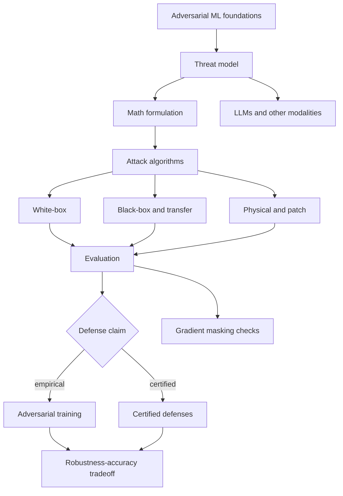

# Adversarial Attacks

Adversarial machine learning studies how learned systems fail when inputs, training data, feedback, or surrounding context are chosen by an adversary rather than sampled passively from the test distribution. In the modern deep-learning setting, the canonical example is an adversarial image $x' = x+\delta$ that looks nearly unchanged to a human but causes a classifier to predict the wrong label. The same discipline now reaches text, speech, reinforcement learning, retrieval systems, tool-using LLM agents, and physical-world perception.


*Figure: The FGSM panda example shows that imperceptible perturbations can change model decisions. Image: [ar5iv](https://arxiv.org/abs/1412.6572), Goodfellow, Shlens, and Szegedy, educational use with attribution.*


*Figure: Physical patches show that adversarial examples can survive outside the pixel-only setting. Image: [ar5iv](https://arxiv.org/abs/1712.09665), Brown et al., educational use with attribution.*

This section is the foundational layer for SJ Wiki. It organizes adversarial ML as topical chapters with papers cited inline: vocabulary, threat models, mathematical formulations, attack families, defenses, and evaluation rules. The central habit is security-style precision: every robustness claim must state the attacker's goal, knowledge, capability, and budget.

## Definitions

An **adversarial example** for a classifier $h$ is an input $x'$ derived from a clean input $x$ such that $x'$ is valid under a specified threat model and the model's behavior changes in an attacker-desired way. In a standard norm-bounded image setting:

$$
x' = x+\delta,\qquad \|\delta\|_p \le \epsilon.
$$

For an **untargeted attack**, success means:

$$
h(x') \ne y.
$$

For a **targeted attack**, success means:

$$
h(x') = y_t,\qquad y_t \ne y.
$$

A **threat model** states what the attacker can know and do. The minimum useful fields are:

$$
\mathcal{T}=(\mathcal{G},\mathcal{K},\mathcal{C},\mathcal{B}),
$$

where $\mathcal{G}$ is the goal, $\mathcal{K}$ is knowledge, $\mathcal{C}$ is capability, and $\mathcal{B}$ is the budget. For example, an $\ell_\infty$ white-box image attack, a transfer-only black-box attack, a physical sticker attack, and an indirect prompt-injection attack are different threat models even if all are called "adversarial."

**White-box attacks** assume the attacker knows and can differentiate the model and defense. **Black-box attacks** assume limited API feedback such as scores, labels, or no target queries. **Transfer attacks** craft examples on a surrogate model and test whether they fool the target. **Physical-world attacks** optimize perturbations that survive transformations such as viewpoint, lighting, printing, and camera pipelines. **Prompt injection** and **jailbreaks** target instruction-following systems rather than ordinary image classifiers.

An **empirical defense** is supported by attacks failing under a stated evaluation protocol. **Adversarial training** is the leading empirical defense for norm-bounded image robustness. A **certified defense** proves that no valid adversarial example exists within a specified set for a given input. Certification is stronger than attack failure, but it is limited to the norm, radius, model, and verifier assumptions.

## Key results

The basic attack optimization problem is:

$$
\max_{\delta \in \Delta(x)}
\mathcal{L}(f_\theta(x+\delta),y),
$$

where $\Delta(x)$ is the allowed perturbation set. For norm-bounded images:

$$
\Delta(x)=\{\delta:\|\delta\|_p\le\epsilon,\ x+\delta \in [0,1]^d\}.
$$

The first-order approximation gives the intuition behind FGSM. If:

$$
g=\nabla_x\mathcal{L}(f_\theta(x),y),
$$

then:

$$
\mathcal{L}(f_\theta(x+\delta),y)
\approx
\mathcal{L}(f_\theta(x),y)+g^\top\delta.
$$

Over an $\ell_\infty$ ball, the maximizing first-order perturbation is:

$$
\delta^\star=\epsilon\,\mathrm{sign}(g).
$$

Defenses often start from the robust training objective:

$$
\min_\theta
\mathbb{E}_{(x,y)}
\left[
\max_{\delta\in\Delta(x)}
\mathcal{L}(f_\theta(x+\delta),y)
\right].
$$

This min-max formulation is powerful but expensive because each training update contains an attack problem. It also makes clear why robustness is threat-model-specific: change $\Delta(x)$ and the defense target changes.

Certification replaces "the attack did not find a failure" with "no failure exists in this set." A pointwise certificate of radius $r$ proves:

$$
\forall x' \text{ with } \|x'-x\|_p \le r,\quad h(x')=y.
$$

Evaluation is the field's recurring difficulty. A robustness number is incomplete unless it states the threat model, attack suite, preprocessing, randomization handling, restarts, query budget, and whether the defense was attacked adaptively. Many historical defenses failed because they masked gradients rather than increasing true robustness.

The section is organized as follows:

1. [Adversarial Attacks](/cs/adversarial-attacks/intro): this hub page and conceptual map.
2. [Threat Models and Attack Taxonomy](/cs/adversarial-attacks/threat-models-and-attack-taxonomy): white/grey/black-box access, goals, budgets, transfer, and attacker knowledge.
3. [Mathematical Formulation](/cs/adversarial-attacks/mathematical-formulation): constrained optimization, min-max risk, dual norms, and loss surfaces.
4. [White-Box Attacks](/cs/adversarial-attacks/white-box-attacks): FGSM, BIM/I-FGSM, PGD, MIM, C&W, and DeepFool as algorithm families.
5. [Black-Box and Transfer Attacks](/cs/adversarial-attacks/black-box-and-transfer-attacks): surrogate models, query attacks, ZOO, NES, SPSA, and Square Attack.
6. [Physical-World and Patch Attacks](/cs/adversarial-attacks/physical-world-and-patch-attacks): patches, stickers, audio, 3D objects, and expectation over transformations.
7. [Adversarial Training](/cs/adversarial-attacks/adversarial-training): PGD adversarial training, TRADES, free and fast variants, overfitting, and cost.
8. [Certified Defenses and Randomized Smoothing](/cs/adversarial-attacks/certified-defenses-and-randomized-smoothing): certificates, smoothing, IBP, CROWN-style bounds, and relaxations.
9. [Gradient Masking and Obfuscation](/cs/adversarial-attacks/gradient-masking-and-obfuscation): broken defenses, BPDA, EOT, and diagnostic signs.
10. [Evaluation and Benchmarks](/cs/adversarial-attacks/evaluation-and-benchmarks): RobustBench, AutoAttack, adaptive attacks, robust accuracy, and reporting discipline.
11. [Robustness-Accuracy Tradeoff](/cs/adversarial-attacks/robustness-accuracy-tradeoff): natural risk, robust risk, boundary error, margins, and data scaling.
12. [Attacks on LLMs and Other Modalities](/cs/adversarial-attacks/attacks-on-llms-and-other-modalities): text, audio, RL, multimodal, jailbreaks, and prompt injection at overview level.
13. [Data Poisoning and Backdoors](/cs/adversarial-attacks/data-poisoning-and-backdoors): training-time compromise, triggers, clean accuracy, attack success rate, and supply-chain risk.

## Visual



| Concept | Minimal question | Main page |
|---|---|---|
| Threat model | What can the attacker know and change? | [Threat models](/cs/adversarial-attacks/threat-models-and-attack-taxonomy) |
| Attack optimization | What objective is being maximized or minimized? | [Mathematical formulation](/cs/adversarial-attacks/mathematical-formulation) |
| White-box attack | What if gradients are available? | [White-box attacks](/cs/adversarial-attacks/white-box-attacks) |
| Black-box attack | What if only an API is available? | [Black-box and transfer](/cs/adversarial-attacks/black-box-and-transfer-attacks) |
| Physical attack | What survives transformations and sensors? | [Physical-world and patch attacks](/cs/adversarial-attacks/physical-world-and-patch-attacks) |
| Empirical defense | What attacks did the model survive? | [Adversarial training](/cs/adversarial-attacks/adversarial-training) |
| Certified defense | What has been proven impossible? | [Certified defenses](/cs/adversarial-attacks/certified-defenses-and-randomized-smoothing) |
| Evaluation | Is the robustness claim actually supported? | [Evaluation and benchmarks](/cs/adversarial-attacks/evaluation-and-benchmarks) |
| Training-time attack | What if the model was compromised before deployment? | [Data poisoning and backdoors](/cs/adversarial-attacks/data-poisoning-and-backdoors) |

## Worked example 1: Parsing a robustness claim

Problem: A model card says: "Our classifier is robust to adversarial examples." The appendix says it was evaluated on CIFAR-10 with PGD-20, $\ell_\infty$, $\epsilon=8/255$, untargeted, white-box access, 10 random restarts, and clipping to $[0,1]$. Rewrite the claim precisely.

1. Identify the dataset:

$$
\text{CIFAR-10}.
$$

2. Identify the perturbation set:

$$
\Delta(x)=\{\delta:\|\delta\|_\infty \le 8/255,\ x+\delta\in[0,1]^d\}.
$$

3. Identify the attacker goal:

$$
h(x+\delta)\ne y.
$$

4. Identify knowledge:

$$
\text{white-box access}.
$$

5. Identify the evaluation algorithm:

$$
\text{PGD-20 with 10 random restarts}.
$$

6. The precise claim is not "robust to adversarial examples" in general. It is: "The classifier achieved the reported robust accuracy against untargeted white-box PGD-20 attacks with 10 restarts under an $\ell_\infty$ radius of $8/255$ on CIFAR-10 inputs clipped to $[0,1]$."

Checked answer: the precise version is narrower but meaningful. It does not claim robustness to patches, $\ell_2$ attacks, black-box query attacks, corruptions, or prompt injection.

## Worked example 2: Choosing the right page for a question

Problem: A reader asks: "My defense applies random resizing before classification. PGD fails, but a transfer attack succeeds. Where should I look?"

1. The defense uses randomness:

$$
F(x,\omega)=f(T(x,\omega)).
$$

2. A naive PGD attack may be using a single random draw or ignoring the expected loss.

3. The relevant adaptive objective is:

$$
\max_{\delta\in\Delta(x)}
\mathbb{E}_{\omega}
[\mathcal{L}(F(x+\delta,\omega),y)].
$$

4. Because transfer succeeds while naive PGD fails, this may be a gradient-masking symptom.

5. The reader should start with [gradient masking and obfuscation](/cs/adversarial-attacks/gradient-masking-and-obfuscation), then check [white-box attacks](/cs/adversarial-attacks/white-box-attacks) for EOT-style PGD and [evaluation and benchmarks](/cs/adversarial-attacks/evaluation-and-benchmarks) for reporting.

Checked answer: the issue is probably not that transfer attacks are "stronger than white-box access" in principle. It is that the white-box attack was not adapted to the randomized defended system.

## Code

```python
from dataclasses import dataclass

@dataclass(frozen=True)
class RobustnessClaim:
    dataset: str
    norm: str
    epsilon: str
    access: str
    goal: str
    attack: str
    restarts: int
    preprocessing: str

    def precise_sentence(self) -> str:
        return (
            f"Robustness is evaluated on {self.dataset} under a {self.goal} "
            f"{self.access} attack using {self.attack} with {self.restarts} restarts, "
            f"constrained by {self.norm} radius {self.epsilon}, with {self.preprocessing}."
        )

claim = RobustnessClaim(
    dataset="CIFAR-10",
    norm="linf",
    epsilon="8/255",
    access="white-box",
    goal="untargeted",
    attack="PGD-20",
    restarts=10,
    preprocessing="inputs clipped to [0, 1]",
)

print(claim.precise_sentence())
```

This toy class is a guardrail for writing robustness claims. It forces the writer to specify the fields that are most often missing from vague statements.

## Common pitfalls

- Saying "robust" without naming the threat model.
- Mixing targeted and untargeted results in the same table without labels.
- Comparing $\epsilon$ values across different preprocessing scales.
- Treating adversarial training as a certificate.
- Treating a certificate for one norm and radius as a general security proof.
- Evaluating a defense with attacks that do not include the defense.
- Reusing image perturbation language for LLM and text attacks without defining semantic or system-level validity.
- Deep-diving a paper result before understanding the shared vocabulary of goals, knowledge, capability, and budget.

## Connections

- [Machine Learning](/cs/machine-learning/intro) supplies empirical risk, generalization, and classifiers.
- [Deep Learning](/cs/deep-learning/intro) supplies neural networks, logits, losses, and backpropagation.
- [Cryptography](/cs/cryptography/intro) provides a neighboring tradition of explicit adversary models and security claims.
- [Reinforcement Learning](/cs/reinforcement-learning/intro) connects to policy attacks and trajectory-level robustness.
- [Threat models and attack taxonomy](/cs/adversarial-attacks/threat-models-and-attack-taxonomy) is the next page to read after this overview.
- [Evaluation and benchmarks](/cs/adversarial-attacks/evaluation-and-benchmarks) is the page to read before trusting a defense number.

## Further reading

- Szegedy et al., "Intriguing Properties of Neural Networks."
- Goodfellow, Shlens, and Szegedy, "Explaining and Harnessing Adversarial Examples."
- Biggio and Roli, "Wild Patterns: Ten Years After the Rise of Adversarial Machine Learning."
- Madry et al., "Towards Deep Learning Models Resistant to Adversarial Attacks."
- Carlini and Wagner, "Towards Evaluating the Robustness of Neural Networks."
- Athalye, Carlini, and Wagner, "Obfuscated Gradients Give a False Sense of Security."
