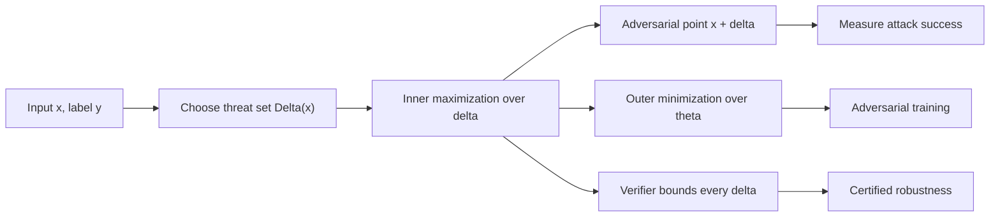

# Mathematical Formulation

Adversarial examples are usually introduced as surprising inputs, but the technical core is an optimization problem. Given a trained model and a valid set of input changes, the attacker searches for a nearby point that maximizes loss, changes the predicted label, or induces a target behavior. Defenses then try to train or certify models whose predictions are stable throughout that valid set.

This page builds the notation used by [white-box attacks](/cs/adversarial-attacks/white-box-attacks), [adversarial training](/cs/adversarial-attacks/adversarial-training), and [certified defenses](/cs/adversarial-attacks/certified-defenses-and-randomized-smoothing). The same formulas are simple enough to write down and hard enough to solve exactly: the inner maximization is nonconvex for neural networks, and the choice of constraint set determines what "nearby" means.

## Definitions

Let $f_\theta : \mathcal{X} \to \mathbb{R}^K$ be a classifier with parameters $\theta$ and logits $f_\theta(x)$. The predicted class is:

$$
h_\theta(x) = \arg\max_{k \in \{1,\dots,K\}} f_\theta(x)_k.
$$

Let $\mathcal{L}(f_\theta(x), y)$ be a training loss, usually cross-entropy for classification. An **untargeted adversarial example** for input-label pair $(x,y)$ is an input $x' = x+\delta$ such that:

$$
\delta \in \Delta(x), \qquad h_\theta(x+\delta) \ne y.
$$

For norm-bounded attacks:

$$
\Delta(x) = \{\delta : \|\delta\|_p \le \epsilon,\ x+\delta \in [0,1]^d\}.
$$

A **targeted adversarial example** for target class $y_t$ satisfies:

$$
\delta \in \Delta(x), \qquad h_\theta(x+\delta) = y_t.
$$

The **attack optimization problem** is often written as:

$$
\delta^\star \in \arg\max_{\delta \in \Delta(x)}
\mathcal{L}(f_\theta(x+\delta), y)
$$

for untargeted attacks. For targeted attacks, one common form is:

$$
\delta^\star \in \arg\min_{\delta \in \Delta(x)}
\mathcal{L}(f_\theta(x+\delta), y_t).
$$

The **robust risk** of a classifier is:

$$
R_{\mathrm{rob}}(\theta) =
\mathbb{E}_{(x,y)\sim \mathcal{D}}
\left[
\max_{\delta \in \Delta(x)}
\mathcal{L}(f_\theta(x+\delta), y)
\right].
$$

Adversarial training approximates the **min-max problem**:

$$
\min_\theta
\mathbb{E}_{(x,y)\sim \mathcal{D}}
\left[
\max_{\delta \in \Delta(x)}
\mathcal{L}(f_\theta(x+\delta), y)
\right].
$$

For certification, the goal is not merely to find a bad $\delta$ but to prove that no bad $\delta$ exists inside the set. For a point $(x,y)$, a certified radius $r$ under norm $p$ means:

$$
\forall x' \text{ with } \|x'-x\|_p \le r,\quad h_\theta(x') = y.
$$

## Key results

For a locally linear loss, the best first-order $\ell_\infty$ perturbation has the sign of the input gradient. Let:

$$
g = \nabla_x \mathcal{L}(f_\theta(x), y).
$$

The first-order Taylor approximation gives:

$$
\mathcal{L}(f_\theta(x+\delta), y)
\approx
\mathcal{L}(f_\theta(x), y) + g^\top \delta.
$$

The maximizer of $g^\top \delta$ over $\|\delta\|_\infty \le \epsilon$ is:

$$
\delta^\star = \epsilon\,\mathrm{sign}(g),
$$

which is the Fast Gradient Sign Method direction. Over an $\ell_2$ ball, the maximizer is:

$$
\delta^\star = \epsilon \frac{g}{\|g\|_2}
\quad \text{when } g \ne 0.
$$

More generally, dual norms explain first-order attacks. If $1/p + 1/q = 1$, then:

$$
\max_{\|\delta\|_p \le \epsilon} g^\top \delta
=
\epsilon \|g\|_q.
$$

This equation is one reason adversarial vulnerability is tied to high-dimensional geometry. Even if each coordinate of $\delta$ is tiny under $\ell_\infty$, the dot product $g^\top \delta$ can accumulate across many dimensions.

Constrained attacks can also be written with penalties. Instead of:

$$
\min_\delta \|\delta\|_p
\quad \text{subject to} \quad h_\theta(x+\delta) = y_t,
$$

one may solve:

$$
\min_\delta \|\delta\|_p + c \cdot \Phi(x+\delta, y_t)
\quad \text{subject to} \quad x+\delta \in [0,1]^d,
$$

where $\Phi$ penalizes failure to reach the target. Carlini-Wagner style attacks use this kind of penalty formulation with carefully chosen confidence losses and box constraints. The penalty coefficient $c$ matters: too small and the target is not reached; too large and the perturbation can be larger than necessary.

Loss surfaces around neural networks are nonconvex, so attack algorithms are approximate. A failed attack does not prove robustness unless the method is a sound verifier. This distinction motivates [gradient masking and obfuscation](/cs/adversarial-attacks/gradient-masking-and-obfuscation): if the optimization landscape is made artificially hard for a particular attack, adversarial accuracy can be overestimated.

The perturbation set is also part of the mathematics, not a side note. Norm balls are convenient because they give closed-form projections and dual-norm calculations, but many realistic sets are intersections of constraints. An image attack may require $\|\delta\|_\infty \le \epsilon$, valid pixel range, fixed crop geometry, and unchanged metadata. A patch attack replaces the norm ball with a mask and transformation distribution. A text attack replaces continuous projection with a discrete search over candidate edits. In each case, the correct attack problem is the one that optimizes over the actual allowed set. Using the wrong $\Delta(x)$ can make a mathematically clean result irrelevant to the system being evaluated.

The same care applies to the loss. Cross-entropy is common because it is already used for training, but margin losses, target losses, detector losses, or sequence-level losses may better match the attack goal. The objective should encode the success condition, not merely be easy to differentiate.

## Visual



| Constraint | Set | First-order maximizer of $g^\top \delta$ | Typical use |
|---|---|---|---|
| $\ell_\infty$ | $\|\delta\|_\infty \le \epsilon$ | $\epsilon\,\mathrm{sign}(g)$ | Pixel-bounded image attacks |
| $\ell_2$ | $\|\delta\|_2 \le \epsilon$ | $\epsilon g / \|g\|_2$ | Energy-bounded perturbations, smoothing certificates |
| $\ell_1$ | $\|\delta\|_1 \le \epsilon$ | Put mass on largest $\vert g_i\vert $ | Sparse-ish budget analysis |
| $\ell_0$ | At most $s$ changed coordinates | Change largest-gradient coordinates | Sparse pixel or feature attacks |

## Worked example 1: First-order $\ell_\infty$ attack on a linear loss

Problem: Suppose the input gradient of the loss at an image is:

$$
g = (0.2, -0.5, 0.0, 1.4).
$$

Find the first-order $\ell_\infty$ adversarial perturbation for $\epsilon = 0.1$ and compute the approximate loss increase.

1. Under the Taylor approximation, maximize:

$$
g^\top \delta
\quad \text{subject to} \quad
|\delta_i| \le 0.1.
$$

2. Choose each coordinate independently:

$$
\delta_i = 0.1\,\mathrm{sign}(g_i).
$$

3. The sign vector is:

$$
\mathrm{sign}(g) = (1,-1,0,1).
$$

4. Therefore:

$$
\delta^\star = (0.1,-0.1,0,0.1).
$$

5. The approximate loss increase is:

$$
\begin{aligned}
g^\top \delta^\star
&= 0.2(0.1) + (-0.5)(-0.1) + 0(0) + 1.4(0.1) \\
&= 0.02 + 0.05 + 0 + 0.14 \\
&= 0.21.
\end{aligned}
$$

Checked answer: the first-order perturbation is $(0.1,-0.1,0,0.1)$ and the approximated loss increase is $0.21$.

## Worked example 2: Robust radius for a binary linear classifier

Problem: Let a binary classifier predict class $+1$ when $w^\top x + b \gt  0$ and class $-1$ otherwise. Let:

$$
w = (3,4), \qquad b=-5, \qquad x=(2,1).
$$

Compute the smallest $\ell_2$ perturbation that reaches the decision boundary.

1. Compute the signed score:

$$
w^\top x + b = 3(2) + 4(1) - 5 = 5.
$$

   The point is classified as $+1$.

2. The decision boundary is $w^\top z + b = 0$. The Euclidean distance from $x$ to the boundary is:

$$
r = \frac{|w^\top x + b|}{\|w\|_2}.
$$

3. Compute the norm:

$$
\|w\|_2 = \sqrt{3^2+4^2}=5.
$$

4. Therefore:

$$
r = \frac{5}{5}=1.
$$

5. The boundary-reaching perturbation moves opposite $w$:

$$
\delta^\star = -\frac{w^\top x+b}{\|w\|_2^2}w
= -\frac{5}{25}(3,4)
= (-0.6,-0.8).
$$

6. Check:

$$
w^\top(x+\delta^\star)+b
= 3(1.4)+4(0.2)-5
= 4.2+0.8-5
= 0.
$$

Checked answer: the minimum $\ell_2$ distance to the boundary is $1$, achieved by $\delta^\star=(-0.6,-0.8)$. Any classifier with margin less than $\epsilon$ at a point cannot be certified robust to $\ell_2$ radius $\epsilon$ at that point.

## Code

```python
import torch
import torch.nn.functional as F

def pgd_inner_max(model, x, y, epsilon=8 / 255, step_size=2 / 255, steps=10):
    x0 = x.detach()
    x_adv = x0 + torch.empty_like(x0).uniform_(-epsilon, epsilon)
    x_adv = x_adv.clamp(0.0, 1.0)

    for _ in range(steps):
        x_adv.requires_grad_(True)
        loss = F.cross_entropy(model(x_adv), y)
        grad = torch.autograd.grad(loss, x_adv)[0]
        with torch.no_grad():
            x_adv = x_adv + step_size * grad.sign()
            delta = (x_adv - x0).clamp(-epsilon, epsilon)
            x_adv = (x0 + delta).clamp(0.0, 1.0)

    return x_adv.detach()
```

The code implements the inner maximization used in many adversarial-training loops. It uses random initialization, gradient ascent on the input, projection to the $\ell_\infty$ ball, and clipping to the valid image range.

## Common pitfalls

- Optimizing the wrong objective for targeted attacks. Targeted attacks usually minimize the target loss, while untargeted attacks maximize the true-label loss.
- Forgetting the input-domain constraint $x+\delta \in [0,1]^d$ after projecting onto a norm ball.
- Treating an approximate attack failure as a proof of robustness. Certification requires a verifier or a theorem.
- Comparing $\epsilon$ values across datasets without checking pixel scaling, channel normalization, and image resolution.
- Using cross-entropy loss blindly when logits saturate; stronger attacks may use margin losses or confidence losses.
- Assuming that the closest adversarial example under $\ell_2$ is also closest under $\ell_\infty$ or $\ell_0$.

## Connections

- [Threat models and attack taxonomy](/cs/adversarial-attacks/threat-models-and-attack-taxonomy) defines the attacker assumptions behind $\Delta(x)$.
- [White-box attacks](/cs/adversarial-attacks/white-box-attacks) are numerical methods for the inner maximization.
- [Adversarial training](/cs/adversarial-attacks/adversarial-training) uses the min-max problem as a training objective.
- [Certified defenses and randomized smoothing](/cs/adversarial-attacks/certified-defenses-and-randomized-smoothing) replaces attack search with proof obligations.
- [Deep learning](/cs/deep-learning/intro) provides the loss functions, logits, and gradient computation used here.

## Further reading

- Goodfellow, Shlens, and Szegedy, "Explaining and Harnessing Adversarial Examples."
- Madry et al., "Towards Deep Learning Models Resistant to Adversarial Attacks."
- Carlini and Wagner, "Towards Evaluating the Robustness of Neural Networks."
- Zhang et al., "Theoretically Principled Trade-off between Robustness and Accuracy."
