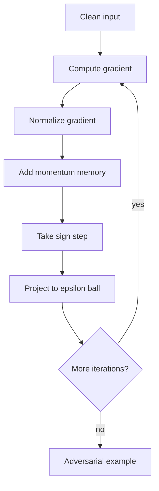

# Momentum Iterative FGSM

Momentum Iterative FGSM (MI-FGSM) strengthens iterative sign-gradient attacks by accumulating a velocity-like gradient direction across steps. The practical motivation is transferability: an attack that overfits to noisy local gradients of one model may fail on another model, while a momentum-smoothed direction can cross decision boundaries shared by several models.

MI-FGSM is best understood as BIM or PGD with a memory term. It keeps the same norm-bounded digital threat model as FGSM and PGD, but changes the update direction from the current gradient sign to the sign of accumulated normalized gradients.

## Threat model

The usual setting is white-box crafting against a source model or ensemble, followed by white-box evaluation on that model or black-box transfer evaluation on other models. The attack is typically untargeted or targeted with an $\ell_\infty$ budget:

$$
\|x_{\mathrm{adv}}-x\|_\infty\le\epsilon,\qquad x_{\mathrm{adv}}\in[0,1]^d.
$$

For transfer attacks, the target model is black-box at crafting time. The attacker may know or train surrogate models and then submit the resulting adversarial example to the target. MI-FGSM is not query-based; it improves the surrogate-side optimization used before transfer.

## Method

Let $x^0=x$ and $g_0=0$. For an untargeted attack, compute the input gradient:

$$
\nabla_x\mathcal{L}(f_\theta(x^t),y).
$$

Normalize it, commonly by the $\ell_1$ norm:

$$
\tilde{g}_{t+1}
=
\frac{\nabla_x\mathcal{L}(f_\theta(x^t),y)}
{\|\nabla_x\mathcal{L}(f_\theta(x^t),y)\|_1}.
$$

Accumulate momentum:

$$
g_{t+1}=\mu g_t+\tilde{g}_{t+1},
$$

then update:

$$
x^{t+1}
=
\Pi_{[0,1]^d\cap B_\infty(x,\epsilon)}
\left(x^t+\alpha\,\mathrm{sign}(g_{t+1})\right).
$$

For targeted MI-FGSM, reverse the sign by descending the target loss. When attacking an ensemble, the loss can be a weighted sum:

$$
\mathcal{L}_{\mathrm{ens}}(x,y)=\sum_{m=1}^M w_m\mathcal{L}(f_m(x),y).
$$

Momentum helps avoid update directions that are strong for one step but unstable across the attack trajectory. The method is still approximate and should be evaluated with the exact threat model stated.

## Visual



| Attack | Direction used | Transfer behavior | Extra parameter |
|---|---|---|---|
| FGSM | One clean-input gradient sign | Often transfers but weak | None |
| BIM/I-FGSM | Current gradient sign per step | Can overfit source model | Step count and step size |
| PGD | Current gradient sign plus random starts | Strong white-box baseline | Restarts |
| MI-FGSM | Sign of accumulated normalized gradients | Often stronger transfer | Momentum $\mu$ |

## Worked example 1: Momentum update in two dimensions

Problem: Let $\mu=1.0$ and $g_0=(0,0)$. Suppose the normalized gradients at two steps are:

$$
\tilde{g}_1=(0.6,0.8),\qquad \tilde{g}_2=(0.8,-0.6).
$$

Compute the accumulated directions.

1. First momentum vector:

$$
g_1=1.0(0,0)+(0.6,0.8)=(0.6,0.8).
$$

2. First sign direction:

$$
\mathrm{sign}(g_1)=(1,1).
$$

3. Second momentum vector:

$$
g_2=1.0(0.6,0.8)+(0.8,-0.6)=(1.4,0.2).
$$

4. Second sign direction:

$$
\mathrm{sign}(g_2)=(1,1).
$$

Checked answer: although the second raw gradient has a negative second coordinate, the accumulated direction remains positive in that coordinate because the previous gradient memory dominates.

## Worked example 2: One projected MI-FGSM step

Problem: Let:

$$
x=(0.50,0.50),\quad \epsilon=0.10,\quad \alpha=0.06,
$$

and the accumulated sign direction is $(1,-1)$. Compute the next point from $x^t=(0.58,0.46)$.

1. Take the raw step:

$$
z=(0.58,0.46)+0.06(1,-1)=(0.64,0.40).
$$

2. The allowed coordinate interval around $x$ is:

$$
[0.40,0.60].
$$

3. Project:

$$
x^{t+1}=(0.60,0.40).
$$

4. Check the perturbation:

$$
x^{t+1}-x=(0.10,-0.10),\quad \|x^{t+1}-x\|_\infty=0.10.
$$

Checked answer: the point is on two faces of the allowed $\ell_\infty$ square.

## Implementation

```python
import torch
import torch.nn.functional as F

def mi_fgsm(model, x, y, epsilon=8/255, step_size=2/255, steps=10, decay=1.0):
    model.eval()
    x0 = x.detach()
    x_adv = x0.clone()
    momentum = torch.zeros_like(x_adv)

    for _ in range(steps):
        x_adv.requires_grad_(True)
        loss = F.cross_entropy(model(x_adv), y)
        grad = torch.autograd.grad(loss, x_adv)[0]
        grad_norm = grad.abs().view(grad.size(0), -1).mean(dim=1)
        grad = grad / grad_norm.view(-1, 1, 1, 1).clamp_min(1e-12)
        momentum = decay * momentum + grad

        with torch.no_grad():
            x_adv = x_adv + step_size * momentum.sign()
            delta = (x_adv - x0).clamp(-epsilon, epsilon)
            x_adv = (x0 + delta).clamp(0.0, 1.0)

    return x_adv.detach()
```

For ensemble transfer, replace `model(x_adv)` with a weighted combination of losses from several surrogate models and backpropagate the summed loss.

## Original paper results

Dong et al.'s "Boosting Adversarial Attacks with Momentum" reported that momentum iterative attacks improved black-box transfer success, especially when combined with model ensembles. The paper also notes that the method won first places in the NIPS 2017 non-targeted and targeted adversarial attack competitions.

The conservative takeaway is that momentum is not a new threat model; it is an optimization improvement that often makes iterative gradient attacks less source-model-specific.

## Connections

- [FGSM](/cs/adversarial-attacks/fgsm) provides the one-step sign-gradient base.
- [PGD](/cs/adversarial-attacks/pgd) gives the projected iterative baseline.
- [Black-box and transfer attacks](/cs/adversarial-attacks/black-box-and-transfer-attacks) explains transfer-only attack evaluation.
- [Universal adversarial perturbations](/cs/adversarial-attacks/universal-adversarial-perturbations) also studies model-shared vulnerable directions.
- [Evaluation and benchmarks](/cs/adversarial-attacks/evaluation-and-benchmarks) covers reporting of transfer and white-box attacks.

## Common pitfalls / when this attack is used today

- Treating transfer success as a white-box robustness result.
- Omitting the surrogate or ensemble details.
- Forgetting to normalize gradients before momentum accumulation.
- Comparing MI-FGSM to PGD without matching step size, steps, and budget.
- Assuming momentum always improves white-box success; its main value is often transfer.
- Using MI-FGSM today as a transfer baseline and as a component in stronger ensemble attacks.

MI-FGSM should be evaluated in two separate modes. In source-model white-box mode, the question is whether the attack finds an adversarial example for the model whose gradients it uses. In transfer mode, the question is whether the generated example fools another model without target-gradient access. Mixing these modes can produce misleading claims. A transfer table should state the source architecture, target architecture, training datasets, preprocessing, and whether any target queries were used for model selection or hyperparameter tuning.

Momentum helps because iterative attacks can over-specialize to the source model's local loss surface. Each step of ordinary BIM or PGD follows the current gradient, which may include high-frequency or model-specific details. The accumulated direction acts like a low-pass memory over the attack trajectory. This does not make the perturbation universal, but it can make it less brittle. The effect is often stronger when attacking an ensemble because the gradient already averages multiple decision surfaces.

The decay parameter $\mu$ should not be hidden. A value near zero recovers an ordinary iterative attack. A value near one keeps strong memory. Larger effective memory can stabilize directions but may also keep pushing in a direction that is no longer useful after projection. Reports should include $\mu$, number of iterations, step size, norm budget, and whether gradients are normalized by $\ell_1$, mean absolute value, or another convention.

Targeted transfer is usually harder than untargeted transfer. An untargeted attack only needs to cross any wrong boundary on the target model; a targeted attack needs to cross into one specified class region. Momentum can help targeted attacks, but success rates should not be compared directly with untargeted success rates. The target-label selection rule also matters: random targets, least-likely targets, and semantically similar targets can have different difficulty.

Modern transfer attacks often combine momentum with input diversity, translation-invariant gradients, scale transformations, or ensemble losses. MI-FGSM is therefore best viewed as a modular idea rather than the end of the transfer-attack line. Its page belongs next to PGD because the update is still projected gradient ascent, but it belongs next to black-box attacks because its most important use is crafting examples that move beyond the source model.

A compact MI-FGSM reporting checklist is:

| Field | What to write down |
|---|---|
| Mode | Source white-box success or transfer success |
| Source | Model architecture, checkpoint, preprocessing, and ensemble weights |
| Target | Target model access and whether target queries were used |
| Attack settings | $\epsilon$, step size, steps, decay $\mu$, gradient normalization |
| Goal | Targeted or untargeted, including target-label rule |
| Selection | Best source loss, first success, or fixed final iterate |

For reproduction, report both source-model and target-model outcomes. A perturbation that barely fools the source may or may not transfer. A perturbation with a high source confidence margin may transfer better, but it may also use more of the budget in model-specific ways. Showing source success, target success, and confidence margins helps readers distinguish poor optimization from poor transfer.

When MI-FGSM is used in competitions or ensemble attacks, the ensemble itself can become a hidden hyperparameter. Adding architectures, adversarially trained models, or preprocessing variants can change transfer substantially. The cleanest reports include ablations: no momentum, momentum on one source, momentum on an ensemble, and any extra input transformations. That makes the contribution of the momentum term visible.

A final interpretation point is that momentum attacks are not defenses bypasses by themselves; they are better search procedures under the same perturbation rules. If a model fails under MI-FGSM transfer, the failure says something about shared decision-boundary geometry between source and target models. If it survives, the result is limited to that surrogate set and transfer setup. A white-box attack on the target may still succeed.

For studying the attack family, compare three directions on the same input: FGSM's one clean gradient, PGD's current gradient at each iterate, and MI-FGSM's accumulated normalized gradient. The differences make optimization history visible. That history is the whole point of the method.

If a defense report includes only transfer attacks, MI-FGSM is a good baseline but not the end of evaluation. Transfer attacks are practical, yet white-box attacks are the stronger stress test when the model is available. A robust claim should say which question it is answering.

For implementation checks, verify that momentum is reset per image or per batch as intended. Accidentally carrying momentum across unrelated batches creates an attack that is neither the published algorithm nor a meaningful universal perturbation. Small state-management mistakes can change transfer results.

## Further reading

- Dong et al., "Boosting Adversarial Attacks with Momentum."
- Kurakin, Goodfellow, and Bengio, "Adversarial Examples in the Physical World."
- Madry et al., "Towards Deep Learning Models Resistant to Adversarial Attacks."
