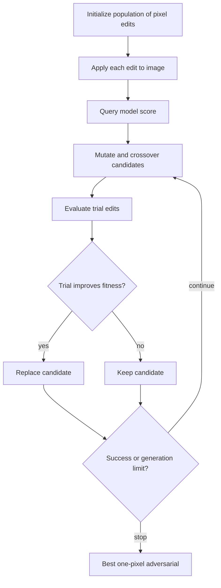

# One Pixel Attack

The One Pixel Attack asks how much damage a classifier can suffer when the attacker changes only one pixel. Instead of relying on gradients, it uses differential evolution, a population-based black-box optimizer, to search over pixel location and color values.

The attack is not the strongest robustness evaluation for modern models, but it is conceptually useful. It exposes a different axis of vulnerability: sparse, low-dimensional changes. It also shows how evolutionary search can attack models when gradients are unavailable or inconvenient.

## Threat model

The attack is a black-box evasion attack with a strict sparsity constraint:

$$
\|\delta\|_0\le 1.
$$

For an RGB image, a candidate perturbation usually includes the pixel coordinates and replacement channel values:

$$
(u,v,r,g,b).
$$

The attacker queries model scores or probabilities to evaluate candidate fitness. The attack can be targeted, trying to maximize a chosen target probability, or untargeted, trying to reduce the true-class probability or cause any misclassification. The primary budget is the number of model queries consumed by the population search.

## Method

Differential evolution maintains a population of candidate pixel edits. For each candidate vector $a$, it creates a mutant from other population members, crosses it with the current candidate, evaluates the resulting image, and keeps whichever candidate has better fitness.

A targeted fitness can be:

$$
F(a)=p_t(x_a),
$$

where $x_a$ is the image after applying the pixel edit and $p_t$ is the target-class probability. An untargeted fitness can be:

$$
F(a)=-p_y(x_a),
$$

or a logit margin that encourages any class other than $y$ to win.

For one pixel on a $W\times H$ RGB image:

$$
a=(u,v,c_1,c_2,c_3),
$$

with integer coordinates and bounded color channels. The search space is low-dimensional but nonconvex and discrete in coordinates, which makes evolutionary search a natural fit.

## Visual



| Constraint | Example attack | Search variable | Typical message |
|---|---|---|---|
| Dense $\ell_\infty$ | FGSM/PGD | All pixels, small changes | Many tiny changes add up |
| Sparse $\ell_1$ | EAD | Fewer larger changes | Metric choice matters |
| One pixel $\ell_0$ | One Pixel Attack | One coordinate plus color | Very sparse changes can fool some models |
| Patch area | Adversarial Patch | Local visible region | Physical visibility can be acceptable |

## Worked example 1: Candidate dimensionality

Problem: A one-pixel attack is run on a $32\times32$ RGB image. A candidate encodes integer row, integer column, and three channel values. What is the dimension of one candidate vector? How many possible pixel locations exist?

1. Candidate fields:

$$
(\text{row},\text{column},R,G,B).
$$

2. Number of fields:

$$
5.
$$

3. Pixel locations:

$$
32\cdot32=1024.
$$

Checked answer: the search vector is 5-dimensional, with 1,024 possible spatial locations before considering color values.

## Worked example 2: Targeted success calculation

Problem: A targeted one-pixel attack tries target class "frog." Before the edit, class probabilities are:

$$
p_{\mathrm{frog}}=0.04,\qquad p_{\mathrm{cat}}=0.80.
$$

After an edit, probabilities are:

$$
p_{\mathrm{frog}}=0.51,\qquad p_{\mathrm{cat}}=0.20.
$$

Assuming "frog" is now the top class, is the targeted attack successful?

1. Targeted success requires:

$$
\arg\max_k p_k(x')=\mathrm{frog}.
$$

2. The target probability after the edit is:

$$
0.51.
$$

3. The original class probability after the edit is:

$$
0.20.
$$

4. If all other classes are below $0.51$, the target is top-1.

Checked answer: yes, under the stated assumption the one-pixel edit is a targeted success. The confidence assigned to the target is $51\%$.

## Implementation

```python
import torch

@torch.no_grad()
def apply_one_pixel(x, candidate):
    x_edit = x.clone()
    row, col, r, g, b = candidate
    row = int(row)
    col = int(col)
    x_edit[:, 0, row, col] = float(r)
    x_edit[:, 1, row, col] = float(g)
    x_edit[:, 2, row, col] = float(b)
    return x_edit.clamp(0.0, 1.0)

@torch.no_grad()
def targeted_fitness(model, x, candidate, target):
    x_edit = apply_one_pixel(x, candidate)
    probs = model(x_edit).softmax(dim=1)
    return probs[0, target].item()
```

A real differential evolution loop maintains a population, performs mutation and crossover, clips candidate coordinates and colors, and counts every model evaluation as a query.

## Original paper results

Su, Vargas, and Sakurai reported that changing one pixel could fool a substantial fraction of images under their black-box differential-evolution setup. The abstract reports targeted perturbability for $67.97\%$ of natural images in the Kaggle CIFAR-10 test dataset and $16.04\%$ of ImageNet test images, with average confidences of $74.03\%$ and $22.91\%$ respectively for at least one target class.

These numbers should be read in the original setting: target models, datasets, score access, and evolutionary search budget matter. The result is a sparse-attack stress test, not a universal claim about all modern robust models.

## Connections

- [EAD elastic-net attack](/cs/adversarial-attacks/ead-elastic-net-attack) uses $\ell_1$ regularization to encourage sparse perturbations.
- [Black-box and transfer attacks](/cs/adversarial-attacks/black-box-and-transfer-attacks) explains score-query black-box settings.
- [Adversarial patch](/cs/adversarial-attacks/adversarial-patch) uses a visible local region rather than a single pixel.
- [Threat models and attack taxonomy](/cs/adversarial-attacks/threat-models-and-attack-taxonomy) distinguishes $\ell_0$ from $\ell_p$ budgets.
- [Evaluation and benchmarks](/cs/adversarial-attacks/evaluation-and-benchmarks) covers reporting query budgets and success rates.

## Common pitfalls / when this attack is used today

- Comparing one-pixel success to $\ell_\infty$ robustness without noting the different threat sets.
- Omitting query counts for differential evolution.
- Assuming score access when the real API exposes only labels.
- Treating target confidence as success when another class is still top-1.
- Ignoring preprocessing; one pixel before resizing may affect several pixels after resizing.
- Using the attack today as a sparse black-box demonstration and robustness sanity check, not as a complete benchmark.

The one-pixel constraint is easy to state but subtle in a real pipeline. If the model resizes, crops, normalizes, or compresses the image before classification, one input pixel may be blurred into multiple model pixels or removed entirely. A faithful threat model should specify where the one-pixel edit is applied: before resizing, after resizing, in raw sensor space, or in the model's tensor input. Otherwise two experiments with the same phrase can mean different attacks.

Differential evolution is stochastic. Success rates depend on population size, generations, mutation factor, crossover probability, target selection, and query budget. A single lucky or unlucky run is not enough. Reports should average over images and random seeds, include failures, and state whether the attack is targeted to every possible class or only to at least one target class.

The attack also highlights the difference between confidence and correctness. A candidate that raises the target probability from $1\%$ to $30\%$ may look impressive, but it is not a targeted success unless the target becomes the predicted class. Conversely, an untargeted attack may succeed with low confidence if it barely crosses the boundary. The success condition must be separate from the confidence statistic.

As a robustness benchmark, One Pixel Attack is intentionally narrow. A defense against one-pixel edits may still fail against two pixels, a patch, or an $\ell_\infty$ perturbation. A model vulnerable to one-pixel edits may still perform well under conventional PGD budgets. The point is not to replace standard attacks; it is to explore sparse vulnerability and black-box search in an extreme low-dimensional setting.

Modern variants often change more than one pixel, use evolutionary strategies over patches, or combine sparse constraints with saliency maps. The original attack remains a useful teaching example because students can see the whole candidate vector and query loop. It makes black-box optimization concrete: propose an edit, query the model, keep better candidates, and count the cost.

A compact One Pixel Attack reporting checklist is:

| Field | What to write down |
|---|---|
| Pixel space | Raw image, resized image, normalized tensor, or sensor coordinates |
| Channels | Grayscale, RGB, or another feature layout |
| Goal | Targeted to all classes, one target, or untargeted |
| Optimizer | Population size, generations, mutation, crossover, and seeds |
| Queries | Average and maximum model evaluations per image |
| Success | Top-1 success and confidence, with failed targets included |

For reproduction, distinguish "at least one target class succeeds" from "all target classes succeed." The former is much easier: the optimizer only needs to find one class region reachable by a one-pixel edit. The latter is a much stronger targeted claim. The original paper reports target-class perturbability in a specific experimental setup, so later comparisons should match that target protocol before comparing percentages.

The attack is also useful for explaining why $\ell_0$ and $\ell_\infty$ measure different things. A one-pixel edit can have a large $\ell_\infty$ value but tiny $\ell_0$ count. A dense FGSM perturbation can have small $\ell_\infty$ value but change every pixel. Neither is "smaller" without naming the metric and application.

A final interpretation point is that sparse attacks can look surprising because humans often focus on global visual similarity. A single pixel may be invisible in a large image, but it can still alter early convolutional features or interact with preprocessing. That does not mean one pixel is always a realistic threat; it means the model's sensitivity should be measured under multiple perturbation geometries.

For reproduction, beware of image display. A changed pixel may be hard to see after browser scaling or antialiasing, and screenshots may hide the actual tensor value. If examples are shown visually, include coordinates, channel values, and the model-input resolution. The scientific object is the tensor edit, not the rendered thumbnail.

## Further reading

- Su, Vargas, and Sakurai, "One Pixel Attack for Fooling Deep Neural Networks."
- Chen et al., "EAD."
- Papernot et al., "The Limitations of Deep Learning in Adversarial Settings."
