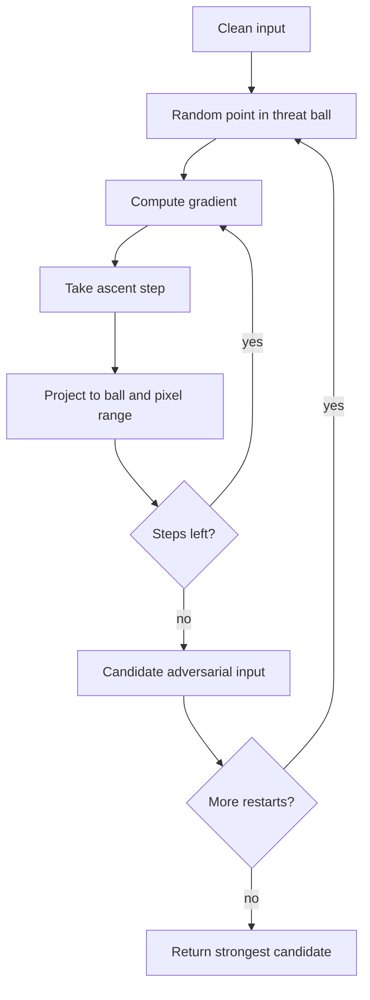

# PGD

Projected Gradient Descent, usually used as projected gradient ascent on the attack loss, is the workhorse first-order attack for norm-bounded robustness evaluation. It takes many small gradient steps, projects the candidate adversarial input back into the allowed threat set after each step, and often starts from a random point inside the perturbation ball.

Madry et al. made PGD central by framing adversarial robustness as robust optimization: training should solve an outer minimization over model parameters and an inner maximization over allowed perturbations. In that view, PGD is both an attack and the inner-loop engine of [adversarial training](/cs/adversarial-attacks/adversarial-training).

## Threat model

The standard PGD threat model is white-box, digital, norm-bounded evasion. The attacker knows the classifier, preprocessing, loss, and defense, and computes input gradients at each iterate. The common untargeted $\ell_\infty$ problem is:

$$
\max_{\delta:\|\delta\|_\infty\le\epsilon,\ x+\delta\in[0,1]^d}
\mathcal{L}(f_\theta(x+\delta),y).
$$

The attacker can also use $\ell_2$ projection, targeted losses, random restarts, alternative margin losses, or expectation over transformations for randomized defenses. PGD is not a certificate: failing to find an adversarial example only means this approximate attack failed under its chosen steps, starts, loss, and budget.

## Method

For $\ell_\infty$ PGD, initialize:

$$
x^0=x+u,\qquad u_i\sim \mathrm{Uniform}[-\epsilon,\epsilon],
$$

then clip $x^0$ to $[0,1]^d$. Each untargeted step is:

$$
\begin{aligned}
z^{t+1} &= x^t+\alpha\,\mathrm{sign}(\nabla_x\mathcal{L}(f_\theta(x^t),y)),\\
x^{t+1} &= \Pi_{[0,1]^d\cap B_\infty(x,\epsilon)}(z^{t+1}).
\end{aligned}
$$

The projection is coordinatewise:

$$
x^{t+1}=\min(1,\max(0,\min(x+\epsilon,\max(x-\epsilon,z^{t+1})))).
$$

For $\ell_2$ PGD, replace the sign step by a normalized gradient step:

$$
z^{t+1}=x^t+\alpha
\frac{\nabla_x\mathcal{L}(f_\theta(x^t),y)}
{\|\nabla_x\mathcal{L}(f_\theta(x^t),y)\|_2}.
$$

The robust training objective is:

$$
\min_\theta
\mathbb{E}_{(x,y)}
\left[
\max_{\delta\in\Delta(x)}
\mathcal{L}(f_\theta(x+\delta),y)
\right].
$$

Madry et al. proposed security against a first-order adversary as a concrete empirical robustness target. In practice, evaluation reports should state $\epsilon$, step size $\alpha$, number of steps, number of restarts, loss, targeted or untargeted goal, and preprocessing.

## Visual



| Choice | Common value | Why it matters |
|---|---|---|
| $\epsilon$ | CIFAR $\ell_\infty$: often $8/255$ | Defines the actual threat model |
| Step size $\alpha$ | Often $2/255$ for PGD-10 style baselines | Too large can bounce; too small can under-search |
| Steps | 10, 20, 50, 100 depending evaluation | More steps usually strengthen attack until saturation |
| Restarts | 1 to 10+ | Helps avoid poor local maxima |
| Loss | Cross-entropy, margin, DLR | Loss choice can change success against defenses |

## Worked example 1: Two $\ell_\infty$ PGD steps

Problem: Let:

$$
x=(0.50,0.50),\quad \epsilon=0.10,\quad \alpha=0.08.
$$

Start at $x^0=x$ and suppose:

$$
\mathrm{sign}(g^0)=(1,1),\qquad \mathrm{sign}(g^1)=(1,-1).
$$

Compute two PGD iterations.

1. The allowed coordinate interval is:

$$
[0.40,0.60].
$$

2. First step:

$$
z^1=(0.50,0.50)+0.08(1,1)=(0.58,0.58).
$$

3. Projection does nothing because $(0.58,0.58)$ is inside the interval:

$$
x^1=(0.58,0.58).
$$

4. Second step:

$$
z^2=(0.58,0.58)+0.08(1,-1)=(0.66,0.50).
$$

5. Project coordinatewise:

$$
x^2=(0.60,0.50).
$$

6. Check the perturbation:

$$
\|x^2-x\|_\infty=\|(0.10,0)\|_\infty=0.10.
$$

Checked answer: $x^2=(0.60,0.50)$, exactly on the $\ell_\infty$ boundary.

## Worked example 2: Robust objective on a tiny batch

Problem: A batch has two examples. PGD finds adversarial losses $2.4$ and $0.7$ for the current model. The clean losses were $0.2$ and $0.4$. What loss enters the robust training objective for this batch?

1. Robust training uses the adversarial inner maximizer, not the clean loss:

$$
\max_{\delta\in\Delta(x_i)}\mathcal{L}(f_\theta(x_i+\delta),y_i).
$$

2. For the two examples, the approximate inner losses are:

$$
2.4,\quad 0.7.
$$

3. The batch robust loss is their average:

$$
\frac{2.4+0.7}{2}=1.55.
$$

4. The clean average would have been:

$$
\frac{0.2+0.4}{2}=0.3.
$$

Checked answer: the training update uses $1.55$ if PGD is the chosen inner maximizer. The larger value reflects the model's worst-case behavior within the threat set, not its average clean behavior.

## Implementation

```python
import torch
import torch.nn.functional as F

def pgd_linf(model, x, y, epsilon=8/255, step_size=2/255, steps=10, restarts=1):
    model.eval()
    best_x = x.detach().clone()
    best_loss = torch.full((x.size(0),), -float("inf"), device=x.device)

    for _ in range(restarts):
        x0 = x.detach()
        x_adv = x0 + torch.empty_like(x0).uniform_(-epsilon, epsilon)
        x_adv = x_adv.clamp(0.0, 1.0)

        for _ in range(steps):
            x_adv.requires_grad_(True)
            loss = F.cross_entropy(model(x_adv), y, reduction="sum")
            grad = torch.autograd.grad(loss, x_adv)[0]
            with torch.no_grad():
                x_adv = x_adv + step_size * grad.sign()
                delta = (x_adv - x0).clamp(-epsilon, epsilon)
                x_adv = (x0 + delta).clamp(0.0, 1.0)

        with torch.no_grad():
            losses = F.cross_entropy(model(x_adv), y, reduction="none")
            replace = losses > best_loss
            best_loss[replace] = losses[replace]
            best_x[replace] = x_adv[replace]

    return best_x.detach()
```

For adversarial training, call a PGD inner loop while the model is in the intended training/evaluation mode, then backpropagate through the final adversarial examples into the model weights. Do not accidentally retain attack-loop gradients through every PGD step unless that is the intended algorithm.

## Original paper results

Madry et al.'s "Towards Deep Learning Models Resistant to Adversarial Attacks" studied robustness through the robust optimization objective above and used PGD as a strong first-order adversary. The paper reported significantly improved resistance on MNIST and CIFAR-10 compared with standard training under the evaluated $\ell_\infty$ threat models, and released challenge models to benchmark attacks.

The safest headline is methodological: PGD with random starts became the default empirical first-order stress test and the inner maximizer for PGD adversarial training. Reported robust accuracies are meaningful only with the dataset, architecture, $\epsilon$, steps, restarts, and evaluation attack.

## Connections

- [FGSM](/cs/adversarial-attacks/fgsm) is the one-step ancestor of PGD.
- [White-box attacks](/cs/adversarial-attacks/white-box-attacks) gives PGD's evaluation role.
- [Adversarial training](/cs/adversarial-attacks/adversarial-training) uses PGD as an inner-loop attack.
- [Evaluation and benchmarks](/cs/adversarial-attacks/evaluation-and-benchmarks) explains why attack configuration must be reported.
- [Adaptive AutoAttack](/cs/adversarial-attacks/adaptive-autoattack) is an evaluation-oriented follow-up direction.
- [Robustness-accuracy tradeoff](/cs/adversarial-attacks/robustness-accuracy-tradeoff) discusses the cost of training for worst-case risk.

## Common pitfalls / when this attack is used today

- Calling PGD "the exact worst case." It is an approximate optimizer.
- Using too few steps or no random starts against a defended model.
- Forgetting to attack preprocessing, normalization, randomization, or detection logic.
- Comparing PGD results across papers with different $\epsilon$ scales.
- Treating PGD adversarial training as a certificate.
- Using PGD today as a standard first-order baseline, adversarial training engine, and debugging tool before broader AutoAttack-style evaluation.

PGD's strength depends on configuration. A weak PGD run can make a defense look robust even when the threat model is ordinary. Step size should be checked by plotting or logging attack loss over iterations: if the loss immediately spikes and then oscillates, the step may be too large; if it barely moves, the step may be too small or gradients may be obstructed. More steps should not make the attack substantially weaker under a fixed objective. If PGD-100 performs worse than PGD-20, inspect projection, clipping, numerical precision, and model mode.

Restarts matter because the inner maximization is nonconvex. A single random start may find a poor local maximum, especially for robustly trained models whose loss landscapes are flatter near data points. Reporting "PGD-20" without restarts is ambiguous. A useful report states something like "untargeted $\ell_\infty$ PGD, $\epsilon=8/255$, step size $2/255$, 20 steps, 10 random restarts, cross-entropy loss, best loss selected." That sentence is longer than "PGD," but it is the actual evaluation protocol.

Loss choice is another practical issue. Cross-entropy can saturate when logits become extreme, and targeted attacks can behave differently from untargeted attacks. Margin losses, DLR-style losses, or attack ensembles can find examples that a plain cross-entropy PGD run misses. This does not mean PGD is obsolete; it means "PGD" is a template, and the objective inside the template must fit the defended system.

When PGD is used for adversarial training, the inner attack is part of the training algorithm. Stronger inner attacks usually improve robustness but increase cost. Too weak an inner attack can lead to catastrophic overfitting or robustness that only holds against the training attack. Too strong an inner attack can slow training and sometimes reduce clean accuracy. This is the practical origin of many variants: free adversarial training, fast adversarial training, TRADES, curriculum schedules, and larger-scale robust training all modify the cost and objective around the same min-max idea.

PGD should also be adapted to the whole deployed pipeline. If a defense includes random resizing, JPEG compression, denoising, detection, or an ensemble, then attacking only the base classifier is not a white-box attack on the system. Use EOT for randomness, BPDA or differentiable surrogates for nondifferentiable transformations, and report exactly which computation graph the gradients use.

A compact PGD reporting checklist is:

| Field | What to write down |
|---|---|
| Threat set | Norm, radius, clipping range, and preprocessing scale |
| Optimizer | Step size, steps, restarts, and random-start distribution |
| Objective | Cross-entropy, margin, DLR, targeted loss, or ensemble loss |
| Selection | Best loss, first success, or best margin across restarts |
| Adaptivity | How preprocessing, randomness, detectors, or ensembles are attacked |
| Scope | All examples or only clean-correct examples |

For reproduction, robust accuracy should be paired with attack diagnostics. Useful diagnostics include average final margin, attack success versus iteration, success versus restart count, and the fraction of examples already misclassified cleanly. If increasing restarts changes robust accuracy substantially, the original attack was not saturated. If increasing steps does nothing after a small number of iterations, that may indicate saturation, but it may also indicate a step-size or gradient issue.

In adversarial training papers, distinguish training-time PGD from evaluation-time PGD. The evaluation attack should usually be at least as strong as the training attack and often stronger. A model trained with PGD-7 and evaluated only with PGD-7 has not been stress-tested against the attack family; it has been tested against a close copy of its training generator.

## Further reading

- Madry et al., "Towards Deep Learning Models Resistant to Adversarial Attacks."
- Goodfellow, Shlens, and Szegedy, "Explaining and Harnessing Adversarial Examples."
- Croce and Hein, "Reliable Evaluation of Adversarial Robustness with an Ensemble of Diverse Parameter-free Attacks."
- Athalye, Carlini, and Wagner, "Obfuscated Gradients Give a False Sense of Security."
