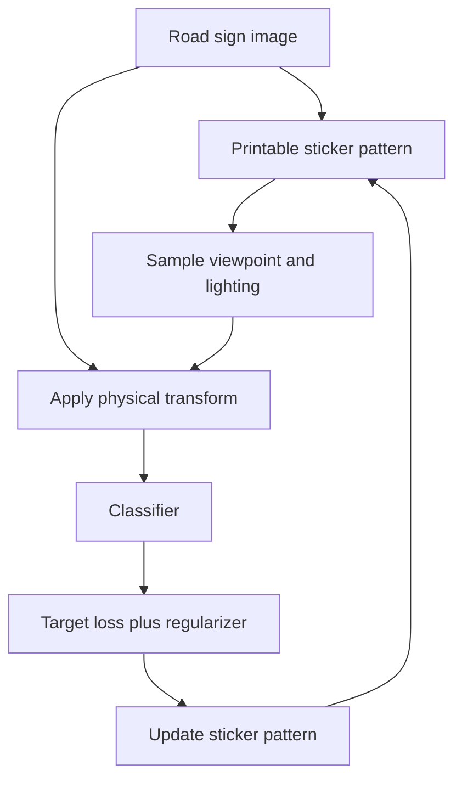

# Physical Stop-Sign Attack

The physical stop-sign attack, introduced through Robust Physical Perturbations (RP2), shows how adversarial optimization can produce printed markings that fool road-sign classifiers under real viewing conditions. The perturbation is not just an image-space noise pattern; it must survive printing, placement, distance, angle, lighting, and camera capture.

This attack is a landmark physical-world example because it frames road-sign attacks as expectation-over-transformations optimization with additional constraints for human plausibility and physical deployment.

## Threat model

The attacker can place stickers, graffiti-like markings, or a poster on or near a traffic sign. The target system is an image classifier or detector used in a perception pipeline. The goal is targeted or untargeted misclassification, such as causing a stop sign to be classified as a speed-limit sign.

The input is generated by a physical or simulated transformation:

$$
x'=T(x,p;\omega),
$$

where $p$ is the printable perturbation and $\omega$ includes viewpoint, scale, lighting, blur, distance, and camera effects. The budget is physical: perturbation area, location, printability, and whether the sign remains plausible to humans.

## Method

RP2 optimizes a perturbation over a distribution of transformations:

$$
\min_p
\mathbb{E}_{\omega\sim\Omega}
\left[
\mathcal{L}(f(T(x,p;\omega)),y_t)
\right]
\lambda R(p).
$$

Here $y_t$ is the target class for a targeted attack, and $R(p)$ is a regularizer that encourages physical plausibility or limits visual change. The expectation term trains the perturbation to work across sampled photos or synthetic transformations rather than one fixed image.

For mask-constrained stickers:

$$
x'=(1-m)x+m p,
$$

with $m$ restricting where the perturbation can appear. In physical deployment, the optimized pattern is printed, placed on a sign, photographed from different viewpoints, and evaluated against the classifier.

## Visual



| Constraint | Digital patch | Physical stop-sign attack |
|---|---|---|
| Location | Often arbitrary | Restricted to sign or plausible markings |
| Transformations | Optional augmentation | Central to the threat model |
| Output medium | Pixels | Printed material and camera capture |
| Human constraint | May be ignored | Sign should remain recognizable or plausible |
| Evaluation | Test images | Lab and field photographs or drive-by captures |

## Worked example 1: Transformation-averaged loss

Problem: A sticker is evaluated under three sampled transformations. The target-class losses are:

$$
0.8,\quad 1.1,\quad 0.5.
$$

The regularizer is $R(p)=0.2$ and $\lambda=0.5$. Compute the RP2-style objective estimate.

1. Average target loss:

$$
\frac{0.8+1.1+0.5}{3}=\frac{2.4}{3}=0.8.
$$

2. Regularization term:

$$
\lambda R(p)=0.5(0.2)=0.1.
$$

3. Total objective:

$$
0.8+0.1=0.9.
$$

Checked answer: the estimated objective is $0.9$. Optimization should reduce both expected attack loss and regularization cost.

## Worked example 2: Masked sticker update

Problem: A pixel on the sign has clean value $0.60$. The optimized sticker value is $0.10$. The mask is $m=1$ on sticker pixels and $m=0$ elsewhere. Compute the attacked pixel for both mask values.

1. The mask formula is:

$$
x'=(1-m)x+mp.
$$

2. On the sticker:

$$
x'=(1-1)(0.60)+1(0.10)=0.10.
$$

3. Off the sticker:

$$
x'=(1-0)(0.60)+0(0.10)=0.60.
$$

Checked answer: the perturbation changes only masked sticker locations. This is why physical attack papers must report the mask shape and placement.

## Implementation

```python
import torch
import torch.nn.functional as F

def masked_overlay(x, pattern, mask):
    return ((1 - mask) * x + mask * pattern).clamp(0.0, 1.0)

def rp2_like_step(model, x_batch, pattern, mask, target, lam=0.01, lr=0.03):
    pattern = pattern.detach().clone().requires_grad_(True)
    x_adv = masked_overlay(x_batch, pattern, mask)
    target_loss = F.cross_entropy(model(x_adv), target)
    regularizer = (mask * (pattern - x_batch).abs()).mean()
    loss = target_loss + lam * regularizer
    grad = torch.autograd.grad(loss, pattern)[0]
    with torch.no_grad():
        pattern = (pattern - lr * grad.sign() * mask).clamp(0.0, 1.0)
    return pattern.detach()
```

This sketch assumes transformed views already appear in `x_batch`. A physical evaluation must include print/camera transformations and held-out viewpoints.

## Original paper results

Eykholt et al.'s CVPR 2018 paper "Robust Physical-World Attacks on Deep Learning Visual Classification" demonstrated robust physical perturbations against road-sign classifiers, including sticker-like and poster-like attacks on stop signs. The paper reports successful attacks under laboratory and real-world viewing conditions, with exact success rates depending on target, sign, distance, angle, and experimental setup.

The conservative takeaway is that physical robustness must be evaluated under transformations. A digital defense against $\ell_\infty$ noise does not automatically protect a road-sign perception system from printable localized attacks.

## Connections

- [Adversarial patch](/cs/adversarial-attacks/adversarial-patch) gives the general universal patch formulation.
- [Physical-world and patch attacks](/cs/adversarial-attacks/physical-world-and-patch-attacks) explains expectation over transformations.
- [Threat models and attack taxonomy](/cs/adversarial-attacks/threat-models-and-attack-taxonomy) separates physical capabilities from digital norm balls.
- [Evaluation and benchmarks](/cs/adversarial-attacks/evaluation-and-benchmarks) covers reporting transformation distributions.
- [Attacks on LLMs and other modalities](/cs/adversarial-attacks/attacks-on-llms-and-other-modalities) shows how modality-specific constraints change the adversarial example problem beyond images.

## Common pitfalls / when this attack is used today

- Evaluating only on the image used for optimization.
- Ignoring camera exposure, motion blur, distance, and print color shifts.
- Claiming the sign is human-recognizable without a human or operational criterion.
- Comparing sticker area to $\ell_\infty$ budgets as if they are the same.
- Forgetting that targeted and untargeted road-sign goals have different safety implications.
- Using this attack today as a template for physical perception threat modeling and transformation-aware evaluation.

The stop-sign setting illustrates why physical attacks need domain constraints. A sticker pattern that covers the whole sign may fool a classifier, but it may no longer represent the same operational scenario as subtle vandalism or natural-looking graffiti. A perturbation that works in a cropped classifier input may fail in a detector pipeline that first localizes signs. A serious evaluation should state whether the target is a classifier on cropped signs, an object detector, or a full driving perception stack.

Transformation sampling should be matched to deployment. For a roadside sign, relevant variables include distance, yaw, pitch, illumination, weathering, motion blur, camera resolution, and automatic exposure. Training on transformations that are too narrow creates a brittle artifact; training on transformations that are too broad may make the optimization harder but the claim more meaningful. Held-out physical captures are particularly important because simulated transformations rarely capture every sensor effect.

Human factors are not optional. If the attack assumes the sign remains recognizable to drivers, the paper should include a criterion for recognizability or plausibility. That criterion might be a human study, compliance with sign-shape constraints, or a narrower claim such as "the perturbation is sticker-like" rather than "the sign is safe for humans." In safety-critical settings, model misclassification and human interpretation are both part of the risk analysis.

Defenses can operate at several levels: robust sign classifiers, detector ensembles, temporal tracking, maps, vehicle behavior constraints, or sensor fusion. An image-only classifier defense is useful but incomplete if the deployed vehicle uses multiple sensors and temporal smoothing. Conversely, a full-stack defense should still test the vision component because perception failures can interact with planning in unexpected ways.

Today, the RP2-style stop-sign attack is best used as a methodological template. It teaches masked perturbations, physical transformations, printability, and operational threat models. The exact stickers from one experiment are less important than the workflow: define attacker capability, optimize over transformations, deploy or simulate realistically, and report success under held-out physical conditions.

A compact physical stop-sign attack reporting checklist is:

| Field | What to write down |
|---|---|
| Target system | Cropped classifier, detector, or full perception stack |
| Physical access | Sticker, poster, graffiti-like marking, or sign replacement |
| Mask | Perturbation location and area on the sign |
| Transformations | Distance, angle, lighting, blur, camera, and weather assumptions |
| Goal | Target class, untargeted error, hiding, or downstream driving effect |
| Trials | Lab images, field captures, drive-by frames, and held-out conditions |

For reproduction, keep the optimized digital pattern and the printable artifact distinct. The printed colors may not match the digital values, and the camera may process them differently. A physical attack report should include photos or measurements of the deployed artifact, plus the exact classifier input crops if possible. Without that, later readers cannot tell whether failures come from optimization, printing, capture, or preprocessing.

The safety interpretation should also be modest. A road-sign classifier misclassification is a serious perception failure, but vehicle behavior depends on maps, temporal smoothing, planning, and other sensors. Conversely, a full vehicle may fail in ways a cropped classifier test misses. The correct claim is the one actually evaluated.

A final interpretation point is that physical attacks are not weaker or stronger than digital attacks in the abstract; they are different. The perturbation is more visible and constrained by materials, but the deployment path is more realistic for many safety-critical systems. A sticker that survives distance and lighting may be more operationally relevant than an imperceptible digital perturbation that assumes access to the camera tensor.

For readers moving from this page to defenses, the central question is coverage. Does the defense protect a cropped classifier, the detector, the tracker, or the whole vehicle behavior? Does it protect against the same patch size and placement? Does it use held-out physical views? Without those answers, "robust to stop-sign attacks" is too broad.

The same caution applies to attack severity. A targeted speed-limit misclassification, a generic non-stop label, a missed detection, and a late detection can have different downstream consequences. The attack page should preserve those distinctions because safety analysis depends on the actual failure mode.

For reproducibility, include enough geometry to reconstruct the scene: sign size, camera distance, approximate viewing angle, crop method, and classifier input resolution. Physical attacks often fail or succeed because of these details, not only because of the optimized sticker pattern.

## Further reading

- Eykholt et al., "Robust Physical-World Attacks on Deep Learning Visual Classification."
- Brown et al., "Adversarial Patch."
- Athalye et al., "Synthesizing Robust Adversarial Examples."
