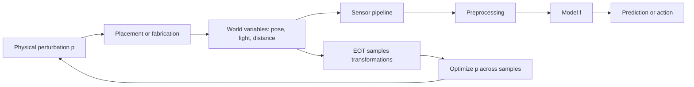

# Physical-World and Patch Attacks

Physical-world attacks ask whether adversarial examples survive outside a saved tensor. A perturbation must pass through printing, lighting, camera optics, viewpoint changes, compression, cropping, sensor noise, and human interpretation. Patch attacks relax the tiny-noise assumption: instead of changing every pixel a little, the adversary changes a localized region, such as a sticker, eyeglass frame, sign overlay, audio segment, or object texture.

This topic is where adversarial ML most clearly meets deployment. The correct mathematical object is no longer just $x+\delta$; it is a transformation pipeline from a physical modification to the model's observed input. The standard tool is expectation over transformations, and the standard warning is that digital $\ell_p$ robustness is not automatically physical robustness.

## Definitions

A **physical-world attack** creates an adversarial effect after a real-world sensing process. If $x$ is a clean scene and $p$ is a physical perturbation, the model observes:

$$
x' = T(x, p; \omega),
$$

where $\omega$ represents nuisance variables such as pose, scale, lighting, camera response, background, distance, and noise.

A **patch attack** restricts the adversary to a region. In image coordinates, a simple digital patch model is:

$$
x' = (1-M)\odot x + M\odot p,
$$

where $M \in \{0,1\}^d$ is a mask and $p$ is the patch content. The budget may be patch area, allowed location, printability, color range, or semantic plausibility rather than an $\ell_p$ norm.

An **Expectation over Transformations (EOT)** objective optimizes expected attack success across transformations:

$$
\max_p
\mathbb{E}_{\omega \sim \Omega}
\left[
\mathcal{L}(f_\theta(T(x,p;\omega)), y)
\right].
$$

For targeted attacks:

$$
\min_p
\mathbb{E}_{\omega \sim \Omega}
\left[
\mathcal{L}(f_\theta(T(x,p;\omega)), y_t)
\right].
$$

A **printability constraint** discourages colors or patterns that cannot be reproduced reliably by a printer or display. A **semantic constraint** ensures the modified object is still recognized by humans as the original object when that matters for the application.

Patch attacks can be **universal** or **image-specific**. A universal patch is optimized to fool many inputs:

$$
\max_p
\mathbb{E}_{(x,y)\sim \mathcal{D},\ \omega\sim\Omega}
\left[
\mathcal{L}(f_\theta(T(x,p;\omega)), y)
\right].
$$

## Key results

The key difference between digital and physical attacks is robustness of the attack itself. A digital adversarial example may fail after a one-pixel translation or JPEG compression; a physical attack must remain effective across a distribution of transformations. EOT directly addresses this by optimizing the average loss across sampled transformations. In practice, each gradient step samples a mini-batch of transformations and backpropagates through the differentiable rendering or augmentation pipeline.

Patch attacks also show that imperceptibility is not the only threat. A patch may be obvious to a human but still dangerous if the system is expected to ignore irrelevant regions. For example, an object detector should not classify a person as a toaster because of a visible sticker. In safety settings, "visible" and "safe" are different ideas.

Physical attacks have multiple validity layers:

- **Digital validity**: pixel values are in range and the attack matches the simulated mask or transform.
- **Manufacturing validity**: the pattern can be printed, displayed, spoken, played, or fabricated.
- **Sensor validity**: the attack survives the camera, microphone, lidar, or other sensor pipeline.
- **Task validity**: humans still assign the intended class or instruction.
- **Operational validity**: the attacker can place, wear, display, or transmit the perturbation under deployment constraints.

Because physical evaluation is expensive, many papers use simulated EOT first and physical experiments second. The simulation does not prove physical success unless the transformation distribution matches the deployment environment. Conversely, a physical demo does not define a general robustness claim unless the scenario, attack construction, and failure cases are reported.

A careful physical report should include the full measurement protocol. For a vision system, that means object size, camera model when relevant, distance range, angle range, lighting, print or display medium, number of trials, and whether failed placements were counted. For audio, it means speakers, microphones, room conditions, loudness, background noise, and whether the perturbation survives over-the-air playback. These details are not bureaucracy: they define the distribution $\Omega$ in the EOT objective. If $\Omega$ is too narrow, the learned attack may be a lab artifact. If it is too broad, optimization may fail even though narrower real attacks remain possible.

Patch defenses need the same care. Cropping, blurring, JPEG compression, random resizing, or patch detectors may stop a naive patch while failing against an adaptive patch optimized through those transformations. A defense should therefore report adaptive patch optimization, not only performance against a patch generated for an undefended model.

## Visual



| Attack type | Perturbation budget | Transformation concern | Example domain |
|---|---|---|---|
| Digital norm-bounded | $\|\delta\|_p \le \epsilon$ | Usually none or light augmentation | Image classifier benchmark |
| Sticker or patch | Area, location, color, printability | Pose, scale, lighting, occlusion | Traffic signs, object detectors |
| Wearable accessory | Shape, placement, social plausibility | Face pose, camera angle, detection crop | Face recognition |
| Audio perturbation | Loudness, psychoacoustic masking, playback channel | Room acoustics, speakers, microphones | Speech recognition |
| 3D object texture | Surface texture, material, renderer | Viewpoint, lighting, mesh geometry | 3D printed objects |

## Worked example 1: EOT objective with three transformations

Problem: A targeted patch attack samples three transformations in one optimization step. The target-class cross-entropy losses are:

$$
0.9,\quad 1.2,\quad 0.6.
$$

For a targeted attack, lower target loss is better. Compute the EOT loss estimate and explain the update direction.

1. The Monte Carlo estimate of expected target loss is the average:

$$
\hat{L}_{\mathrm{EOT}}
= \frac{0.9+1.2+0.6}{3}.
$$

2. Sum the losses:

$$
0.9+1.2+0.6 = 2.7.
$$

3. Divide by 3:

$$
\hat{L}_{\mathrm{EOT}} = 0.9.
$$

4. Since the attack is targeted, the optimizer should move the patch in the negative gradient direction of this average loss:

$$
p \leftarrow p - \alpha \nabla_p \hat{L}_{\mathrm{EOT}}.
$$

Checked answer: the estimated EOT loss is $0.9$, and a targeted gradient attack descends this average so the target class becomes more likely across transformations, not just in one view.

## Worked example 2: Patch-area budget

Problem: A detector input is $640 \times 480$ pixels. An attack uses a square patch of side length 80 pixels. Compute the patch area fraction.

1. Image area:

$$
A_{\mathrm{image}} = 640 \cdot 480 = 307200.
$$

2. Patch area:

$$
A_{\mathrm{patch}} = 80 \cdot 80 = 6400.
$$

3. Fraction:

$$
\frac{A_{\mathrm{patch}}}{A_{\mathrm{image}}}
= \frac{6400}{307200}.
$$

4. Simplify:

$$
\frac{6400}{307200} = 0.020833\ldots
$$

5. Convert to percent:

$$
0.020833\ldots \cdot 100\% \approx 2.08\%.
$$

Checked answer: the patch covers about $2.08\%$ of the image. This budget is not comparable to an $\ell_\infty$ budget such as $8/255$; it measures localized area rather than per-pixel amplitude.

## Code

```python
import torch
import torch.nn.functional as F

def apply_patch(x, patch, top, left):
    x_patched = x.clone()
    _, _, h, w = patch.shape
    x_patched[:, :, top:top + h, left:left + w] = patch
    return x_patched

def optimize_patch_step(model, x, y_target, patch, optimizer, transforms):
    optimizer.zero_grad()
    losses = []

    for transform in transforms:
        top, left, aug = transform
        patched = apply_patch(x, patch, top, left)
        viewed = aug(patched).clamp(0.0, 1.0)
        losses.append(F.cross_entropy(model(viewed), y_target))

    loss = torch.stack(losses).mean()
    loss.backward()
    optimizer.step()
    with torch.no_grad():
        patch.clamp_(0.0, 1.0)
    return float(loss.detach())
```

This sketch shows the EOT pattern: apply the same learnable patch under several transformations, average the target loss, update the patch, and clamp it to a printable pixel range. Real physical attacks need a more realistic transform distribution and often a printability penalty.

## Common pitfalls

- Treating digital $\ell_p$ robustness as evidence of sticker, camera, or audio robustness.
- Reporting a physical demo without the transformation range, number of trials, distances, angles, and failed attempts.
- Optimizing a patch for one fixed crop and then claiming general physical robustness.
- Ignoring human semantic validity, such as whether a modified stop sign is still a stop sign to drivers.
- Forgetting that object detectors add complications: region proposals, non-maximum suppression, confidence thresholds, and multiple objects.
- Using nondifferentiable transformations in training but not adapting the attack with approximations or score-based search.
- Comparing patch attacks to imperceptible-noise attacks without saying that their threat models are different.

## Connections

- [Threat models and attack taxonomy](/cs/adversarial-attacks/threat-models-and-attack-taxonomy) explains why physical attacks require different capability and budget definitions.
- [Mathematical formulation](/cs/adversarial-attacks/mathematical-formulation) gives the constrained-optimization view behind EOT.
- [White-box attacks](/cs/adversarial-attacks/white-box-attacks) provides the gradient methods used inside differentiable EOT.
- [Evaluation and benchmarks](/cs/adversarial-attacks/evaluation-and-benchmarks) discusses adaptive evaluation and reporting.
- [Attacks on LLMs and other modalities](/cs/adversarial-attacks/attacks-on-llms-and-other-modalities) broadens the idea of perturbation beyond images.

## Further reading

- Kurakin, Goodfellow, and Bengio, "Adversarial Examples in the Physical World."
- Athalye et al., "Synthesizing Robust Adversarial Examples."
- Eykholt et al., "Robust Physical-World Attacks on Deep Learning Visual Classification."
- Brown et al., "Adversarial Patch."
- Sharif et al., work on adversarial eyeglass frames for face recognition.
