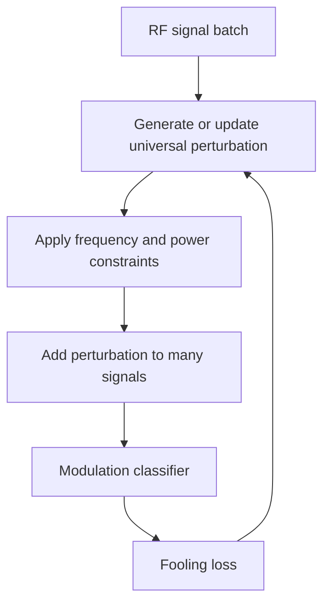

# RF Universal Adversarial Perturbations

RF universal adversarial perturbations adapt image-domain universal attacks to automatic modulation classification. Instead of adding a shared image-like vector to pixels, the attacker adds a signal perturbation to in-phase and quadrature samples so that a deep modulation classifier misidentifies many transmissions.

This page groups the source folder's radio-modulation attack and defense material under the named technique. The main attack is UAP-FD, a universal perturbation under frequency and data constraints; related defense work uses autoencoder-style pretraining or denoising ideas to improve robustness in the RF domain.

## Threat model

The target is an automatic modulation classification DNN that maps a received signal $x$ to a modulation label. A universal perturbation $v$ is added:

$$
x_{\mathrm{adv}}=x+v.
$$

The perturbation must respect communication-domain constraints: power, frequency content, shift invariance, channel effects, and sometimes data-free black-box settings. The goal is untargeted accuracy reduction or a high fooling rate:

$$
f(x+v)\ne y
$$

for many signals $x$. A practical RF attacker may not know the exact transmitted signal, so a universal and shift-invariant perturbation is more plausible than per-example optimization.

## Method

UAP-FD follows the universal-perturbation idea but adapts it to signal constraints. A generic universal objective is:

$$
\max_v
\mathbb{E}_{(x,y)\sim\mathcal{D}}
\left[
\mathcal{L}(f(x+v),y)
\right]
\quad \text{subject to} \quad v\in\mathcal{C}_{\mathrm{RF}}.
$$

The constraint set $\mathcal{C}_{\mathrm{RF}}$ can encode perturbation power, spectral limits, frequency filtering, and data constraints. The source paper describes filtering individual perturbations, decomposing and reconstructing signals to reduce high-frequency perceptibility, and generating proxy signals for data-free black-box settings.

For defenses, an autoencoder or denoising front end can be trained to map received signals toward clean representations:

$$
\hat{x}=D_\phi(E_\psi(x_{\mathrm{adv}})),
$$

then classify $\hat{x}$. Such defenses must be evaluated adaptively because an attacker may optimize through the preprocessing if it is known.

## Visual



| Aspect | Image UAP | RF UAP-FD |
|---|---|---|
| Input | Pixels | I/Q signal samples |
| Constraint | $\ell_p$ norm and clipping | Power, spectrum, shift, channel |
| Deployment | Add image perturbation | Transmit or inject signal perturbation |
| Evaluation | Fooling rate or accuracy drop | Classification accuracy, imperceptibility, channel robustness |
| Defense concern | Gradient masking and preprocessing | Denoising, filtering, adaptive RF-aware attacks |

## Worked example 1: Accuracy drop

Problem: An AMC model has clean accuracy $83\%$. Under a universal RF perturbation, accuracy falls to $9\%$. Compute the absolute and relative accuracy drop.

1. Absolute drop:

$$
83\%-9\%=74\ \text{percentage points}.
$$

2. Relative drop compared with clean accuracy:

$$
\frac{83-9}{83}=\frac{74}{83}\approx0.8916.
$$

3. Percentage:

$$
0.8916\cdot100\%\approx89.2\%.
$$

Checked answer: the attack causes a 74-point absolute drop, about an 89.2% relative reduction from the clean accuracy.

## Worked example 2: Perturbation power projection

Problem: A perturbation vector has energy:

$$
\|v\|_2^2=25.
$$

The allowed energy is $P=9$. What scale factor projects $v$ to the energy budget?

1. Current norm:

$$
\|v\|_2=5.
$$

2. Allowed norm:

$$
\sqrt{P}=3.
$$

3. Scale factor:

$$
\frac{3}{5}=0.6.
$$

4. Projected perturbation:

$$
v_{\mathrm{proj}}=0.6v.
$$

Checked answer: scaling by $0.6$ gives energy $9$ because $\|0.6v\|_2^2=0.36(25)=9$.

## Implementation

```python
import torch
import torch.nn.functional as F

def project_power(v, max_energy):
    flat = v.view(v.size(0), -1)
    energy = flat.pow(2).sum(dim=1).clamp_min(1e-12)
    scale = torch.minimum(torch.ones_like(energy), (max_energy / energy).sqrt())
    return (flat * scale[:, None]).view_as(v)

def rf_uap_step(model, signals, labels, v, max_energy, lr=1e-2):
    v = v.detach().clone().requires_grad_(True)
    adv = signals + v
    loss = F.cross_entropy(model(adv), labels)
    grad = torch.autograd.grad(loss, v)[0]
    with torch.no_grad():
        v = v + lr * grad.sign()
        v = project_power(v, max_energy)
    return v.detach()
```

This code shows a universal signal perturbation update with a simple power projection. Real RF attacks require signal-specific constraints, channel models, and careful train/test separation.

## Original paper results

Wang et al.'s "Universal Attack Against Automatic Modulation Classification DNNs Under Frequency and Data Constraints" reported that UAP-FD reduced a model's accuracy from $83\%$ to $9\%$ in one evaluated setting while maintaining imperceptibility and shift-invariance properties. The paper also reports a real-world captured-signal setting where accuracy dropped from $98.3\%$ to $12.5\%$.

The conservative takeaway is that universal perturbation ideas transfer beyond images, but the RF threat model must include frequency, power, channel, and data-availability constraints.

## Connections

- [Universal adversarial perturbations](/cs/adversarial-attacks/universal-adversarial-perturbations) gives the image-domain origin.
- [Attacks on LLMs and other modalities](/cs/adversarial-attacks/attacks-on-llms-and-other-modalities) provides the broader non-image context.
- [Black-box and transfer attacks](/cs/adversarial-attacks/black-box-and-transfer-attacks) connects to data-free and black-box settings.
- [Certified defenses and randomized smoothing](/cs/adversarial-attacks/certified-defenses-and-randomized-smoothing) gives a contrast with empirical denoising defenses.
- [Evaluation and benchmarks](/cs/adversarial-attacks/evaluation-and-benchmarks) explains why domain-specific budgets must be reported.

## Common pitfalls / when this attack is used today

- Reusing image $\ell_p$ budgets without RF power or spectral constraints.
- Reporting digital simulation success as over-the-air success.
- Ignoring channel shifts, synchronization, and receiver preprocessing.
- Treating denoising defenses as robust without adaptive attacks.
- Confusing untargeted accuracy reduction with targeted modulation impersonation.
- Using RF universal perturbations today for wireless ML robustness tests and cross-domain adversarial-ML examples.

RF attacks require careful separation between simulation and transmission. A perturbation that reduces accuracy on stored I/Q samples may not survive the transmitter, channel, receiver filters, synchronization, and automatic gain control of a real system. Conversely, an over-the-air perturbation can interact with the channel in ways that are absent from a clean dataset. A report should state whether the perturbation is injected digitally, transmitted physically, or replayed through captured signals.

Power and spectral constraints are not just cosmetic. Wireless systems are regulated and engineered around bandwidth, power, and interference. A perturbation with high out-of-band energy might be easy to detect or illegal to transmit. A perturbation that overwhelms the signal may be more like jamming than an adversarial example. UAP-FD's emphasis on frequency and data constraints is important because it moves the threat model closer to communication reality.

Universality has a special meaning for modulation classification. If the attacker does not know the exact transmitted bits, a per-sample perturbation is less plausible. A universal or data-free perturbation can be prepared without observing every signal instance. Shift invariance also matters because timing offsets can move the perturbation relative to symbol boundaries. These constraints make RF universal attacks different from simply reusing an image UAP algorithm.

Defenses such as denoising autoencoders, filtering, or preprocessing should be attacked adaptively. If the attacker knows the denoiser, gradients can pass through it. If the filter removes high frequencies, the attacker can optimize a lower-frequency perturbation. If the defense uses randomness, the attacker can optimize expected loss. Robustness claims should therefore include adaptive attacks, not only attacks generated against the undefended classifier.

RF adversarial ML also has benign uses: stress-testing learned receivers, evaluating modulation classifiers before deployment, and designing robust training procedures. Because wireless systems affect shared spectrum, experimental work should avoid uncontrolled transmission. Simulated channels, shielded environments, or authorized testbeds are the right setting for reproducing attacks.

A compact RF UAP reporting checklist is:

| Field | What to write down |
|---|---|
| Signal representation | I/Q samples, spectrogram, features, sample rate, and normalization |
| Constraint | Power, spectral mask, frequency band, shift, and clipping |
| Access | White-box, black-box, data-free, or proxy-signal setting |
| Channel | Digital injection, simulated channel, captured replay, or over-the-air test |
| Metric | Accuracy drop, fooling rate, target success, and imperceptibility |
| Defense | Whether filtering or denoising is attacked adaptively |

For reproduction, include the modulation dataset, signal length, SNR distribution, train/test split, and channel model. A perturbation that works at one SNR may fail at another. If the attack uses proxy signals, describe how they are generated and whether they overlap statistically with the evaluation set. If real captured signals are used, document the hardware and capture conditions.

RF attacks also blur the line between adversarial examples and interference. The difference is the constraint and goal: an adversarial perturbation is designed to cause classifier error while staying within a limited, often hard-to-detect signal budget; a jammer may simply overpower communication. Reports should make this distinction clear so that robustness numbers are not interpreted as general anti-jamming guarantees.

A final interpretation point is that RF adversarial examples are system-level phenomena. The classifier is only one component in a receiver stack that may include synchronization, filtering, demodulation, error correction, and protocol logic. A perturbation that fools a standalone modulation classifier may or may not affect the final communication task. Conversely, a small classifier error can matter if the classifier controls spectrum sensing, signal identification, or downstream routing decisions.

For cross-section study, this page is a useful bridge between adversarial ML and communications engineering. The same universal-perturbation mathematics appears in image classifiers, but the engineering constraints come from signal processing. That is why this page links back to universal perturbations while insisting on RF-specific budgets.

When reading RF robustness numbers, check whether the baseline classifier is already sensitive to ordinary channel variation. If clean accuracy changes sharply with SNR or channel model, an adversarial accuracy drop should be interpreted against that baseline. Robustness to adversarial perturbations and robustness to natural channel variation are related but not identical.

The safest summary is therefore conditional: under the stated signal representation, channel assumptions, and perturbation constraints, the learned receiver fails. That is a precise and useful claim. It should not be inflated into a statement about all radios, all channels, or all communication systems.

Precision keeps the result useful.

## Further reading

- Wang et al., "Universal Attack Against Automatic Modulation Classification DNNs Under Frequency and Data Constraints."
- Moosavi-Dezfooli et al., "Universal Adversarial Perturbations."
- Domain-specific work on adversarial examples and defenses for automatic modulation classification.
