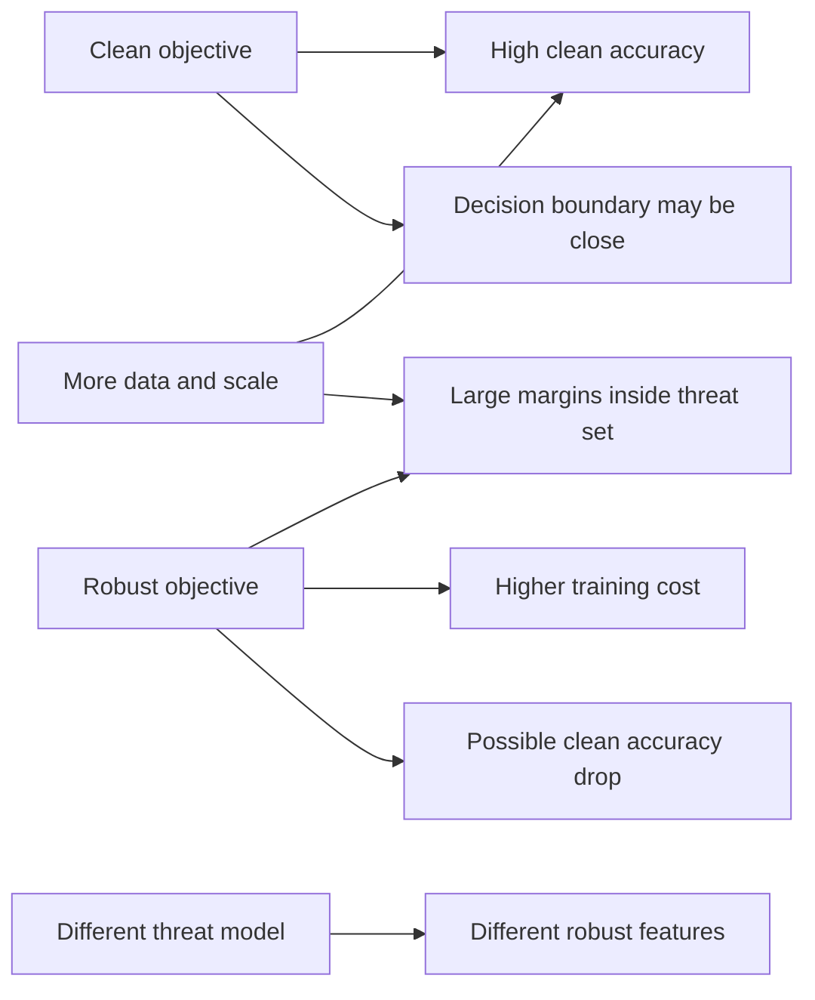

# Robustness-Accuracy Tradeoff

Robust models often lose clean accuracy compared with standard models. This is not just an implementation inconvenience; in many settings robustness changes the classification problem. A classifier that must be correct on every point in an $\epsilon$-ball needs larger margins, smoother decision boundaries, different features, and often more data or compute.


*Figure: The FGSM panda example shows that imperceptible perturbations can change model decisions. Image: [ar5iv](https://arxiv.org/abs/1412.6572), Goodfellow, Shlens, and Szegedy, educational use with attribution.*

The tradeoff should not be oversold as an absolute law for every dataset and architecture. Better data, architectures, training methods, and scale can improve both clean and robust accuracy. But the tension is real enough that every robustness result should report both metrics and name the threat model. This page explains the formal decomposition, geometric intuition, and practical consequences.

## Definitions

The **natural risk** of classifier $h$ under distribution $\mathcal{D}$ is:

$$
R_{\mathrm{nat}}(h)
=
\Pr_{(x,y)\sim\mathcal{D}}[h(x)\ne y].
$$

The **robust risk** under perturbation set $\Delta(x)$ is:

$$
R_{\mathrm{rob}}(h)
=
\Pr_{(x,y)\sim\mathcal{D}}
[\exists \delta \in \Delta(x) \text{ such that } h(x+\delta)\ne y].
$$

Robust risk is at least natural risk when $0 \in \Delta(x)$:

$$
R_{\mathrm{rob}}(h) \ge R_{\mathrm{nat}}(h).
$$

The **boundary error** is the extra risk caused by points that are correctly classified cleanly but have a nearby adversarial point:

$$
R_{\mathrm{boundary}}(h)
=
R_{\mathrm{rob}}(h) - R_{\mathrm{nat}}(h).
$$

TRADES-style analysis uses this decomposition to motivate objectives that balance clean classification and boundary stability. In practical terms, a model should be accurate on $x$ and stable between $x$ and nearby $x'$.

The **robust Bayes classifier** is the classifier that minimizes robust risk for a given perturbation set. It may differ from the ordinary Bayes classifier, especially when class distributions overlap after being expanded by $\epsilon$-balls.

## Key results

The first basic inequality is:

$$
R_{\mathrm{rob}}(h) \ge R_{\mathrm{nat}}(h).
$$

Proof sketch: if $h(x)\ne y$, then because $0 \in \Delta(x)$, there exists a valid perturbation, namely $\delta=0$, such that $h(x+\delta)\ne y$. Every natural error is therefore a robust error. Robust risk counts natural errors plus clean-correct points that can be flipped nearby.

A geometric way to see the tradeoff is to expand each data point into a ball. A decision boundary that passes between two nearby classes may classify clean points correctly, but if the class balls overlap, no classifier can label every point in both balls correctly. Increasing $\epsilon$ increases overlap and can force a choice: keep the clean boundary close to the data, or move it to create robust margins for one region at the cost of another.

For linear classifiers, robust training often resembles margin maximization. Suppose a binary classifier predicts $\mathrm{sign}(w^\top x+b)$. The $\ell_2$ robust condition for label $y \in \{-1,1\}$ is:

$$
y(w^\top x+b) > \epsilon \|w\|_2.
$$

This is stronger than clean correctness:

$$
y(w^\top x+b) > 0.
$$

The robust condition demands margin at least $\epsilon\|w\|_2$, so examples near the boundary are no longer enough. The model may need to sacrifice some clean examples to create a wider stable region.

Data scale can reduce the tradeoff. Robust learning asks for more information because it must learn stable labels over neighborhoods, not just at sampled points. Additional labeled data, synthetic data, self-supervised pretraining, and larger models can improve robust accuracy, but they do not remove the need to specify the perturbation set. A model robust to one perturbation family can still fail under another.

Feature learning is another lens. Standard models may use highly predictive but nonrobust features that humans do not notice. Robust training discourages features that change too much under the threat model, often producing gradients and saliency maps that appear more human-aligned. This does not mean robust models are universally interpretable or secure; it means the threat model influences which features are useful.

In practice, the tradeoff should be read as a design frontier rather than a single number. One model might improve clean accuracy at fixed robust accuracy by using more data; another might improve robust accuracy at fixed clean accuracy by using a better architecture or longer training; a third might move along the frontier by changing $\epsilon$ or the TRADES parameter $\beta$. The fair comparison is always under the same dataset, preprocessing, perturbation set, and evaluation protocol. When those conditions differ, a clean-accuracy drop or robust-accuracy gain may be caused by the experimental setup rather than a deeper property of robustness.

The tradeoff is also user-facing. In a medical, driving, or moderation system, a small clean-accuracy loss may be acceptable if robustness improves against a realistic threat. In a benign image-tagging tool, the same loss may not be worth the cost. The technical curve must therefore be paired with an application-level risk decision.

This is why robustness papers should avoid single-metric storytelling. A useful result shows the frontier: clean accuracy, robust accuracy, compute, data scale, and the exact threat model that produced the curve.

## Visual



| Quantity | Meaning | Typical reporting |
|---|---|---|
| Clean accuracy | Accuracy on unperturbed test examples | Always report |
| Robust accuracy | Accuracy after attack or under certificate at radius $\epsilon$ | Report with norm, radius, attack or verifier |
| Boundary error | Clean-correct points vulnerable within $\Delta(x)$ | Often implicit in analysis |
| Certified accuracy | Correct and provably stable examples | Report as curve over radii |
| Robust overfitting | Robust test accuracy drops late in training | Track checkpoints and robust validation |
| Data scaling | More data improves robust learning | Compare under fixed threat model |

## Worked example 1: Natural risk versus robust risk

Problem: A classifier is tested on 10 examples. It misclassifies 1 clean example. Among the 9 clean-correct examples, 3 can be flipped by an allowed perturbation. Compute natural risk, robust risk, and boundary error.

1. Natural errors:

$$
n_{\mathrm{nat}}=1.
$$

2. Test size:

$$
n=10.
$$

3. Natural risk:

$$
R_{\mathrm{nat}}=\frac{1}{10}=0.10.
$$

4. Robust errors include the 1 clean error plus the 3 clean-correct-but-vulnerable examples:

$$
n_{\mathrm{rob}}=1+3=4.
$$

5. Robust risk:

$$
R_{\mathrm{rob}}=\frac{4}{10}=0.40.
$$

6. Boundary error:

$$
R_{\mathrm{boundary}}=R_{\mathrm{rob}}-R_{\mathrm{nat}}=0.40-0.10=0.30.
$$

Checked answer: natural risk is $10\%$, robust risk is $40\%$, and boundary error is $30\%$. The classifier is mostly clean-correct but has a large vulnerable boundary region.

## Worked example 2: Robust margin for a linear classifier

Problem: A binary linear classifier has $w=(6,8)$, $b=-3$, input $x=(1,1)$, and label $y=+1$. Determine whether it is clean-correct and whether it is robust to $\ell_2$ radius $\epsilon=0.25$.

1. Compute the score:

$$
w^\top x+b = 6(1)+8(1)-3=11.
$$

2. Since $y=+1$ and the score is positive, the point is clean-correct:

$$
y(w^\top x+b)=11>0.
$$

3. Compute $\|w\|_2$:

$$
\|w\|_2=\sqrt{6^2+8^2}=\sqrt{100}=10.
$$

4. Compute robust margin requirement:

$$
\epsilon\|w\|_2=0.25(10)=2.5.
$$

5. Check:

$$
y(w^\top x+b)=11>2.5.
$$

Checked answer: the point is clean-correct and certified robust to $\ell_2$ radius $0.25$ for this linear classifier. If the score had been $1.5$, it would still be clean-correct but not robust at this radius.

## Code

```python
import torch

@torch.no_grad()
def clean_and_robust_accuracy(model, attack_fn, x, y):
    model.eval()
    clean_pred = model(x).argmax(dim=1)
    clean_correct = clean_pred.eq(y)

    x_adv = attack_fn(model, x, y)
    adv_pred = model(x_adv).argmax(dim=1)
    robust_correct = adv_pred.eq(y)

    boundary_error = clean_correct.logical_and(~robust_correct)
    return {
        "clean_accuracy": clean_correct.float().mean().item(),
        "robust_accuracy": robust_correct.float().mean().item(),
        "boundary_error_rate": boundary_error.float().mean().item(),
    }

def linear_l2_certified(masked_scores, weight_norm, epsilon):
    # masked_scores should contain y * (w^T x + b) for binary labels in {-1, 1}.
    required_margin = epsilon * weight_norm
    return masked_scores > required_margin
```

The first function separates clean accuracy, robust accuracy, and the clean-correct examples that become wrong after attack. The second shows the robust-margin condition for a binary linear model under an $\ell_2$ threat.

## Common pitfalls

- Reporting robust accuracy without clean accuracy, hiding a model that is robust only because it predicts poorly.
- Treating the tradeoff as identical for every dataset, architecture, training method, and perturbation set.
- Assuming $\ell_\infty$ robustness improves patch, rotation, corruption, or semantic robustness.
- Comparing robust models trained with much more data or compute to clean models without noting the difference.
- Ignoring robust overfitting and selecting the final checkpoint instead of the best robust-validation checkpoint.
- Concluding that human-aligned gradients imply full interpretability or safety.
- Forgetting that certified accuracy and empirical robust accuracy are different metrics.

## Connections

- [Adversarial training](/cs/adversarial-attacks/adversarial-training) is where the tradeoff appears most visibly in practice.
- [Mathematical formulation](/cs/adversarial-attacks/mathematical-formulation) defines robust risk and perturbation sets.
- [Certified defenses and randomized smoothing](/cs/adversarial-attacks/certified-defenses-and-randomized-smoothing) reports certified accuracy curves that often trade off with clean accuracy.
- [Evaluation and benchmarks](/cs/adversarial-attacks/evaluation-and-benchmarks) explains why both clean and robust metrics are required.
- [Machine learning](/cs/machine-learning/intro) provides the risk-minimization background.

## Further reading

- Tsipras et al., "Robustness May Be at Odds with Accuracy."
- Zhang et al., "Theoretically Principled Trade-off between Robustness and Accuracy."
- Madry et al., "Towards Deep Learning Models Resistant to Adversarial Attacks."
- Rice, Wong, and Kolter, work on overfitting in adversarially robust deep learning.
- Schmidt et al., work on the sample complexity of adversarially robust generalization.
