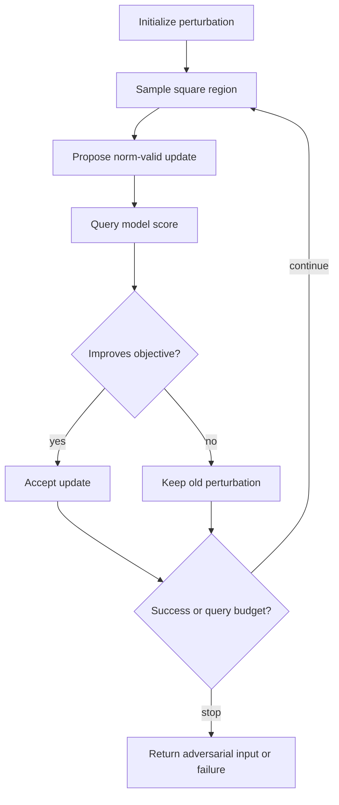

# Square Attack

Square Attack is a query-efficient black-box attack based on random search over localized square-shaped updates. It does not estimate a full gradient. Instead, it proposes structured perturbation changes, keeps those that improve the attack objective, and maintains the perturbation near the boundary of the allowed norm ball.

The method is useful because many score-based black-box attacks spend queries estimating gradients in very high-dimensional spaces. Square Attack exploits image structure and simple acceptance rules to reduce query cost while remaining strong enough to serve in robustness benchmarks.

## Threat model

Square Attack is a score-based black-box evasion attack. The attacker can query the model and receive enough score information to evaluate a loss or margin. It supports $\ell_\infty$ and $\ell_2$ settings. The standard untargeted goal is:

$$
f(x+\delta)\ne y,
$$

with:

$$
\|\delta\|_p\le \epsilon,\qquad x+\delta\in[0,1]^d.
$$

The attacker has no gradient access. The primary budget is the number of score queries. If only top-1 labels are available, the method must be modified or replaced by a decision-based attack.

## Method

At a high level, Square Attack maintains a perturbation $\delta^t$ and repeatedly samples a square region $S_t$ in the image. It proposes a new perturbation $\delta'$ that changes values inside $S_t$ while preserving the norm constraint. If the candidate improves the objective, accept:

$$
\delta^{t+1}=\delta',
$$

otherwise keep:

$$
\delta^{t+1}=\delta^t.
$$

For an untargeted margin objective, one can define:

$$
J(x')=Z_y(x')-\max_{k\ne y}Z_k(x').
$$

The attack wants to reduce $J$ below zero. A proposal is good when it lowers $J$. The square size typically decreases over time: large squares explore broad changes early, and smaller squares refine later.

Square Attack differs from random pixel noise because the square update is spatially coherent and norm-aware. It differs from ZOO because it never tries to reconstruct the gradient coordinate by coordinate.

## Visual



| Attack | Full gradient estimate? | Query style | Main advantage |
|---|---|---|---|
| ZOO | Yes, coordinate finite differences | Many local coordinate queries | Direct gradient approximation |
| NES/SPSA | Approximate random-direction gradient | Paired random queries | Dimension-independent samples |
| Square Attack | No | Accept/reject random square proposals | Query-efficient on images |
| Boundary Attack | No score objective | Label-only proposals | Works with hard labels |

## Worked example 1: Margin success check

Problem: A classifier has true class $y=0$. For a candidate image, logits are:

$$
Z(x')=(1.1,1.4,0.2).
$$

Using the untargeted margin $J=Z_y-\max_{k\ne y}Z_k$, determine whether the candidate is adversarial.

1. True-class logit:

$$
Z_y=1.1.
$$

2. Largest non-true logit:

$$
\max_{k\ne0}Z_k=\max(1.4,0.2)=1.4.
$$

3. Margin:

$$
J=1.1-1.4=-0.3.
$$

4. Since $J\lt 0$, some non-true class has higher logit than the true class.

Checked answer: the candidate is adversarial under this logit-margin criterion.

## Worked example 2: Accepting a square proposal

Problem: A current candidate has margin:

$$
J(x+\delta^t)=0.25.
$$

A square proposal gives:

$$
J(x+\delta')=0.10.
$$

The attack minimizes $J$. Should it accept the proposal? What if the next proposal gives $0.30$?

1. Compare the first proposal:

$$
0.10<0.25.
$$

2. Because the objective improved, accept:

$$
\delta^{t+1}=\delta'.
$$

3. Compare the second proposal:

$$
0.30>0.10.
$$

4. Because it worsens the objective, reject and keep the previous perturbation.

Checked answer: accept the first proposal and reject the second. If a proposal also produces $J\lt 0$, the attack has found an adversarial example.

## Implementation

```python
import torch

@torch.no_grad()
def untargeted_margin(logits, y):
    true = logits.gather(1, y[:, None]).squeeze(1)
    other = logits.clone()
    other.scatter_(1, y[:, None], -1e9)
    return true - other.max(dim=1).values

@torch.no_grad()
def square_attack_step(model, x, y, delta, epsilon, square_size):
    proposal = delta.clone()
    _, _, h, w = x.shape
    top = torch.randint(0, h - square_size + 1, (1,)).item()
    left = torch.randint(0, w - square_size + 1, (1,)).item()
    values = torch.empty_like(proposal[:, :, top:top+square_size, left:left+square_size])
    values.uniform_(-epsilon, epsilon)
    proposal[:, :, top:top+square_size, left:left+square_size] = values
    proposal = proposal.clamp(-epsilon, epsilon)

    old_margin = untargeted_margin(model((x + delta).clamp(0, 1)), y)
    new_margin = untargeted_margin(model((x + proposal).clamp(0, 1)), y)
    accept = new_margin < old_margin
    return torch.where(accept.view(-1, 1, 1, 1), proposal, delta)
```

This sketch captures the accept/reject idea, not the full optimized Square Attack schedule for $\ell_\infty$ or $\ell_2$.

## Original paper results

Andriushchenko, Croce, Flammarion, and Hein introduced Square Attack as a query-efficient black-box attack. The paper reports that on ImageNet it improved average query efficiency in untargeted settings by a factor of at least 1.8 and up to 3 compared with a recent state-of-the-art $\ell_\infty$ attack available at the time, and that it achieved strong success rates in standard benchmarks.

The conservative takeaway is that random search can be highly competitive when the proposal distribution is well matched to the image perturbation constraint.

## Connections

- [Black-box and transfer attacks](/cs/adversarial-attacks/black-box-and-transfer-attacks) gives the query-attack context.
- [ZOO](/cs/adversarial-attacks/zoo) contrasts finite-difference gradient estimation.
- [Boundary Attack](/cs/adversarial-attacks/boundary-attack) covers label-only decision attacks.
- [Evaluation and benchmarks](/cs/adversarial-attacks/evaluation-and-benchmarks) discusses attack suites and reporting.
- [Adaptive AutoAttack](/cs/adversarial-attacks/adaptive-autoattack) is an evaluation-oriented method related in spirit to reliable attack selection.

## Common pitfalls / when this attack is used today

- Describing Square Attack as gradient estimation; it is random search with structured proposals.
- Omitting the query budget and success-versus-query curve.
- Using score-based Square Attack against an API that exposes only labels.
- Forgetting projection to the chosen norm ball.
- Assuming square proposals are equally appropriate for non-image domains.
- Using Square Attack today as a strong score-based black-box baseline and a gradient-masking diagnostic.

Square Attack's strength comes from matching the proposal distribution to the image domain. A square update changes a coherent local region, which is often more effective than independent pixel noise under a small query budget. This structure also keeps the method simple: the attack evaluates whether a proposal improves the margin and keeps it if it does. There is no need to estimate a full gradient, store a surrogate model, or solve a large linear system.

The square-size schedule is part of the attack. Large squares explore broad changes and can quickly move the candidate toward an adversarial region. Smaller squares refine the perturbation after coarse progress. If the squares stay too large, the attack may fail to make delicate adjustments; if they become too small too early, the attack may waste queries on local noise. A reproducible evaluation should report the schedule or use a standard implementation.

For $\ell_\infty$ attacks, keeping the perturbation near the boundary of the feasible set is often useful because the adversary is trying to maximize loss under a fixed budget. For $\ell_2$ attacks, the proposal and projection logic differs. A defense paper should not simply say "Square Attack" without stating the norm version. As with PGD, the norm defines the attack geometry.

Square Attack is also a good diagnostic for gradient masking. If a white-box gradient attack fails but Square Attack succeeds with score access, the gradients used by the white-box attack may be uninformative, obstructed, or incorrectly computed. The correct response is not to claim black-box attacks are inherently stronger, but to adapt the white-box evaluation to the full defended system.

The method is less directly portable to text, audio, or tabular data because "square" is an image prior. The broader idea is portable: use structured random search proposals that respect the domain and accept improvements under a query budget. For non-image data, the proposal shape should be redesigned around valid edits, waveform windows, feature groups, or protocol fields.

A compact Square Attack reporting checklist is:

| Field | What to write down |
|---|---|
| Norm | $\ell_\infty$ or $\ell_2$ version and radius |
| Scores | Logits, probabilities, or margin access used by the objective |
| Schedule | Square-size schedule and number of queries |
| Objective | Untargeted or targeted margin definition |
| Initialization | Starting perturbation distribution |
| Results | Success rate as a function of query budget |

For reproduction, success-versus-query curves are more informative than one final point. A model broken in 200 queries is operationally different from a model broken only after 10,000 queries. Median queries among successes should be reported together with failures at the budget limit; otherwise a method can look efficient by ignoring hard examples.

Square Attack is often included in attack suites because it is gradient-free. If it outperforms a white-box gradient attack against a defended model, that is a signal to inspect gradient masking, not a reason to stop. The next evaluation step should be an adaptive white-box attack that accounts for the defense, plus black-box results to characterize practical query exposure.

A final interpretation point is that Square Attack is deliberately simple. Its strength is not a sophisticated model of the loss surface; it is the combination of structured proposals, boundary-aware perturbations, and strict acceptance under a query budget. That simplicity makes it hard for defenses to dismiss. If a defense only blocks attacks that need gradients but fails under random square proposals, the defense likely did not improve the underlying decision boundary enough.

For reproduction, use the same threat model as the white-box baselines. If PGD is evaluated at $\epsilon=8/255$ in $\ell_\infty$, Square Attack should use the same radius and input scale. Otherwise the black-box comparison is measuring a different feasible set. The attack family is useful precisely because it offers a different search method under the same budget.

The method is particularly helpful when gradients are suspect because its proposals do not depend on them. A defense that survives PGD but fails to square updates deserves a closer adaptive white-box analysis before any robustness claim is trusted.

## Further reading

- Andriushchenko et al., "Square Attack: A Query-Efficient Black-Box Adversarial Attack via Random Search."
- Chen et al., "ZOO."
- Croce and Hein, "Reliable Evaluation of Adversarial Robustness with an Ensemble of Diverse Parameter-free Attacks."
