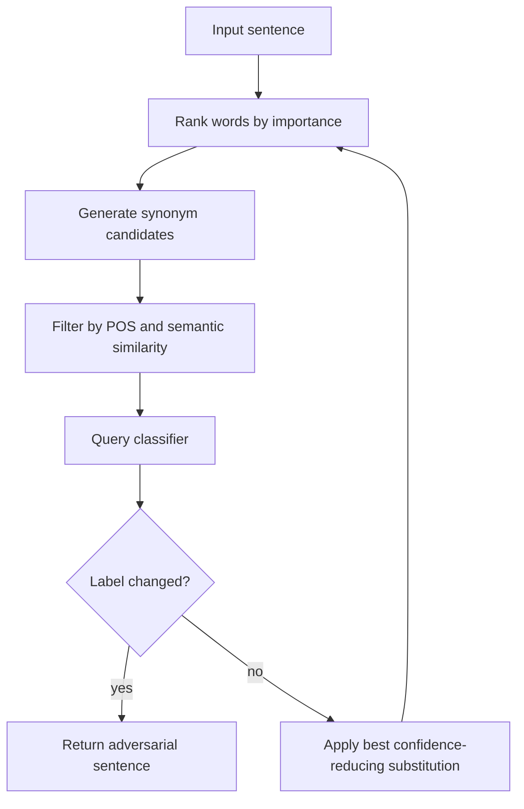

# TextFooler

TextFooler is a word-substitution attack for NLP classifiers. It ranks important words, proposes semantically similar replacements, filters candidates for grammatical and semantic consistency, and queries the model to find substitutions that change the prediction.

Its role in adversarial NLP is similar to PGD's role in image robustness, but with a different constraint language. The attacker is not allowed to add arbitrary vector noise; the perturbed sentence should remain fluent and preserve meaning under a human-readable criterion.

## Threat model

TextFooler is primarily a black-box or score-query evasion attack. The attacker can query the model for labels or confidence scores but does not need gradients. The goal is usually untargeted:

$$
f(x')\ne y,
$$

while preserving semantic similarity:

$$
\mathrm{sim}(x,x')\ge \tau,
$$

and limiting the word-change rate:

$$
\frac{\#\mathrm{changed\ words}}{\#\mathrm{words}}\le \rho.
$$

For entailment and other paired-sentence tasks, valid substitutions must preserve the intended relation, not merely the surface sentence.

## Method

TextFooler has four conceptual steps.

First, estimate word importance. A common black-box method removes or masks a word and measures confidence drop for the true label:

$$
I_i=p_y(x)-p_y(x_{\setminus i}).
$$

Second, process words from most to least important. Third, generate candidate synonyms using embeddings or lexical resources. Fourth, filter candidates by part of speech, semantic similarity, and language-model or fluency constraints. The attack queries the classifier and accepts a substitution if it reduces true-class confidence or causes misclassification.

The attack stops when the classifier changes label or no valid substitutions remain. Its quality depends heavily on the semantic filter: weak filters produce nonsensical attacks; overly strict filters may miss valid adversarial examples.

## Visual



| Constraint | Example measurement | Why it matters |
|---|---|---|
| Word-change rate | Changed words divided by total words | Controls attack size |
| Semantic similarity | Sentence embedding cosine similarity | Prevents meaning drift |
| Part of speech | Noun to noun, verb to verb | Preserves grammar |
| Fluency | Language-model score or human check | Avoids unnatural text |
| Query budget | Number of classifier calls | Defines black-box cost |

## Worked example 1: Word importance from confidence drop

Problem: A sentiment model assigns the true positive class probability $0.92$ to the sentence. When the word "excellent" is masked, the probability drops to $0.41$. When "movie" is masked, it drops to $0.86$. Which word is more important by TextFooler-style confidence drop?

1. Importance of "excellent":

$$
I_{\mathrm{excellent}}=0.92-0.41=0.51.
$$

2. Importance of "movie":

$$
I_{\mathrm{movie}}=0.92-0.86=0.06.
$$

3. Compare:

$$
0.51>0.06.
$$

Checked answer: "excellent" is ranked as more important because masking it causes a much larger confidence drop.

## Worked example 2: Word-change-rate check

Problem: A sentence has 20 words. An attack changes 3 words while preserving semantic similarity above the threshold. The maximum allowed word-change rate is $\rho=0.20$. Is the perturbation valid?

1. Changed-word rate:

$$
\frac{3}{20}=0.15.
$$

2. Compare with budget:

$$
0.15\le0.20.
$$

3. The semantic condition is stated to be satisfied.

Checked answer: the perturbation is valid under the word-change and semantic-similarity constraints. It still must be checked for task-specific label preservation by humans or a stronger validation protocol when stakes are high.

## Implementation

```python
def word_change_rate(original, adversarial):
    orig_words = original.split()
    adv_words = adversarial.split()
    if len(orig_words) != len(adv_words):
        raise ValueError("this simple checker assumes equal token counts")
    changed = sum(o != a for o, a in zip(orig_words, adv_words))
    return changed / max(len(orig_words), 1)

def choose_best_substitution(model_score, sentence, index, candidates, true_label):
    words = sentence.split()
    best_candidate = None
    best_score = float("inf")
    for cand in candidates:
        trial = words[:]
        trial[index] = cand
        text = " ".join(trial)
        score = model_score(text, true_label)
        if score < best_score:
            best_score = score
            best_candidate = text
    return best_candidate, best_score
```

This pseudocode leaves synonym generation and semantic filtering to separate components. Those components are not optional in a faithful TextFooler-style evaluation.

## Original paper results

Jin et al.'s TextFooler paper evaluated word-substitution attacks on text classification and entailment models including strong neural architectures. The paper reported high attack success while attempting to preserve semantic similarity and grammaticality through filtering.

The conservative takeaway is that word-level substitutions can fool NLP classifiers without obvious character noise, but the validity of a text adversarial example depends on semantic and human-evaluation assumptions.

## Connections

- [HotFlip](/cs/adversarial-attacks/hotflip) is the character-level gradient predecessor.
- [BERT-Attack](/cs/adversarial-attacks/bert-attack) uses masked language models for substitution candidates.
- [Attacks on LLMs and other modalities](/cs/adversarial-attacks/attacks-on-llms-and-other-modalities) places text attacks beside jailbreaks and prompt injection.
- [Black-box and transfer attacks](/cs/adversarial-attacks/black-box-and-transfer-attacks) covers query-limited access.
- [Evaluation and benchmarks](/cs/adversarial-attacks/evaluation-and-benchmarks) motivates careful success and validity reporting.

## Common pitfalls / when this attack is used today

- Counting label changes caused by meaning changes as adversarial success.
- Reporting semantic similarity from one automated metric as if it were a proof.
- Ignoring query budgets and candidate-generation details.
- Applying word substitution to tasks where one word can change the ground-truth label.
- Forgetting tokenizer effects for subword or character models.
- Using TextFooler today as a baseline for NLP robustness, adversarial data augmentation, and semantic-validity debates.

TextFooler lives or dies by semantic validity. Automated similarity metrics are useful filters, but they are not ground truth. A high sentence-embedding cosine score can still hide a changed negation, entity, number, legal condition, or causal relation. A low score can reject a perfectly valid paraphrase. For high-stakes tasks, human validation or task-specific consistency checks are needed before counting an example as a successful adversarial input.

The word-importance step is also model-interface dependent. If the model returns probabilities, the attacker can measure confidence drops. If it returns only labels, importance estimation becomes noisier and may need more queries or a different heuristic. If the API returns calibrated scores for only the top class, the attack may not know the true-label probability after a candidate substitution. These details turn one named attack into several distinct threat models.

Word substitution can accidentally create distribution shift rather than adversarial pressure. Replacing common words with rare synonyms may fool a classifier because the sentence becomes unnatural, not because the model lacks semantic robustness. That is still a vulnerability in some applications, but the report should say whether candidates are frequency-controlled, grammar-checked, and natural to humans. Fluency and semantic preservation are separate constraints.

For entailment, question answering, and fact verification, preserving the label is harder than preserving sentence meaning in isolation. Changing a word in the premise can alter entailment. Changing a named entity can alter the answer. Therefore TextFooler-style attacks need task-specific edit rules. The same substitution that is valid for sentiment classification may be invalid for natural language inference.

Today TextFooler is useful as a baseline, but robust NLP evaluation should include multiple perturbation types: character noise, word substitutions, paraphrases, syntactic transformations, and prompt-level attacks for LLM systems. A defense tuned only to synonym substitutions may fail against character attacks or semantically equivalent paraphrases.

A compact TextFooler reporting checklist is:

| Field | What to write down |
|---|---|
| Model access | Labels, probabilities, logits, or local surrogate |
| Importance | Deletion, masking, gradient proxy, or score drop |
| Candidates | Embedding neighbors, lexical synonyms, or other source |
| Filters | POS, semantic similarity, grammar, and fluency thresholds |
| Budget | Maximum changed words, query limit, and candidate count |
| Validation | Automated metric, human check, or task-specific label-preservation rule |

For reproduction, include examples of accepted and rejected substitutions. Aggregate metrics can hide invalid edits, especially when antonyms or entity changes slip through filters. Showing a few concrete adversarial sentences helps readers judge whether the attack is preserving meaning or merely changing the task.

When defenses use adversarial training with TextFooler examples, they may overfit to the candidate generator. A robust NLP defense should test held-out attacks with different synonym sources, paraphrasers, and character perturbations. The attack family is a baseline, not the full space of meaning-preserving text changes.

A final interpretation point is that TextFooler is not just an algorithm for finding failures; it is a measurement of a model's reliance on particular lexical cues. If replacing one sentiment-bearing adjective with a close synonym flips the label, the classifier may have learned brittle word associations rather than robust sentence meaning. If replacing a rare word with a common synonym changes the output, the model may be sensitive to frequency artifacts.

For a wiki reader, the safest mental model is "black-box semantic search under constraints." The attack searches the neighborhood of the sentence, where neighborhood means acceptable substitutions rather than Euclidean distance. That makes it a natural bridge between image attacks and prompt or paraphrase attacks on modern language systems.

The strongest TextFooler-style reports include a small human-readable sample table: original text, adversarial text, changed words, predicted labels, and a note about meaning. That table is not decoration. It lets readers inspect whether the attack is genuinely semantic or whether it exploits broken filters.

Finally, keep the dataset label policy in mind. In sentiment data, some substitutions clearly preserve labels; in topic classification, replacing a named entity may change the topic; in entailment, one adjective can reverse the relation. The same algorithm can be valid in one benchmark and invalid in another unless the label-preservation rule is task-aware.

That rule belongs in the threat model.

## Further reading

- Jin et al., "Is BERT Really Robust? A Strong Baseline for Natural Language Attack on Text Classification and Entailment."
- Ebrahimi et al., "HotFlip."
- Li et al., "BERT-Attack."
