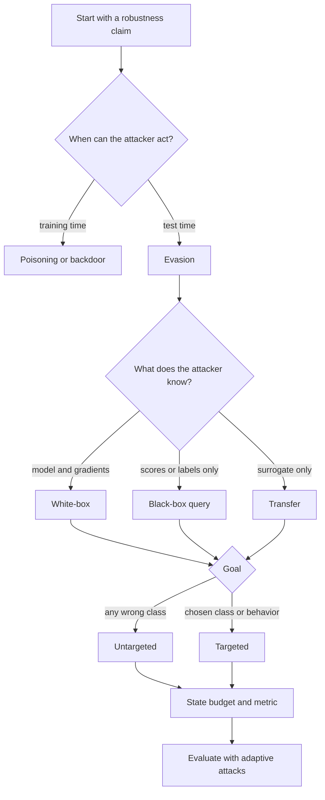

# Threat Models and Attack Taxonomy

Adversarial machine learning is only meaningful once the attacker's powers are stated. A defense that is strong against a transfer attack may fail under white-box gradients; a detector that works for digital $\ell_\infty$ image noise may be irrelevant for a printed sticker or a prompt-injection attack. Threat modeling is the discipline that turns "the model is robust" into a claim with assumptions, budgets, goals, and evaluation rules.

This page gives the vocabulary used throughout the adversarial-attacks section. It connects the security-style view of attacker goal, knowledge, capability, and strategy with the optimization view used in [mathematical formulation](/cs/adversarial-attacks/mathematical-formulation), [white-box attacks](/cs/adversarial-attacks/white-box-attacks), and [evaluation and benchmarks](/cs/adversarial-attacks/evaluation-and-benchmarks).

## Definitions

A **threat model** is a structured description of what the adversary wants, what the adversary knows, what the adversary can modify, and what costs or budgets constrain the attack. A compact version is:

$$
\mathcal{T} = (\mathcal{G}, \mathcal{K}, \mathcal{C}, \mathcal{S}, \mathcal{B}),
$$

where $\mathcal{G}$ is the goal, $\mathcal{K}$ is knowledge, $\mathcal{C}$ is capability, $\mathcal{S}$ is strategy, and $\mathcal{B}$ is the budget. Biggio and Roli's survey framing is often summarized this way: security evaluation should state the adversary's goal, knowledge, capability, and attack strategy rather than describing only the algorithm.

An **evasion attack** changes test-time inputs while keeping the trained model fixed. Most image adversarial examples are evasion attacks:

$$
x' = x + \delta, \qquad \|\delta\|_p \le \epsilon.
$$

A **poisoning attack** changes the training data or training process. A **backdoor attack** is a poisoning-style attack that makes the model behave normally except when a trigger is present. This page set focuses mostly on evasion, but the same threat-model discipline applies to poisoning and backdoors.

An **untargeted attack** succeeds when the model no longer predicts the original correct class:

$$
f(x') \ne y.
$$

A **targeted attack** succeeds when the model predicts a chosen target class $y_t$:

$$
f(x') = y_t, \qquad y_t \ne y.
$$

A **white-box attack** assumes the adversary knows the architecture, parameters, preprocessing, loss, and defense. It can compute $\nabla_x \mathcal{L}(f_\theta(x), y)$ directly. A **black-box attack** assumes no direct access to internals. Black-box access may still include probability scores, logits, top-$k$ labels, or only hard labels. A **grey-box attack** sits between these extremes, for example when the attacker knows the architecture family and training data distribution but not the exact weights.

A **norm ball** constrains the perturbation:

$$
B_p(x, \epsilon) = \{x' : \|x' - x\|_p \le \epsilon\}.
$$

Common choices are $\ell_\infty$, $\ell_2$, and $\ell_0$. The $\ell_\infty$ budget limits the largest per-coordinate change; $\ell_2$ limits total Euclidean energy; $\ell_0$ limits the number of changed coordinates. In image work with pixel values scaled to $[0,1]$, $\epsilon = 8/255$ is a common $\ell_\infty$ scale for CIFAR-style experiments, but the number is not universal and has no meaning without the preprocessing pipeline.

A **query budget** limits how many times the attacker may call the model. Query budgets are central in black-box attacks because finite-difference gradients, score estimation, and decision-boundary search can require many calls. A benchmark should report success rate as a function of queries, not only the best result after an unlimited search.

**Transferability** is the phenomenon that an adversarial example generated against one model can fool another model. Transfer attacks use a surrogate model and require no target-model queries once the attack examples are generated.

## Key results

Threat models are not just documentation; they change the mathematical problem. If the attacker is untargeted and white-box with an $\ell_\infty$ budget, the inner problem often looks like:

$$
\max_{\|\delta\|_\infty \le \epsilon} \mathcal{L}(f_\theta(x+\delta), y).
$$

If the attacker is targeted, the sign of the objective changes because the attacker wants the target label to become likely:

$$
\min_{\|\delta\|_\infty \le \epsilon} \mathcal{L}(f_\theta(x+\delta), y_t).
$$

If the attacker has only hard-label black-box access, the objective is not directly available. The attack may instead search for a point near $x$ that crosses the decision boundary:

$$
\min_{\delta} \|\delta\|_p \quad \text{subject to} \quad f(x+\delta) \ne y.
$$

The same defense claim can be true or false depending on $\mathcal{K}$. Random input transformations can look strong if the attacker differentiates through the original classifier but not through the transformation distribution. Under an adaptive white-box threat model, the attacker should attack the full defended system. For a randomized defense $g(x, \omega)$, a typical objective is the expected loss:

$$
\max_{\|\delta\|_p \le \epsilon} \mathbb{E}_{\omega}[\mathcal{L}(g(x+\delta, \omega), y)].
$$

Threat models also define what counts as a valid example. A perturbation that is imperceptible under one metric may be semantically invalid under another. For text, a single character change can preserve meaning, change meaning, or reveal the attack. For physical objects, validity includes printability, viewing angle, lighting, camera pipeline, and human recognizability. For LLM prompts, the "perturbation" is often not a norm-bounded vector but an instruction, context placement, tool output, or retrieved document that changes the model's behavior.

A useful robustness claim therefore includes at least:

- Data domain and preprocessing.
- Attacker goal: targeted, untargeted, extraction, privacy leakage, jailbreak, policy violation, or another goal.
- Attacker knowledge: white-box, grey-box, score-query, decision-query, or transfer-only.
- Attacker capability: perturbation set, physical access, prompt placement, training-data access, or tool-channel access.
- Budget: norm radius, query count, time limit, patch area, edit distance, token count, or intervention cost.
- Evaluation strategy: attack algorithms, restarts, adaptive attack details, random seeds, and stopping rules.

## Visual



| Axis | Common options | What must be reported |
|---|---|---|
| Goal | Untargeted, targeted, confidence reduction, jailbreak, extraction | Exact success condition |
| Knowledge | White-box, grey-box, score-query, decision-query, transfer-only | What the attacker sees and differentiates through |
| Capability | Digital perturbation, patch, physical transform, prompt injection, training-data edit | Valid action set |
| Budget | $\epsilon$, $\ell_p$ norm, query count, edit distance, patch area, token limit | Numerical values and preprocessing scale |
| Strategy | Gradient, search, surrogate, adaptive, expectation over transformations | Algorithms, restarts, and stopping rules |

## Worked example 1: Classifying a threat model

Problem: A paper claims a traffic-sign classifier is robust because no attack succeeded when adding $\ell_\infty$ noise of at most $4/255$ to a digital test image. The deployment concern is stickers placed on real stop signs and photographed by a dashboard camera. Classify the mismatch.

1. The evaluated capability is digital additive noise:

$$
x' = x + \delta, \qquad \|\delta\|_\infty \le 4/255.
$$

2. The deployment capability is a physical patch observed through a camera:

$$
x' = T(x, p; \omega),
$$

   where $p$ is the sticker pattern and $\omega$ includes distance, angle, lighting, blur, camera exposure, and printing artifacts.

3. The evaluated budget is a per-pixel intensity budget. The deployment budget is patch size, location, printability, and physical realism.

4. The evaluated attack may be white-box or black-box, but the statement gives no information about query access, model knowledge, or adaptive optimization through the camera transformation.

Checked answer: the robustness claim does not cover the deployment concern. It may be a valid $\ell_\infty$ digital robustness claim, but it is not evidence of physical patch robustness. A better evaluation would use [physical-world and patch attacks](/cs/adversarial-attacks/physical-world-and-patch-attacks) with expectation over transformations.

## Worked example 2: Comparing $\ell_\infty$ and $\ell_2$ budgets

Problem: An image has $28 \times 28 = 784$ grayscale pixels scaled to $[0,1]$. Attack A changes every pixel by $0.01$. Attack B changes 4 pixels by $0.10$ and leaves the rest unchanged. Compare their $\ell_\infty$ and $\ell_2$ sizes.

1. Attack A has perturbation vector $\delta_A$ with 784 entries, each equal to $0.01$.

$$
\|\delta_A\|_\infty = 0.01.
$$

2. Its $\ell_2$ norm is:

$$
\|\delta_A\|_2 = \sqrt{784(0.01)^2}
= 28 \cdot 0.01
= 0.28.
$$

3. Attack B has 4 entries equal to $0.10$.

$$
\|\delta_B\|_\infty = 0.10.
$$

4. Its $\ell_2$ norm is:

$$
\|\delta_B\|_2 = \sqrt{4(0.10)^2}
= 2 \cdot 0.10
= 0.20.
$$

Checked answer: Attack A is smaller under $\ell_\infty$ but larger under $\ell_2$. This is why reports must name the norm. Saying "small perturbation" is ambiguous.

## Code

```python
from dataclasses import dataclass
import torch

@dataclass(frozen=True)
class ThreatModel:
    norm: str
    epsilon: float
    targeted: bool
    query_budget: int | None = None

def project_delta(delta: torch.Tensor, threat: ThreatModel) -> torch.Tensor:
    if threat.norm == "linf":
        return delta.clamp(-threat.epsilon, threat.epsilon)
    if threat.norm == "l2":
        flat = delta.view(delta.shape[0], -1)
        norms = flat.norm(p=2, dim=1).clamp_min(1e-12)
        factors = torch.minimum(torch.ones_like(norms), threat.epsilon / norms)
        return (flat * factors[:, None]).view_as(delta)
    raise ValueError(f"unsupported norm: {threat.norm}")

def is_valid_adversarial(x, x_adv, y, model, threat: ThreatModel, target=None):
    delta = x_adv - x
    projected = project_delta(delta, threat)
    in_budget = torch.allclose(delta, projected, atol=1e-6)
    pred = model(x_adv).argmax(dim=1)
    success = pred.eq(target) if threat.targeted else pred.ne(y)
    return bool(in_budget and success.all())
```

This sketch is not an attack. It is a small threat-model checker: it separates budget validity from success validity. That separation prevents a common evaluation error where invalid examples are counted as successful attacks.

## Common pitfalls

- Reporting adversarial accuracy without stating the norm, $\epsilon$, preprocessing scale, and clipping range.
- Treating black-box failure as evidence of white-box robustness.
- Comparing defenses evaluated under different query budgets or different restart counts.
- Forgetting that targeted and untargeted attacks have different success conditions and usually different difficulty.
- Calling a physical patch "small" without reporting area, location constraints, transformation distribution, and human-recognition constraints.
- Evaluating a randomized or preprocessing defense with an attack that ignores the randomness or preprocessing.
- Reusing image-centric norm-ball language for text and LLM attacks without defining the semantic validity constraint.

## Connections

- [Mathematical formulation](/cs/adversarial-attacks/mathematical-formulation) turns threat models into constrained optimization problems.
- [White-box attacks](/cs/adversarial-attacks/white-box-attacks) assumes the strongest common knowledge model.
- [Black-box and transfer attacks](/cs/adversarial-attacks/black-box-and-transfer-attacks) studies restricted knowledge and query budgets.
- [Physical-world and patch attacks](/cs/adversarial-attacks/physical-world-and-patch-attacks) replaces simple norm balls with transformation-aware constraints.
- [Evaluation and benchmarks](/cs/adversarial-attacks/evaluation-and-benchmarks) explains why threat-model drift causes misleading robustness claims.
- [Cryptography](/cs/cryptography/intro) is the neighboring field most associated with explicit adversary models.

## Further reading

- Biggio and Roli, "Wild Patterns: Ten Years After the Rise of Adversarial Machine Learning."
- Szegedy et al., "Intriguing Properties of Neural Networks."
- Goodfellow, Shlens, and Szegedy, "Explaining and Harnessing Adversarial Examples."
- Athalye, Carlini, and Wagner, "Obfuscated Gradients Give a False Sense of Security."
