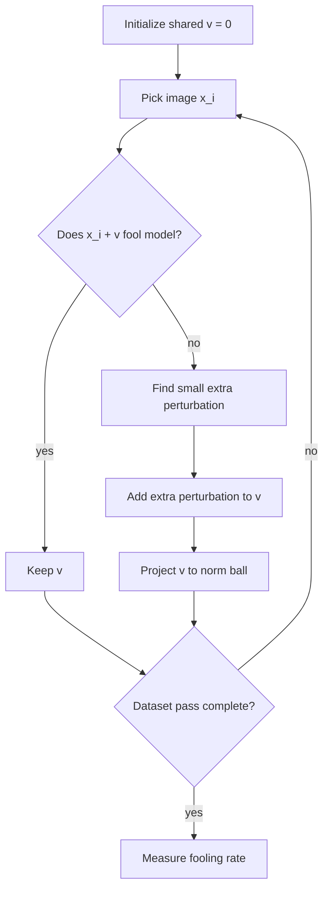

# Universal Adversarial Perturbations

Universal adversarial perturbations are image-agnostic perturbations: one vector $v$ is added to many different natural images and fools the classifier on a large fraction of them. This is more surprising than ordinary per-image adversarial examples because the perturbation is not custom-fit to a single input.

The original result gave a geometric interpretation of adversarial vulnerability. If many natural images have nearby decision boundaries with correlated normal directions, then a single direction in input space can cross many boundaries. Universal perturbations connect per-example attacks such as [DeepFool](/cs/adversarial-attacks/deepfool) to dataset-level structure.

## Threat model

The standard threat model is white-box or surrogate-white-box, untargeted, digital evasion with an image-agnostic perturbation:

$$
x_{\mathrm{adv}}=x+v,
$$

where one $v$ is reused across many inputs. The budget is usually:

$$
\|v\|_p\le \xi,
$$

for $p=2$ or $p=\infty$. Attack success is measured by fooling rate over a distribution:

$$
\Pr_{x\sim \mathcal{D}}[\hat{k}(x+v)\ne \hat{k}(x)].
$$

The attacker may compute $v$ using a training set and then deploy it on unseen images. Transfer to other models is a central concern because a universal perturbation can be stored, printed, or broadcast more easily than per-input perturbations.

## Method

The original algorithm builds $v$ iteratively over a dataset. Start with:

$$
v=0.
$$

For each image $x_i$, check whether $x_i+v$ already fools the classifier. If not, compute a small additional perturbation $\Delta v_i$ that fools the current shifted image:

$$
\hat{k}(x_i+v+\Delta v_i)\ne \hat{k}(x_i).
$$

A method such as DeepFool can provide $\Delta v_i$. Then update:

$$
v\leftarrow \Pi_{p,\xi}(v+\Delta v_i),
$$

where $\Pi_{p,\xi}$ projects the perturbation back into the allowed $\ell_p$ ball. Repeat passes over the dataset until the fooling rate reaches a target threshold or the iteration limit is reached.

The key difference from PGD is the role of the perturbation variable. PGD optimizes a different $\delta_i$ for each input. Universal perturbations optimize one shared $v$ that must work across many inputs.

## Visual



| Perturbation type | Optimized for | Storage cost | Typical evaluation |
|---|---|---|---|
| Per-image FGSM/PGD | One image | One perturbation per input | Robust accuracy under fixed budget |
| Universal perturbation | Dataset or distribution | One shared vector | Fooling rate over many images |
| Adversarial patch | Many scenes with mask and transforms | One patch pattern | Target success under transformations |
| RF universal perturbation | Signal classifier distribution | One waveform-like pattern | Accuracy drop under channel constraints |

## Worked example 1: Fooling rate calculation

Problem: A universal perturbation is tested on 1,000 images. On clean images, the model predicts labels $\hat{k}(x_i)$. After adding $v$, the prediction changes for 720 images. Compute the fooling rate.

1. Number of changed predictions:

$$
s=720.
$$

2. Number of test images:

$$
n=1000.
$$

3. Fooling rate:

$$
\frac{s}{n}=\frac{720}{1000}=0.72.
$$

4. Convert to percentage:

$$
0.72\cdot100\%=72\%.
$$

Checked answer: the universal perturbation has a $72\%$ fooling rate under the definition based on prediction change. If the evaluation uses ground-truth labels instead, the report must say so because the number may differ.

## Worked example 2: Projection onto an $\ell_2$ budget

Problem: During construction, the current universal perturbation becomes:

$$
v=(3,4),
$$

but the budget is $\xi=2$ in $\ell_2$. Project $v$ onto the $\ell_2$ ball.

1. Compute the norm:

$$
\|v\|_2=\sqrt{3^2+4^2}=5.
$$

2. Since $5\gt 2$, scale the vector:

$$
\Pi_{2,2}(v)=v\cdot \frac{2}{5}.
$$

3. Apply the scaling:

$$
\Pi_{2,2}(v)=\left(3\cdot\frac{2}{5},4\cdot\frac{2}{5}\right)=(1.2,1.6).
$$

4. Check:

$$
\sqrt{1.2^2+1.6^2}=\sqrt{1.44+2.56}=2.
$$

Checked answer: the projected perturbation is $(1.2,1.6)$, exactly on the budget boundary.

## Implementation

```python
import torch

def project_l2(v, radius):
    norm = v.view(-1).norm(p=2).clamp_min(1e-12)
    return v * torch.minimum(torch.tensor(1.0, device=v.device), radius / norm)

def universal_perturbation(model, images, deepfool_step, radius, passes=3):
    model.eval()
    v = torch.zeros_like(images[0:1])

    for _ in range(passes):
        for x in images:
            x = x.unsqueeze(0)
            with torch.no_grad():
                clean_label = model(x).argmax(dim=1)
                shifted_label = model((x + v).clamp(0, 1)).argmax(dim=1)
            if shifted_label.eq(clean_label).item():
                r = deepfool_step(model, (x + v).clamp(0, 1))
                v = project_l2(v + r, radius)

    return v.detach()
```

The placeholder `deepfool_step` should return a perturbation for the currently shifted image. For real use, evaluate on held-out images and report the threat norm, radius, preprocessing, and whether the clean prediction or ground-truth label defines success.

## Original paper results

Moosavi-Dezfooli, Fawzi, Fawzi, and Frossard showed that small universal perturbations could fool state-of-the-art image classifiers on many natural images and could transfer across networks. The paper emphasized the existence of shared vulnerable directions in the input space and connected those directions to correlations in the decision boundary geometry.

The conservative headline is qualitative and structural: image-agnostic perturbations with small norm can achieve high fooling rates on natural-image classifiers, and their transferability suggests that adversarial vulnerability is not only a per-image accident.

## Connections

- [DeepFool](/cs/adversarial-attacks/deepfool) is often used to compute the incremental per-image boundary crossing.
- [Adversarial patch](/cs/adversarial-attacks/adversarial-patch) is another universal attack but with a localized visible mask.
- [Black-box and transfer attacks](/cs/adversarial-attacks/black-box-and-transfer-attacks) covers transferability.
- [Physical-world and patch attacks](/cs/adversarial-attacks/physical-world-and-patch-attacks) studies universal patterns under transformations.
- [RF universal adversarial perturbations](/cs/adversarial-attacks/rf-universal-adversarial-perturbations) adapts the idea to radio modulation classifiers.

## Common pitfalls / when this attack is used today

- Confusing fooling rate with error rate against ground-truth labels.
- Training and evaluating the universal perturbation on the same image set without saying so.
- Ignoring clipping, which can change the effective perturbation.
- Reporting a universal perturbation without the norm and radius.
- Assuming universal means physically robust; physical robustness requires transformation-aware optimization.
- Using universal perturbations today to study shared boundary geometry, transfer, patch initialization, and modality-specific attacks.

Universal perturbation evaluation has a train/test split just like ordinary machine learning. The perturbation is often constructed on a set of images and then evaluated on held-out images. If the same images are used for both construction and reporting, the result measures memorized dataset vulnerability more than distribution-level universality. A useful report states the construction set size, held-out set size, number of passes, attack used for per-image updates, and projection radius.

The fooling-rate definition should be explicit. Some papers count a fool when the predicted label changes from the clean prediction, even if the clean prediction was wrong. Others count only examples whose final prediction differs from the ground-truth label. The prediction-change version measures boundary crossing; the ground-truth version measures robust accuracy. Both can be useful, but they are not interchangeable.

Universal perturbations also expose transfer questions. A perturbation constructed on one architecture can be tested on another architecture with no target queries. If it transfers, that suggests shared nonrobust directions or correlated decision-boundary geometry. If it does not transfer, the result may still be important for the source model. Reports should separate source-model fooling rate, transfer fooling rate, and any target-model fine-tuning or query adaptation.

Defenses against universal perturbations can include adversarial training, input denoising, randomization, and detection of shared high-frequency patterns. Each defense needs an adaptive evaluation. A detector that recognizes one learned perturbation may fail against a newly optimized perturbation. A denoiser that removes a visible pattern may not remove a low-frequency universal direction. A randomized transform should be attacked with expectation over transformations, not with a fixed deterministic approximation.

The modern use of universal perturbations extends beyond images. RF modulation, audio, malware features, and prompt suffixes all have analogues of "one perturbation that works on many inputs," but the validity constraints change by domain. The transferable idea is not the pixel formula; it is the distribution-level objective and the question of shared vulnerable directions.

A compact universal-perturbation reporting checklist is:

| Field | What to write down |
|---|---|
| Construction data | Dataset split, number of samples, and number of passes |
| Evaluation data | Held-out split and whether clean-wrong examples are included |
| Budget | Norm, radius, clipping, and projection operator |
| Update attack | DeepFool, PGD, gradient ascent, or another inner method |
| Success metric | Prediction-change fooling rate or ground-truth error rate |
| Transfer | Source model, target model, and target-query use |

For reproduction, save the perturbation itself or enough information to regenerate it. Universal attacks are sensitive to data order, stopping criteria, and projection details. If the perturbation is learned on a normalized input space, the visualized pattern may look different after unnormalization; both the machine-space and human-viewable versions can be useful, but they should not be confused.

When comparing universal perturbations to patches, the shared word "universal" can mislead. A full-image universal perturbation is usually constrained by a norm and added everywhere. A patch is localized, visible, and constrained by area and transformations. Both use one learned pattern across many inputs, but their attacker capabilities and defenses differ. A defense against one does not automatically cover the other.

A final interpretation point is that universal perturbations are evidence about model geometry at the distribution level. They suggest that many decision boundaries are aligned enough for one vector to cross them. That is different from saying the perturbation encodes a human-recognizable feature. Often the pattern looks like structured noise, but its effect comes from how the model partitions high-dimensional space.

For reproduction, report whether the universal perturbation is targeted or untargeted. Targeted universal perturbations are generally harder because the same vector must push many inputs toward one class. Untargeted perturbations only need to change predictions. Mixing the two in one table can make attacks look inconsistent when the goals are simply different.

## Further reading

- Moosavi-Dezfooli et al., "Universal Adversarial Perturbations."
- Moosavi-Dezfooli, Fawzi, and Frossard, "DeepFool."
- Brown et al., "Adversarial Patch."
- Wang et al., "Universal Attack Against Automatic Modulation Classification DNNs Under Frequency and Data Constraints."
