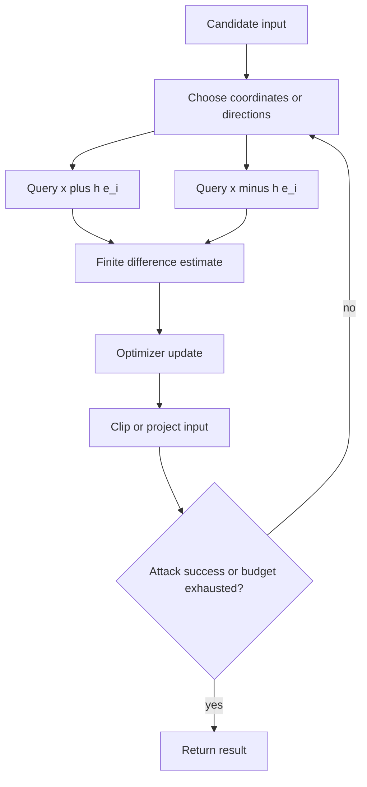

# ZOO

ZOO, short for Zeroth Order Optimization, is a score-based black-box attack that estimates gradients from model outputs instead of backpropagation. It was designed to attack deep neural networks without training a substitute model, using only queries to obtain confidence scores or logits.

The attack is a direct black-box analogue of optimization-based white-box attacks such as C&W. If the attacker can evaluate a loss value at nearby inputs, finite differences can approximate the input gradient coordinate by coordinate or through stochastic variants.

## Threat model

ZOO assumes score-query black-box access. The attacker cannot inspect weights or compute exact gradients, but can submit inputs and receive enough output information to define an attack loss:

$$
J(x)=\mathrm{attack\_loss}(f(x),y,t).
$$

The attack can be targeted or untargeted and usually searches for low-distortion adversarial examples under valid input bounds:

$$
x'\in[0,1]^d.
$$

Because each loss evaluation costs a target query, the query budget is central. ZOO is stronger than transfer-only attacks in knowledge of the target outputs, but weaker than white-box attacks in direct gradient access.

## Method

The core finite-difference estimate for coordinate $i$ is:

$$
\frac{\partial J}{\partial x_i}
\approx
\frac{J(x+he_i)-J(x-he_i)}{2h}.
$$

This uses two queries per coordinate. For an image with dimension $d$, one full central-difference gradient costs $2d$ queries. ZOO reduces cost using techniques such as coordinate sampling, dimension reduction, hierarchical attack strategies, and optimization details inspired by C&W.

A simplified black-box gradient descent step for a targeted objective is:

$$
x^{t+1}=\Pi_{[0,1]^d}(x^t-\alpha \hat{\nabla}J(x^t)),
$$

where $\hat{\nabla}J$ is a finite-difference estimate. For an untargeted objective, the sign of the step changes depending on whether $J$ is defined as a loss to maximize or a success penalty to minimize.

The attack is zeroth order because it uses function values, not derivatives. It is still optimization-based: the loss, confidence margin, distortion penalty, step schedule, and coordinate choices matter.

## Visual



| Method | Target feedback | Gradient source | Query cost issue |
|---|---|---|---|
| C&W | White-box logits | Backpropagation | Optimizer iterations |
| ZOO | Black-box scores/logits | Finite differences | Queries scale with dimension |
| NES/SPSA | Black-box scalar loss | Random directions | Noisy estimates |
| Boundary Attack | Labels only | No gradient estimate | Many accept/reject queries |

## Worked example 1: Coordinate query count

Problem: A $28\times28$ grayscale image has $784$ input coordinates. ZOO uses central finite differences for every coordinate once. How many queries are needed for one full gradient estimate?

1. Dimension:

$$
d=28\cdot28=784.
$$

2. Central differences use two queries per coordinate:

$$
x+he_i,\qquad x-he_i.
$$

3. Total queries:

$$
Q=2d=2(784)=1568.
$$

Checked answer: one full coordinate gradient costs $1{,}568$ model queries, before any optimizer iterations or success checks.

## Worked example 2: Finite-difference derivative

Problem: Suppose a black-box loss returns:

$$
J(x+he_i)=1.24,\qquad J(x-he_i)=1.16,
$$

with $h=0.01$. Estimate $\partial J/\partial x_i$.

1. Difference in loss values:

$$
1.24-1.16=0.08.
$$

2. Denominator:

$$
2h=0.02.
$$

3. Estimate:

$$
\frac{0.08}{0.02}=4.
$$

Checked answer: the finite-difference estimate for coordinate $i$ is $4$. If the attack maximizes $J$, it should increase this coordinate; if it minimizes $J$, it should decrease it.

## Implementation

```python
import torch
import torch.nn.functional as F

@torch.no_grad()
def coordinate_fd_grad(model, x, y, coords, h=1e-3):
    grad = torch.zeros_like(x)
    flat_grad = grad.view(grad.size(0), -1)
    flat_x = x.view(x.size(0), -1)

    for idx in coords:
        xp = flat_x.clone()
        xm = flat_x.clone()
        xp[:, idx] = (xp[:, idx] + h).clamp(0, 1)
        xm[:, idx] = (xm[:, idx] - h).clamp(0, 1)
        loss_p = F.cross_entropy(model(xp.view_as(x)), y, reduction="none")
        loss_m = F.cross_entropy(model(xm.view_as(x)), y, reduction="none")
        flat_grad[:, idx] = (loss_p - loss_m) / (2 * h)

    return grad
```

The snippet assumes the API returns logits so cross-entropy can be computed. If the API returns rounded probabilities or top-$k$ scores, the loss and estimator need to match the actual feedback.

## Original paper results

Chen et al. introduced ZOO at AISec 2017 and attacked deep neural networks without training substitute models. The paper showed that zeroth-order optimization could produce adversarial examples on standard image datasets and compete with white-box optimization attacks in settings where sufficient score queries were available.

The conservative headline is that score access can substitute for gradients at high query cost. ZOO helped make query accounting a first-class part of black-box robustness evaluation.

## Connections

- [Black-box and transfer attacks](/cs/adversarial-attacks/black-box-and-transfer-attacks) introduces score-query attacks.
- [Boundary Attack](/cs/adversarial-attacks/boundary-attack) handles the harder label-only setting.
- [Square Attack](/cs/adversarial-attacks/square-attack) avoids full gradient estimation through random square updates.
- [Carlini-Wagner attack](/cs/adversarial-attacks/carlini-wagner-attack) supplies the white-box optimization style ZOO adapts.
- [Evaluation and benchmarks](/cs/adversarial-attacks/evaluation-and-benchmarks) covers query budgets.

## Common pitfalls / when this attack is used today

- Ignoring query counts and reporting only final success.
- Assuming the API exposes logits when it exposes only labels or rounded scores.
- Estimating all coordinates of a high-resolution image without considering cost.
- Using a finite-difference step $h$ too small for numerical precision or score rounding.
- Calling a surrogate-gradient attack "ZOO" when no target scores are queried.
- Using ZOO today as a reference point for score-based black-box optimization and query-cost intuition.

ZOO is most informative when the score interface is realistic. Some APIs return logits, some return calibrated probabilities, some return rounded percentages, some return only the top few classes, and some add noise or rate limits. A finite-difference estimate that works with full-precision logits may become unstable with rounded probabilities. If a paper uses ZOO, it should describe exactly what scalar objective is computed from the returned output.

The finite-difference step $h$ is a numerical hyperparameter. If $h$ is too large, the estimate no longer approximates the local derivative. If $h$ is too small, floating-point precision, input quantization, compression, or output rounding can dominate the difference. In image systems with 8-bit inputs, a perturbation smaller than one pixel level may be meaningless after quantization. This is one reason query attacks often use carefully tuned estimators rather than textbook finite differences.

Coordinate selection is the main scalability challenge. A full gradient for a $224\times224\times3$ image would require more than 300,000 central-difference queries. ZOO-style attacks therefore use coordinate sampling, importance heuristics, resizing to lower-dimensional spaces, or hierarchical refinement. Those choices define the actual attack. A report that says "we used ZOO" but omits the coordinate policy leaves out much of the method.

Score-based access is stronger than label-only access. If a defense hides probabilities, ZOO may no longer apply, but that does not prove robustness. It changes the attacker to a decision-based threat model. Conversely, if a commercial API exposes confidence scores, a score-based attack may be much more practical than transfer-only attacks. The defense claim should match the deployed interface, not a convenient abstraction.

In modern benchmarks, ZOO is less common than Square Attack or NES/SPSA-style estimators for large images, but it remains a foundational black-box method. It teaches the central tradeoff: gradients are not magical privileged information; they can be approximated from queries, but the price is query complexity.

A compact ZOO reporting checklist is:

| Field | What to write down |
|---|---|
| Output access | Logits, probabilities, rounded scores, or top-$k$ scores |
| Objective | Exact scalar loss computed from scores |
| Estimator | Central difference, coordinate sampling, or another zeroth-order rule |
| Query budget | Per example limit and total queries consumed |
| Dimension strategy | Full resolution, resized variables, hierarchical refinement, or coordinate subset |
| Distortion | Norm, box constraint, and success-distortion tradeoff |

For reproduction, query accounting should include every model call used for gradient estimates, line searches, confidence checks, and early stopping. It is easy to undercount by reporting optimizer iterations rather than actual API calls. If one iteration estimates 100 coordinates with central differences, that is at least 200 score queries before any extra checks.

ZOO is also a useful way to reason about defenses that rely on hiding gradients. If the defense leaves a smooth score surface exposed, finite differences can often recover enough directional information. If the defense rounds or hides scores, the threat model changes, but a determined attacker may switch to decision-based search. Robustness should therefore be stated relative to the available output channel.

A final interpretation point is that ZOO turns model evaluation into an API-security problem. The same classifier can be easier or harder to attack depending on whether it returns logits, calibrated scores, rounded probabilities, or only labels. That does not change the mathematical decision boundary, but it changes the practical cost of discovering it. Query limits, monitoring, and output restrictions are therefore part of the operational threat model.

For readers comparing ZOO with transfer attacks, the key difference is feedback. Transfer attacks spend effort before querying the target; ZOO spends queries to learn target-specific directions. If target queries are cheap and scores are rich, ZOO-style attacks can be powerful. If target queries are expensive or labels only, other black-box families become more relevant.

The attack is also a reminder that API design affects measurable robustness. Returning fewer decimals or fewer classes may raise attack cost, but it is not a substitute for model robustness. Treat output restriction as one layer of risk reduction, not as a proof that nearby adversarial examples are absent.

If a paper evaluates both ZOO and white-box C&W, the comparison should make the query-gradient tradeoff explicit. Similar distortion with far more queries means the black-box interface is costly but still exploitable. Much worse distortion may reflect query limits rather than a genuinely safer model.

## Further reading

- Chen et al., "ZOO: Zeroth Order Optimization Based Black-box Attacks to Deep Neural Networks without Training Substitute Models."
- Carlini and Wagner, "Towards Evaluating the Robustness of Neural Networks."
- Andriushchenko et al., "Square Attack."
