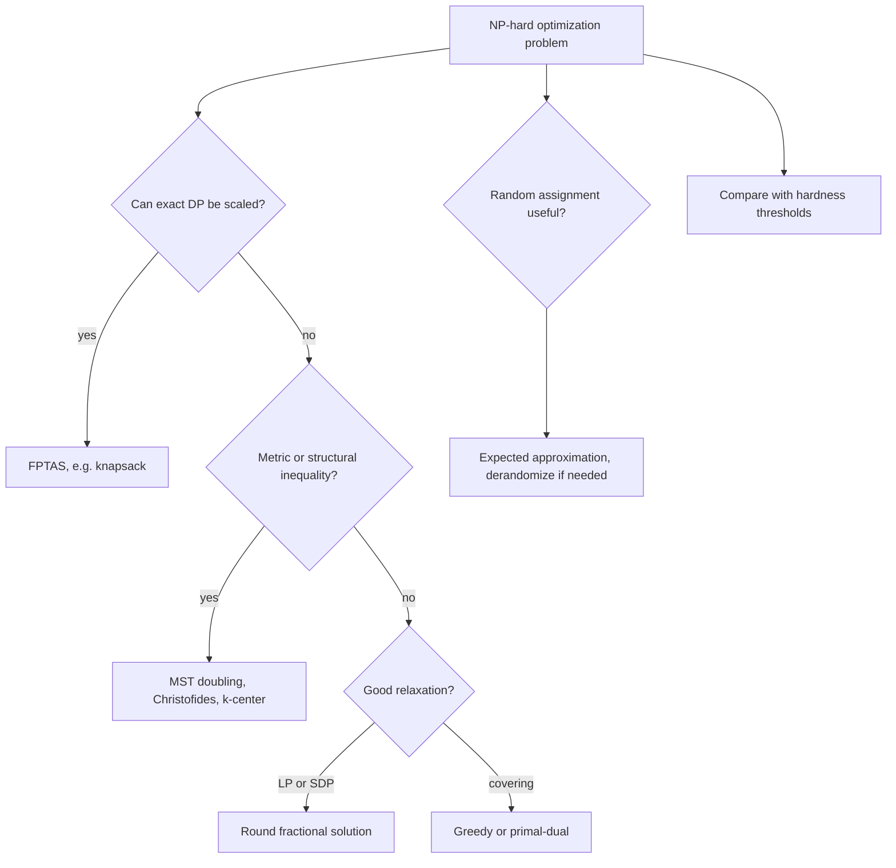

# Approximation Algorithms

Approximation algorithms address optimization problems where exact polynomial-time algorithms are unlikely, usually because the problem is NP-hard. Instead of insisting on optimality, they guarantee a solution within a provable factor of optimal. The goal is not "good in experiments"; it is a worst-case mathematical promise connecting algorithm value to optimum [3], [6].

The field combines greedy choices, relaxations, rounding, primal-dual methods, local search, randomized rounding, and hardness theory. This page covers vertex cover, metric TSP, set cover, knapsack FPTAS, Max-3SAT, Steiner tree, k-center, and the PCP theorem as context for why some approximation ratios are difficult or impossible to improve [6], [12].


*Figure: A traveling-salesman tour illustrates why exact optimization can be hard even when the objective is easy to state. Image: [Wikimedia Commons](https://commons.wikimedia.org/wiki/File:TSP_Deutschland_3.png), public domain or CC-BY-SA via Wikimedia Commons.*

## Definitions

For a minimization problem, an algorithm has approximation ratio $\rho\ge1$ if for every instance $I$,

$$\mathrm{ALG}(I)\le \rho\cdot \mathrm{OPT}(I).$$

Equivalently,

$$\rho=\sup_I \frac{\mathrm{ALG}(I)}{\mathrm{OPT}(I)}.$$

For maximization, the ratio is often written $\mathrm{ALG}(I)\ge \mathrm{OPT}(I)/\rho$, or as a performance fraction $\mathrm{ALG}(I)/\mathrm{OPT}(I)\ge\alpha$.

An **absolute approximation** bounds $\vert \mathrm{ALG}-\mathrm{OPT}\vert $ by a constant or additive term. A **relative approximation** gives a multiplicative ratio. A **PTAS** gives a $(1+\epsilon)$-approximation for every fixed $\epsilon\gt 0$ in polynomial time, though the exponent may depend badly on $1/\epsilon$. An **FPTAS** is polynomial in both input size and $1/\epsilon$.

A **relaxation** enlarges the feasible region so the optimum becomes easier to compute. Linear-programming relaxation lets integer variables become fractional. Rounding maps the relaxed solution back to a feasible integral solution while controlling cost.

Every approximation proof needs a lower bound for minimization or an upper bound for maximization. Sometimes the bound is obvious, such as $MST\le OPT$ for metric TSP after deleting one edge from an optimal tour. Sometimes it is a relaxation, such as a fractional LP optimum. Sometimes it is a packing argument, such as the matching lower bound for vertex cover. The algorithm is only half the story; the comparison certificate is what turns a heuristic into an approximation algorithm.

## Key results

Vertex cover asks for a minimum set of vertices touching every edge. A simple 2-approximation repeatedly chooses an uncovered edge $(u,v)$, adds both endpoints, and deletes all covered edges. The chosen edges form a matching, so any vertex cover must include at least one endpoint from each chosen edge. If the algorithm chooses $k$ edges, it returns $2k$ vertices while optimum is at least $k$. LP relaxation gives another 2-approximation: solve the fractional cover LP and choose every vertex with $x_v\ge1/2$ [6].

Metric TSP assumes distances satisfy the triangle inequality. The MST-doubling algorithm builds a minimum spanning tree, doubles every edge to make all degrees even, takes an Euler tour, and shortcuts repeated vertices. The doubled tree has cost $2\cdot MST\le2\cdot OPT$, and shortcutting cannot increase length in a metric. Christofides improves this to $3/2$ by adding a minimum-weight perfect matching on odd-degree MST vertices before shortcutting [7].

Set cover has universe $U$ and subsets $S_1,\ldots,S_m$. Greedy repeatedly chooses the set covering the most uncovered elements. A charging argument gives an $H_n=\ln n+O(1)$ approximation, where $n=\vert U\vert $ [8]. LP rounding gives related logarithmic guarantees. Unlike vertex cover, a constant-factor approximation for general set cover would contradict standard hardness assumptions.

Knapsack has an FPTAS despite being NP-hard in its 0/1 form. The pseudo-polynomial DP by total value runs in $O(nV)$, where $V$ is the sum of values. Scaling values down by a factor depending on $\epsilon$ and $n$ reduces the value range while losing only a controlled fraction of optimum. A common bound is $O(n^2/\epsilon)$ states for a $(1-\epsilon)$ maximization approximation [6].

Max-3SAT asks for an assignment satisfying as many 3-literal clauses as possible. A uniformly random assignment satisfies any clause with probability $7/8$, since only one of the eight truth assignments to three literals fails. Therefore the expected number of satisfied clauses is $7m/8$, and conditional expectation derandomizes this into a deterministic $7/8$-approximation.

Steiner tree asks for the cheapest tree connecting required terminals, possibly using extra nonterminal vertices. Metric closure and MST-style approaches give constant approximations. The $k$-center problem asks for $k$ centers minimizing maximum client distance. The greedy farthest-first traversal gives a 2-approximation in metric spaces: after choosing the first center, repeatedly choose the point farthest from existing centers.

The PCP theorem states, roughly, that every NP statement has proofs checkable with constant randomness and a constant number of queried bits, with a gap between yes and no instances [12]. Its algorithmic consequence is hardness of approximation: for many problems, improving a ratio beyond a threshold is NP-hard. This does not make approximation pessimistic; it tells us which guarantees are meaningful targets.

Approximation schemes are especially sensitive to input encoding. A pseudo-polynomial algorithm may look polynomial in a numeric value like capacity $W$, but the input length contains only $\log W$ bits for that number. An FPTAS must be polynomial in $1/\epsilon$ and the encoded input size, which is why scaling values rather than capacities is the standard route for knapsack when values are the DP dimension.

## Visual



| Problem | Algorithm | Guarantee | Main proof idea |
| --- | --- | --- | --- |
| Vertex cover | maximal matching endpoints | 2-approx | matching lower bound |
| Vertex cover | LP rounding at $1/2$ | 2-approx | fractional lower bound |
| Metric TSP | MST doubling | 2-approx | tree lower bound plus shortcutting |
| Metric TSP | Christofides | 1.5-approx | matching odd-degree vertices |
| Set cover | greedy | $H_n$-approx | charging uncovered elements |
| 0/1 knapsack | value scaling DP | FPTAS | bounded rounding loss |
| Max-3SAT | random assignment | $7/8$ expected | clause satisfaction probability |
| k-center | farthest-first | 2-approx | packing lower bound |

## Worked example 1: MST-doubling TSP on four metric nodes

**Problem.** Four nodes have metric distances:

| edge | distance |
| --- | --- |
| A-B | 1 |
| B-C | 2 |
| C-D | 1 |
| A-D | 2 |
| A-C | 2 |
| B-D | 2 |

Use MST doubling to produce a TSP tour.

**Method.**

1. Build an MST. Choose edges A-B(1), C-D(1), and B-C(2). MST cost is $4$.
2. Double MST edges. The doubled multigraph cost is $8$ and every vertex has even degree.
3. One Euler tour is

$$A\to B\to C\to D\to C\to B\to A.$$

4. Shortcut repeated vertices using the triangle inequality. Visit first occurrences:

$$A\to B\to C\to D\to A.$$

5. Tour cost is $A-B=1$, $B-C=2$, $C-D=1$, $D-A=2$, total $6$.

**Checked answer.** The algorithm returns a tour of cost $6$. Since any TSP tour contains a spanning connected structure, $OPT\ge MST=4$, so the 2-approx bound allows cost up to $8$. The produced tour is within that guarantee.

## Worked example 2: greedy set cover analysis

**Problem.** Universe $U=\{1,2,3,4,5,6\}$ and sets

$$S_1=\{1,2,3\},\quad S_2=\{3,4\},\quad S_3=\{4,5,6\},\quad S_4=\{1,6\}.$$

Run greedy set cover.

**Method.**

1. Initially all 6 elements are uncovered. $S_1$ and $S_3$ each cover 3. Break ties by choosing $S_1$.
2. Covered: $\{1,2,3\}$. Uncovered: $\{4,5,6\}$.
3. Marginal gains now: $S_2$ covers $\{4\}$, $S_3$ covers $\{4,5,6\}$, $S_4$ covers $\{6\}$. Choose $S_3$.
4. Covered: all elements. Greedy returns $\{S_1,S_3\}$.

**Checked answer.** The greedy cover has size 2, and it is optimal because no single set covers all six elements. The general analysis would charge the first three elements at price $1/3$ each and the last three at price $1/3$ each in this instance, totaling 2. On worse instances, the same charging style yields the harmonic bound $H_n$.

## Code

```python
def vertex_cover_2approx(edges):
    uncovered = {tuple(edge) for edge in edges}
    cover = set()
    while uncovered:
        u, v = next(iter(uncovered))
        cover.add(u)
        cover.add(v)
        uncovered = {e for e in uncovered if u not in e and v not in e}
    return cover

def set_cover_greedy(universe, sets):
    uncovered = set(universe)
    chosen = []
    while uncovered:
        name, subset = max(sets.items(), key=lambda item: len(uncovered & set(item[1])))
        gain = uncovered & set(subset)
        if not gain:
            raise ValueError("universe cannot be covered")
        chosen.append(name)
        uncovered -= gain
    return chosen

def tsp_mst_doubling(nodes, dist):
    parent = {v: v for v in nodes}

    def find(x):
        while parent[x] != x:
            parent[x] = parent[parent[x]]
            x = parent[x]
        return x

    def union(a, b):
        ra, rb = find(a), find(b)
        if ra == rb:
            return False
        parent[rb] = ra
        return True

    edges = sorted((dist[a, b], a, b) for i, a in enumerate(nodes) for b in nodes[i + 1:])
    tree = {v: [] for v in nodes}
    for w, a, b in edges:
        if union(a, b):
            tree[a].append(b)
            tree[b].append(a)

    tour = []
    seen = set()

    def preorder(u, p=None):
        seen.add(u)
        tour.append(u)
        for v in tree[u]:
            if v != p:
                preorder(v, u)

    preorder(nodes[0])
    tour.append(nodes[0])

    def distance(a, b):
        return dist.get((a, b), dist.get((b, a)))

    cost = sum(distance(a, b) for a, b in zip(tour, tour[1:]))
    return tour, cost
```

## Common pitfalls

- Reporting empirical solution quality as an approximation ratio without a proof.
- Mixing minimization and maximization ratio conventions.
- Forgetting that metric TSP approximations rely on the triangle inequality.
- Applying MST doubling to nonmetric TSP and expecting the same guarantee.
- Treating Christofides as a general TSP approximation rather than metric TSP.
- Using greedy set cover and claiming a constant-factor guarantee.
- Rounding every positive LP variable up without bounding the cost increase.
- Calling a pseudo-polynomial knapsack DP polynomial in the input length.
- Scaling knapsack values too coarsely and losing more than the allowed $\epsilon$.
- Assuming a randomized expected guarantee automatically holds for every run.
- Ignoring hardness results when promising better ratios for standard NP-hard problems.
- Confusing approximation algorithms with heuristics; heuristics may work well but lack worst-case guarantees.

## Connections

- [Greedy Algorithms](/cs/algorithms/greedy-algorithms) for set cover, interval ideas, and local-choice proofs.
- [Dynamic Programming](/cs/algorithms/dynamic-programming) for knapsack pseudo-polynomial DP and FPTAS construction.
- [Graph Algorithms](/cs/algorithms/graph-algorithms) for MSTs, matchings, cuts, TSP, and k-center metrics.
- [Network Flow and Matching](/cs/algorithms/network-flow-and-matching) for LP relaxations, vertex cover in bipartite graphs, and matching lower bounds.
- [Randomized Algorithms](/cs/algorithms/randomized-algorithms) for random assignment, randomized rounding, and probability amplification.
- [Theory of Computation](/cs/theory/intro) for NP-hardness and PCP-based hardness of approximation.
- [Discrete Math](/math/discrete/intro) for graphs, set systems, and linear-programming intuition.

## References

[1] T. H. Cormen, C. E. Leiserson, R. L. Rivest, and C. Stein, *Introduction to Algorithms*, 4th ed. MIT Press, 2022.

[2] R. Sedgewick and K. Wayne, *Algorithms*, 4th ed. Addison-Wesley, 2011.

[3] J. Kleinberg and E. Tardos, *Algorithm Design*. Pearson, 2005.

[4] S. S. Skiena, *The Algorithm Design Manual*, 3rd ed. Springer, 2020.

[5] R. Motwani and P. Raghavan, *Randomized Algorithms*. Cambridge University Press, 1995.

[6] V. V. Vazirani, *Approximation Algorithms*. Springer, 2003.

[7] N. Christofides, "Worst-case analysis of a new heuristic for the travelling salesman problem," Graduate School of Industrial Administration, Carnegie Mellon University, Report 388, 1976.

[8] L. Lovasz, "On the ratio of optimal integral and fractional covers," *Discrete Mathematics*, vol. 13, no. 4, pp. 383-390, 1975.

[9] D. S. Johnson, "Approximation algorithms for combinatorial problems," *Journal of Computer and System Sciences*, vol. 9, no. 3, pp. 256-278, 1974.

[10] D. S. Hochbaum and D. B. Shmoys, "A best possible heuristic for the k-center problem," *Mathematics of Operations Research*, vol. 10, no. 2, pp. 180-184, 1985.

[11] M. X. Goemans and D. P. Williamson, "Improved approximation algorithms for maximum cut and satisfiability problems using semidefinite programming," *Journal of the ACM*, vol. 42, no. 6, pp. 1115-1145, 1995.

[12] S. Arora, C. Lund, R. Motwani, M. Sudan, and M. Szegedy, "Proof verification and the hardness of approximation problems," *Journal of the ACM*, vol. 45, no. 3, pp. 501-555, 1998.

[13] P. Raghavan and C. D. Thompson, "Randomized rounding: A technique for provably good algorithms and algorithmic proofs," *Combinatorica*, vol. 7, pp. 365-374, 1987.

[14] M. H. Hajiaghayi and K. Jain, "The prize-collecting generalized Steiner tree problem via a new approach of primal-dual schema," *SODA*, pp. 631-640, 2006.
