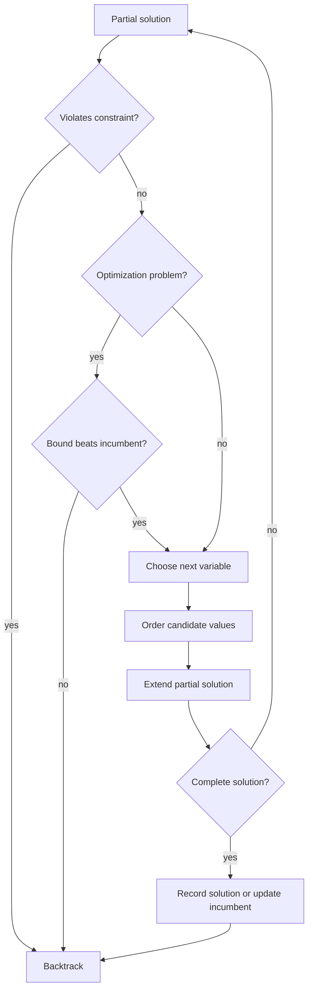

# Backtracking and Branch & Bound

Backtracking is disciplined exhaustive search. It explores a search-space tree, abandons branches as soon as they cannot lead to a feasible solution, and returns when it has either found enough solutions or proven that none exist. Branch and bound adds objective-function bounds so that an optimization search can discard branches that cannot beat the best solution already found [1], [4].

These methods sit between brute force and polynomial-time algorithm design. They do not change NP-complete problems into easy problems, but they often solve practical instances by exploiting constraints, structure, and good ordering. The intellectual move is to make the implicit tree explicit: what is a node, what are its children, what makes a partial assignment impossible, and what lower or upper bound certifies that a subtree is not worth exploring?

## Definitions

A **search-space tree** has a root representing the empty partial solution. Each edge adds a choice, such as assigning a variable, placing a queen, selecting an item, or extending a path. A leaf is either a complete feasible solution, a complete infeasible assignment, or a partial state that has been pruned.

**Backtracking** prunes by feasibility. If a partial assignment violates a constraint, no extension can repair it, so the algorithm returns immediately. **Constraint propagation** tightens future choices after a current choice. In Sudoku, placing a digit removes that digit from peer cells. In graph coloring, coloring a vertex removes that color from adjacent uncolored vertices.

**Branch and bound** prunes by objective value. For maximization, an upper bound on the best value achievable in a subtree is compared with the incumbent best feasible value. If the upper bound is no better than the incumbent, the subtree can be discarded. For minimization, use a lower bound.

**Forward checking** removes inconsistent values from neighboring domains after an assignment. **AC-3** enforces arc consistency in binary constraint satisfaction problems by repeatedly deleting values that have no compatible support in a neighbor's domain. **Variable ordering** chooses which variable to branch on next; the minimum-remaining-values heuristic often branches on the most constrained variable. **Value ordering** chooses the trial order of values; least-constraining-value tries values that preserve future flexibility.

## Key results

Backtracking classics include N-queens, Sudoku, graph coloring, subset sum, Hamiltonian cycle, and knight's tour. They share a pattern: maintain a partial object and a fast validity test. In N-queens, one queen per row reduces the branching structure; column and diagonal sets make each placement check $O(1)$. In graph coloring, assigning colors vertex by vertex with forward checking prunes when an uncolored vertex loses all colors. In Hamiltonian cycle search, a partial path can be abandoned if it revisits a vertex or cannot return to the start.

Sudoku demonstrates the difference between naive backtracking and constraint-aware backtracking. A plain search tries digits cell by cell. A stronger solver keeps domains for empty cells, repeatedly fills forced cells, and chooses a cell with the smallest domain. Knuth's dancing-links representation for exact cover gives a highly efficient way to implement Sudoku-like exact cover searches because cover and uncover operations are constant-time pointer updates [7].

DPLL-style SAT solving is another backtracking descendant [8]. It branches on Boolean variables, applies unit propagation, and learns from conflicts in modern CDCL solvers. While full SAT solver engineering is beyond this page, the connection is important: practical search depends less on raw recursion and more on propagation, branching heuristics, and recorded information.

Branch and bound for 0/1 knapsack often uses the fractional-knapsack relaxation as an upper bound. Sort remaining items by value density. At a node, take the current value and fill remaining capacity fractionally to compute an optimistic value. If that optimistic value cannot beat the incumbent, prune. The relaxation is not a feasible 0/1 solution, but it is an upper bound because fractional knapsack can only help a maximization problem.

For the traveling salesman problem, branch-and-bound methods use lower bounds such as reduced-cost matrix bounds, one-tree bounds, or assignment relaxations. A reduced-cost bound subtracts row and column minima from a cost matrix; the total reduction is a lower bound on any tour using the remaining choices. These bounds can prune huge parts of the tour tree, although the worst-case complexity remains exponential.

Iterative deepening and beam search are memory-conscious alternatives for large state spaces. Iterative deepening depth-first search runs DFS with increasing depth limits; it has the memory of DFS and, in uniform branching trees, only a modest time overhead relative to BFS. Beam search keeps only the best $b$ frontier states according to a heuristic. It is not complete unless the beam is wide enough, but it is useful in domains where approximate or heuristic search is acceptable.

The main correctness distinction is this: backtracking pruning is safe when the pruned partial assignment cannot be extended to any feasible solution; branch-and-bound pruning is safe when the best possible completion cannot improve the incumbent. Heuristics may affect speed dramatically, but they must not change these safety conditions unless the algorithm is explicitly approximate.

## Visual



| Technique | Prunes by | Typical example | Guarantee |
| --- | --- | --- | --- |
| Plain backtracking | immediate infeasibility | N-queens | complete if all branches explored |
| Forward checking | future domain wipeout | graph coloring | complete with safe propagation |
| AC-3 | arc inconsistency | binary CSP | preserves solutions |
| Branch and bound | objective bound | 0/1 knapsack, TSP | optimal if bounds are valid |
| Iterative deepening | depth limit | puzzle search | complete with increasing limits |
| Beam search | heuristic rank | large approximate search | not generally complete |

## Worked example 1: N-queens for N=4

**Problem.** Place four queens on a $4\times4$ board so no two attack each other.

**Method.** Place one queen per row. Track used columns and diagonals $r-c$ and $r+c$.

1. Row 0, try column 0. Used: column 0, diagonals 0 and 0.
2. Row 1 cannot use column 0 or diagonal positions. Try column 2. Then row 2 has no legal column, so backtrack.
3. Row 1 after row 0 column 0, try column 3. Row 2 can try column 1, but row 3 has no legal column. Backtrack.
4. Row 0 column 0 fails. Try row 0 column 1.
5. Row 1 cannot use columns attacked by the queen at (0,1). Try column 3.
6. Row 2 legal choices include column 0. Place at (2,0).
7. Row 3 legal choices include column 2. Place at (3,2).

Board:

```text
. Q . .
. . . Q
Q . . .
. . Q .
```

**Checked answer.** The queen positions are $(0,1),(1,3),(2,0),(3,2)$. Columns are all distinct. The $r-c$ values are $-1,-2,2,1$, all distinct. The $r+c$ values are $1,4,2,5$, all distinct. Therefore no queens attack each other.

## Worked example 2: 0/1 knapsack branch and bound

**Problem.** Capacity is $10$. Items sorted by value density are:

| item | weight | value | density |
| --- | --- | --- | --- |
| A | 4 | 40 | 10 |
| B | 7 | 42 | 6 |
| C | 5 | 25 | 5 |
| D | 3 | 12 | 4 |

Find the optimum 0/1 value using a fractional upper bound.

**Method.**

1. At the root, fractional fill takes A fully, then $6/7$ of B. Bound is $40+36=76$.
2. Branch include A. Current value $40$, remaining capacity $6$. Fractional bound adds $6/7$ of B, so bound is $76$.
3. From include A, include B is infeasible because $4+7\gt 10$.
4. Include A, exclude B. Remaining capacity $6$. Take C fully for value $25$, then $1/3$ of D for value $4$. Bound is $69$.
5. This branch can produce feasible solution A+C with weight $9$ and value $65$. Incumbent becomes $65$.
6. Exclude A at root. Fractional fill takes B fully, then $3/5$ of C. Bound is $42+15=57$.
7. Since $57\lt 65$, prune the entire exclude-A subtree.
8. Continue include-A/exclude-B. Include C gives value $65$, remaining capacity $1$, cannot include D. Exclude C gives value $40+12=52$ if D is included.

**Checked answer.** The optimum is A+C with value $65$. The key safe prune is the exclude-A subtree: even its fractional relaxation cannot beat the incumbent.

## Code

```python
def n_queens_backtrack(n):
    solutions = []
    cols, diag1, diag2 = set(), set(), set()
    board = []

    def search(row):
        if row == n:
            solutions.append(board.copy())
            return
        for col in range(n):
            if col in cols or row - col in diag1 or row + col in diag2:
                continue
            cols.add(col)
            diag1.add(row - col)
            diag2.add(row + col)
            board.append(col)
            search(row + 1)
            board.pop()
            diag2.remove(row + col)
            diag1.remove(row - col)
            cols.remove(col)

    search(0)
    return solutions

def sudoku_solve(grid):
    rows = [set() for _ in range(9)]
    cols = [set() for _ in range(9)]
    boxes = [set() for _ in range(9)]
    empties = []

    for r in range(9):
        for c in range(9):
            value = grid[r][c]
            if value == 0:
                empties.append((r, c))
            else:
                rows[r].add(value)
                cols[c].add(value)
                boxes[(r // 3) * 3 + c // 3].add(value)

    def candidates(r, c):
        used = rows[r] | cols[c] | boxes[(r // 3) * 3 + c // 3]
        return [x for x in range(1, 10) if x not in used]

    def search():
        if not empties:
            return True
        best_i = min(range(len(empties)), key=lambda i: len(candidates(*empties[i])))
        r, c = empties.pop(best_i)
        b = (r // 3) * 3 + c // 3
        for value in candidates(r, c):
            grid[r][c] = value
            rows[r].add(value)
            cols[c].add(value)
            boxes[b].add(value)
            if search():
                return True
            boxes[b].remove(value)
            cols[c].remove(value)
            rows[r].remove(value)
            grid[r][c] = 0
        empties.insert(best_i, (r, c))
        return False

    return grid if search() else None
```

## Common pitfalls

- Calling a search "backtracking" while still generating every complete assignment before checking constraints.
- Using a pruning test that is not logically safe, thereby losing valid solutions.
- Forgetting to undo state changes when returning from recursion.
- Mutating shared domain sets without copying or rolling back correctly.
- Choosing variables in a fixed order when a constrained-variable heuristic would shrink the tree.
- Confusing an upper bound for maximization with a lower bound.
- Pruning a branch because its current value is low, even though future choices could improve it.
- Using the 0/1 knapsack greedy value as an upper bound; the fractional relaxation is the valid upper bound.
- Assuming branch and bound changes exponential worst-case complexity.
- Letting recursion continue after a complete solution when only one solution is needed.
- Using beam search when completeness or optimality is required.
- Implementing Sudoku row, column, and box checks with repeated full scans instead of maintained sets.
- Forgetting that Hamiltonian cycle and longest path remain NP-complete despite strong pruning.

## Connections

- [Dynamic Programming](/cs/algorithms/dynamic-programming) for problems where overlapping subproblems can replace search trees.
- [Greedy Algorithms](/cs/algorithms/greedy-algorithms) for fractional knapsack, which supplies the branch-and-bound relaxation.
- [Graph Algorithms](/cs/algorithms/graph-algorithms) for graph coloring, Hamiltonian cycles, and search trees over paths.
- [Approximation Algorithms](/cs/algorithms/approximation-algorithms) for when exact exponential search is too expensive.
- [Theory of Computation](/cs/theory/intro) for NP-completeness and reductions.
- [Discrete Math](/math/discrete/intro) for combinatorial enumeration, constraints, and graph coloring.

## References

[1] T. H. Cormen, C. E. Leiserson, R. L. Rivest, and C. Stein, *Introduction to Algorithms*, 4th ed. MIT Press, 2022.

[2] R. Sedgewick and K. Wayne, *Algorithms*, 4th ed. Addison-Wesley, 2011.

[3] J. Kleinberg and E. Tardos, *Algorithm Design*. Pearson, 2005.

[4] S. S. Skiena, *The Algorithm Design Manual*, 3rd ed. Springer, 2020.

[5] K. Mehlhorn and P. Sanders, *Algorithms and Data Structures: The Basic Toolbox*. Springer, 2008.

[6] D. E. Knuth, *The Art of Computer Programming, Vol. 4A: Combinatorial Algorithms*. Addison-Wesley, 2011.

[7] D. E. Knuth, "Dancing links," 2000. arXiv:cs/0011047.

[8] M. Davis, G. Logemann, and D. Loveland, "A machine program for theorem-proving," *Communications of the ACM*, vol. 5, no. 7, pp. 394-397, 1962. https://doi.org/10.1145/368273.368557

[9] E. L. Lawler and D. E. Wood, "Branch-and-bound methods: A survey," *Operations Research*, vol. 14, no. 4, pp. 699-719, 1966.

[10] R. M. Karp, "Reducibility among combinatorial problems," in *Complexity of Computer Computations*, pp. 85-103, 1972.

[11] A. Mackworth, "Consistency in networks of relations," *Artificial Intelligence*, vol. 8, no. 1, pp. 99-118, 1977.

[12] R. E. Tarjan, "Depth-first search and linear graph algorithms," *SIAM Journal on Computing*, vol. 1, no. 2, pp. 146-160, 1972.
