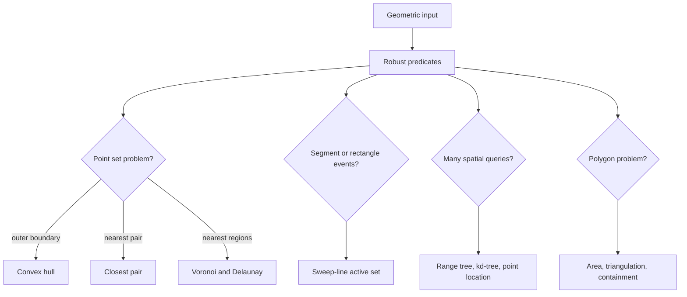

# Computational Geometry

Computational geometry designs algorithms for points, lines, segments, polygons, and higher-dimensional geometric objects. It turns geometric intuition into robust predicates and data structures. The subject powers graphics, robotics, GIS, CAD, collision detection, mesh generation, motion planning, and spatial indexing [1], [4].

The main danger is that pictures lie. A convex hull looks obvious on a diagram, but a correct implementation needs an orientation predicate, a tie policy for collinear points, and numerical care. This page focuses on the canonical undergraduate-to-graduate toolkit: orientation tests, segment intersection, convex hulls, closest pairs, sweep lines, Voronoi diagrams, Delaunay triangulations, point location, range trees, kd-trees, polygon triangulation, and low-dimensional linear programming [5], [6].


*Figure: The convex hull is the smallest convex polygon containing a point set. Image: [Wikimedia Commons](https://commons.wikimedia.org/wiki/File:ConvexHull.svg), public domain or CC-BY-SA via Wikimedia Commons.*

## Definitions

For points $a=(a_x,a_y)$, $b=(b_x,b_y)$, and $c=(c_x,c_y)$, the orientation predicate is the sign of the cross product

$$\operatorname{orient}(a,b,c)=(b_x-a_x)(c_y-a_y)-(b_y-a_y)(c_x-a_x).$$

Positive means $a\to b\to c$ makes a left turn, negative means right turn, and zero means collinear.

Two line segments intersect if their endpoints straddle each other's supporting lines, with special handling for collinear overlap. A polygon is **simple** if its edges do not cross except at shared endpoints. The signed area of a polygon with vertices $(x_i,y_i)$ is given by the shoelace formula:

$$A=\frac12\left|\sum_i x_i y_{i+1}-y_i x_{i+1}\right|.$$

The **convex hull** of a point set is the smallest convex set containing it. The **closest pair** problem asks for the pair of points with minimum Euclidean distance. A **sweep-line** algorithm imagines a vertical or horizontal line moving across events, maintaining an active set of objects intersecting the sweep line. A **Voronoi diagram** partitions the plane by nearest site, and the **Delaunay triangulation** is its geometric dual under general-position assumptions.

## Key results

The orientation predicate is the primitive behind most planar algorithms. Segment intersection can be decided by orientations:

$$\operatorname{orient}(a,b,c)\operatorname{orient}(a,b,d)\le0$$

and

$$\operatorname{orient}(c,d,a)\operatorname{orient}(c,d,b)\le0,$$

plus bounding-box checks for collinear cases. In floating-point geometry, near-zero orientation values can cause inconsistent decisions; robust implementations often use exact integer arithmetic, rational arithmetic, or adaptive precision predicates.

Convex hull algorithms reflect output sensitivity and sorting choices. Graham scan selects a pivot, sorts points by polar angle, then maintains a stack and pops while the last turn is not left [7]. Andrew's monotone chain sorts points lexicographically and builds lower and upper hulls with the same stack rule [8]. Jarvis march, or gift wrapping, repeatedly chooses the next hull point by scanning all points; it runs in $O(nh)$ for $h$ hull vertices. Chan's algorithm combines grouping and wrapping to achieve $O(n\log h)$ output-sensitive time [11].

Closest pair uses divide and conquer [1]. Sort by $x$, solve left and right halves recursively, and let $\delta$ be the better distance. Points farther than $\delta$ from the vertical split cannot form a cross-pair. Sort the strip by $y$ and compare each point to only a constant number of following points. With careful presorting, the recurrence is $T(n)=2T(n/2)+O(n)$, hence $O(n\log n)$.

Sweep-line algorithms turn two-dimensional problems into event processing. Bentley-Ottmann reports all segment intersections by sweeping endpoints and discovered intersection events while maintaining active segments ordered by their $y$-coordinate at the sweep position [9]. Rectangle union area sweeps vertical edges, maintaining covered $y$-length in a segment tree. The area added between consecutive $x$ events is active covered height times horizontal distance.

Voronoi diagrams and Delaunay triangulations encode nearest-neighbor structure. Fortune's algorithm builds the Voronoi diagram in $O(n\log n)$ time using a beach line and event queue [10]. Delaunay triangulations maximize the minimum angle among triangulations in a precise sense and are used in meshing. The empty circumcircle property says a triangle is Delaunay if no input point lies inside its circumcircle.

Point location asks which face of a planar subdivision contains a query point. Slab decomposition, trapezoidal maps, and persistent search structures give different preprocessing-query trade-offs. Orthogonal range trees answer axis-aligned rectangle queries by recursively organizing coordinates, while kd-trees split space by alternating coordinate axes and are widely used for nearest-neighbor search in moderate dimensions. High dimensions weaken these structures due to the curse of dimensionality.

Polygon triangulation decomposes a simple polygon into triangles. Ear clipping repeatedly removes a convex ear whose diagonal lies inside the polygon; it is simple but not asymptotically optimal. Linear programming in fixed dimension can be solved in expected linear time by randomized incremental algorithms such as Seidel's method, showing that geometric dimension can be a parameter independent of the number of constraints.

## Visual



| Problem | Standard algorithm | Time | Key primitive |
| --- | --- | --- | --- |
| Orientation | cross product sign | $O(1)$ | arithmetic robustness |
| Segment intersection | orientation tests | $O(1)$ | collinear handling |
| Convex hull | Graham or Andrew | $O(n\log n)$ | sorting plus stack |
| Output-sensitive hull | Chan | $O(n\log h)$ | wrapping over groups |
| Closest pair | divide and conquer | $O(n\log n)$ | strip packing |
| Segment intersections | Bentley-Ottmann | $O((n+k)\log n)$ | sweep active order |
| Polygon area | shoelace formula | $O(n)$ | signed edge sum |
| kd-tree query | spatial partition | data dependent | bounding boxes |

## Worked example 1: Graham scan trace on six points

**Problem.** Compute the convex hull of

$$P=\{(0,0),(1,1),(2,0),(2,2),(0,2),(1,0.5)\}.$$

**Method.**

1. Choose pivot $(0,0)$, the lowest then leftmost point.
2. Sort other points by polar angle from the pivot. A valid order is $(2,0)$, $(1,0.5)$, $(1,1)$, $(2,2)$, $(0,2)$.
3. Start stack with $(0,0),(2,0)$.
4. Consider $(1,0.5)$. Orientation of $(0,0),(2,0),(1,0.5)$ is positive, so push.
5. Consider $(1,1)$. Orientation of $(2,0),(1,0.5),(1,1)$ is negative or zero depending on exact order check, so pop $(1,0.5)$ because it is interior. Now orientation of $(0,0),(2,0),(1,1)$ is positive; push $(1,1)$.
6. Consider $(2,2)$. Orientation of $(2,0),(1,1),(2,2)$ is negative, so pop $(1,1)$. Orientation of $(0,0),(2,0),(2,2)$ is positive; push $(2,2)$.
7. Consider $(0,2)$. Orientation of $(2,0),(2,2),(0,2)$ is positive; push.

**Checked answer.** The hull is

$$[(0,0),(2,0),(2,2),(0,2)].$$

The points $(1,0.5)$ and $(1,1)$ are interior and correctly removed by right-turn tests.

## Worked example 2: closest pair by divide and conquer

**Problem.** Find the closest pair among

$$\{(0,0),(1,3),(2,2),(4,4),(5,1),(6,2)\}.$$

**Method.**

1. Sort by $x$: the points are already ordered.
2. Split into left $L=\{(0,0),(1,3),(2,2)\}$ and right $R=\{(4,4),(5,1),(6,2)\}$.
3. Brute force left distances:
   $(0,0)$ to $(1,3)$ is $\sqrt{10}$,
   $(0,0)$ to $(2,2)$ is $\sqrt8$,
   $(1,3)$ to $(2,2)$ is $\sqrt2$.
   Left best is $\sqrt2$.
4. Brute force right distances:
   $(4,4)$ to $(5,1)$ is $\sqrt{10}$,
   $(4,4)$ to $(6,2)$ is $\sqrt8$,
   $(5,1)$ to $(6,2)$ is $\sqrt2$.
   Right best is $\sqrt2$.
5. Therefore $\delta=\sqrt2$. The split line is between $x=2$ and $x=4$, say $x=3$.
6. The strip contains points with $\vert x-3\vert \lt \sqrt2$, namely $(2,2)$ and $(4,4)$. Their distance is $\sqrt8$, not better.

**Checked answer.** The closest distance is $\sqrt2$, achieved by $(1,3),(2,2)$ and also by $(5,1),(6,2)$.

## Code

```python
from math import hypot

def orient(a, b, c):
    return (b[0] - a[0]) * (c[1] - a[1]) - (b[1] - a[1]) * (c[0] - a[0])

def segment_intersect(a, b, c, d):
    def on_segment(p, q, r):
        return (min(p[0], r[0]) <= q[0] <= max(p[0], r[0]) and
                min(p[1], r[1]) <= q[1] <= max(p[1], r[1]))

    o1 = orient(a, b, c)
    o2 = orient(a, b, d)
    o3 = orient(c, d, a)
    o4 = orient(c, d, b)
    if o1 == 0 and on_segment(a, c, b):
        return True
    if o2 == 0 and on_segment(a, d, b):
        return True
    if o3 == 0 and on_segment(c, a, d):
        return True
    if o4 == 0 and on_segment(c, b, d):
        return True
    return (o1 > 0) != (o2 > 0) and (o3 > 0) != (o4 > 0)

def convex_hull_andrew(points):
    pts = sorted(set(points))
    if len(pts) <= 1:
        return pts

    def build(seq):
        hull = []
        for p in seq:
            while len(hull) >= 2 and orient(hull[-2], hull[-1], p) <= 0:
                hull.pop()
            hull.append(p)
        return hull

    lower = build(pts)
    upper = build(reversed(pts))
    return lower[:-1] + upper[:-1]

def closest_pair(points):
    pts = sorted(points)

    def brute(ps):
        best = (float("inf"), None)
        for i in range(len(ps)):
            for j in range(i + 1, len(ps)):
                d = hypot(ps[i][0] - ps[j][0], ps[i][1] - ps[j][1])
                if d < best[0]:
                    best = (d, (ps[i], ps[j]))
        return best

    def solve(ps):
        if len(ps) <= 3:
            return brute(ps)
        mid = len(ps) // 2
        mid_x = ps[mid][0]
        dl, pl = solve(ps[:mid])
        dr, pr = solve(ps[mid:])
        delta, pair = (dl, pl) if dl <= dr else (dr, pr)
        strip = sorted([p for p in ps if abs(p[0] - mid_x) < delta], key=lambda p: p[1])
        for i in range(len(strip)):
            for j in range(i + 1, min(i + 8, len(strip))):
                d = hypot(strip[i][0] - strip[j][0], strip[i][1] - strip[j][1])
                if d < delta:
                    delta, pair = d, (strip[i], strip[j])
        return delta, pair

    return solve(pts)
```

## Common pitfalls

- Using floating-point orientation tests without considering near-collinear inputs.
- Forgetting collinear overlap cases in segment intersection.
- Sorting convex-hull points by angle without a consistent distance tie-break.
- Removing collinear boundary points when the output specification wants all boundary points.
- Recomputing sorted-by-$y$ lists in closest pair, adding an avoidable logarithmic factor.
- Comparing every strip point with all later strip points instead of using the packing bound.
- Treating a kd-tree as guaranteed logarithmic in high dimensions.
- Implementing sweep-line event ordering without tie rules for shared endpoints.
- Counting rectangle union area without a covered-length data structure.
- Assuming Delaunay triangulation is unique when points are cocircular.
- Applying shoelace formula to unordered points rather than polygon boundary order.
- Confusing point-in-polygon ray crossings on boundary cases.
- Forgetting that geographic coordinates on a sphere are not ordinary planar coordinates.

## Connections

- [Divide and Conquer](/cs/algorithms/divide-and-conquer) for closest pair and geometric divide steps.
- [Sorting Algorithms](/cs/algorithms/sorting-algorithms) for coordinate sorting in hulls and sweeps.
- [Graph Algorithms](/cs/algorithms/graph-algorithms) for planar graphs, triangulations, and shortest paths in geometric graphs.
- [Searching Algorithms](/cs/algorithms/searching-algorithms) for kd-trees, range trees, and point location.
- [Data Structures](/cs/data-structures/intro) for balanced trees, segment trees, priority queues, and spatial indexes.
- [Discrete Math](/math/discrete/intro) for planar graph structure and combinatorial geometry.

## References

[1] T. H. Cormen, C. E. Leiserson, R. L. Rivest, and C. Stein, *Introduction to Algorithms*, 4th ed. MIT Press, 2022.

[2] M. de Berg, O. Cheong, M. van Kreveld, and M. Overmars, *Computational Geometry: Algorithms and Applications*, 3rd ed. Springer, 2008.

[3] J. O'Rourke, *Computational Geometry in C*, 2nd ed. Cambridge University Press, 1998.

[4] S. S. Skiena, *The Algorithm Design Manual*, 3rd ed. Springer, 2020.

[5] K. Mehlhorn and P. Sanders, *Algorithms and Data Structures: The Basic Toolbox*. Springer, 2008.

[6] F. P. Preparata and M. I. Shamos, *Computational Geometry: An Introduction*. Springer, 1985.

[7] R. L. Graham, "An efficient algorithm for determining the convex hull of a finite planar set," *Information Processing Letters*, vol. 1, no. 4, pp. 132-133, 1972.

[8] A. M. Andrew, "Another efficient algorithm for convex hulls in two dimensions," *Information Processing Letters*, vol. 9, no. 5, pp. 216-219, 1979.

[9] J. L. Bentley and T. A. Ottmann, "Algorithms for reporting and counting geometric intersections," *IEEE Transactions on Computers*, vol. C-28, no. 9, pp. 643-647, 1979.

[10] S. Fortune, "A sweepline algorithm for Voronoi diagrams," *Algorithmica*, vol. 2, pp. 153-174, 1987.

[11] T. M. Chan, "Optimal output-sensitive convex hull algorithms in two and three dimensions," *Discrete & Computational Geometry*, vol. 16, pp. 361-368, 1996.

[12] R. Seidel, "Small-dimensional linear programming and convex hulls made easy," *Discrete & Computational Geometry*, vol. 6, pp. 423-434, 1991.

[13] J. L. Bentley, "Multidimensional binary search trees used for associative searching," *Communications of the ACM*, vol. 18, no. 9, pp. 509-517, 1975.
