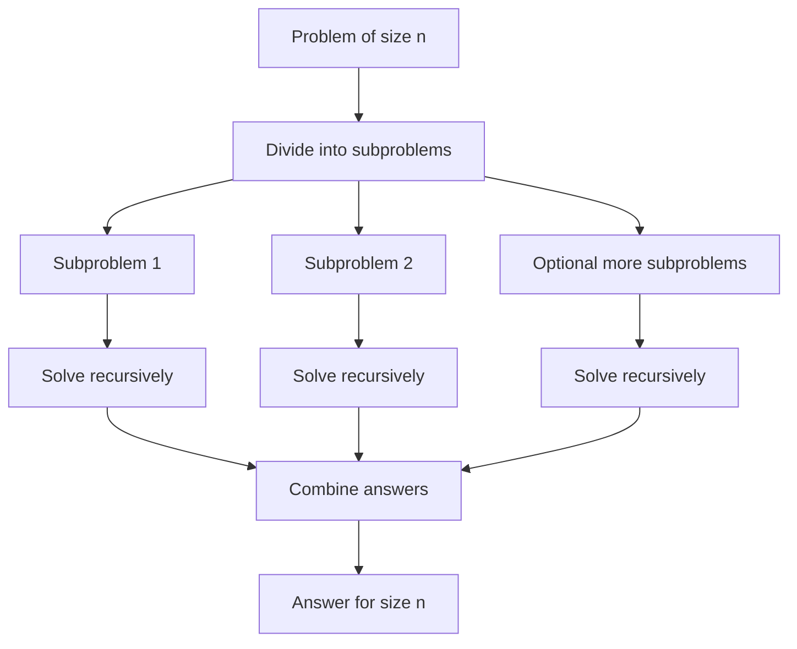

# Divide and Conquer

Divide and conquer solves a problem by splitting it into smaller instances, solving those instances recursively, and combining their answers. The pattern is simple enough to describe in one sentence, but it explains many of the fastest classical algorithms: merge sort, quicksort, binary search, closest pair of points, Karatsuba multiplication, Strassen matrix multiplication, and the Cooley-Tukey FFT [1], [2].

The technique is also a way to think about recurrences. CLRS presents the Master Theorem as a quick classification tool; Kleinberg and Tardos emphasize identifying the algorithmic structure; Mehlhorn and Sanders connect divide and conquer to memory hierarchy and cache-oblivious algorithms [1], [3], [6]. The important habit is to keep the divide, conquer, and combine costs separate before trying to simplify the recurrence.


*Figure: Strassen's algorithm replaces eight block multiplications by seven carefully chosen products. Image: [Wikimedia Commons](https://commons.wikimedia.org/wiki/File:Strassen_algorithm.svg), public domain or CC-BY-SA via Wikimedia Commons.*

## Definitions

A divide-and-conquer algorithm has three phases:

1. **Divide:** transform an input of size $n$ into subproblems, often of size $n/b$.
2. **Conquer:** solve the subproblems, usually recursively.
3. **Combine:** merge, compare, add, interpolate, or otherwise assemble the subproblem answers.

Many recurrences have the form

$$T(n)=aT(n/b)+f(n),$$

where $a$ is the number of subproblems, $n/b$ is each subproblem size, and $f(n)$ is the nonrecursive divide-plus-combine work. The critical comparison is between $f(n)$ and $n^{\log_b a}$, the total leaf-level work implied by the recursion tree.

The **substitution method** proves a guessed bound by induction. The **recursion-tree method** sums work level by level. The **Master Theorem** handles many balanced recurrences. The **Akra-Bazzi theorem** extends the method to recurrences such as $T(n)=T(n/3)+T(2n/3)+n$, where subproblem sizes need not be equal [1].

## Key results

The Master Theorem for $T(n)=aT(n/b)+f(n)$, with constants $a\ge1$ and $b\gt 1$, has three standard cases [1, Ch. 4].

If $f(n)=O(n^{\log_b a-\epsilon})$ for some $\epsilon\gt 0$, then the leaves dominate and $T(n)=\Theta(n^{\log_b a})$. Binary search is the degenerate example $T(n)=T(n/2)+O(1)$, giving $\Theta(\log n)$.

If $f(n)=\Theta(n^{\log_b a}\log^k n)$ for $k\ge0$, then all levels balance up to logarithmic factors and

$$T(n)=\Theta(n^{\log_b a}\log^{k+1} n).$$

Merge sort has $a=2$, $b=2$, and $f(n)=\Theta(n)$, so $T(n)=\Theta(n\log n)$.

If $f(n)=\Omega(n^{\log_b a+\epsilon})$ and the regularity condition $af(n/b)\le cf(n)$ holds for some $c\lt 1$, then the root dominates and $T(n)=\Theta(f(n))$. The regularity condition rules out wild oscillations that break the simple recursion-tree intuition.

The recursion-tree view is often the safest first pass. Draw the root work, then the work on level 1, level 2, and so on. If the per-level work shrinks geometrically, the root dominates. If it grows geometrically, the leaves dominate. If it stays nearly flat, multiply one level's work by the number of levels. This picture also helps when a theorem does not apply exactly: uneven splits, floors and ceilings, and extra logarithms are easier to reason about once the levels are visible. It also exposes hidden combine costs.

Classic divide-and-conquer algorithms differ mainly in combine cost. Merge sort splits trivially and combines linearly. Quicksort does linear partition work first, then recurses on data-dependent sizes; randomized pivots give expected $\Theta(n\log n)$ even though the worst recurrence $T(n)=T(n-1)+\Theta(n)$ is quadratic [7]. Binary search has no real combine phase. The maximum-subarray divide-and-conquer algorithm compares the best left interval, best right interval, and best crossing interval in $O(n)$ combine time; Kadane's algorithm improves this to $O(n)$ total by carrying a stronger linear invariant.

Closest pair of points is a geometric showcase [10]. Sort points by $x$, recursively solve left and right halves, let $\delta$ be the smaller distance, and inspect only points within $\delta$ of the dividing line. After sorting that strip by $y$, each point needs comparison with only a constant number of following strip points. With careful presorting, the recurrence is $T(n)=2T(n/2)+O(n)$, so the time is $O(n\log n)$.

Karatsuba multiplication writes two $m$-digit numbers as $x=x_1B^m+x_0$ and $y=y_1B^m+y_0$. The schoolbook formula uses four half-size products. Karatsuba observes that

$$x_1y_0+x_0y_1=(x_1+x_0)(y_1+y_0)-x_1y_1-x_0y_0,$$

so three half-size multiplications suffice. The recurrence $T(n)=3T(n/2)+O(n)$ solves to $T(n)=O(n^{\log_2 3})\approx O(n^{1.585})$ [7].

Strassen's matrix multiplication similarly reduces eight block multiplications to seven, giving $T(n)=7T(n/2)+O(n^2)=O(n^{\log_2 7})\approx O(n^{2.807})$ [8]. Modern matrix multiplication has better asymptotic exponents, but Strassen remains the conceptual starting point for algebraic speedups. The Cooley-Tukey FFT evaluates a polynomial or computes the discrete Fourier transform by separating even and odd coefficients:

$$X_k=\sum_{n=0}^{N-1}x_ne^{-2\pi i kn/N}.$$

It recursively computes two $N/2$-point transforms and combines them with twiddle factors in linear time, yielding $O(N\log N)$ [9].

## Visual



| Recurrence | Source algorithm | Dominant term | Result |
| --- | --- | --- | --- |
| $T(n)=T(n/2)+O(1)$ | Binary search | levels | $O(\log n)$ |
| $T(n)=2T(n/2)+O(n)$ | Merge sort, closest pair | balanced | $O(n\log n)$ |
| $T(n)=3T(n/2)+O(n)$ | Karatsuba | leaves | $O(n^{\log_2 3})$ |
| $T(n)=7T(n/2)+O(n^2)$ | Strassen | leaves | $O(n^{\log_2 7})$ |
| $T(n)=2T(n/2)+O(1)$ | Min and max pair variants | leaves | $O(n)$ |
| $T(n)=T(n-1)+O(n)$ | Bad quicksort | root-to-leaf path | $O(n^2)$ |

## Worked example 1: Master Theorem with logarithmic combine cost

**Problem.** Solve

$$T(n)=3T(n/4)+n\log n.$$

**Method.**

1. Identify $a=3$, $b=4$, and $f(n)=n\log n$.
2. Compute the critical exponent:

$$n^{\log_b a}=n^{\log_4 3}\approx n^{0.792}.$$

3. Compare $f(n)$ to the critical term. Since $n\log n$ grows polynomially faster than $n^{0.792}$, choose an $\epsilon$ with $0\lt \epsilon\lt 1-\log_4 3$. For example, $\epsilon=0.1$ works because $n\log n=\Omega(n^{0.892})$.
4. Check regularity:

$$af(n/b)=3\cdot (n/4)\log(n/4)=\frac34 n(\log n-2).$$

For sufficiently large $n$, this is at most $c n\log n$ for a constant $c\lt 1$, such as $c=0.9$.
5. Apply Master Theorem case 3.

**Checked answer.** The root work dominates, so

$$T(n)=\Theta(n\log n).$$

The answer is not $\Theta(n^{\log_4 3})$ because the combine work is larger than the total leaf growth.

## Worked example 2: Karatsuba multiplication of two 4-digit numbers

**Problem.** Multiply $1234$ by $5678$ using one Karatsuba split.

**Method.** Use base $B=10$ and split after two digits:

$$x=1234=12\cdot100+34,\qquad y=5678=56\cdot100+78.$$

Compute three products:

1. High product:

$$z_2=12\cdot56=672.$$

2. Low product:

$$z_0=34\cdot78=2652.$$

3. Sum product:

$$z_1'=(12+34)(56+78)=46\cdot134=6164.$$

The cross term is

$$z_1=z_1'-z_2-z_0=6164-672-2652=2840.$$

Assemble:

$$xy=z_2\cdot100^2+z_1\cdot100+z_0.$$

Thus

$$xy=672\cdot10000+2840\cdot100+2652=6{,}720{,}000+284{,}000+2{,}652=7{,}006{,}652.$$

**Checked answer.** Ordinary multiplication also gives $1234\cdot5678=7{,}006{,}652$. Karatsuba saved one half-size multiplication; at scale, that changes the exponent.

## Code

```python
from math import hypot

def karatsuba_multiply(x, y):
    if x < 10 or y < 10:
        return x * y

    n = max(len(str(abs(x))), len(str(abs(y))))
    m = n // 2
    base = 10 ** m

    x1, x0 = divmod(x, base)
    y1, y0 = divmod(y, base)

    z2 = karatsuba_multiply(x1, y1)
    z0 = karatsuba_multiply(x0, y0)
    z1 = karatsuba_multiply(x1 + x0, y1 + y0) - z2 - z0
    return z2 * base * base + z1 * base + z0

def closest_pair_bruteforce(points):
    best = (float("inf"), None)
    for i in range(len(points)):
        for j in range(i + 1, len(points)):
            d = hypot(points[i][0] - points[j][0], points[i][1] - points[j][1])
            if d < best[0]:
                best = (d, (points[i], points[j]))
    return best

def closest_pair(points):
    px = sorted(points)

    def solve(ps):
        if len(ps) <= 3:
            return closest_pair_bruteforce(ps)
        mid = len(ps) // 2
        mid_x = ps[mid][0]
        dl, pair_l = solve(ps[:mid])
        dr, pair_r = solve(ps[mid:])
        delta, pair = (dl, pair_l) if dl <= dr else (dr, pair_r)

        strip = sorted((p for p in ps if abs(p[0] - mid_x) < delta), key=lambda p: p[1])
        for i in range(len(strip)):
            for j in range(i + 1, min(i + 8, len(strip))):
                d = hypot(strip[i][0] - strip[j][0], strip[i][1] - strip[j][1])
                if d < delta:
                    delta, pair = d, (strip[i], strip[j])
        return delta, pair

    return solve(px)
```

## Common pitfalls

- Applying the Master Theorem before checking that the recurrence matches its assumptions.
- Comparing $f(n)$ with $n$ instead of with $n^{\log_b a}$.
- Forgetting the regularity condition in Master Theorem case 3.
- Treating quicksort as a balanced recurrence without justifying pivot quality.
- Counting only arithmetic operations while ignoring the combine step's data movement.
- Re-sorting by $y$ inside each closest-pair recursive call, which adds an extra logarithmic factor.
- Implementing Karatsuba with string splits that mishandle signs or leading zeros.
- Assuming Strassen is automatically faster for all matrix sizes; constants and numerical stability matter.
- Forgetting FFT bit-reversal or twiddle-factor indexing in iterative implementations.
- Using recursion so deep that language stack limits dominate the theoretical cost.
- Thinking divide and conquer requires independent subproblems; some algorithms share preprocessing or combine state.
- Replacing a simple linear algorithm with a divide-and-conquer version that has the same or worse asymptotic cost.

## Connections

- [Sorting Algorithms](/cs/algorithms/sorting-algorithms) for merge sort and quicksort.
- [Searching Algorithms](/cs/algorithms/searching-algorithms) for binary search and selection.
- [Dynamic Programming](/cs/algorithms/dynamic-programming) contrasts overlapping subproblems with independent subproblems.
- [Computational Geometry](/cs/algorithms/computational-geometry) for closest pair, convex hull, and sweep-line preprocessing.
- [Number-Theoretic and Algebraic Algorithms](/cs/algorithms/number-theoretic-and-algebraic-algorithms) for FFT, Karatsuba, matrix exponentiation, and modular transforms.
- [Discrete Math](/math/discrete/intro) for recurrence solving and induction.

## References

[1] T. H. Cormen, C. E. Leiserson, R. L. Rivest, and C. Stein, *Introduction to Algorithms*, 4th ed. MIT Press, 2022.

[2] R. Sedgewick and K. Wayne, *Algorithms*, 4th ed. Addison-Wesley, 2011.

[3] J. Kleinberg and E. Tardos, *Algorithm Design*. Pearson, 2005.

[4] S. S. Skiena, *The Algorithm Design Manual*, 3rd ed. Springer, 2020.

[5] D. E. Knuth, *The Art of Computer Programming, Vol. 1: Fundamental Algorithms*, 3rd ed. Addison-Wesley, 1997.

[6] K. Mehlhorn and P. Sanders, *Algorithms and Data Structures: The Basic Toolbox*. Springer, 2008.

[7] A. Karatsuba and Y. Ofman, "Multiplication of many-digital numbers by automatic computers," *Proceedings of the USSR Academy of Sciences*, vol. 145, pp. 293-294, 1962.

[8] V. Strassen, "Gaussian elimination is not optimal," *Numerische Mathematik*, vol. 13, pp. 354-356, 1969. https://doi.org/10.1007/BF02165411

[9] J. W. Cooley and J. W. Tukey, "An algorithm for the machine calculation of complex Fourier series," *Mathematics of Computation*, vol. 19, no. 90, pp. 297-301, 1965. https://doi.org/10.1090/S0025-5718-1965-0178586-1

[10] M. I. Shamos and D. Hoey, "Closest-point problems," *FOCS*, pp. 151-162, 1975. https://doi.org/10.1109/SFCS.1975.8

[11] M. Akra and L. Bazzi, "On the solution of linear recurrence equations," *Computational Optimization and Applications*, vol. 10, pp. 195-210, 1998.

[12] C. A. R. Hoare, "Quicksort," *The Computer Journal*, vol. 5, no. 1, pp. 10-16, 1962. https://doi.org/10.1093/comjnl/5.1.10
