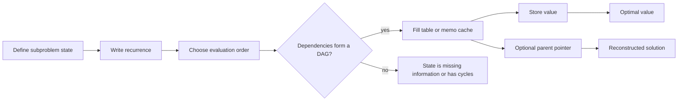

# Dynamic Programming

Dynamic programming, usually shortened to DP, turns an exponential recursive search into a polynomial computation by solving each distinct subproblem once. It is the method behind edit distance, sequence alignment, knapsack, matrix-chain multiplication, optimal binary search trees, interval optimization, tree optimization, and many shortest-path formulations [1], [3].

The central skill is not memorizing recurrences. It is choosing a state that contains exactly enough information to make future decisions independent of the past. Bellman's principle of optimality gives the philosophical version: an optimal policy has the property that, after any first decision, the remaining decisions must be optimal for the resulting subproblem [7]. Modern algorithm courses often add another view: a DP is a shortest-path or longest-path computation on an implicit acyclic graph of states.


*Figure: Hamming-distance states give a small example of a state space where local transitions define global distances. Image: [Wikimedia Commons](https://commons.wikimedia.org/wiki/File:Hamming_distance_4_bit_binary.svg), public domain or CC-BY-SA via Wikimedia Commons.*

## Definitions

A problem has **optimal substructure** if an optimal solution can be assembled from optimal solutions to smaller subproblems. It has **overlapping subproblems** if a naive recursion repeatedly asks for the same subproblem. DP is appropriate when both properties are present and the state space is not too large.

**Memoization** is top-down DP: write the recursive recurrence and cache answers by state. It is often easier to derive because the code mirrors the mathematical definition. **Tabulation** is bottom-up DP: order states so dependencies are known before a state is computed. It is often faster and easier to space-optimize.

A **state** is the tuple of variables indexing a subproblem, such as $(i,j)$ for prefixes of two strings. A **transition** describes how one state depends on earlier states. A **base case** initializes states with no smaller dependencies. A **reconstruction pointer** stores which transition attained the optimum, allowing the algorithm to recover the actual solution rather than only its value.

Space optimization is possible when a transition uses only a small window of previous states. Fibonacci needs only two previous values; edit distance needs one previous row and the current row if only the distance is required; 0/1 knapsack can use one row if capacities are iterated in decreasing order.

DP states form a directed graph even when the graph is never built explicitly. Each state has edges to the states it depends on. A tabulation order is a topological order of that graph, and memoized recursion is depth-first search with caching over the same graph. This perspective is useful for debugging: if a recurrence has a cycle, then it is not a plain acyclic DP until an additional monotone dimension, relaxation method, or fixed-point argument is supplied.

## Key results

The simplest DP examples are one-dimensional. Fibonacci has recurrence $F_n=F_{n-1}+F_{n-2}$; memoization changes the exponential recursion tree into $O(n)$ states. Climbing stairs is the same recurrence with different base cases. House robber uses

$$dp[i]=\max(dp[i-1],dp[i-2]+value_i),$$

which captures the choice to skip or rob the current house. Kadane's maximum-subarray algorithm can be viewed as DP with state "best subarray ending at index $i$":

$$bestEnd[i]=\max(A[i],bestEnd[i-1]+A[i]).$$

For sequences, the longest increasing subsequence has a quadratic DP:

$$dp[i]=1+\max\{dp[j]:j<i,\ A[j]<A[i]\}.$$

There is also an $O(n\log n)$ method that maintains `tails[len]`, the smallest possible tail value of an increasing subsequence of length `len`. This faster method is not a classic table DP over all subproblems, but it is often taught beside DP because it improves the same recurrence through a stronger invariant.

For two strings $X$ and $Y$, longest common subsequence uses prefixes:

$$
L[i][j]=
\begin{cases}
L[i-1][j-1]+1, & X[i-1]=Y[j-1],\\
\max(L[i-1][j],L[i][j-1]), & X[i-1]\ne Y[j-1].
\end{cases}
$$

Edit distance, formalized for strings by Wagner and Fischer [8], also uses prefix states. Insert, delete, and replace operations yield three transitions. If replacement cost is $0$ for equal characters and $1$ otherwise, the recurrence is

$$D[i][j]=\min(D[i-1][j]+1,\ D[i][j-1]+1,\ D[i-1][j-1]+cost).$$

Knapsack variants show how subtle state direction can be. In 0/1 knapsack, each item can be used at most once:

$$dp[i][w]=\max(dp[i-1][w],dp[i-1][w-weight_i]+value_i).$$

With one-dimensional compression, iterate capacities downward so the current item is not reused. In unbounded knapsack, iterate upward because reusing the current item is allowed. Subset sum and equal-partition are Boolean versions of the same capacity-indexed state.

Matrix-chain multiplication and optimal BST are interval DPs. Matrix-chain multiplication chooses a split $k$ for multiplying matrices $i,\ldots,j$:

$$M[i][j]=\min_{i\le k<j}\left(M[i][k]+M[k+1][j]+p_{i-1}p_kp_j\right).$$

Knuth's optimal BST work [9] shows that some interval DPs have monotonicity properties allowing faster optimization, but those speedups require proof before use.

DP on trees passes information along edges. A maximum independent set on a tree has states `take[u]` and `skip[u]`. Rerooting DP computes an answer for every possible root by combining child contributions and then passing parent-side contributions back down. Bitmask DP represents a subset by an integer mask; Held-Karp TSP uses states $(S,j)$ meaning the best path that starts at a fixed city, visits exactly set $S$, and ends at $j$, giving $O(n^2 2^n)$ time [10].

Finally, regex matching, word break, palindrome partitioning, and parsing-style tasks remind us that DP is not only numeric optimization. It is a method for recognizing whether a structured object can be decomposed into legal smaller objects.

The cost of a DP is usually the number of states times the cost per transition. That simple product should be written down before coding. An $O(n^2)$ table with $O(n)$ split choices is $O(n^3)$, not $O(n^2)$. Many advanced DP optimizations, including Knuth optimization, divide-and-conquer DP optimization, and monotone queues, are ways to reduce transition cost after proving extra structure.

## Visual



| DP family | Typical state | Transition style | Example |
| --- | --- | --- | --- |
| 1D prefix | $i$ | choose previous index or local action | Fibonacci, house robber |
| 2D sequence | $(i,j)$ | match, skip, edit | LCS, edit distance |
| Capacity | $(i,w)$ or $w$ | take or skip item | 0/1 knapsack, subset sum |
| Interval | $(i,j)$ | choose split $k$ | matrix chain, optimal BST |
| Tree | node plus mode | combine children | independent set, vertex cover on trees |
| Bitmask | $(S,last)$ | add one element | TSP, assignment variants |
| DAG path | vertex/state | relax incoming edges | shortest-path interpretation |

## Worked example 1: LCS table for two strings

**Problem.** Find the LCS length of $X=\texttt{ABCBDAB}$ and $Y=\texttt{BDCABA}$.

**Method.** Build $L[i][j]$ for prefixes $X[:i]$ and $Y[:j]$. The zero row and zero column are $0$.

1. For $i=1$, $X[0]=A$. It matches $Y[3]=A$ and $Y[5]=A$, so the row becomes:

$$[0,0,0,1,1,1].$$

2. For $i=2$, $X[1]=B$. It matches $Y[0]=B$ and $Y[4]=B$. Applying the recurrence across the row gives:

$$[1,1,1,1,2,2].$$

3. Continuing row by row yields the final table values:

| prefix | B | D | C | A | B | A |
| --- | --- | --- | --- | --- | --- | --- |
| A | 0 | 0 | 0 | 1 | 1 | 1 |
| AB | 1 | 1 | 1 | 1 | 2 | 2 |
| ABC | 1 | 1 | 2 | 2 | 2 | 2 |
| ABCB | 1 | 1 | 2 | 2 | 3 | 3 |
| ABCBD | 1 | 2 | 2 | 2 | 3 | 3 |
| ABCBDA | 1 | 2 | 2 | 3 | 3 | 4 |
| ABCBDAB | 1 | 2 | 2 | 3 | 4 | 4 |

**Checked answer.** The LCS length is $L[7][6]=4$. One valid LCS is `BCBA`; another is `BDAB`. The table gives the value, and parent pointers or backward tracing recover a sequence.

## Worked example 2: 0/1 knapsack table

**Problem.** Items have weights and values

| item | weight | value |
| --- | --- | --- |
| 1 | 2 | 3 |
| 2 | 3 | 4 |
| 3 | 4 | 5 |
| 4 | 5 | 8 |

Capacity is $W=5$. Find the maximum value using each item at most once.

**Method.** Let $dp[i][w]$ be the best value using the first $i$ items and capacity $w$.

1. After item 1, capacities $0,1$ have value $0$, and capacities $2$ through $5$ have value $3$.
2. Item 2 gives value $4$ at capacities $3$ and $4$, and value $7$ at capacity $5$ by taking items 1 and 2.
3. Item 3 gives value $5$ at capacity $4$, but capacity $5$ remains $7$ because item 3 plus item 1 would exceed capacity.
4. Item 4 gives value $8$ at capacity $5$, which beats $7$.

| $i\backslash w$ | 0 | 1 | 2 | 3 | 4 | 5 |
| --- | --- | --- | --- | --- | --- | --- |
| 0 | 0 | 0 | 0 | 0 | 0 | 0 |
| 1 | 0 | 0 | 3 | 3 | 3 | 3 |
| 2 | 0 | 0 | 3 | 4 | 4 | 7 |
| 3 | 0 | 0 | 3 | 4 | 5 | 7 |
| 4 | 0 | 0 | 3 | 4 | 5 | 8 |

**Checked answer.** The optimum value is $8$, achieved by taking item 4 alone. Taking items 1 and 2 gives value $7$, so the final comparison is meaningful.

## Code

```python
from bisect import bisect_left

def edit_distance(a, b):
    prev = list(range(len(b) + 1))
    for i, ca in enumerate(a, start=1):
        curr = [i] + [0] * len(b)
        for j, cb in enumerate(b, start=1):
            cost = 0 if ca == cb else 1
            curr[j] = min(
                prev[j] + 1,
                curr[j - 1] + 1,
                prev[j - 1] + cost,
            )
        prev = curr
    return prev[-1]

def knapsack_01(weights, values, capacity):
    dp = [0] * (capacity + 1)
    for weight, value in zip(weights, values):
        for w in range(capacity, weight - 1, -1):
            dp[w] = max(dp[w], dp[w - weight] + value)
    return dp[capacity]

def lis_nlogn(values):
    tails = []
    for x in values:
        i = bisect_left(tails, x)
        if i == len(tails):
            tails.append(x)
        else:
            tails[i] = x
    return len(tails)
```

## Common pitfalls

- Starting with code before defining the state in words.
- Leaving information out of the state, which makes the recurrence depend on hidden history.
- Adding too much information to the state, which makes the table exponentially larger than needed.
- Mixing 0/1 knapsack and unbounded knapsack loop directions.
- Forgetting base cases for empty prefixes, zero capacity, or leaf nodes.
- Computing a tabulation order that uses states before they are filled.
- Returning only the optimal value when the task asks for the chosen objects.
- Assuming greedy reconstruction works for every DP without parent pointers.
- Compressing space before the full two-dimensional recurrence is debugged.
- Treating a cyclic recurrence as DP when it really needs shortest paths, relaxation, or fixed points.
- Ignoring integer overflow in languages with fixed-width arithmetic.
- Using bitmask DP when $n$ is too large for $2^n$ states.
- Claiming DP is always polynomial; the number of states may still be exponential.

## Connections

- [Divide and Conquer](/cs/algorithms/divide-and-conquer) contrasts independent recursive subproblems with overlapping ones.
- [Greedy Algorithms](/cs/algorithms/greedy-algorithms) explains when a local choice can replace a table.
- [Graph Algorithms](/cs/algorithms/graph-algorithms) for shortest paths on explicit graphs; DP often works on implicit DAGs.
- [String Algorithms](/cs/algorithms/string-algorithms) for edit distance, LCS, and approximate matching.
- [Approximation Algorithms](/cs/algorithms/approximation-algorithms) for knapsack FPTAS and pseudo-polynomial DP.
- [Discrete Math](/math/discrete/intro) for induction, recurrences, and combinatorial state spaces.

## References

[1] T. H. Cormen, C. E. Leiserson, R. L. Rivest, and C. Stein, *Introduction to Algorithms*, 4th ed. MIT Press, 2022.

[2] R. Sedgewick and K. Wayne, *Algorithms*, 4th ed. Addison-Wesley, 2011.

[3] J. Kleinberg and E. Tardos, *Algorithm Design*. Pearson, 2005.

[4] S. S. Skiena, *The Algorithm Design Manual*, 3rd ed. Springer, 2020.

[5] K. Mehlhorn and P. Sanders, *Algorithms and Data Structures: The Basic Toolbox*. Springer, 2008.

[6] V. V. Vazirani, *Approximation Algorithms*. Springer, 2003.

[7] R. Bellman, *Dynamic Programming*. Princeton University Press, 1957.

[8] R. A. Wagner and M. J. Fischer, "The string-to-string correction problem," *Journal of the ACM*, vol. 21, no. 1, pp. 168-173, 1974. https://doi.org/10.1145/321796.321811

[9] D. E. Knuth, "Optimum binary search trees," *Acta Informatica*, vol. 1, pp. 14-25, 1971. https://doi.org/10.1007/BF00264289

[10] M. Held and R. M. Karp, "A dynamic programming approach to sequencing problems," *Journal of the Society for Industrial and Applied Mathematics*, vol. 10, no. 1, pp. 196-210, 1962.

[11] R. E. Bellman, "On a routing problem," *Quarterly of Applied Mathematics*, vol. 16, no. 1, pp. 87-90, 1958.

[12] S. Arora and B. Barak, *Computational Complexity: A Modern Approach*. Cambridge University Press, 2009.
