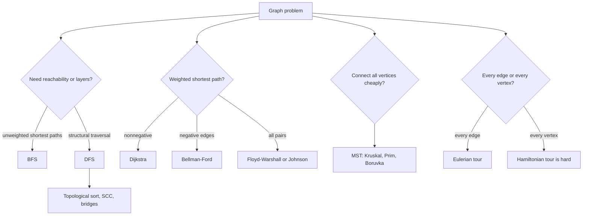

# Graph Algorithms

Graphs model relationships: roads between cities, prerequisites between courses, calls between functions, dependencies between packages, links between web pages, and states connected by transitions. Graph algorithms are therefore a central toolkit for computer science. They combine data structures, proof invariants, and traversal order into procedures for reachability, connectivity, ordering, spanning trees, and shortest paths [1], [3].

This page gives a course-scale map rather than a single algorithm. Breadth-first search and depth-first search provide the basic traversal grammar. Topological sorting, connected components, strongly connected components, bridges, articulation points, MSTs, and shortest paths layer additional invariants on top. The important distinction is what the edge weights and graph direction allow: unweighted graphs favor BFS, nonnegative weighted graphs allow Dijkstra, negative edges require Bellman-Ford or reweighting, and arbitrary all-pairs shortest paths use Floyd-Warshall or Johnson's algorithm [1], [6].


*Figure: Dijkstra's algorithm repeatedly finalizes the unsettled vertex with minimum tentative distance. Image: [Wikimedia Commons](https://commons.wikimedia.org/wiki/File:Dijkstra_Animation.gif), public domain or CC-BY-SA via Wikimedia Commons.*


*Figure: BFS expands a graph layer by layer from the source. Image: [Wikimedia Commons](https://commons.wikimedia.org/wiki/File:Animated_BFS.gif), public domain or CC-BY-SA via Wikimedia Commons.*


*Figure: Kruskal's algorithm grows a minimum spanning forest by safe light edges. Image: [Wikimedia Commons](https://commons.wikimedia.org/wiki/File:Kruskal_Algorithm_6.svg), public domain or CC-BY-SA via Wikimedia Commons.*


*Figure: Tarjan's algorithm detects strongly connected components using DFS low-link values. Image: [Wikimedia Commons](https://commons.wikimedia.org/wiki/File:Tarjan%27s_Algorithm_Animation.gif), public domain or CC-BY-SA via Wikimedia Commons.*

## Definitions

A graph is $G=(V,E)$, where $V$ is a set of vertices and $E$ is a set of edges. In an undirected graph, an edge $\{u,v\}$ has no direction. In a directed graph, an edge $(u,v)$ goes from $u$ to $v$. A weighted graph has a function $w:E\to\mathbb{R}$ assigning edge costs, lengths, or capacities.

The most common representations are adjacency lists, adjacency matrices, and edge lists. An **adjacency list** stores, for each vertex, its outgoing neighbors and optional weights; it uses $O(V+E)$ space and is ideal for sparse graphs. An **adjacency matrix** stores whether every pair is adjacent; it uses $O(V^2)$ space and supports constant-time edge existence tests. An **edge list** is a flat list of edges; it is natural for Kruskal's algorithm and Bellman-Ford.

A **path** is a sequence of vertices connected by edges. A graph is connected if every vertex can reach every other vertex in the undirected sense. A directed graph is strongly connected if every vertex can reach every other vertex following edge direction. A **DAG** is a directed acyclic graph. A **topological order** of a DAG lists every vertex before its outgoing successors.

During DFS in a directed graph, edges can be classified as tree, back, forward, or cross edges. A back edge to an ancestor indicates a directed cycle. Discovery time, finish time, and low-link values are timestamps that encode ancestor reachability.

## Key results

BFS explores in increasing number of edges from a source. With a queue, it runs in $O(V+E)$ time on adjacency lists and computes shortest-path distances in unweighted graphs. The proof is by layer invariant: when a vertex is first discovered, all shorter paths would have had to pass through an earlier layer already processed [1].

DFS explores one branch until it cannot continue, then backtracks. It also runs in $O(V+E)$ and produces discovery and finish times. In undirected graphs, DFS identifies connected components. In directed graphs, reverse finish-time order is central to Kosaraju's SCC algorithm, while Tarjan's algorithm computes SCCs in one pass using a stack and low-link values [10].

Topological sorting has two standard implementations. Kahn's algorithm repeatedly removes vertices of indegree zero. DFS topological sort appends vertices after exploring all outgoing edges, then reverses the finish list. Both are correct because a DAG always has at least one source, and DFS finish times place every vertex before those reachable from it.

Bridges and articulation points in undirected graphs use low-link values. For a DFS tree edge $(u,v)$, if `low[v] > disc[u]`, then no back edge from $v$'s subtree reaches $u$ or an ancestor, so $(u,v)$ is a bridge. A non-root vertex $u$ is an articulation point if some child $v$ has `low[v] >= disc[u]`; removing $u$ separates that child subtree.

Minimum spanning tree algorithms assume an undirected connected graph with edge weights. Kruskal sorts edges and adds a light edge when it connects two different components. Prim grows a single tree using the lightest edge crossing the current cut. Boruvka repeatedly adds the cheapest outgoing edge of every component, merging many components per phase. The cut property proves all three: the lightest edge crossing any cut is safe for some MST [8], [9].

Shortest-path algorithms depend on weight assumptions. Dijkstra's algorithm works with nonnegative weights and uses relaxation:

$$
\text{if } dist[v] > dist[u]+w(u,v),\quad dist[v]\leftarrow dist[u]+w(u,v).
$$

With a binary heap it runs in $O((V+E)\log V)$; with Fibonacci heaps, the theoretical bound is $O(E+V\log V)$, though constants often make binary heaps preferable [7]. Bellman-Ford relaxes every edge $V-1$ times, handles negative edges, and detects a negative cycle if any edge can still relax afterward [11]. Floyd-Warshall computes all-pairs shortest paths by allowing intermediate vertices one by one:

$$D^{(k)}[i][j]=\min(D^{(k-1)}[i][j],D^{(k-1)}[i][k]+D^{(k-1)}[k][j]).$$

Johnson's algorithm adds a new source, runs Bellman-Ford to compute potentials, reweights edges to nonnegative values, then runs Dijkstra from every vertex [13].

$A^*$ search augments Dijkstra with a heuristic $h(v)$ estimating distance to the goal. If $h$ is admissible and consistent, $A^*$ remains optimal while often expanding far fewer states. Eulerian tours, which use every edge exactly once, have clean degree characterizations and linear algorithms. Hamiltonian tours, which visit every vertex exactly once, are NP-complete in general, so graph algorithms also mark the boundary between efficient and intractable problems.

## Visual



| Algorithm | Graph type | Main structure | Time with adjacency lists |
| --- | --- | --- | --- |
| BFS | unweighted directed or undirected | queue | $O(V+E)$ |
| DFS | directed or undirected | recursion stack | $O(V+E)$ |
| Kahn topological sort | DAG | indegree queue | $O(V+E)$ |
| Tarjan SCC | directed | DFS stack and low-link | $O(V+E)$ |
| Kruskal MST | undirected weighted | sorting plus union-find | $O(E\log E)$ |
| Prim MST | undirected weighted | heap | $O(E\log V)$ |
| Dijkstra | nonnegative weighted | priority queue | $O((V+E)\log V)$ |
| Bellman-Ford | weighted with negative edges | edge relaxations | $O(VE)$ |
| Floyd-Warshall | all-pairs | matrix DP | $O(V^3)$ |

## Worked example 1: Dijkstra on a five-node graph

**Problem.** Find shortest paths from $A$ with edges:

$$A\to B:4,\ A\to C:1,\ C\to B:2,\ B\to D:1,\ C\to D:5,\ D\to E:3,\ B\to E:7.$$

All weights are nonnegative.

**Method.**

1. Initialize $dist[A]=0$ and all others to $\infty$. Heap contains $(0,A)$.
2. Extract $A$. Relax $A\to B$ so $dist[B]=4$. Relax $A\to C$ so $dist[C]=1$.
3. Extract $C$ with distance 1. Relax $C\to B$: $1+2=3\lt 4$, so $dist[B]=3$. Relax $C\to D$: $1+5=6$, so $dist[D]=6$.
4. Extract $B$ with distance 3. Relax $B\to D$: $3+1=4\lt 6$, so $dist[D]=4$. Relax $B\to E$: $3+7=10$, so $dist[E]=10$.
5. Extract $D$ with distance 4. Relax $D\to E$: $4+3=7\lt 10$, so $dist[E]=7$.
6. Extract $E$ with distance 7. It has no outgoing improvements.

**Checked answer.** Distances are $A:0$, $C:1$, $B:3$, $D:4$, $E:7$. The shortest path to $E$ is $A\to C\to B\to D\to E$ with length $1+2+1+3=7$.

## Worked example 2: Bellman-Ford detecting a negative cycle

**Problem.** Consider edges:

$$S\to A:1,\ A\to B:1,\ B\to C:-3,\ C\to A:1.$$

Does a reachable negative cycle exist?

**Method.** There are four vertices, so Bellman-Ford performs $V-1=3$ full relaxation passes, then checks one more pass.

1. Initialize $dist[S]=0$, others $\infty$.
2. Pass 1: $A=1$, $B=2$, $C=-1$, then $C\to A$ gives $A=0$.
3. Pass 2: $A\to B$ gives $B=1$; $B\to C$ gives $C=-2$; $C\to A$ gives $A=-1$.
4. Pass 3: $B=0$, $C=-3$, $A=-2$.
5. Extra check: $A\to B$ can still improve $B$ from $0$ to $-1$.

**Checked answer.** The cycle $A\to B\to C\to A$ has total weight $1-3+1=-1$, so distances are not well-defined below. Bellman-Ford correctly reports a reachable negative cycle.

## Code

```python
from heapq import heappop, heappush

def dijkstra_heap(graph, source):
    dist = {source: 0}
    parent = {source: None}
    heap = [(0, source)]
    while heap:
        d, u = heappop(heap)
        if d != dist.get(u, float("inf")):
            continue
        for v, weight in graph.get(u, []):
            nd = d + weight
            if nd < dist.get(v, float("inf")):
                dist[v] = nd
                parent[v] = u
                heappush(heap, (nd, v))
    return dist, parent

def bellman_ford(vertices, edges, source):
    dist = {v: float("inf") for v in vertices}
    dist[source] = 0
    for _ in range(len(vertices) - 1):
        changed = False
        for u, v, w in edges:
            if dist[u] + w < dist[v]:
                dist[v] = dist[u] + w
                changed = True
        if not changed:
            break
    for u, v, w in edges:
        if dist[u] + w < dist[v]:
            raise ValueError("negative cycle reachable from source")
    return dist

def kruskal_mst(vertices, edges):
    parent = {v: v for v in vertices}
    rank = {v: 0 for v in vertices}

    def find(x):
        while parent[x] != x:
            parent[x] = parent[parent[x]]
            x = parent[x]
        return x

    def union(a, b):
        ra, rb = find(a), find(b)
        if ra == rb:
            return False
        if rank[ra] < rank[rb]:
            ra, rb = rb, ra
        parent[rb] = ra
        if rank[ra] == rank[rb]:
            rank[ra] += 1
        return True

    mst = []
    for w, u, v in sorted(edges):
        if union(u, v):
            mst.append((u, v, w))
    return mst

def scc_tarjan(graph):
    index = 0
    stack, on_stack = [], set()
    idx, low = {}, {}
    comps = []

    def dfs(u):
        nonlocal index
        idx[u] = low[u] = index
        index += 1
        stack.append(u)
        on_stack.add(u)
        for v in graph.get(u, []):
            if v not in idx:
                dfs(v)
                low[u] = min(low[u], low[v])
            elif v in on_stack:
                low[u] = min(low[u], idx[v])
        if low[u] == idx[u]:
            comp = []
            while True:
                v = stack.pop()
                on_stack.remove(v)
                comp.append(v)
                if v == u:
                    break
            comps.append(comp)

    for u in graph:
        if u not in idx:
            dfs(u)
    return comps
```

## Common pitfalls

- Using an adjacency matrix for a sparse graph with millions of vertices.
- Marking BFS vertices only when popped from the queue, causing duplicate enqueues.
- Treating DFS finish order as a topological order without reversing it.
- Running Dijkstra on a graph with negative edges.
- Forgetting to ignore stale priority-queue entries in Dijkstra implementations without decrease-key.
- Stopping Bellman-Ford after $V-1$ passes without the extra negative-cycle check.
- Confusing strongly connected components with weakly connected components.
- Computing bridge low-link values with directed-graph logic.
- Implementing Kruskal without path compression and union by rank on large inputs.
- Assuming MST is unique when edge weights tie.
- Using Floyd-Warshall when $V$ is too large for $O(V^3)$ time and $O(V^2)$ memory.
- Treating Hamiltonian cycle like Eulerian cycle; their difficulty is very different.
- Using an inadmissible $A^*$ heuristic while still claiming optimality.

## Connections

- [Greedy Algorithms](/cs/algorithms/greedy-algorithms) for MST cut properties and Dijkstra's stay-ahead proof.
- [Dynamic Programming](/cs/algorithms/dynamic-programming) for Floyd-Warshall and shortest paths on DAGs.
- [Network Flow and Matching](/cs/algorithms/network-flow-and-matching) for augmenting paths and residual graphs.
- [Backtracking and Branch & Bound](/cs/algorithms/backtracking-and-branch-and-bound) for Hamiltonian paths, graph coloring, and exact search.
- [Data Structures](/cs/data-structures/intro) for heaps, queues, stacks, and union-find.
- [Theory of Computation](/cs/theory/intro) for NP-completeness of Hamiltonian cycle.
- [Discrete Math](/math/discrete/intro) for graph terminology and proof techniques.

## References

[1] T. H. Cormen, C. E. Leiserson, R. L. Rivest, and C. Stein, *Introduction to Algorithms*, 4th ed. MIT Press, 2022.

[2] R. Sedgewick and K. Wayne, *Algorithms*, 4th ed. Addison-Wesley, 2011.

[3] J. Kleinberg and E. Tardos, *Algorithm Design*. Pearson, 2005.

[4] S. S. Skiena, *The Algorithm Design Manual*, 3rd ed. Springer, 2020.

[5] K. Mehlhorn and P. Sanders, *Algorithms and Data Structures: The Basic Toolbox*. Springer, 2008.

[6] D. B. West, *Introduction to Graph Theory*, 2nd ed. Prentice Hall, 2001.

[7] E. W. Dijkstra, "A note on two problems in connexion with graphs," *Numerische Mathematik*, vol. 1, pp. 269-271, 1959. https://doi.org/10.1007/BF01386390

[8] J. B. Kruskal, "On the shortest spanning subtree of a graph and the traveling salesman problem," *Proceedings of the American Mathematical Society*, vol. 7, no. 1, pp. 48-50, 1956.

[9] R. C. Prim, "Shortest connection networks and some generalizations," *Bell System Technical Journal*, vol. 36, no. 6, pp. 1389-1401, 1957.

[10] R. E. Tarjan, "Depth-first search and linear graph algorithms," *SIAM Journal on Computing*, vol. 1, no. 2, pp. 146-160, 1972.

[11] R. Bellman, "On a routing problem," *Quarterly of Applied Mathematics*, vol. 16, no. 1, pp. 87-90, 1958.

[12] R. W. Floyd, "Algorithm 97: Shortest path," *Communications of the ACM*, vol. 5, no. 6, p. 345, 1962. https://doi.org/10.1145/367766.368168

[13] D. B. Johnson, "Efficient algorithms for shortest paths in sparse networks," *Journal of the ACM*, vol. 24, no. 1, pp. 1-13, 1977. https://doi.org/10.1145/321992.321993

[14] M. L. Fredman and R. E. Tarjan, "Fibonacci heaps and their uses in improved network optimization algorithms," *Journal of the ACM*, vol. 34, no. 3, pp. 596-615, 1987.
