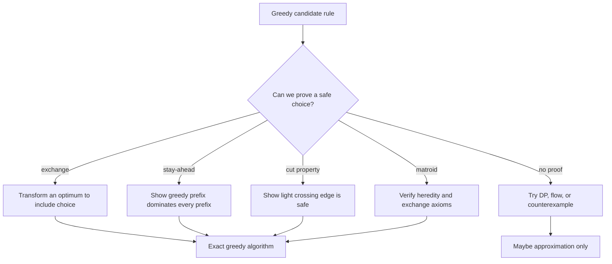

# Greedy Algorithms

Greedy algorithms build a solution one locally best choice at a time. They are attractive because the code is often short and fast, but the proof burden is high: a greedy choice that feels natural can be catastrophically wrong. The central question is not "what choice looks best now?" but "why can some optimal solution be transformed to include this choice?" [1], [3].

This page covers the main proof styles: exchange arguments, stay-ahead arguments, cut properties, and the matroid theorem. It also gives counterexamples, because knowing when greedy fails is part of using it responsibly. CLRS emphasizes canonical examples such as activity selection, Huffman coding, MST, and Dijkstra; Kleinberg and Tardos add interval partitioning and scheduling; Vazirani connects greedy algorithms to approximation, especially set cover [1], [3], [6].


*Figure: Huffman coding repeatedly combines the two least frequent symbols. Image: [Wikimedia Commons](https://commons.wikimedia.org/wiki/File:Huffman_tree_2.svg), public domain or CC-BY-SA via Wikimedia Commons.*

## Definitions

A **greedy algorithm** constructs a solution through irrevocable choices, each selected by a local rule. A proof must show that the local rule is globally safe.

An **exchange argument** starts with an optimal solution and modifies it to include the greedy choice without making it worse. Repeating the exchange shows that a fully greedy solution is optimal. A **stay-ahead argument** proves that after each step, the greedy partial solution is at least as good as any competitor according to a carefully chosen measure. A **cut property** identifies a partition of a graph and shows that a light edge crossing the cut is safe for a minimum spanning tree.

A **matroid** is a pair $(E,\mathcal{I})$ where $E$ is a finite ground set and $\mathcal{I}$ is a family of independent subsets satisfying heredity and exchange. Heredity says every subset of an independent set is independent. Exchange says if $A,B\in\mathcal{I}$ and $\vert A\vert \lt \vert B\vert $, then some element of $B\setminus A$ can be added to $A$ while preserving independence. Edmonds's theorem says that the simple greedy algorithm finds a maximum-weight independent set in every matroid, and matroids are exactly the structures for which that broad greedy guarantee holds [12].

## Key results

Activity selection is the cleanest interval example. Given intervals with start and finish times, select the largest number of non-overlapping intervals. Sorting by earliest finish time and repeatedly taking the first compatible interval is optimal. The exchange proof replaces the first interval in an optimal solution with the greedy interval; because the greedy interval finishes no later, the remaining intervals still fit [1], [3].

Interval partitioning asks for the minimum number of resources, such as classrooms, needed to schedule all intervals. Sort by start time and assign each interval to a currently free resource if possible; otherwise open a new resource. A min-heap of finishing times implements this in $O(n\log n)$. The proof is a stay-ahead argument using depth: if the algorithm opens a new room, all existing rooms overlap the new interval, so the instance really needs that many rooms.

Fractional knapsack sorts items by value density $v_i/w_i$ and fills capacity from highest density downward. It is optimal because any solution using lower-density material while higher-density material remains can exchange weight and improve value. This proof fails for 0/1 knapsack: indivisible items create combinatorial interactions that local density cannot capture.

Huffman coding builds an optimal prefix code by repeatedly combining the two least frequent symbols into a new pseudo-symbol [7]. The proof has two parts. First, in some optimal prefix tree, the two least frequent symbols are siblings at maximum depth. Second, replacing those siblings by their parent reduces the problem size while preserving optimal substructure. A priority queue gives $O(n\log n)$ time.

Minimum spanning tree algorithms are greedy but use different views. Kruskal sorts edges by weight and adds an edge if it connects two different components. Union-find makes the cycle test nearly constant amortized time. Prim grows one tree by repeatedly adding the lightest edge crossing from the tree to the outside. Both are justified by the cut property: the lightest edge crossing any cut is safe for some MST [8], [9].

Dijkstra's algorithm is greedy for shortest paths with nonnegative edge weights [10]. It repeatedly finalizes the unsettled vertex with minimum tentative distance. The proof is a stay-ahead argument: any alternative path to that vertex would need to leave the settled set through an edge of nonnegative weight, so it cannot beat the tentative value already chosen. Negative edges break this argument, which is why Bellman-Ford is needed in that setting.

Scheduling jobs to minimize maximum lateness has another elegant greedy rule. If each job has processing time $p_j$ and deadline $d_j$, schedule jobs in increasing deadline order. An exchange argument swaps adjacent inverted jobs and shows the maximum lateness does not increase. Repeated swaps transform any optimal schedule into earliest-deadline-first order.

Set cover demonstrates greedy as approximation rather than exact optimization. Repeatedly choose the set covering the largest number of still-uncovered elements. The result can be a factor $H_n=\ln n+O(1)$ larger than optimum, and this logarithmic behavior is essentially the right scale under standard complexity assumptions [6], [13]. The same local-choice style that gives exact algorithms for matroids gives controlled approximate algorithms for harder covering problems.

Greedy fails for 0/1 knapsack, longest path, and arbitrary coin systems. For coin change with denominations $1,3,4$, greedy makes $6=4+1+1$ using three coins, but the optimum is $3+3$ using two. These failures show why a proof must be part of the algorithm, not an afterthought.

## Visual



| Problem | Greedy rule | Guarantee | Proof style |
| --- | --- | --- | --- |
| Activity selection | earliest finishing compatible interval | optimal | exchange |
| Interval partitioning | earliest available room by finish time | optimal | depth lower bound |
| Fractional knapsack | highest value density first | optimal | exchange |
| Huffman coding | merge two least frequent symbols | optimal | structural exchange plus induction |
| Kruskal MST | lightest non-cycle edge | optimal | cut property |
| Prim MST | lightest edge leaving tree | optimal | cut property |
| Dijkstra | minimum tentative distance vertex | optimal for nonnegative edges | stay-ahead |
| Set cover | set covering most uncovered elements | $H_n$-approximation | charging |

## Worked example 1: interval scheduling on six activities

**Problem.** Select the maximum number of non-overlapping intervals:

| activity | start | finish |
| --- | --- | --- |
| A | 1 | 4 |
| B | 3 | 5 |
| C | 0 | 6 |
| D | 5 | 7 |
| E | 3 | 9 |
| F | 8 | 10 |

**Method.** Sort by finish time: A(1,4), B(3,5), C(0,6), D(5,7), E(3,9), F(8,10).

1. Choose A because it finishes first at time 4.
2. B starts at 3, so it conflicts with A. Skip.
3. C starts at 0, so it conflicts with A. Skip.
4. D starts at 5, which is after A finishes. Choose D.
5. E starts at 3, so it conflicts with A and D. Skip.
6. F starts at 8, which is after D finishes. Choose F.

**Checked answer.** The greedy set is $\{A,D,F\}$ with size 3. No solution can have 4 intervals because every interval before D conflicts with A or D, and the time line only supports at most one of A/B/C/E before D plus D plus F. The exchange proof gives the general optimality guarantee.

## Worked example 2: Huffman code construction

**Problem.** Frequencies are

| symbol | frequency |
| --- | --- |
| A | 5 |
| B | 9 |
| C | 12 |
| D | 13 |
| E | 16 |
| F | 45 |

Construct a Huffman tree.

**Method.**

1. Merge A(5) and B(9) into node AB(14).
2. Merge C(12) and D(13) into CD(25).
3. Merge AB(14) and E(16) into ABE(30).
4. Merge CD(25) and ABE(30) into CDEAB(55).
5. Merge F(45) and CDEAB(55) into root(100).

Assign 0 to left edges and 1 to right edges using the merge order above. One valid code is:

| symbol | code | length | contribution |
| --- | --- | --- | --- |
| F | 0 | 1 | 45 |
| C | 100 | 3 | 36 |
| D | 101 | 3 | 39 |
| A | 1100 | 4 | 20 |
| B | 1101 | 4 | 36 |
| E | 111 | 3 | 48 |

**Checked answer.** The weighted path length is $45+36+39+20+36+48=224$. The exact bit strings can flip left and right choices, but the tree shape and weighted length are optimal.

## Code

```python
from heapq import heappop, heappush, heapify

def activity_selection(intervals):
    chosen = []
    current_finish = float("-inf")
    for start, finish, name in sorted(intervals, key=lambda x: x[1]):
        if start >= current_finish:
            chosen.append(name)
            current_finish = finish
    return chosen

def fractional_knapsack(items, capacity):
    total = 0.0
    taken = []
    for value, weight, name in sorted(items, key=lambda x: x[0] / x[1], reverse=True):
        if capacity == 0:
            break
        amount = min(weight, capacity)
        total += amount * value / weight
        taken.append((name, amount))
        capacity -= amount
    return total, taken

def huffman_code(freq):
    heap = [(weight, symbol) for symbol, weight in freq.items()]
    heapify(heap)
    counter = 0
    while len(heap) > 1:
        w1, t1 = heappop(heap)
        w2, t2 = heappop(heap)
        counter += 1
        heappush(heap, (w1 + w2, (counter, t1, t2)))

    def walk(tree, prefix, out):
        if isinstance(tree, str):
            out[tree] = prefix or "0"
            return
        _, left, right = tree
        walk(left, prefix + "0", out)
        walk(right, prefix + "1", out)

    result = {}
    walk(heap[0][1], "", result)
    return result
```

## Common pitfalls

- Assuming a greedy rule is correct because it works on small examples.
- Proving that the first greedy choice is good but not proving the induction step.
- Using value density for 0/1 knapsack.
- Forgetting that Dijkstra requires nonnegative edge weights.
- Implementing Kruskal without a reliable cycle test.
- Confusing interval scheduling, which maximizes compatible jobs, with interval partitioning, which assigns all jobs to minimum rooms.
- Sorting activities by start time or duration for interval scheduling; both rules fail.
- Building Huffman codes by sorting once instead of repeatedly extracting two minimum frequencies.
- Treating set-cover greedy as exact.
- Applying coin-change greedy to a noncanonical coin system.
- Ignoring tie-breaking when deterministic output matters, even if optimality does not.
- Missing the lower bound used in a stay-ahead proof.
- Claiming matroid greedy applies before verifying the exchange axiom.

## Connections

- [Dynamic Programming](/cs/algorithms/dynamic-programming) for problems where local choices fail and state tables are needed.
- [Graph Algorithms](/cs/algorithms/graph-algorithms) for MST and Dijkstra.
- [Approximation Algorithms](/cs/algorithms/approximation-algorithms) for greedy set cover, vertex cover variants, and scheduling approximations.
- [Network Flow and Matching](/cs/algorithms/network-flow-and-matching) for problems where augmenting paths replace local greedy choices.
- [Data Structures](/cs/data-structures/intro) for heaps, union-find, and priority queues.
- [Discrete Math](/math/discrete/intro) for matroids, exchange arguments, and graph cuts.

## References

[1] T. H. Cormen, C. E. Leiserson, R. L. Rivest, and C. Stein, *Introduction to Algorithms*, 4th ed. MIT Press, 2022.

[2] R. Sedgewick and K. Wayne, *Algorithms*, 4th ed. Addison-Wesley, 2011.

[3] J. Kleinberg and E. Tardos, *Algorithm Design*. Pearson, 2005.

[4] S. S. Skiena, *The Algorithm Design Manual*, 3rd ed. Springer, 2020.

[5] K. Mehlhorn and P. Sanders, *Algorithms and Data Structures: The Basic Toolbox*. Springer, 2008.

[6] V. V. Vazirani, *Approximation Algorithms*. Springer, 2003.

[7] D. A. Huffman, "A method for the construction of minimum-redundancy codes," *Proceedings of the IRE*, vol. 40, no. 9, pp. 1098-1101, 1952. https://doi.org/10.1109/JRPROC.1952.273898

[8] J. B. Kruskal, "On the shortest spanning subtree of a graph and the traveling salesman problem," *Proceedings of the American Mathematical Society*, vol. 7, no. 1, pp. 48-50, 1956.

[9] R. C. Prim, "Shortest connection networks and some generalizations," *Bell System Technical Journal*, vol. 36, no. 6, pp. 1389-1401, 1957.

[10] E. W. Dijkstra, "A note on two problems in connexion with graphs," *Numerische Mathematik*, vol. 1, pp. 269-271, 1959. https://doi.org/10.1007/BF01386390

[11] J. Edmonds, "Matroids and the greedy algorithm," *Mathematical Programming*, vol. 1, pp. 127-136, 1971.

[12] J. Edmonds, "Submodular functions, matroids, and certain polyhedra," *Combinatorial Structures and Their Applications*, pp. 69-87, 1970.

[13] L. Lovasz, "On the ratio of optimal integral and fractional covers," *Discrete Mathematics*, vol. 13, no. 4, pp. 383-390, 1975.
