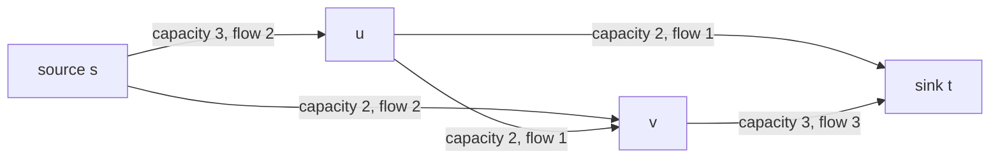
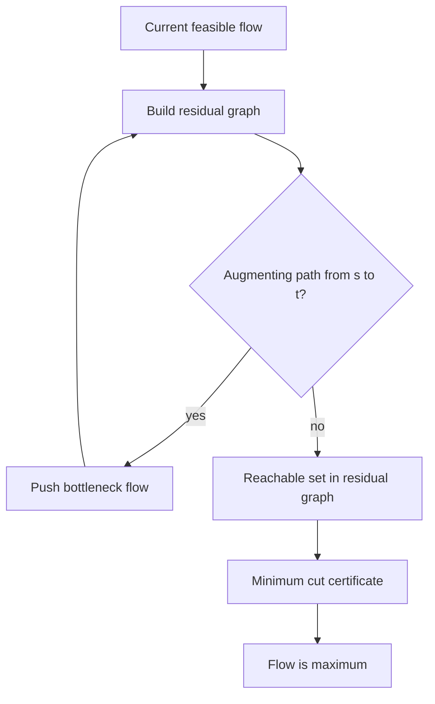

# Network Flow and Matching

Network flow studies how much material can be shipped from a source to a sink through capacitated edges. Matching studies how to pair objects subject to compatibility constraints. These topics belong together because many matching and assignment problems can be expressed as flow problems, while augmenting-path reasoning is the shared proof engine [1], [3].

Flow algorithms are also a bridge from graph theory to optimization. The max-flow/min-cut theorem gives a strong duality statement: the best feasible flow value equals the capacity of the smallest cut separating source from sink. That equality explains why augmenting-path algorithms can certify optimality, not merely improve a solution. Stable matching is different in objective but similar in spirit: a simple proposal process terminates with a matching that has no blocking pair [13].

## Definitions

A **flow network** is a directed graph $G=(V,E)$ with nonnegative capacities $c(u,v)$, a source $s$, and a sink $t$. A flow $f$ satisfies capacity constraints $0\le f(u,v)\le c(u,v)$ and flow conservation at every vertex except $s$ and $t$:

$$\sum_u f(u,v)=\sum_w f(v,w).$$

The **value** $\vert f\vert $ is the net amount leaving $s$. An **$s$-$t$ cut** is a partition $(S,T)$ with $s\in S$ and $t\in T$. Its capacity is

$$c(S,T)=\sum_{u\in S,v\in T}c(u,v).$$

The **residual graph** records possible changes to the current flow. If $f(u,v)\lt c(u,v)$, a forward residual edge has capacity $c(u,v)-f(u,v)$. If $f(u,v)\gt 0$, a backward residual edge $(v,u)$ has capacity $f(u,v)$, representing cancellation of existing flow.

A **matching** is a set of edges no two of which share an endpoint. In bipartite matching, vertices are split into left and right sets and every edge goes between the sides. A **stable matching** has two equally sized sets with preference lists; it has no blocking pair $(m,w)$ such that both prefer each other to their assigned partners.

## Key results

Ford-Fulkerson is a framework, not one fixed algorithm [7]. Start with zero flow. While the residual graph has an augmenting path from $s$ to $t$, push as much flow as possible along that path. The path bottleneck is the minimum residual capacity on the path. When no augmenting path remains, let $S$ be the vertices reachable from $s$ in the residual graph. No residual edge crosses from $S$ to $T$, so every original edge crossing the cut is saturated and every reverse crossing edge has zero flow. Thus the current flow value equals the cut capacity, proving optimality.

The max-flow/min-cut theorem states

$$\max_f |f|=\min_{(S,T)} c(S,T).$$

It is one of the cleanest algorithmic duality results: feasible flows are lower bounded by cuts, and the residual reachability cut at termination matches the flow.

Edmonds-Karp chooses augmenting paths by BFS, so each path has the fewest number of edges in the residual graph [8]. Its time is $O(VE^2)$. The proof shows that shortest residual distances from $s$ never decrease and that each edge can become critical only $O(V)$ times.

Dinic's algorithm builds a BFS level graph and sends a blocking flow through it before rebuilding levels [9]. A blocking flow saturates enough edges that every $s$-$t$ path in the current level graph is blocked. The general bound is $O(V^2E)$, with better bounds for unit networks. Push-relabel methods take a different local view: maintain a preflow that may temporarily exceed conservation at vertices, assign heights, and push excess downhill or relabel vertices when no admissible edge exists. Goldberg and Tarjan's push-relabel framework is very fast in practice [12].

Min-cost max-flow adds a cost $a(u,v)$ to each edge and seeks a maximum flow of minimum total cost. The successive shortest path method repeatedly augments along a least-cost residual path, often using Bellman-Ford initially or potentials plus Dijkstra when reduced costs are nonnegative. Negative cycles in the residual graph signal that the cost can be improved without changing flow value.

Bipartite matching can be solved by max flow: connect $s$ to every left vertex with capacity 1, connect compatibility edges left to right with capacity 1, and connect every right vertex to $t$ with capacity 1. Integral capacities imply an integral max flow, hence a matching. Hopcroft-Karp improves over one-augmenting-path-at-a-time by finding a maximal set of shortest vertex-disjoint augmenting paths per phase, running in $O(E\sqrt V)$ [10]. Konig's theorem connects maximum bipartite matching with minimum vertex cover size.

Stable matching is not maximum-weight matching. Gale-Shapley has one side propose down preference lists; recipients keep their favorite proposal so far and reject the rest [13]. The algorithm terminates because each proposer advances monotonically through a finite list. It is stable because a blocking pair would imply the proposer eventually proposed to that recipient, and the recipient rejected or later traded up. The result is proposer-optimal among all stable matchings.

Applications include assignment, project selection, image segmentation by graph cuts, disjoint paths, circulation with demands, baseball elimination, and scheduling. In each case, the modeling step is at least as important as the algorithm: identify conservation, capacities, source/sink structure, and what a cut or matching certificate means in the original problem.

## Visual





| Problem | Core method | Typical bound | Certificate |
| --- | --- | --- | --- |
| Max flow | augmenting paths | depends on path rule | min cut |
| Edmonds-Karp | BFS augmenting paths | $O(VE^2)$ | residual no-path cut |
| Dinic | level graph plus blocking flow | $O(V^2E)$ | residual no-path cut |
| Push-relabel | local excess pushes | polynomial, fast in practice | no active excess to sink |
| Min-cost max-flow | shortest residual paths | implementation dependent | optimal potentials/no negative cycle |
| Bipartite matching | augmenting paths or flow | $O(E\sqrt V)$ for Hopcroft-Karp | min vertex cover |
| Stable matching | deferred acceptance | $O(n^2)$ | no blocking pair |

## Worked example 1: max flow on a four-node graph

**Problem.** Network edges are

$$s\to a:3,\quad s\to b:2,\quad a\to b:1,\quad a\to t:2,\quad b\to t:3.$$

Find a maximum flow.

**Method.**

1. Start with zero flow.
2. Augment along $s\to a\to t$. Bottleneck is $\min(3,2)=2$. Send 2 units. Now $s\to a$ has residual 1, and $a\to t$ is saturated.
3. Augment along $s\to b\to t$. Bottleneck is $\min(2,3)=2$. Send 2 units. Now $s\to b$ is saturated, and $b\to t$ has residual 1.
4. Residual path $s\to a\to b\to t$ exists with bottleneck $\min(1,1,1)=1$. Send 1 unit.
5. Total flow is now 5. Edges out of $s$ carry $3+2=5$, both saturated.
6. The cut $S=\{s\}$, $T=\{a,b,t\}$ has capacity $3+2=5$.

**Checked answer.** Flow value 5 equals cut capacity 5, so by max-flow/min-cut it is maximum. The final edge flows are $s\to a=3$, $s\to b=2$, $a\to t=2$, $a\to b=1$, $b\to t=3$.

## Worked example 2: Gale-Shapley on 3 men x 3 women

**Problem.** Preferences are:

| proposer | preference list |
| --- | --- |
| A | X, Y, Z |
| B | Y, X, Z |
| C | Y, Z, X |

| receiver | preference list |
| --- | --- |
| X | B, A, C |
| Y | A, B, C |
| Z | A, C, B |

Run men-proposing Gale-Shapley.

**Method.**

1. Round 1 proposals: A proposes X, B proposes Y, C proposes Y.
2. X holds A. Y compares B and C; Y prefers B, so holds B and rejects C.
3. C is free and proposes next to Z.
4. Z holds C.
5. All proposers are matched: A-X, B-Y, C-Z.

Check stability. Potential blocking pairs:

1. A prefers X most, so A will not block with Y or Z.
2. B prefers Y most, so B will not block with X or Z.
3. C prefers Y over Z, but Y prefers B over C, so $(C,Y)$ is not blocking. C prefers Z over X, so C does not seek X.

**Checked answer.** The matching $(A,X),(B,Y),(C,Z)$ is stable. It is proposer-optimal among stable matchings because the men proposed.

## Code

```python
from collections import deque

def edmonds_karp(capacity, source, sink):
    residual = {u: dict(vs) for u, vs in capacity.items()}
    for u in list(capacity):
        for v in capacity[u]:
            residual.setdefault(v, {})
            residual[v].setdefault(u, 0)

    max_flow = 0
    while True:
        parent = {source: None}
        q = deque([source])
        while q and sink not in parent:
            u = q.popleft()
            for v, cap in residual[u].items():
                if cap > 0 and v not in parent:
                    parent[v] = u
                    q.append(v)
        if sink not in parent:
            return max_flow

        bottleneck = float("inf")
        v = sink
        while v != source:
            u = parent[v]
            bottleneck = min(bottleneck, residual[u][v])
            v = u
        v = sink
        while v != source:
            u = parent[v]
            residual[u][v] -= bottleneck
            residual[v][u] += bottleneck
            v = u
        max_flow += bottleneck

def hopcroft_karp(graph):
    pair_u = {u: None for u in graph}
    right = {v for nbrs in graph.values() for v in nbrs}
    pair_v = {v: None for v in right}
    dist = {}

    def bfs():
        q = deque()
        found = False
        for u in graph:
            if pair_u[u] is None:
                dist[u] = 0
                q.append(u)
            else:
                dist[u] = float("inf")
        while q:
            u = q.popleft()
            for v in graph[u]:
                mate = pair_v[v]
                if mate is None:
                    found = True
                elif dist[mate] == float("inf"):
                    dist[mate] = dist[u] + 1
                    q.append(mate)
        return found

    def dfs(u):
        for v in graph[u]:
            mate = pair_v[v]
            if mate is None or (dist[mate] == dist[u] + 1 and dfs(mate)):
                pair_u[u] = v
                pair_v[v] = u
                return True
        dist[u] = float("inf")
        return False

    matching = 0
    while bfs():
        for u in graph:
            if pair_u[u] is None and dfs(u):
                matching += 1
    return matching, pair_u

def gale_shapley(men_prefs, women_prefs):
    rank = {w: {m: i for i, m in enumerate(prefs)} for w, prefs in women_prefs.items()}
    free = deque(men_prefs)
    next_choice = {m: 0 for m in men_prefs}
    engaged = {}

    while free:
        m = free.popleft()
        w = men_prefs[m][next_choice[m]]
        next_choice[m] += 1
        if w not in engaged:
            engaged[w] = m
        else:
            current = engaged[w]
            if rank[w][m] < rank[w][current]:
                engaged[w] = m
                free.append(current)
            else:
                free.append(m)
    return {m: w for w, m in engaged.items()}
```

## Common pitfalls

- Forgetting backward residual edges, which are essential for canceling earlier choices.
- Treating Ford-Fulkerson as polynomial without specifying integral capacities or a path rule.
- Computing a cut in the original graph rather than from residual reachability after termination.
- Using DFS augmenting paths and expecting Edmonds-Karp's $O(VE^2)$ bound.
- Forgetting that max-flow integrality depends on integral capacities.
- Modeling bipartite matching with capacities larger than 1 and accidentally allowing many matches per vertex.
- Confusing stable matching with maximum-cardinality or maximum-weight matching.
- Claiming Gale-Shapley is fair to both sides; proposer-optimal means receiver-pessimal among stable matchings.
- Using min-cost max-flow with negative residual costs without potentials or Bellman-Ford handling.
- Missing lower and upper bounds in circulation-with-demands reductions.
- Treating image graph cuts as ordinary shortest paths; the cut objective is different.
- Forgetting that a min cut certificate proves max flow value, not necessarily uniqueness of the flow.

## Connections

- [Graph Algorithms](/cs/algorithms/graph-algorithms) for BFS, residual reachability, and shortest paths.
- [Greedy Algorithms](/cs/algorithms/greedy-algorithms) for local improvement ideas and why augmenting paths need stronger certificates.
- [Approximation Algorithms](/cs/algorithms/approximation-algorithms) for vertex cover, matching relaxations, and LP rounding.
- [Dynamic Programming](/cs/algorithms/dynamic-programming) for shortest-path subroutines in min-cost flow.
- [Data Structures](/cs/data-structures/intro) for queues, heaps, and disjoint sets used around flow models.
- [Discrete Math](/math/discrete/intro) for cuts, matchings, and Hall-type theorems.

## References

[1] T. H. Cormen, C. E. Leiserson, R. L. Rivest, and C. Stein, *Introduction to Algorithms*, 4th ed. MIT Press, 2022.

[2] R. Sedgewick and K. Wayne, *Algorithms*, 4th ed. Addison-Wesley, 2011.

[3] J. Kleinberg and E. Tardos, *Algorithm Design*. Pearson, 2005.

[4] S. S. Skiena, *The Algorithm Design Manual*, 3rd ed. Springer, 2020.

[5] K. Mehlhorn and P. Sanders, *Algorithms and Data Structures: The Basic Toolbox*. Springer, 2008.

[6] A. Schrijver, *Combinatorial Optimization: Polyhedra and Efficiency*. Springer, 2003.

[7] L. R. Ford and D. R. Fulkerson, "Maximal flow through a network," *Canadian Journal of Mathematics*, vol. 8, pp. 399-404, 1956. https://doi.org/10.4153/CJM-1956-045-5

[8] J. Edmonds and R. M. Karp, "Theoretical improvements in algorithmic efficiency for network flow problems," *Journal of the ACM*, vol. 19, no. 2, pp. 248-264, 1972. https://doi.org/10.1145/321694.321699

[9] E. A. Dinic, "Algorithm for solution of a problem of maximum flow in networks with power estimation," *Soviet Mathematics Doklady*, vol. 11, pp. 1277-1280, 1970.

[10] J. E. Hopcroft and R. M. Karp, "An $n^{5/2}$ algorithm for maximum matchings in bipartite graphs," *SIAM Journal on Computing*, vol. 2, no. 4, pp. 225-231, 1973.

[11] D. Konig, *Theorie der endlichen und unendlichen Graphen*. Akademische Verlagsgesellschaft, 1936.

[12] A. V. Goldberg and R. E. Tarjan, "A new approach to the maximum-flow problem," *Journal of the ACM*, vol. 35, no. 4, pp. 921-940, 1988.

[13] D. Gale and L. S. Shapley, "College admissions and the stability of marriage," *The American Mathematical Monthly*, vol. 69, no. 1, pp. 9-15, 1962. https://doi.org/10.2307/2312726

[14] R. E. Tarjan, *Data Structures and Network Algorithms*. SIAM, 1983.
