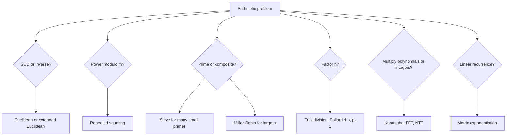

# Number-Theoretic and Algebraic Algorithms

Number-theoretic algorithms manipulate divisibility, congruences, primes, and modular arithmetic. Algebraic algorithms manipulate polynomials, matrices, and structured products. Together they support cryptography, coding theory, computer algebra, randomized verification, signal processing, and high-performance arithmetic [1], [3].

The common theme is exploiting structure. The Euclidean algorithm replaces division by repeated remainders. Fast exponentiation replaces $n$ multiplications by $O(\log n)$ squarings. Sieve methods mark composites collectively. Miller-Rabin tests compositeness through modular square roots of 1. FFT-based multiplication evaluates polynomials at roots of unity, multiplies pointwise, and interpolates [7], [8], [13].


*Figure: The sieve of Eratosthenes marks multiples of each prime to enumerate primes efficiently. Image: [Wikimedia Commons](https://commons.wikimedia.org/wiki/File:Sieve_of_Eratosthenes_animation.gif), public domain or CC-BY-SA via Wikimedia Commons.*

## Definitions

For integers $a$ and $b$, $\gcd(a,b)$ is the largest positive integer dividing both. Bezout's identity says there exist integers $x,y$ such that

$$ax+by=\gcd(a,b).$$

The extended Euclidean algorithm computes $x$ and $y$ as well as the gcd. If $\gcd(a,m)=1$, then $x$ is a modular inverse of $a$ modulo $m$ because $ax\equiv1\pmod m$.

In arithmetic algorithms, it is important to distinguish arithmetic-operation counts from bit complexity. A statement such as $O(\log n)$ modular multiplications is not the same as $O(\log n)$ bit operations, because the numbers being multiplied have $\Theta(\log m)$ bits. Textbook pseudocode often counts word operations, while cryptographic implementations must account for multi-precision arithmetic, cache behavior, side-channel resistance, and constant-time modular reduction.

Modular exponentiation asks for $a^e\bmod m$. Repeated squaring uses the binary representation of $e$. The Chinese Remainder Theorem states that if moduli $m_1,\ldots,m_k$ are pairwise coprime, then the system $x\equiv a_i\pmod{m_i}$ has a unique solution modulo $M=\prod_i m_i$.

A primality test decides whether $n$ is prime. A factorization algorithm finds nontrivial factors of composite $n$. A discrete logarithm problem asks for $x$ such that $g^x\equiv h\pmod p$. A polynomial multiplication algorithm computes coefficients of $C(x)=A(x)B(x)$. A linear recurrence can be encoded in a matrix so that fast matrix exponentiation jumps to the $n$-th term.

## Key results

The Euclidean algorithm follows from $\gcd(a,b)=\gcd(b,a\bmod b)$ and runs in $O(\log \min(a,b))$ arithmetic steps. The extended version back-substitutes remainders to compute Bezout coefficients. This is the workhorse behind modular inverses, CRT, rational reconstruction, and many cryptographic protocols.

Fast modular exponentiation processes exponent bits from least significant to most significant or vice versa. Maintain a result and a current base; when the current exponent bit is 1, multiply the result by the base modulo $m$; square the base each step. The time is $O(\log e)$ modular multiplications.

The sieve of Eratosthenes marks multiples of each prime $p\le\sqrt n$ and runs in $O(n\log\log n)$ time. A segmented sieve processes intervals that fit in memory, useful when $n$ is huge. A linear sieve maintains a list of primes and marks each composite once by its smallest prime factor, giving $O(n)$ time with a larger constant and more delicate implementation.

Fermat's test uses $a^{n-1}\equiv1\pmod n$ for prime $n$ and $\gcd(a,n)=1$, but Carmichael numbers fool it for many bases. Miller-Rabin writes

$$n-1=2^s d,\qquad d\text{ odd},$$

then tests whether $a^d\equiv1\pmod n$ or some repeated square equals $-1\pmod n$ [9], [10]. If neither happens, $a$ is a witness that $n$ is composite. For odd composite $n$, at most one quarter of bases are strong liars, so independent random bases reduce error exponentially. AKS gives deterministic polynomial-time primality testing, mainly of theoretical significance [12].

Factorization is harder than primality testing. Trial division is useful for small factors. Pollard's rho uses a pseudorandom sequence and gcd checks to find a repeated value modulo an unknown factor [11]. Pollard's $p-1$ works when $p-1$ is smooth for a prime factor $p$. The quadratic sieve and number field sieve are advanced subexponential methods for large integers.

Discrete logarithm has baby-step giant-step in $O(\sqrt p)$ time and memory for prime-order groups: store $g^0,\ldots,g^{m-1}$, then search $h(g^{-m})^j$. Pollard's rho for logs lowers memory with randomized walks. These algorithms are central to cryptographic parameter selection.

The FFT computes

$$X_k=\sum_{n=0}^{N-1}x_ne^{-2\pi i kn/N}$$

in $O(N\log N)$ time by splitting even and odd indices [8]. Polynomial multiplication pads coefficient arrays, evaluates both polynomials by FFT, multiplies values pointwise, and applies inverse FFT. The number-theoretic transform, or NTT, replaces complex roots by modular roots of unity, avoiding floating-point error when a suitable prime modulus is available.

Karatsuba and Toom-Cook reduce the number of recursive integer multiplications by evaluating at selected points and interpolating [7]. Schonhage-Strassen uses FFT ideas for very large integer multiplication [13]. Matrix exponentiation computes linear recurrences such as Fibonacci by raising a companion matrix in $O(k^3\log n)$ time for order $k$ recurrences, or faster with specialized matrix structure.

CRT is also a performance tool. Large modular computations can be split across several machine-word primes, computed independently, and reconstructed at the end. This is common in exact polynomial multiplication and computer algebra. The same idea appears in NTT implementations that combine several NTT-friendly primes when one modulus cannot hold the full coefficient range.

## Visual



| Task | Standard algorithm | Time sketch | Important caveat |
| --- | --- | --- | --- |
| GCD | Euclidean algorithm | $O(\log n)$ divisions | arithmetic bit-cost may matter |
| Modular inverse | extended Euclid | $O(\log m)$ divisions | inverse exists only if gcd is 1 |
| Modular power | repeated squaring | $O(\log e)$ multiplications | reduce after every multiply |
| Prime table | sieve | $O(n\log\log n)$ | memory can dominate |
| Primality | Miller-Rabin | $O(k\log^3 n)$ bit-style sketch | randomized unless fixed-base theorem applies |
| Factorization | Pollard rho | heuristic | can fail and need retries |
| Discrete log | baby-step giant-step | $O(\sqrt p)$ | high memory |
| Polynomial product | FFT or NTT | $O(n\log n)$ | precision or modulus constraints |

## Worked example 1: extended Euclidean algorithm for gcd(252,198)

**Problem.** Compute $\gcd(252,198)$ and Bezout coefficients $x,y$ such that $252x+198y=\gcd(252,198)$.

**Method.** First run Euclid:

$$252=1\cdot198+54,$$

$$198=3\cdot54+36,$$

$$54=1\cdot36+18,$$

$$36=2\cdot18+0.$$

So the gcd is $18$. Back-substitute:

$$18=54-1\cdot36.$$

Since $36=198-3\cdot54$,

$$18=54-(198-3\cdot54)=4\cdot54-198.$$

Since $54=252-198$,

$$18=4(252-198)-198=4\cdot252-5\cdot198.$$

**Checked answer.** $\gcd(252,198)=18$, with Bezout coefficients $x=4$, $y=-5$. Check: $252\cdot4+198\cdot(-5)=1008-990=18$.

## Worked example 2: Miller-Rabin witness for n = 561

**Problem.** Show that base $a=2$ is a Miller-Rabin witness for $n=561$, a Carmichael number.

**Method.**

1. Compute

$$n-1=560=2^4\cdot35,$$

so $s=4$ and $d=35$.

2. Compute $x=2^{35}\bmod561$. Repeated squaring gives $x=263$.
3. Since $263\ne1$ and $263\ne560$, continue squaring:

$$263^2\bmod561=166,$$

$$166^2\bmod561=67,$$

$$67^2\bmod561=1.$$

4. The sequence reached $1$ without first reaching $-1\bmod561$, which is $560$.

**Checked answer.** Miller-Rabin declares $561$ composite for base $2$. This is stronger than Fermat's test: $561$ is a Carmichael number, so it can satisfy $a^{560}\equiv1\pmod{561}$ for many coprime bases, but the strong witness sequence exposes compositeness.

## Code

```python
def gcd_ext(a, b):
    old_r, r = abs(a), abs(b)
    old_s, s = 1, 0
    old_t, t = 0, 1
    while r:
        q = old_r // r
        old_r, r = r, old_r - q * r
        old_s, s = s, old_s - q * s
        old_t, t = t, old_t - q * t
    if a < 0:
        old_s = -old_s
    if b < 0:
        old_t = -old_t
    return old_r, old_s, old_t

def mod_pow(base, exp, mod):
    result = 1 % mod
    base %= mod
    while exp:
        if exp & 1:
            result = (result * base) % mod
        base = (base * base) % mod
        exp >>= 1
    return result

def sieve_eratosthenes(n):
    is_prime = [True] * (n + 1)
    if n >= 0:
        is_prime[0] = False
    if n >= 1:
        is_prime[1] = False
    p = 2
    while p * p <= n:
        if is_prime[p]:
            for multiple in range(p * p, n + 1, p):
                is_prime[multiple] = False
        p += 1
    return [i for i, ok in enumerate(is_prime) if ok]

def miller_rabin(n, bases=(2, 3, 5, 7, 11, 13, 17)):
    if n < 2:
        return False
    small = [2, 3, 5, 7, 11, 13, 17]
    for p in small:
        if n == p:
            return True
        if n % p == 0:
            return False

    d = n - 1
    s = 0
    while d % 2 == 0:
        s += 1
        d //= 2

    for a in bases:
        if a % n == 0:
            continue
        x = mod_pow(a, d, n)
        if x == 1 or x == n - 1:
            continue
        for _ in range(s - 1):
            x = (x * x) % n
            if x == n - 1:
                break
        else:
            return False
    return True
```

## Common pitfalls

- Forgetting that a modular inverse exists only when $\gcd(a,m)=1$.
- Letting intermediate powers grow instead of reducing modulo $m$ after each multiplication.
- Starting the sieve's marking at $2p$ instead of $p^2$, wasting work.
- Treating Fermat primality testing as reliable on Carmichael numbers.
- Using Miller-Rabin without handling small even numbers and small prime divisors.
- Forgetting that randomized Miller-Rabin has an error probability unless deterministic base conditions apply.
- Assuming primality testing and factorization have comparable difficulty.
- Applying CRT to non-coprime moduli without checking consistency.
- Using floating-point FFT for exact integer multiplication without rounding-error safeguards.
- Choosing an NTT modulus without a suitable primitive root and transform length.
- Computing matrix powers with naive repeated multiplication instead of exponentiation by squaring.
- Ignoring bit complexity when numbers grow far beyond machine-word size.

## Connections

- [Cryptography](/cs/cryptography/intro) for modular inverses, primality, discrete logs, and RSA-style arithmetic.
- [Divide and Conquer](/cs/algorithms/divide-and-conquer) for Karatsuba, FFT, and recurrence analysis.
- [Randomized Algorithms](/cs/algorithms/randomized-algorithms) for Miller-Rabin, Pollard rho, and fingerprinting.
- [String Algorithms](/cs/algorithms/string-algorithms) for rolling hashes and FFT-based matching.
- [Dynamic Programming](/cs/algorithms/dynamic-programming) for linear recurrences and matrix exponentiation alternatives.
- [Discrete Math](/math/discrete/intro) for modular arithmetic, groups, and number theory.

## References

[1] T. H. Cormen, C. E. Leiserson, R. L. Rivest, and C. Stein, *Introduction to Algorithms*, 4th ed. MIT Press, 2022.

[2] R. Sedgewick and K. Wayne, *Algorithms*, 4th ed. Addison-Wesley, 2011.

[3] V. Shoup, *A Computational Introduction to Number Theory and Algebra*, 2nd ed. Cambridge University Press, 2009.

[4] D. E. Knuth, *The Art of Computer Programming, Vol. 2: Seminumerical Algorithms*, 3rd ed. Addison-Wesley, 1997.

[5] K. Mehlhorn and P. Sanders, *Algorithms and Data Structures: The Basic Toolbox*. Springer, 2008.

[6] A. Menezes, P. van Oorschot, and S. Vanstone, *Handbook of Applied Cryptography*. CRC Press, 1996.

[7] A. Karatsuba and Y. Ofman, "Multiplication of many-digital numbers by automatic computers," *Proceedings of the USSR Academy of Sciences*, vol. 145, pp. 293-294, 1962.

[8] J. W. Cooley and J. W. Tukey, "An algorithm for the machine calculation of complex Fourier series," *Mathematics of Computation*, vol. 19, no. 90, pp. 297-301, 1965.

[9] G. L. Miller, "Riemann's hypothesis and tests for primality," *Journal of Computer and System Sciences*, vol. 13, no. 3, pp. 300-317, 1976.

[10] M. O. Rabin, "Probabilistic algorithm for testing primality," *Journal of Number Theory*, vol. 12, no. 1, pp. 128-138, 1980.

[11] J. M. Pollard, "A Monte Carlo method for factorization," *BIT Numerical Mathematics*, vol. 15, pp. 331-334, 1975.

[12] M. Agrawal, N. Kayal, and N. Saxena, "PRIMES is in P," *Annals of Mathematics*, vol. 160, no. 2, pp. 781-793, 2004. arXiv:math/0205028.

[13] A. Schonhage and V. Strassen, "Schnelle Multiplikation grosser Zahlen," *Computing*, vol. 7, pp. 281-292, 1971.

[14] D. Shanks, "Class number, a theory of factorization, and genera," *Proceedings of Symposia in Pure Mathematics*, vol. 20, pp. 415-440, 1971.
