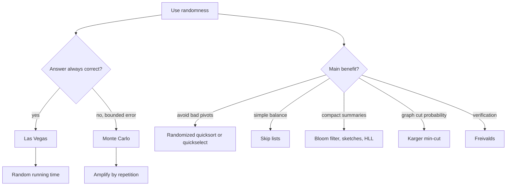

# Randomized Algorithms

Randomized algorithms use random choices as part of the computation. Randomness can simplify design, improve expected performance, avoid adversarial inputs, reduce memory, or allow approximate answers in streaming settings. The right question is not merely "can it fail?" but "what is random: the running time, the answer, or both, and with what probability?" [1], [5].

This page covers Las Vegas versus Monte Carlo algorithms, randomized quicksort and quickselect, skip lists, randomized hashing, Bloom filters, count-min sketches, Karger's min-cut algorithm, Johnson-Lindenstrauss projections, reservoir sampling, Misra-Gries heavy hitters, HyperLogLog, and Freivalds' matrix-product check. Motwani and Raghavan emphasize probability tools and classification; CLRS and Sedgewick connect the ideas to sorting, selection, hashing, and graph algorithms [1], [2], [5].


*Figure: A skip list uses random levels to create express lanes over an ordered linked list. Image: [Wikimedia Commons](https://commons.wikimedia.org/wiki/File:Skip_list.svg), public domain or CC-BY-SA via Wikimedia Commons.*

## Definitions

A **Las Vegas** algorithm always returns a correct answer, but its running time is random. Randomized quicksort is Las Vegas when implemented correctly: it always sorts, while the pivot choices determine the recursion shape. A **Monte Carlo** algorithm has a bounded probability of returning an incorrect answer, but usually has a deterministic or bounded running time. Miller-Rabin primality testing is Monte Carlo when bases are chosen randomly and no deterministic base theorem is invoked.

The **expected running time** is the average over the algorithm's own random choices, often independent of any input distribution. A bound that holds **with high probability** usually means probability at least $1-1/n^c$ for a chosen constant $c$. Error probabilities can often be amplified by independent repetition: if one run fails with probability $p\lt 1$, then $r$ independent runs fail with probability $p^r$.

A family of hash functions $\mathcal{H}$ is **universal** if for distinct keys $x\ne y$,

$$\Pr_{h\in\mathcal{H}}[h(x)=h(y)]\le \frac1m,$$

where $m$ is the number of buckets. A **Bloom filter** is a probabilistic set-membership structure with false positives but no false negatives, assuming no deletions. A **streaming algorithm** processes data in one pass using memory sublinear in the stream length.

## Key results

Randomized quicksort chooses a random pivot, partitions, and recursively sorts both sides. For any pair of elements, they are compared only if one of them is the first pivot chosen among the elements whose ranks lie between them. Summing that probability over all pairs gives expected $O(n\log n)$ comparisons [1]. Randomized quickselect recurses into only one side, yielding expected $O(n)$ time.

Skip lists store each key in level 0 and promote it to higher levels by repeated coin flips [10]. Search starts at the highest level, moves right while possible, then drops down. Expected height is $O(\log n)$ and expected search, insert, and delete time are $O(\log n)$. Skip lists provide balanced-tree performance with randomized structural simplicity.

Hashing benefits from randomization at several levels. Universal hashing prevents an adversary from knowing which keys collide before the hash function is selected. Perfect hashing for static sets can use a two-level scheme: first hash into buckets, then choose a collision-free secondary table for each bucket. Expected total space is linear when the first-level hash has controlled sum of squared bucket sizes. Cuckoo hashing gives constant worst-case lookup by storing each key in one of two or more possible cells and relocating keys on insertion, with occasional rebuilds.

Bloom filters use $m$ bits and $k$ hash functions. Inserting an item sets $k$ positions. Querying checks whether all $k$ positions are set. After $n$ insertions, the approximate false-positive probability is

$$\left(1-e^{-kn/m}\right)^k.$$

Count-min sketches estimate frequencies using several hash tables. They overestimate counts because collisions add mass, and the minimum across rows controls the error. Misra-Gries maintains at most $k-1$ counters and finds all items with frequency more than $n/k$ in a stream. Reservoir sampling keeps a uniform random sample from a stream of unknown length.

Karger's randomized min-cut algorithm repeatedly contracts a uniformly random edge until two supernodes remain [9]. A fixed global min cut survives one contraction step with probability at least $1-2/n$, then at least $1-2/(n-1)$, and so on, yielding success probability at least $2/(n(n-1))$ for one run. Repeating $O(n^2\log n)$ times boosts success probability.

The Johnson-Lindenstrauss lemma states that $n$ points in high-dimensional Euclidean space can be embedded into $O(\epsilon^{-2}\log n)$ dimensions while preserving all pairwise distances within a factor $1\pm\epsilon$ [11]. Random projections make this constructive and useful for dimensionality reduction.

Freivalds' algorithm verifies whether $AB=C$ by choosing a random vector $r$ and checking whether $A(Br)=Cr$ [12]. If $AB\ne C$, the probability of a false acceptance is at most $1/2$ over suitable random binary vectors. This is much faster than multiplying matrices when only verification is needed.

HyperLogLog estimates the number of distinct elements by hashing stream elements and tracking leading-zero patterns across registers. It is probabilistic, mergeable, and widely used in analytics systems. Its lesson is broader: randomized algorithms often trade exactness for compact summaries with quantifiable error.

## Visual



| Algorithm or structure | Type | Guarantee | Main parameter |
| --- | --- | --- | --- |
| Randomized quicksort | Las Vegas | expected $O(n\log n)$ | pivot distribution |
| Randomized quickselect | Las Vegas | expected $O(n)$ | pivot distribution |
| Skip list | Las Vegas structure | expected $O(\log n)$ operations | promotion probability |
| Universal hashing | randomized hashing | expected short chains | hash family |
| Bloom filter | Monte Carlo data structure | no false negatives, tunable false positives | $m,k,n$ |
| Count-min sketch | Monte Carlo estimate | overestimates within probabilistic error | width and depth |
| Karger min-cut | Monte Carlo | success boosted by repetition | number of trials |
| Freivalds | Monte Carlo verifier | false accept at most $1/2$ per run | random vector |

## Worked example 1: reservoir sampling correctness for k = 1

**Problem.** A stream has unknown length $n$. Algorithm: keep the first item; when item $i$ arrives for $i\ge2$, replace the current sample with probability $1/i$. Prove each item is retained with probability $1/n$ after processing $n$ items.

**Method.**

1. Consider item $j$. It is selected when it arrives with probability $1/j$.
2. For each later item $i=j+1,\ldots,n$, item $j$ survives if it is not replaced. The probability of not being replaced at step $i$ is $1-1/i=(i-1)/i$.
3. Multiply selection and survival probabilities:

$$\Pr[\text{item }j\text{ remains}]=\frac1j\prod_{i=j+1}^{n}\frac{i-1}{i}.$$

4. The product telescopes:

$$\prod_{i=j+1}^{n}\frac{i-1}{i}=\frac{j}{j+1}\cdot\frac{j+1}{j+2}\cdots\frac{n-1}{n}=\frac{j}{n}.$$

5. Therefore

$$\Pr[\text{item }j\text{ remains}]=\frac1j\cdot\frac{j}{n}=\frac1n.$$

**Checked answer.** Every item has equal probability $1/n$ of being the final sample, even though the algorithm never knows $n$ in advance.

## Worked example 2: Bloom filter false-positive computation

**Problem.** A Bloom filter has $m=1000$ bits, $k=4$ hash functions, and stores $n=100$ inserted keys. Estimate the false-positive probability.

**Method.**

1. Probability a fixed bit remains 0 after one hash placement is $1-1/1000$.
2. There are $kn=400$ hash placements, so probability a fixed bit is still 0 is approximately

$$\left(1-\frac1{1000}\right)^{400}\approx e^{-0.4}\approx0.6703.$$

3. Probability the bit is 1 is about $1-0.6703=0.3297$.
4. A query for an absent key checks $k=4$ positions. Approximate them as independent:

$$p\approx(0.3297)^4\approx0.0118.$$

**Checked answer.** The false-positive rate is about $1.18\%$. There are no false negatives for inserted keys unless deletion or implementation error is introduced.

## Code

```python
import random

class SkipNode:
    def __init__(self, key, level):
        self.key = key
        self.forward = [None] * level

class SkipListBasic:
    def __init__(self, p=0.5, max_level=16):
        self.p = p
        self.max_level = max_level
        self.level = 1
        self.head = SkipNode(None, max_level)

    def _random_level(self):
        level = 1
        while level < self.max_level and random.random() < self.p:
            level += 1
        return level

    def contains(self, key):
        node = self.head
        for i in reversed(range(self.level)):
            while node.forward[i] and node.forward[i].key < key:
                node = node.forward[i]
        node = node.forward[0]
        return node is not None and node.key == key

    def insert(self, key):
        update = [None] * self.max_level
        node = self.head
        for i in reversed(range(self.level)):
            while node.forward[i] and node.forward[i].key < key:
                node = node.forward[i]
            update[i] = node
        if node.forward[0] and node.forward[0].key == key:
            return
        new_level = self._random_level()
        if new_level > self.level:
            for i in range(self.level, new_level):
                update[i] = self.head
            self.level = new_level
        new_node = SkipNode(key, new_level)
        for i in range(new_level):
            new_node.forward[i] = update[i].forward[i]
            update[i].forward[i] = new_node

def reservoir_sample(stream, k):
    sample = []
    for i, item in enumerate(stream, start=1):
        if i <= k:
            sample.append(item)
        else:
            j = random.randrange(i)
            if j < k:
                sample[j] = item
    return sample

class BloomFilter:
    def __init__(self, bits=1024, hashes=4):
        self.bits = bits
        self.hashes = hashes
        self.table = [0] * bits

    def _positions(self, item):
        for seed in range(self.hashes):
            yield hash((seed, item)) % self.bits

    def add(self, item):
        for pos in self._positions(item):
            self.table[pos] = 1

    def might_contain(self, item):
        return all(self.table[pos] for pos in self._positions(item))
```

## Common pitfalls

- Saying "average case" when the expectation is over algorithmic randomness, not input distribution.
- Calling a Monte Carlo algorithm Las Vegas because it usually works.
- Forgetting to amplify error probabilities through independent trials.
- Using a predictable hash seed where adversaries can force collisions.
- Treating Bloom filter positives as proof of membership.
- Adding deletion to a standard Bloom filter without counters and then creating false negatives.
- Assuming randomized quicksort has worst-case $O(n\log n)$ time.
- Implementing reservoir sampling with probability $1/n$ after the stream length is already known, which misses the online point.
- Reporting count-min sketch estimates as exact counts.
- Running Karger's min-cut only once and expecting high success probability.
- Using Johnson-Lindenstrauss projections without checking the target dimension for the desired $\epsilon$ and failure probability.
- Forgetting that Python's built-in hash may be salted and process-specific.

## Connections

- [Sorting Algorithms](/cs/algorithms/sorting-algorithms) for randomized quicksort.
- [Searching Algorithms](/cs/algorithms/searching-algorithms) for randomized quickselect, hashing, and skip lists.
- [Graph Algorithms](/cs/algorithms/graph-algorithms) for Karger's min-cut and randomized graph procedures.
- [Number-Theoretic and Algebraic Algorithms](/cs/algorithms/number-theoretic-and-algebraic-algorithms) for Miller-Rabin, Pollard rho, and Freivalds-style algebraic checking.
- [Approximation Algorithms](/cs/algorithms/approximation-algorithms) for randomized approximation and probabilistic guarantees.
- [Discrete Math](/math/discrete/intro) for probability, expectation, and concentration bounds.

## References

[1] T. H. Cormen, C. E. Leiserson, R. L. Rivest, and C. Stein, *Introduction to Algorithms*, 4th ed. MIT Press, 2022.

[2] R. Sedgewick and K. Wayne, *Algorithms*, 4th ed. Addison-Wesley, 2011.

[3] J. Kleinberg and E. Tardos, *Algorithm Design*. Pearson, 2005.

[4] K. Mehlhorn and P. Sanders, *Algorithms and Data Structures: The Basic Toolbox*. Springer, 2008.

[5] R. Motwani and P. Raghavan, *Randomized Algorithms*. Cambridge University Press, 1995.

[6] M. Mitzenmacher and E. Upfal, *Probability and Computing*, 2nd ed. Cambridge University Press, 2017.

[7] B. H. Bloom, "Space/time trade-offs in hash coding with allowable errors," *Communications of the ACM*, vol. 13, no. 7, pp. 422-426, 1970.

[8] M. O. Rabin, "Probabilistic algorithms," in *Algorithms and Complexity: New Directions and Recent Results*, Academic Press, 1976.

[9] D. R. Karger, "Global min-cuts in RNC, and other ramifications of a simple min-out algorithm," *SODA*, pp. 21-30, 1993.

[10] W. Pugh, "Skip lists: A probabilistic alternative to balanced trees," *Communications of the ACM*, vol. 33, no. 6, pp. 668-676, 1990.

[11] W. B. Johnson and J. Lindenstrauss, "Extensions of Lipschitz mappings into a Hilbert space," *Contemporary Mathematics*, vol. 26, pp. 189-206, 1984.

[12] R. Freivalds, "Fast probabilistic algorithms," *Mathematical Foundations of Computer Science*, pp. 57-69, 1979.

[13] G. Cormode and S. Muthukrishnan, "An improved data stream summary: The count-min sketch and its applications," *Journal of Algorithms*, vol. 55, no. 1, pp. 58-75, 2005.

[14] P. Flajolet et al., "HyperLogLog: The analysis of a near-optimal cardinality estimation algorithm," *AofA*, 2007.
