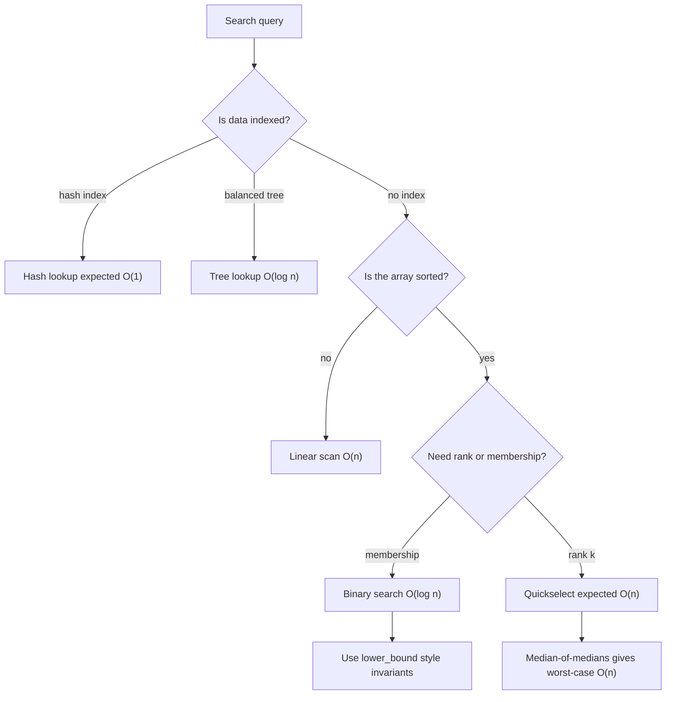

# Searching Algorithms

Searching asks where an item is, whether it exists, or which item has a specified rank. The problem looks elementary, but its variants cover a large part of algorithms: sequential scans, binary decisions over sorted order, selection by partitioning, hash-table lookup, balanced search trees, external-memory indexes, and probabilistic skip structures [1], [2].

The right search method depends on what structure is available before the query arrives. If the data is unsorted and not indexed, a linear scan is unavoidable in the worst case. If the data is sorted, comparison search can discard half or more of the remaining candidates per step. If many queries arrive over a changing set, hash tables and balanced trees shift work into an updateable index. This page connects these options and emphasizes the invariants that make search code correct.


*Figure: Binary search repeatedly halves a sorted array. Image: [Wikimedia Commons](https://commons.wikimedia.org/wiki/File:Binary_search_into_array_-_example.svg), public domain or CC-BY-SA via Wikimedia Commons.*


*Figure: Logarithmic search grows slowly as the array grows. Image: [Wikimedia Commons](https://commons.wikimedia.org/wiki/File:Binary_search_complexity.svg), public domain or CC-BY-SA via Wikimedia Commons.*

## Definitions

The basic dictionary search problem maintains a set $S$ of keys and supports `find(x)`, which returns whether $x\in S$ and often returns the associated record. A **static** search structure is built once and queried many times. A **dynamic** search structure also supports insertions and deletions.

For arrays, a common contract is to return an index $i$ with $A[i]=x$, or `-1` if no such index exists. For duplicate keys, the contract must be explicit: any occurrence, first occurrence, last occurrence, lower bound, and upper bound are different problems. The **lower bound** of $x$ is the first index $i$ such that $A[i]\ge x$; the **upper bound** is the first index $i$ such that $A[i]\gt x$.

An **order statistic** is the element of rank $k$ in sorted order. The minimum is rank $1$, the maximum is rank $n$, and the median is rank $\lceil n/2\rceil$ or one of the two central ranks, depending on convention. Quickselect solves this by partitioning rather than fully sorting. Median-of-medians gives deterministic $O(n)$ worst-case selection [8].

A **hash table** maps keys to array positions through a hash function $h$. With chaining, each table slot stores a list or small bucket of keys. With open addressing, all keys live directly in the table and collisions are resolved by probing. The **load factor** $\alpha=n/m$ is the ratio between stored keys and table slots; it controls expected lookup cost under ordinary hashing assumptions. Cuckoo hashing uses two or more possible positions per key and moves existing keys when necessary [9].

## Key results

Linear search scans each element until it finds the target or exhausts the input. It is optimal when nothing is known about the array: an adversary can place the target in the final unchecked position. Its cost is $O(n)$ time and $O(1)$ space, and it is the fallback inside many more structured algorithms for tiny subproblems.

Binary search assumes sorted order and keeps an interval of possible positions. The invariant is usually half-open: the answer, if it exists, lies in $[lo,hi)$. At each step compute `mid = lo + (hi - lo) // 2`, compare $A[mid]$ with the target, and discard one side. It needs $\lfloor\log_2 n\rfloor+O(1)$ comparisons. Lower-bound binary search is often more useful than equality search because it handles duplicates and insertion positions cleanly.

Ternary search is different in discrete arrays and continuous unimodal optimization. On a sorted array, ternary search is worse than binary search because it uses more comparisons to reduce the interval. On a unimodal function, it compares two interior points and discards the side that cannot contain the maximum or minimum. Interpolation search estimates the target's position from key values:

$$pos=lo+\frac{(x-A[lo])(hi-lo)}{A[hi]-A[lo]}.$$

It can have expected $O(\log\log n)$ time for uniformly distributed keys, but it degrades to $O(n)$ on clustered or adversarial data [4]. Exponential search first finds a range of size $2^t$ containing the target, then binary searches inside it; this is useful for unbounded arrays and for targets near the front.

Several interview-famous array searches are binary-search variants over a predicate. In a rotated sorted array, compare the target with the sorted half to decide which side can contain it. For the first occurrence of a duplicate, keep searching left after equality. For a peak in a mountain array, compare adjacent elements: if $A[mid]\lt A[mid+1]$, the peak lies to the right; otherwise it lies at or left of `mid`.

Selection asks for rank rather than membership. Quickselect uses the same partition idea as quicksort [7]. If the pivot lands at rank $r$, recurse only into the side containing rank $k$. Random pivots give expected $O(n)$ time because the total expected size of recursive subproblems decreases geometrically. Median-of-medians divides the input into groups of five, recursively selects the median of group medians, and partitions around it. At least $3n/10-O(1)$ elements are guaranteed on each side, which yields the recurrence $T(n)\le T(n/5)+T(7n/10)+O(n)=O(n)$ [8].

Hash-based search gives expected $O(1)$ lookup when the hash function spreads keys well and the load factor is controlled. Chaining is simple and robust under deletion. Open addressing improves locality but requires careful handling of tombstones and resizing. Linear probing has cache-friendly runs but suffers from primary clustering; quadratic probing and double hashing reduce some clustering effects. Cuckoo hashing offers worst-case constant lookup after successful insertion because each key has a small fixed set of candidate cells, but insertion can trigger cycles and table rebuilds [9].

Tree-based search preserves sorted order. A plain binary search tree can degrade to a linked list, but AVL trees and red-black trees maintain height $O(\log n)$ through rotations. B-trees and B+ trees store many keys per node so a search visits few disk pages or cache lines; they are the standard structure behind database and filesystem indexes. Skip lists use random levels to simulate balanced search paths with simpler code and expected $O(\log n)$ time [10].

## Visual



| Method | Precondition | Time | Space | Best use |
| --- | --- | --- | --- | --- |
| Linear search | none | $O(n)$ | $O(1)$ | Tiny arrays, unsorted one-shot data |
| Binary search | sorted random access | $O(\log n)$ | $O(1)$ | Membership, lower bound, duplicates |
| Exponential search | sorted, unknown size or near-front targets | $O(\log p)$ for position $p$ | $O(1)$ | Streams with random access blocks |
| Interpolation search | roughly uniform numeric keys | expected $O(\log\log n)$, worst $O(n)$ | $O(1)$ | Dense numeric tables |
| Quickselect | random access | expected $O(n)$ | expected $O(\log n)$ stack | k-th smallest, median |
| Median-of-medians | random access | worst $O(n)$ | recursion stack | Adversarial selection |
| Hash table | hashable keys | expected $O(1)$ | $O(n)$ | Dynamic dictionaries |
| Balanced tree | ordered keys | $O(\log n)$ | $O(n)$ | Range queries and ordered iteration |

## Worked example 1: binary search for first occurrence

**Problem.** Find the first occurrence of $4$ in

$$A=[1,2,4,4,4,7,9].$$

**Method.** Use a lower-bound search for the first index with $A[i]\ge4$. Keep the half-open invariant that the answer is in $[lo,hi)$.

1. Start with $lo=0$, $hi=7$.
2. `mid = 3`, $A[3]=4$. Since $A[mid]\ge4$, the first valid position is at or left of 3, so set $hi=3$.
3. Now $lo=0$, $hi=3$. `mid = 1`, $A[1]=2$. Since $2\lt 4$, discard positions through 1 and set $lo=2$.
4. Now $lo=2$, $hi=3$. `mid = 2`, $A[2]=4$. Set $hi=2$.
5. Now $lo=2$, $hi=2$, so the loop stops.

**Checked answer.** The lower bound is index $2$. Because $2\lt n$ and $A[2]=4$, the first occurrence exists and is at index $2$. If the target had been $5$, the same search would return insertion position $5$, and the equality check would reject it.

## Worked example 2: Quickselect for the k-th smallest

**Problem.** Find the 4th smallest element of

$$A=[8,3,2,7,4,1,6,5].$$

Use 1-based rank $k=4$.

**Method.**

1. Choose pivot $5$. Partition into $L=[3,2,4,1]$, $E=[5]$, $G=[8,7,6]$.
2. The pivot's rank range is positions $\vert L\vert +1$ through $\vert L\vert +\vert E\vert $, namely rank $5$.
3. Since $k=4\lt 5$, recurse into $L$ with the same rank $k=4$.
4. In $L=[3,2,4,1]$, choose pivot $3$. Partition into $L_2=[2,1]$, $E_2=[3]$, $G_2=[4]$.
5. Pivot $3$ has rank $\vert L_2\vert +1=3$ inside this subarray.
6. Since the desired rank is $4$, recurse into $G_2=[4]$ with adjusted rank $k'=4-3=1$.
7. A one-element subarray returns $4$.

**Checked answer.** Sorting the original array gives $[1,2,3,4,5,6,7,8]$, whose 4th element is $4$. Quickselect found it without sorting the right side of the first partition.

## Code

```python
from random import randrange

def lower_bound(a, x):
    lo, hi = 0, len(a)
    while lo < hi:
        mid = lo + (hi - lo) // 2
        if a[mid] < x:
            lo = mid + 1
        else:
            hi = mid
    return lo

def binary_search_first(a, x):
    i = lower_bound(a, x)
    return i if i < len(a) and a[i] == x else -1

def quickselect(a, k):
    """Return the k-th smallest element for zero-based k."""
    if not 0 <= k < len(a):
        raise IndexError("rank out of range")

    values = list(a)
    while True:
        pivot = values[randrange(len(values))]
        lows = [x for x in values if x < pivot]
        highs = [x for x in values if x > pivot]
        pivots = [x for x in values if x == pivot]

        if k < len(lows):
            values = lows
        elif k < len(lows) + len(pivots):
            return pivot
        else:
            k -= len(lows) + len(pivots)
            values = highs

if __name__ == "__main__":
    a = [1, 2, 4, 4, 4, 7, 9]
    print(binary_search_first(a, 4))
    print(quickselect([8, 3, 2, 7, 4, 1, 6, 5], 3))
```

## Common pitfalls

- Writing binary search without a clear invariant, then patching off-by-one errors by trial.
- Returning the first equality seen when the required contract is first occurrence.
- Using `(lo + hi) // 2` in languages where integer overflow is possible.
- Applying binary search to a list that is only "usually sorted" after recent updates.
- Confusing ternary search on sorted arrays with ternary search on unimodal functions.
- Assuming interpolation search has logarithmic worst-case time.
- Implementing quickselect but recursing into both sides, which turns it back into quicksort-like work.
- Forgetting to adjust $k$ after discarding the lower partition in selection.
- Letting hash-table load factor grow without resizing.
- Deleting from open-addressed hash tables without tombstones or cluster repair.
- Using a plain BST when adversarial insertion order can make height $n$.
- Choosing a B-tree minimum degree without considering cache-line and page size.

## Connections

- [Sorting Algorithms](/cs/algorithms/sorting-algorithms) because sorted order enables binary, interpolation, and exponential search.
- [Randomized Algorithms](/cs/algorithms/randomized-algorithms) for randomized quickselect, skip lists, and hashing assumptions.
- [Data Structures](/cs/data-structures/intro) for hash tables, balanced trees, B-trees, and skip lists.
- [Divide and Conquer](/cs/algorithms/divide-and-conquer) for binary search and selection recurrences.
- [Approximation Algorithms](/cs/algorithms/approximation-algorithms) where binary search over an answer is often paired with feasibility tests.
- [Discrete Math](/math/discrete/intro) for order, predicates, and proof by invariant.

## References

[1] T. H. Cormen, C. E. Leiserson, R. L. Rivest, and C. Stein, *Introduction to Algorithms*, 4th ed. MIT Press, 2022.

[2] R. Sedgewick and K. Wayne, *Algorithms*, 4th ed. Addison-Wesley, 2011.

[3] J. Kleinberg and E. Tardos, *Algorithm Design*. Pearson, 2005.

[4] D. E. Knuth, *The Art of Computer Programming, Vol. 3: Sorting and Searching*, 2nd ed. Addison-Wesley, 1998.

[5] S. S. Skiena, *The Algorithm Design Manual*, 3rd ed. Springer, 2020.

[6] K. Mehlhorn and P. Sanders, *Algorithms and Data Structures: The Basic Toolbox*. Springer, 2008.

[7] C. A. R. Hoare, "Algorithm 65: Find," *Communications of the ACM*, vol. 4, no. 7, pp. 321-322, 1961. https://doi.org/10.1145/366622.366647

[8] M. Blum, R. W. Floyd, V. Pratt, R. L. Rivest, and R. E. Tarjan, "Time bounds for selection," *Journal of Computer and System Sciences*, vol. 7, no. 4, pp. 448-461, 1973. https://doi.org/10.1016/S0022-0000(73)80033-9

[9] R. Pagh and F. F. Rodler, "Cuckoo hashing," *Journal of Algorithms*, vol. 51, no. 2, pp. 122-144, 2004. https://doi.org/10.1016/j.jalgor.2003.12.002

[10] W. Pugh, "Skip lists: A probabilistic alternative to balanced trees," *Communications of the ACM*, vol. 33, no. 6, pp. 668-676, 1990. https://doi.org/10.1145/78973.78977

[11] G. M. Adelson-Velsky and E. M. Landis, "An algorithm for the organization of information," *Soviet Mathematics Doklady*, vol. 3, pp. 1259-1263, 1962.

[12] R. Bayer and E. M. McCreight, "Organization and maintenance of large ordered indexes," *Acta Informatica*, vol. 1, pp. 173-189, 1972.
