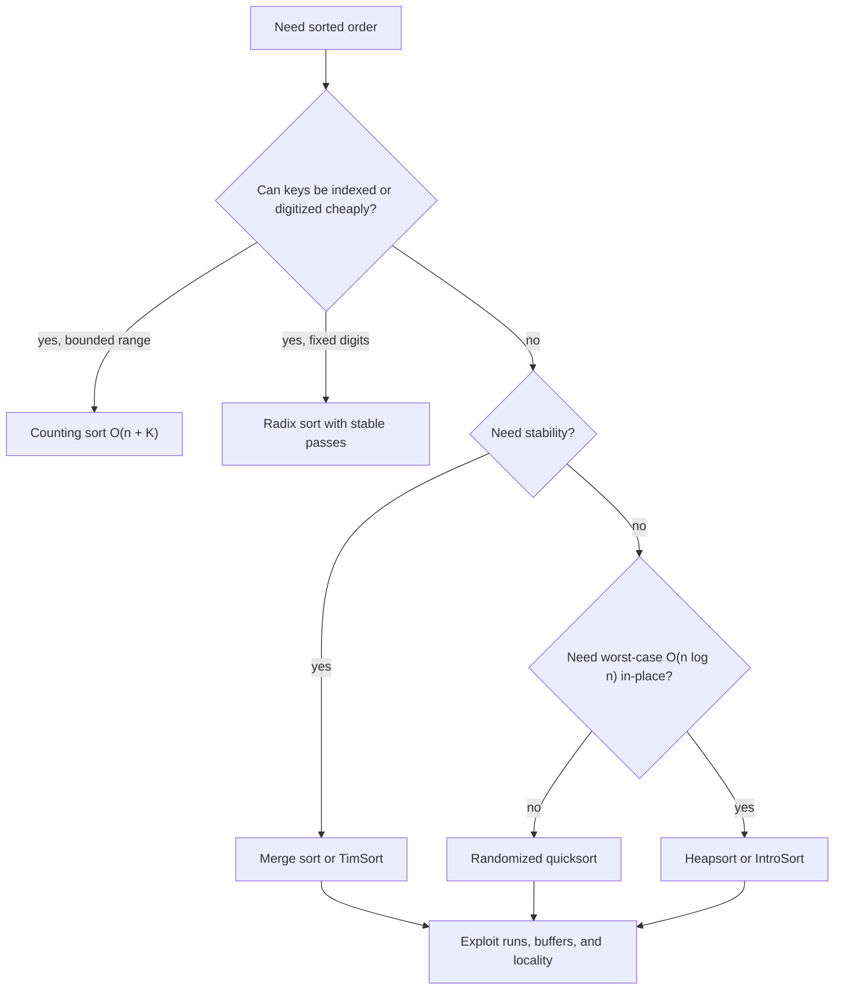

# Sorting Algorithms

Sorting takes a collection of records and rearranges it so keys appear in nondecreasing or nonincreasing order. It is one of the central algorithmic problems because sorted order turns many hard-looking tasks into scanning tasks: duplicate detection, set intersection, binary search, interval merging, sweep-line geometry, and many database operations all become simpler after sorting [1, Ch. 2, 6-8].

This page treats sorting as a design space rather than a list of named procedures. The main trade-offs are comparisons versus key arithmetic, stability versus raw memory movement, in-place updates versus auxiliary arrays, and predictable worst-case time versus excellent practical behavior. CLRS emphasizes lower bounds and correctness proofs, Sedgewick and Wayne emphasize implementation details and partitioning discipline, while Mehlhorn and Sanders connect sorting to memory hierarchy, external sorting, and parallel settings [1], [2], [6].


*Figure: Quicksort recursively partitions around pivots. Image: [Wikimedia Commons](https://commons.wikimedia.org/wiki/File:Quicksort.gif), public domain or CC-BY-SA via Wikimedia Commons.*


*Figure: Merge sort sorts by recursively merging sorted subarrays. Image: [Wikimedia Commons](https://commons.wikimedia.org/wiki/File:Merge-sort-example-300px.gif), public domain or CC-BY-SA via Wikimedia Commons.*


*Figure: Heapsort keeps the maximum at the heap root and repeatedly extracts it. Image: [Wikimedia Commons](https://commons.wikimedia.org/wiki/File:Sorting_heapsort_anim.gif), public domain or CC-BY-SA via Wikimedia Commons.*

## Definitions

A sorting algorithm receives a sequence $A[0],\ldots,A[n-1]$ of records, each with a key $k(A[i])$, and produces a permutation $A'$ such that $k(A'[0])\le k(A'[1])\le\cdots\le k(A'[n-1])$. If equal-key records retain their original relative order, the algorithm is **stable**. Stability matters whenever a later sort refines an earlier one, for example sorting employees by department and then stably by hire date.

An algorithm is **in-place** if it uses only $O(1)$ or sometimes $O(\log n)$ extra memory beyond the input array. The phrase is slightly overloaded: textbook heapsort is in-place, quicksort uses $O(\log n)$ expected stack space with good pivots, and merge sort is usually not in-place because ordinary merging needs a buffer of size $n$.

A sorting algorithm is **adaptive** if it becomes faster on partially ordered inputs. Insertion sort is adaptive because an array with $I$ inversions can be sorted in $O(n+I)$ time. TimSort, the default list sort in Python and object-array sort in Java, exploits naturally occurring monotone runs and merges them with carefully maintained stack invariants.

A **comparison sort** only obtains ordering information from questions of the form "is $x\lt y$?" Bubble sort, insertion sort, selection sort, merge sort, quicksort, heapsort, shellsort, TimSort, and IntroSort are comparison sorts. A **non-comparison sort** uses more structure, such as integer keys in a bounded range or digit representations. Counting sort, radix sort, and bucket sort can beat the $\Omega(n\log n)$ comparison lower bound because their decision process is not only binary comparison [1, Ch. 8].

## Key results

The basic quadratic sorts still earn a place in a serious algorithms course because they isolate important ideas. Bubble sort repeatedly swaps adjacent inversions; it is stable and adaptive with an early-exit flag, but it performs too many writes. Selection sort repeatedly selects the minimum remaining item; it makes only $O(n)$ swaps, but it is not stable in its usual array form and performs $\Theta(n^2)$ comparisons even on sorted input. Insertion sort maintains a sorted prefix; it is stable, in-place, and very fast on tiny or nearly sorted arrays, which is why production hybrid sorts use it for small subproblems [2].

Merge sort follows the divide-and-conquer recurrence $T(n)=2T(n/2)+\Theta(n)$ and therefore takes $\Theta(n\log n)$ time. It is stable with the usual merge routine: when equal keys appear at the front of both runs, choose the left one first. Its main cost is the $O(n)$ auxiliary buffer and the memory bandwidth required to copy. Merge sort is excellent for linked lists and external sorting because merging two sequential streams is cache and disk friendly.

Quicksort, introduced by Hoare [7], partitions the array around a pivot and recursively sorts the parts. A bad deterministic pivot can make it $\Theta(n^2)$, but randomized pivot selection gives expected $\Theta(n\log n)$ comparisons. Lomuto partitioning is simple but performs more swaps and handles equal keys poorly. Hoare partitioning uses two moving indices and fewer swaps, but returns a split point rather than the final pivot position. Three-way partitioning, often associated with Dutch-national-flag partitioning, separates keys less than, equal to, and greater than the pivot; it is the right default when duplicates are common [2], [8].

Heapsort, developed after Williams's heap idea [9], first heapifies the array in $O(n)$ time and then repeatedly swaps the maximum with the final unsorted position. It is in-place and has worst-case $\Theta(n\log n)$ time, but its memory access pattern is less local than quicksort or merge sort. Shellsort performs insertion sort over decreasing gaps. Its exact time depends on the gap sequence; it is valuable historically and practically for medium arrays, but it does not dominate modern hybrids.

Counting sort assumes keys in $\{0,\ldots,K\}$ and runs in $O(n+K)$ time. It is stable if it places elements by scanning the input from right to left into positions derived from prefix counts. Radix sort applies a stable digit sort repeatedly. LSD radix sort processes least significant digits first and is natural for fixed-length strings or integers; MSD radix sort processes most significant digits first and recursively refines buckets, which can be faster for variable-length strings. Bucket sort assumes keys are drawn from a distribution, often uniform over $[0,1)$, and sorts small buckets after scattering.

The central impossibility result is the comparison lower bound. Any comparison sort induces a binary decision tree whose leaves correspond to the $n!$ possible input orders. A binary tree with height $h$ has at most $2^h$ leaves, so $2^h\ge n!$. Hence $h\ge \log_2(n!)=\Omega(n\log n)$ by Stirling's approximation. This is a lower bound on worst-case comparisons, and also on average comparisons under the uniform distribution over permutations [1, Ch. 8].

Production sorting chooses hybrids. **TimSort** detects runs, extends short runs with binary insertion sort, then merges while maintaining invariants that keep the merge stack balanced. It is stable and adaptive, which matches real application data. **IntroSort**, used as the basis of many C++ `std::sort` implementations, starts with quicksort, switches to heapsort if recursion becomes too deep, and uses insertion sort for tiny partitions. The result preserves quicksort's cache-friendly average behavior while guaranteeing $O(n\log n)$ worst-case time [6].

External sorting treats memory as the scarce resource. If only $M$ records fit in RAM, sort chunks of size $M$ into initial runs, write them to disk, then perform multiway merge passes using input buffers and one output buffer. Parallel sorting uses partitioning or sampling to distribute work across processors, then merges or redistributes buckets. The key idea in both settings is the same as in internal sorting: comparisons matter, but data movement and locality often dominate wall-clock time.

## Visual



| Algorithm | Worst time | Average time | Extra space | Stable | In-place | Adaptive notes |
| --- | --- | --- | --- | --- | --- | --- |
| Bubble sort | $O(n^2)$ | $O(n^2)$ | $O(1)$ | Yes | Yes | Early exit gives $O(n)$ best case |
| Insertion sort | $O(n^2)$ | $O(n^2)$ | $O(1)$ | Yes | Yes | $O(n+I)$ for $I$ inversions |
| Selection sort | $O(n^2)$ | $O(n^2)$ | $O(1)$ | Usually no | Yes | Few swaps, not few comparisons |
| Merge sort | $O(n\log n)$ | $O(n\log n)$ | $O(n)$ | Yes | No | Excellent for lists and external sorting |
| Quicksort | $O(n^2)$ | $O(n\log n)$ expected | $O(\log n)$ expected | No | Mostly | Random and three-way variants improve robustness |
| Heapsort | $O(n\log n)$ | $O(n\log n)$ | $O(1)$ | No | Yes | Predictable, cache behavior weaker |
| Counting sort | $O(n+K)$ | $O(n+K)$ | $O(n+K)$ | Yes if implemented carefully | No | Useful when $K=O(n)$ |
| Radix sort | $O(d(n+K))$ | $O(d(n+K))$ | depends on stable pass | Yes with stable pass | Usually no | Best for integers, strings, fixed-width keys |
| TimSort | $O(n\log n)$ | data dependent | $O(n)$ worst case | Yes | No | Exploits natural runs |
| IntroSort | $O(n\log n)$ | $O(n\log n)$ | $O(\log n)$ | No | Mostly | Quicksort plus heapsort fallback |

## Worked example 1: merge-sort recurrence

**Problem.** Solve the recurrence for merge sort on $n=2^k$ items:

$$T(n)=2T(n/2)+cn,\qquad T(1)=d.$$

**Method.**

1. Expand one level:

$$T(n)=2\left(2T(n/4)+c(n/2)\right)+cn=4T(n/4)+2cn.$$

2. Expand two more levels to see the pattern:

$$T(n)=8T(n/8)+3cn.$$

3. After $i$ levels:

$$T(n)=2^iT(n/2^i)+icn.$$

4. Stop when $n/2^i=1$, so $i=\log_2 n$.

5. Substitute:

$$T(n)=2^{\log_2 n}T(1)+cn\log_2 n=nd+cn\log_2 n.$$

**Checked answer.** The exact expression under this simplified model is $T(n)=cn\log_2 n+dn$, so merge sort is $\Theta(n\log n)$. The result also follows from the Master Theorem with $a=2$, $b=2$, and $f(n)=\Theta(n)$.

## Worked example 2: Lomuto quicksort partition trace

**Problem.** Partition $A=[9,3,7,1,8,2,5]$ using Lomuto's scheme with pivot $5$, the last element. The goal is to place elements $\le5$ before the pivot and elements $\gt 5$ after it.

**Method.** Maintain index $i$, the boundary of the $\le5$ region. Initially $i=-1$.

| Step | $j$ | $A[j]$ | Action | Array | $i$ |
| --- | --- | --- | --- | --- | --- |
| start | - | - | pivot is 5 | $[9,3,7,1,8,2,5]$ | -1 |
| 1 | 0 | 9 | leave it | $[9,3,7,1,8,2,5]$ | -1 |
| 2 | 1 | 3 | increment $i$, swap $A[0]$ and $A[1]$ | $[3,9,7,1,8,2,5]$ | 0 |
| 3 | 2 | 7 | leave it | $[3,9,7,1,8,2,5]$ | 0 |
| 4 | 3 | 1 | increment $i$, swap $A[1]$ and $A[3]$ | $[3,1,7,9,8,2,5]$ | 1 |
| 5 | 4 | 8 | leave it | $[3,1,7,9,8,2,5]$ | 1 |
| 6 | 5 | 2 | increment $i$, swap $A[2]$ and $A[5]$ | $[3,1,2,9,8,7,5]$ | 2 |
| final | - | - | swap $A[3]$ and pivot | $[3,1,2,5,8,7,9]$ | 3 |

**Checked answer.** The pivot ends at index $3$. All entries left of it are $\le5$, and all entries right of it are $\gt 5$. The left and right sides are not sorted yet; recursive quicksort calls handle them.

## Code

```python
from random import randrange

def merge_sort(values):
    """Stable merge sort returning a new sorted list."""
    if len(values) <= 1:
        return list(values)

    mid = len(values) // 2
    left = merge_sort(values[:mid])
    right = merge_sort(values[mid:])

    merged = []
    i = j = 0
    while i < len(left) and j < len(right):
        if left[i] <= right[j]:
            merged.append(left[i])
            i += 1
        else:
            merged.append(right[j])
            j += 1

    merged.extend(left[i:])
    merged.extend(right[j:])
    return merged

def quicksort(values):
    """Randomized three-way quicksort returning a new sorted list."""
    if len(values) <= 1:
        return list(values)

    pivot = values[randrange(len(values))]
    less, equal, greater = [], [], []
    for x in values:
        if x < pivot:
            less.append(x)
        elif x > pivot:
            greater.append(x)
        else:
            equal.append(x)

    return quicksort(less) + equal + quicksort(greater)

if __name__ == "__main__":
    data = [9, 3, 7, 1, 8, 2, 5, 3]
    print(merge_sort(data))
    print(quicksort(data))
```

## Common pitfalls

- Treating "in-place" and "low memory in practice" as identical. Recursive quicksort still uses stack space.
- Forgetting that stable merge chooses from the left run first when keys tie.
- Using Lomuto partitioning on duplicate-heavy data without three-way partitioning.
- Claiming randomized quicksort is worst-case $O(n\log n)$; the guarantee is expected time.
- Comparing counting sort to comparison sorts without including the $K$ range term.
- Using radix sort with an unstable digit pass, which destroys the ordering from earlier passes.
- Assuming heapsort is always faster because it has a good worst-case bound.
- Ignoring cache behavior and memory bandwidth when comparing textbook asymptotics.
- Applying bucket sort without checking distribution assumptions.
- Building an external sort with two-way merges when a multiway merge would reduce disk passes.
- Forgetting that Python's `list.sort` and Java object sorting are stable TimSort variants.
- Sorting records by a key function that is expensive to recompute; decorate-sort-undecorate or cache keys.

## Connections

- [Big-O Notation](/cs/algorithms/big-o) for the asymptotic language used in the comparison table.
- [Searching Algorithms](/cs/algorithms/searching-algorithms) because binary search and order statistics depend on sorted or partitioned structure.
- [Divide and Conquer](/cs/algorithms/divide-and-conquer) for merge sort, quicksort, and recurrence solving.
- [Randomized Algorithms](/cs/algorithms/randomized-algorithms) for randomized quicksort and randomized selection.
- [Data Structures](/cs/data-structures/intro) for heaps, arrays, linked lists, B-trees, and memory-layout effects.
- [Computational Geometry](/cs/algorithms/computational-geometry) where sorting by coordinate is the first step in hulls and sweep lines.

## References

[1] T. H. Cormen, C. E. Leiserson, R. L. Rivest, and C. Stein, *Introduction to Algorithms*, 4th ed. MIT Press, 2022.

[2] R. Sedgewick and K. Wayne, *Algorithms*, 4th ed. Addison-Wesley, 2011.

[3] J. Kleinberg and E. Tardos, *Algorithm Design*. Pearson, 2005.

[4] D. E. Knuth, *The Art of Computer Programming, Vol. 3: Sorting and Searching*, 2nd ed. Addison-Wesley, 1998.

[5] S. S. Skiena, *The Algorithm Design Manual*, 3rd ed. Springer, 2020.

[6] K. Mehlhorn and P. Sanders, *Algorithms and Data Structures: The Basic Toolbox*. Springer, 2008.

[7] C. A. R. Hoare, "Quicksort," *The Computer Journal*, vol. 5, no. 1, pp. 10-16, 1962. https://doi.org/10.1093/comjnl/5.1.10

[8] R. Sedgewick, "Implementing quicksort programs," *Communications of the ACM*, vol. 21, no. 10, pp. 847-857, 1978. https://doi.org/10.1145/359619.359631

[9] J. W. J. Williams, "Algorithm 232: Heapsort," *Communications of the ACM*, vol. 7, no. 6, pp. 347-348, 1964. https://doi.org/10.1145/512274.512284

[10] P. McIlroy, "Optimistic sorting and information theoretic complexity," *SODA*, pp. 467-474, 1993.

[11] T. Peters, "Timsort description," Python Software Foundation, 2002.

[12] D. R. Musser, "Introspective sorting and selection algorithms," *Software: Practice and Experience*, vol. 27, no. 8, pp. 983-993, 1997.
