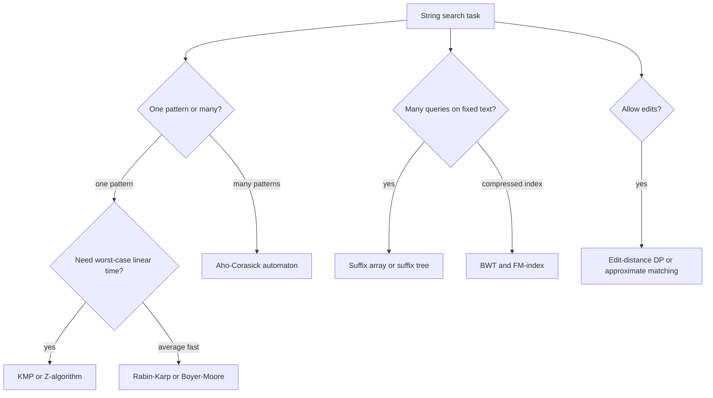

# String Algorithms

String algorithms search, compare, index, compress, and approximately match sequences of symbols. The symbols may be characters in text, bytes in files, tokens in natural language, bases in DNA, or events in a log. The core challenge is avoiding repeated work: naive matching compares the same prefixes again and again, while KMP, Z-values, suffix arrays, suffix trees, tries, and automata reuse information about previous comparisons [1], [2].

This page covers exact single-pattern matching, rolling hashes, multi-pattern matching, suffix-based indexes, and a short bridge to edit distance and compressed search. The theme is preprocessing. Sometimes preprocess the pattern, as KMP does; sometimes preprocess a set of patterns, as Aho-Corasick does; sometimes preprocess the text, as suffix arrays and FM-indexes do [7], [9], [12].


*Figure: A trie stores shared prefixes once, which is the structural basis for multi-pattern string search. Image: [Wikimedia Commons](https://commons.wikimedia.org/wiki/File:Trie_example.svg), public domain or CC-BY-SA via Wikimedia Commons.*

## Definitions

Let $T$ be a text of length $n$ and $P$ be a pattern of length $m$. Exact pattern matching asks for all positions $i$ such that

$$T[i:i+m]=P.$$

The naive algorithm checks every alignment and compares up to $m$ characters, taking $O(nm)$ time in the worst case.

A **prefix** of a string is a substring starting at position $0$. A **suffix** ends at the final position. A **border** is a nonempty proper prefix that is also a suffix. KMP's prefix function $\pi[i]$ is the length of the longest border of $P[0:i+1]$. The Z-array $Z[i]$ is the length of the longest substring starting at $i$ that matches the prefix of the string.

A **trie** stores strings by edges labeled with characters, sharing common prefixes. A **failure link** points from a trie node to the longest proper suffix of that node's string that is also a trie prefix. A **suffix array** is an array of starting positions of all suffixes of $T$ in lexicographic order. The **LCP array** stores longest common prefix lengths between adjacent suffixes in suffix-array order.

A **rolling hash** assigns a numeric fingerprint to a substring and updates it in constant time when the window shifts. Hash equality is a candidate match, not necessarily a proof, unless the algorithm verifies characters or uses a collision-free setting.

## Key results

Naive matching is simple and sometimes fast enough, especially for very short patterns or when library routines use vectorized comparisons. Its worst case is poor: searching `AAAAAB` in `AAAAAAAAAAAAAAAA` repeats almost the same comparisons at many shifts.

Knuth-Morris-Pratt preprocesses the pattern into the prefix function, then scans the text without moving the text index backward [7]. If a mismatch occurs after matching $q$ characters, the next possible matched prefix length is $\pi[q-1]$. The reason is border structure: any future match ending at the current text position must be a border of the matched pattern prefix. KMP runs in $O(n+m)$ time and $O(m)$ space.

Rabin-Karp computes a rolling hash of each length-$m$ text window and compares it with the pattern hash [10]. A typical polynomial hash is

$$H(S)=\sum_{i=0}^{m-1}S[i]b^{m-1-i}\bmod q.$$

When the window shifts, subtract the outgoing character, multiply by $b$, add the incoming character, and reduce modulo $q$. The algorithm has expected $O(n+m)$ time with a good modulus and randomization, but adversarial collisions can force verification work. Its advantage is multi-pattern matching when many patterns of the same length share a hash table.

Boyer-Moore compares the pattern from right to left and uses two shift rules [8]. The bad-character rule shifts the pattern so the mismatched text character aligns with its previous occurrence in the pattern, if any. The good-suffix rule shifts based on a suffix that matched before the mismatch. Full Boyer-Moore has excellent practical performance and sublinear behavior on many texts because it can skip alignments entirely.

Aho-Corasick builds a trie of all patterns and adds failure links [9]. Scanning the text follows trie edges when possible and failure links otherwise. Whenever the automaton reaches a node with output patterns, those patterns occur ending at the current text position. The runtime is $O(n+\text{total pattern length}+\text{number of matches})$.

The Z-algorithm computes all $Z[i]$ values in linear time by maintaining a rightmost interval $[L,R]$ known to match the prefix. Prefix-function and Z-array views are interchangeable for many tasks. For pattern matching, compute Z on `P + sentinel + T`; positions where $Z[i]\ge m$ are matches.

Suffix arrays and suffix trees index a fixed text for many queries. A suffix array can be built by prefix doubling in $O(n\log n)$ time or by linear-time algorithms such as SA-IS [12]. Pattern search uses binary search over suffixes in $O(m\log n)$ time, or faster with LCP acceleration. A suffix tree compactly represents all suffixes and supports $O(m+\text{occ})$ exact pattern queries after construction. Ukkonen's algorithm builds a suffix tree online in linear time, but it is implementation-heavy [11].

Longest common substring between two strings can be found by building a suffix array for `A + sentinel + B`, computing LCPs, and taking the maximum LCP between adjacent suffixes from different original strings. Edit distance and approximate matching use dynamic programming rather than exact border reuse; they connect string algorithms back to the DP page. Burrows-Wheeler transform and FM-indexes compress the text while retaining search capability. They support backward search over character ranges and are fundamental in read alignment and compressed text indexes.

## Visual



| Structure | Preprocesses | Query style | Time highlight |
| --- | --- | --- | --- |
| KMP prefix function | pattern | exact one-pattern scan | $O(n+m)$ |
| Rabin-Karp hash | pattern and rolling text windows | exact candidates with verification | expected $O(n+m)$ |
| Boyer-Moore tables | pattern | right-to-left comparisons | often sublinear practical scans |
| Aho-Corasick trie | pattern set | multi-pattern stream | linear plus outputs |
| Z-array | combined string | prefix-match lengths | $O(n+m)$ |
| Suffix array | text | many pattern queries | build $O(n\log n)$ or better |
| Suffix tree | text | substring index | query $O(m+\text{occ})$ |
| FM-index | compressed text | backward search | depends on rank/select support |

## Worked example 1: KMP failure function for `ABABCABAB`

**Problem.** Compute the prefix function $\pi$ for pattern `ABABCABAB`.

**Method.** Let $\pi[i]$ be the longest proper border length for the prefix ending at $i$.

| $i$ | prefix | current char | longest border | $\pi[i]$ |
| --- | --- | --- | --- | --- |
| 0 | A | A | none | 0 |
| 1 | AB | B | none | 0 |
| 2 | ABA | A | A | 1 |
| 3 | ABAB | B | AB | 2 |
| 4 | ABABC | C | none after fallback | 0 |
| 5 | ABABCA | A | A | 1 |
| 6 | ABABCAB | B | AB | 2 |
| 7 | ABABCABA | A | ABA | 3 |
| 8 | ABABCABAB | B | ABAB | 4 |

Check one nontrivial fallback. At $i=4$, the matched border length before reading `C` is $2$, expecting pattern character `A`, but the character is `C`. Fall back from length $2$ to $\pi[1]=0$. At length $0$, `C` still does not match `A`, so $\pi[4]=0$.

**Checked answer.** The prefix function is

$$[0,0,1,2,0,1,2,3,4].$$

This means that after matching the full pattern and then seeing a mismatch, KMP can resume as if the prefix `ABAB` had already matched.

## Worked example 2: Rabin-Karp matching `ABAB` in `ABCABABAB`

**Problem.** Find pattern `ABAB` in text `ABCABABAB` using a simple rolling hash. Use character values $A=1$, $B=2$, $C=3$, base $10$, and modulus $101$.

**Method.**

1. Pattern hash:

$$H(P)=1\cdot10^3+2\cdot10^2+1\cdot10+2=1212\equiv0\pmod{101}.$$

2. First text window `ABCA`:

$$H=1\cdot1000+2\cdot100+3\cdot10+1=1231\equiv19.$$

No match.

3. Roll to `BCAB`. Remove $A=1$, multiply by base, add $B=2$:

$$((1231-1\cdot1000)\cdot10+2)=2312\equiv90.$$

No match.

4. Roll to `CABA`:

$$((2312-2\cdot1000)\cdot10+1)=3121\equiv91.$$

No match.

5. Roll to `ABAB`:

$$((3121-3\cdot1000)\cdot10+2)=1212\equiv0.$$

Hash matches. Verify characters: text positions 3 through 6 are exactly `ABAB`.

6. Roll to the final `BABA`, then `ABAB` at positions 5 through 8. The final window also hashes to $0$ and verifies.

**Checked answer.** Matches start at indices $3$ and $5$ using zero-based indexing.

## Code

```python
def prefix_function(pattern):
    pi = [0] * len(pattern)
    j = 0
    for i in range(1, len(pattern)):
        while j > 0 and pattern[i] != pattern[j]:
            j = pi[j - 1]
        if pattern[i] == pattern[j]:
            j += 1
        pi[i] = j
    return pi

def kmp_search(text, pattern):
    if pattern == "":
        return list(range(len(text) + 1))
    pi = prefix_function(pattern)
    matches = []
    j = 0
    for i, ch in enumerate(text):
        while j > 0 and ch != pattern[j]:
            j = pi[j - 1]
        if ch == pattern[j]:
            j += 1
        if j == len(pattern):
            matches.append(i - len(pattern) + 1)
            j = pi[j - 1]
    return matches

def rabin_karp(text, pattern, base=256, mod=1_000_000_007):
    m = len(pattern)
    if m == 0:
        return list(range(len(text) + 1))
    if m > len(text):
        return []
    high = pow(base, m - 1, mod)
    ph = th = 0
    for i in range(m):
        ph = (ph * base + ord(pattern[i])) % mod
        th = (th * base + ord(text[i])) % mod
    matches = []
    for i in range(len(text) - m + 1):
        if ph == th and text[i:i + m] == pattern:
            matches.append(i)
        if i + m < len(text):
            th = (th - ord(text[i]) * high) % mod
            th = (th * base + ord(text[i + m])) % mod
    return matches

def z_function(s):
    z = [0] * len(s)
    left = right = 0
    for i in range(1, len(s)):
        if i <= right:
            z[i] = min(right - i + 1, z[i - left])
        while i + z[i] < len(s) and s[z[i]] == s[i + z[i]]:
            z[i] += 1
        if i + z[i] - 1 > right:
            left, right = i, i + z[i] - 1
    return z
```

## Common pitfalls

- Treating hash equality as proof of equality without verification or a collision argument.
- Building the KMP prefix table over the text instead of the pattern for standard scanning.
- Forgetting to fall back repeatedly in KMP; one fallback may not be enough.
- Using a sentinel in `P + sentinel + T` that can also appear in the input.
- Claiming Boyer-Moore is worst-case linear without the full set of rules and implementation details.
- Reporting overlapping matches incorrectly after a full KMP match.
- Storing every suffix string explicitly when building a suffix array, causing quadratic memory use.
- Confusing longest common subsequence with longest common substring.
- Implementing Aho-Corasick outputs only at terminal nodes and missing patterns inherited through failure links.
- Using a tiny modulus in Rabin-Karp on adversarial input.
- Ignoring Unicode normalization when matching human-language text.
- Applying byte-oriented algorithms directly to variable-width encoded text without defining the symbol alphabet.

## Connections

- [Dynamic Programming](/cs/algorithms/dynamic-programming) for edit distance, LCS, and approximate matching.
- [Searching Algorithms](/cs/algorithms/searching-algorithms) for binary search over suffix arrays.
- [Data Structures](/cs/data-structures/intro) for tries, automata, arrays, and hash tables.
- [Randomized Algorithms](/cs/algorithms/randomized-algorithms) for rolling-hash collision analysis and randomized fingerprints.
- [Number-Theoretic and Algebraic Algorithms](/cs/algorithms/number-theoretic-and-algebraic-algorithms) for modular hashing and FFT-based convolution matching.
- [Theory of Computation](/cs/theory/intro) for finite automata and regular languages.

## References

[1] T. H. Cormen, C. E. Leiserson, R. L. Rivest, and C. Stein, *Introduction to Algorithms*, 4th ed. MIT Press, 2022.

[2] R. Sedgewick and K. Wayne, *Algorithms*, 4th ed. Addison-Wesley, 2011.

[3] D. E. Knuth, *The Art of Computer Programming, Vol. 3: Sorting and Searching*, 2nd ed. Addison-Wesley, 1998.

[4] G. Navarro and M. Raffinot, *Flexible Pattern Matching in Strings*. Cambridge University Press, 2002.

[5] D. Gusfield, *Algorithms on Strings, Trees, and Sequences*. Cambridge University Press, 1997.

[6] K. Mehlhorn and P. Sanders, *Algorithms and Data Structures: The Basic Toolbox*. Springer, 2008.

[7] D. E. Knuth, J. H. Morris, Jr., and V. R. Pratt, "Fast pattern matching in strings," *SIAM Journal on Computing*, vol. 6, no. 2, pp. 323-350, 1977.

[8] R. S. Boyer and J. S. Moore, "A fast string searching algorithm," *Communications of the ACM*, vol. 20, no. 10, pp. 762-772, 1977. https://doi.org/10.1145/359842.359859

[9] A. V. Aho and M. J. Corasick, "Efficient string matching: An aid to bibliographic search," *Communications of the ACM*, vol. 18, no. 6, pp. 333-340, 1975.

[10] R. M. Karp and M. O. Rabin, "Efficient randomized pattern-matching algorithms," *IBM Journal of Research and Development*, vol. 31, no. 2, pp. 249-260, 1987.

[11] E. Ukkonen, "On-line construction of suffix trees," *Algorithmica*, vol. 14, pp. 249-260, 1995.

[12] G. Nong, S. Zhang, and W. H. Chan, "Linear suffix array construction by almost pure induced-sorting," *Data Compression Conference*, pp. 193-202, 2009.

[13] M. Burrows and D. J. Wheeler, "A block-sorting lossless data compression algorithm," Digital SRC Research Report 124, 1994.
