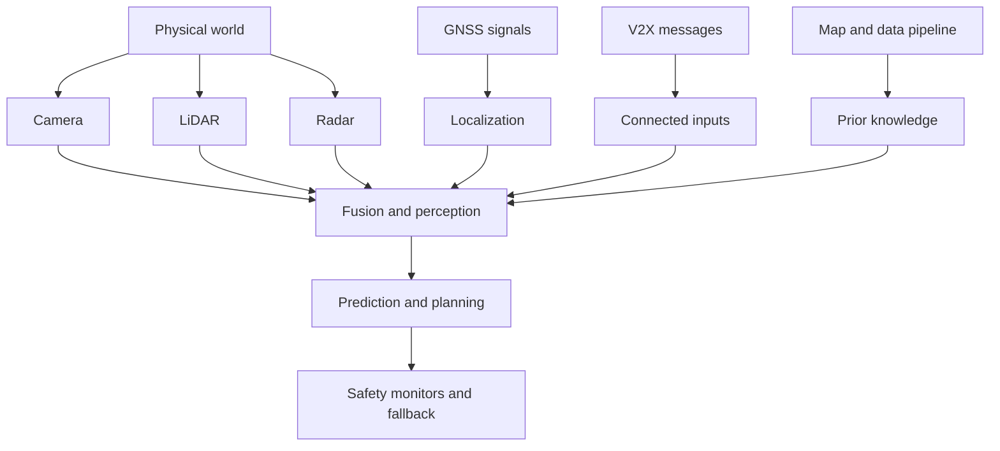

# Adversarial and Physical Attacks on AV

Autonomous vehicles are cyber-physical systems, so attacks can target neural perception, sensor physics, localization, maps, communication, compute, and human interaction. A sticker on a sign, a projected pattern, a spoofed GNSS signal, lidar interference, radar jamming, a malicious V2X message, or a tampered map update can all become safety-relevant. The defense is not one adversarial-training trick; it is layered robustness, detection, redundancy, secure engineering, and conservative fallback.

This page gives a foundational overview of adversarial patches on signs, lidar spoofing, projector attacks, sensor jamming, GNSS spoofing, V2X attacks, and defense considerations. It cross-links to the broader [adversarial attacks](/cs/adversarial-attacks/) section and to AV-specific pages on [sensors](/cs/autonomous-driving/sensors-cameras-lidar-radar-imu), [fusion](/cs/autonomous-driving/sensor-fusion), [V2X](/cs/autonomous-driving/v2x-and-connected-vehicles), and [safety](/cs/autonomous-driving/safety-iso26262-sotif-scenario-testing).

## Definitions

An **adversarial example** is an input intentionally perturbed to cause a model error. In AVs, perturbations may be digital, such as modified pixels in a dataset, or physical, such as stickers, projected light, or manipulated objects.

An **adversarial patch** is a visible pattern designed to cause misclassification or misdetection from many viewpoints. In driving, researchers have studied patches on traffic signs, clothing, road surfaces, and objects.

**Physical attacks** act through the real sensor channel. Examples include placing stickers on a sign, shining light into a camera, projecting patterns onto a road, spoofing lidar returns, jamming radar, or spoofing GNSS.

**Lidar spoofing** injects fake returns or manipulates timing so the lidar reports nonexistent objects or misses real ones. Practical difficulty depends on lidar design, timing, power, geometry, and signal processing.

**Sensor jamming** overwhelms or degrades a sensor so it cannot produce reliable measurements. Radar and GNSS jamming are classic examples; camera glare and laser dazzling are optical analogues.

**GNSS spoofing** transmits counterfeit satellite-like signals or corrections to mislead the receiver about position or time.

**Attack surface** is the set of places an attacker can influence the system: sensors, V2X messages, map updates, cloud APIs, maintenance ports, training data, labels, simulation assets, and human-machine interfaces.

**Defense in depth** means using multiple independent mitigations so one failed defense does not immediately create a hazard.

## Key results

Attacks differ by required access and operational impact.

| Attack class | Target | Required access | Possible effect | Common defense |
|---|---|---|---|---|
| Sign patch | Camera classifier or detector | Physical access to sign or object | Misread sign, missed object | Multi-frame checks, map priors, robust training |
| Projector attack | Camera perception | Line of sight and lighting control | Fake lane, false object, glare | Exposure checks, temporal consistency, sensor fusion |
| Lidar spoofing | Range perception | Timing and optical access | Phantom obstacle or hidden object | Signal authentication, waveform checks, fusion |
| Radar jamming | Radar perception | RF transmitter near band | Lost or noisy detections | Interference detection, sensor redundancy |
| GNSS spoofing | Localization | RF signal dominance | Wrong global pose or time | Multi-sensor localization, spoof detection |
| V2X spoofing | Connected planning inputs | Credential abuse or protocol weakness | False hazard or priority claim | PKI, plausibility, rate limits |
| Data poisoning | Training pipeline | Data or label access | Systematic model weakness | Provenance, audits, robust training |

Physical robustness is harder than digital robustness because the attack passes through viewpoint, distance, motion blur, weather, camera exposure, sensor compression, and temporal tracking. That can weaken attacks, but it also makes them harder to characterize.

Fusion helps but can also spread errors. If a camera sees a fake sign and a map expects a sign there, the stack may become more confident. If lidar and radar disagree, the fusion system must preserve disagreement as uncertainty rather than forcing a single answer.

Adversarial risk belongs in the safety case. A SOTIF analysis may cover performance limits without malicious intent, while cybersecurity analysis covers intentional attacks. In practice, the same hazardous behavior can arise from either, so safety and security teams need shared scenarios and mitigations.

A useful risk model separates threat, vulnerability, exposure, and consequence:

$$
\mathrm{risk}
\approx
P(\mathrm{attack})\times
P(\mathrm{success}\mid \mathrm{attack})
\times
\mathrm{severity}.
$$

This is not a precise AV safety equation, but it prevents two mistakes: dismissing attacks merely because they are hard, and over-prioritizing attacks that have low consequence or unrealistic access.

Attack evaluation should be scenario based. A digital perturbation that fools a frozen image classifier is useful for research, but AV safety depends on whether the attack survives distance, pose, motion, compression, weather, temporal tracking, multi-camera overlap, and planning logic. A convincing evaluation states attacker capability, placement constraints, lighting assumptions, vehicle speed, sensor model, success criteria, and whether the attack produces an unsafe action rather than only a perception error.

Defenses should be layered. Robust training can reduce sensitivity to some perturbations, but it should be paired with temporal consistency checks, cross-sensor disagreement detection, map plausibility, secure boot, signed updates, network isolation, logging, and fallback behavior. The goal is not to make every sensor impossible to fool. The goal is to prevent a single manipulated channel from silently becoming a hazardous command.

The operational response should be proportional to confidence and context. A suspected camera glare attack on an empty highway might trigger sensor downweighting and speed reduction. A suspected localization spoof near a complex intersection may require stopping or leaving autonomous service. A suspected V2X spoof should not necessarily cause an emergency maneuver; it may be safer to ignore the message and rely on onboard perception. Defense design therefore belongs in behavior planning and safety monitoring, not only in perception research.

Logging is part of defense. If a system flags spoofing, jamming, or sensor tampering, the event should be preserved with raw evidence, timing, vehicle state, and software version. That record supports incident response, patch development, fleet-wide detection, and safety-case updates.

## Visual



## Worked example 1: Attack latency and stopping distance

Problem: A camera attack causes a pedestrian detector to miss a pedestrian for 0.4 s. The vehicle travels at 15 m/s. How much distance passes before the missed detection can be corrected, ignoring braking?

1. Use:

$$
d = vt.
$$

2. Substitute speed and time:

$$
d = 15 \times 0.4 = 6\ \mathrm{m}.
$$

Answer: the vehicle travels 6 m during the missed-detection interval.

Check: Six meters is a large distance in urban driving. Even temporary perception failures can be safety critical if they occur near crosswalks or stopped traffic.

## Worked example 2: Plausibility-checking a spoofed GNSS jump

Problem: A vehicle's GNSS position jumps 12 m sideways within 0.2 s, while wheel odometry and IMU indicate lateral velocity below 0.5 m/s. Compute the implied lateral velocity from GNSS and decide whether to flag it.

1. Compute implied velocity:

$$
v_y = \frac{12}{0.2}=60\ \mathrm{m/s}.
$$

2. Compare with inertial estimate:

$$
60\ \mathrm{m/s} \gg 0.5\ \mathrm{m/s}.
$$

3. Compare with plausible vehicle lateral motion. A road vehicle cannot move sideways at 60 m/s without an extreme crash or sensor/model failure.

Answer: the GNSS jump should be flagged as implausible and rejected or heavily downweighted.

Check: This does not prove spoofing; it could be multipath or receiver fault. The safe response is to isolate the measurement and rely on other localization sources while uncertainty grows.

## Code

```python
from dataclasses import dataclass

@dataclass
class GnssMeasurement:
    x_m: float
    y_m: float
    t_s: float

def gnss_plausible(prev, cur, max_speed_mps=60.0, max_lateral_mps=5.0):
    dt = cur.t_s - prev.t_s
    if dt <= 0.0:
        return False, "nonpositive timestamp step"
    vx = (cur.x_m - prev.x_m) / dt
    vy = (cur.y_m - prev.y_m) / dt
    speed = (vx * vx + vy * vy) ** 0.5
    if speed > max_speed_mps:
        return False, f"implied speed {speed:.1f} m/s too high"
    if abs(vy) > max_lateral_mps:
        return False, f"implied lateral speed {vy:.1f} m/s too high"
    return True, "measurement plausible"

prev = GnssMeasurement(0.0, 0.0, 10.0)
cur = GnssMeasurement(0.0, 12.0, 10.2)
print(gnss_plausible(prev, cur))
```

## Common pitfalls

- Treating adversarial attacks as only image-classifier problems. AV attacks can target lidar, radar, GNSS, maps, V2X, data, and compute.
- Assuming sensor fusion automatically defeats attacks. Fusion can amplify a bad input if priors and sensors fail in correlated ways.
- Ignoring physical feasibility. Some published digital attacks do not survive real distance, lighting, motion, or viewpoint changes.
- Ignoring low-tech attacks. Dirt, tape, glare, blocked sensors, and moved signs can be as relevant as optimized perturbations.
- Designing defenses without operational response. Detection must connect to degraded mode, fallback, or service restriction.
- Separating safety and security too sharply. Malicious attacks and non-malicious performance limits can produce the same hazardous event.

## Connections

- [Adversarial attacks](/cs/adversarial-attacks/)
- [Sensors, cameras, lidar, radar, and IMU](/cs/autonomous-driving/sensors-cameras-lidar-radar-imu)
- [Sensor fusion](/cs/autonomous-driving/sensor-fusion)
- [V2X and connected vehicles](/cs/autonomous-driving/v2x-and-connected-vehicles)
- [Safety, ISO 26262, SOTIF, and scenario testing](/cs/autonomous-driving/safety-iso26262-sotif-scenario-testing)
- [Deep learning](/cs/deep-learning/)
- Further reading: adversarial examples for traffic signs, physical adversarial patches, lidar spoofing research, GNSS spoofing literature, vehicular cybersecurity standards, and robust perception surveys.
