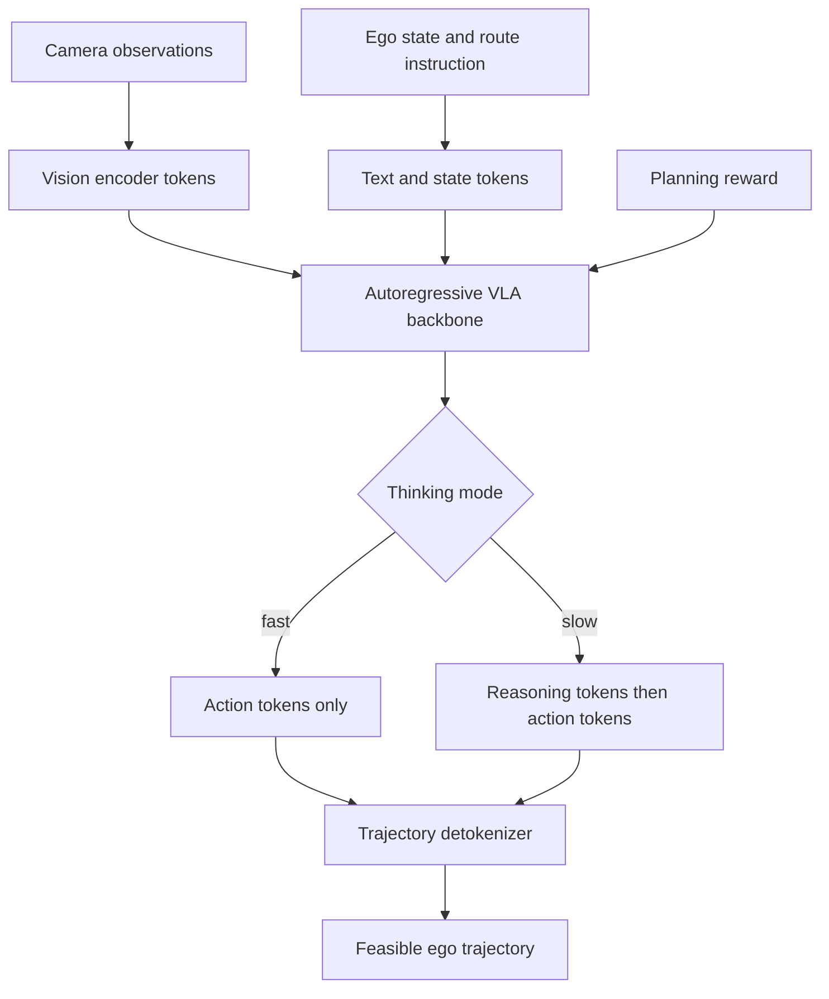

# AutoVLA (Zhou et al., 2025)

AutoVLA, introduced by Zhou, Cai, Zhao, Zhang, Huang, Zhou, and Ma in the NeurIPS 2025 paper "AutoVLA: A Vision-Language-Action Model for End-to-End Autonomous Driving with Adaptive Reasoning and Reinforcement Fine-Tuning," is a VLA driving model that unifies language reasoning and action generation in one autoregressive model. It tokenizes continuous trajectories into discrete feasible actions, trains fast and slow thinking modes, and applies reinforcement fine-tuning with GRPO-style optimization.

This is a post-2024 research system, so its claims should be read conservatively. The paper reports experiments on nuPlan, nuScenes, Waymo, and CARLA in open-loop and closed-loop settings, but VLA driving remains an active research area. AutoVLA is most useful as a concrete example of how [vision-language models](/cs/autonomous-driving/mllm-for-driving-survey) are being connected to physical trajectory outputs.

## Definitions

A **vision-language-action model** maps observations and language into actions:

$$
(I, s_{\mathrm{ego}}, \tau_{\mathrm{text}})\rightarrow a_{1:T}.
$$

For driving, the action is often a future trajectory rather than a direct steering command.

**Action tokenization** converts continuous trajectories into discrete tokens. Suppose a trajectory vocabulary is

$$
\mathcal{V}=\{v_1,\dots,v_K\},
$$

where each $v_k$ is a feasible waypoint sequence. A continuous expert trajectory $Y$ is assigned to the nearest token:

$$
z^\star=\arg\min_k d(Y,v_k).
$$

The language model can then generate action tokens as part of its normal autoregressive sequence.

**Fast thinking** means trajectory-only generation without long chain-of-thought reasoning. **Slow thinking** means producing intermediate semantic reasoning before the action. AutoVLA trains both modes and uses reinforcement fine-tuning to reduce unnecessary reasoning in simple scenarios.

**Group Relative Policy Optimization** in this context is used as reinforcement fine-tuning with verifiable planning rewards. The paper uses reward functions related to planning quality and efficiency so the model can adapt reasoning length and action choice.

## Key results

The source abstract reports competitive or superior performance across real-world and simulated datasets, including nuPlan, nuScenes, Waymo, and CARLA, under open-loop and closed-loop tests. It also reports qualitative adaptive reasoning: simple scenes can use fast trajectory generation, while complex scenes can use chain-of-thought reasoning.

The main design result is the action interface. Many VLM driving systems produce text decisions, meta-actions, or waypoints through a separate decoder. AutoVLA instead integrates physical action tokens into the autoregressive model. This keeps reasoning and trajectory generation in one sequence:

$$
\text{visual tokens},\text{text command}
\rightarrow
\text{optional reasoning tokens}
\rightarrow
\text{action tokens}.
$$

This design addresses two common problems:

1. Textual decisions are not directly executable.
2. Fixed chain-of-thought reasoning can be too slow or unnecessary.

The action codebook constrains outputs toward feasible trajectories. That does not guarantee safety, but it is better than unconstrained text or arbitrary coordinate generation. Reinforcement fine-tuning then rewards planning behavior and can penalize overly long reasoning in easy cases.

The main open risks are the same as for other VLA systems: spatial grounding, hallucination, latency, distribution shift, and validation. A generated action token can still be unsafe if perception is wrong or the action vocabulary lacks the needed maneuver.

AutoVLA's action-token interface is best understood as a compromise between continuous control and language generation. A language model is good at predicting discrete tokens, so the trajectory is made token-like. But driving is continuous, so the token vocabulary must be built from feasible motion primitives or trajectory clusters. The quality of that vocabulary determines what the model can express. If the vocabulary lacks a cautious creep, emergency brake, or unusual evasive maneuver, the model cannot produce it directly.

The adaptive reasoning idea addresses a real deployment pressure. Long chain-of-thought outputs are expensive, and most driving frames are routine. A vehicle should not spend large-model latency explaining every lane-following frame. But when the scene is ambiguous, such as a construction worker near a blocked lane, extra semantic reasoning may be worth the cost. AutoVLA's fast/slow distinction is one way to make that tradeoff learnable.

Reinforcement fine-tuning adds another layer: the model is not only imitating expert trajectories; it is rewarded for planning quality and efficiency. In principle, this can correct cases where supervised data contains ambiguous or suboptimal reasoning. In practice, reward design is delicate. A reward that over-penalizes reasoning length may make the model too terse in hard scenes; a reward that overemphasizes route progress may reduce caution. These are safety-relevant choices, not just training details.

Because AutoVLA is recent, it should be read as a research direction rather than a settled recipe. Its strongest contribution is showing how action feasibility, language reasoning, and post-training can be put into one architecture. Whether that architecture is preferable to a hybrid VLM plus planner depends on closed-loop reliability, latency, interpretability, and certification needs.

The tokenization design also affects interpretability. A token can correspond to a known trajectory prototype, which is easier to inspect than an arbitrary latent vector. Engineers can ask which maneuver family was selected, how often a token appears in risky scenes, or whether a token is associated with hard braking. This is helpful for debugging, but only if the vocabulary is documented and stable.

AutoVLA's fast and slow modes raise an evaluation challenge: the benchmark must include both routine and complex scenes. If all scenes are simple, slow reasoning looks wasteful. If all scenes are hand-picked corner cases, fast mode looks unsafe. A realistic driving distribution is heavily imbalanced toward ordinary frames, so adaptive reasoning should be measured by both average latency and tail-case behavior.

Finally, reinforcement fine-tuning should be audited for reward hacking. A model may learn to avoid penalties in the benchmark without becoming safer in real traffic. Verifiable rewards help, but they are only as good as the scenarios, metrics, and constraints used during fine-tuning.

The safest reading is that AutoVLA advances the action interface for foundation models, while the deployment question remains open and depends on independent validation.

## Visual



| Interface | Output | Benefit | Risk |
|---|---|---|---|
| Text-only VLM | Explanation or meta-action | Interpretable | Not executable |
| VLM plus planner | High-level guidance | Uses classical grounding | Interface complexity |
| Continuous waypoint decoder | Numeric trajectory | Direct planning | Mode collapse or infeasible outputs |
| AutoVLA action tokens | Discrete feasible trajectory token | Native autoregressive action | Vocabulary coverage limit |

## Worked example 1: Assigning a trajectory token

Problem: A trajectory vocabulary has three one-step candidate endpoints: $v_1=(5,0)$, $v_2=(5,1)$, and $v_3=(3,0)$. An expert endpoint is $Y=(4.6,0.8)$. Assign the nearest action token by Euclidean distance.

1. Distance to $v_1$:

$$
d_1=\sqrt{(4.6-5)^2+(0.8-0)^2}=\sqrt{0.16+0.64}=\sqrt{0.8}\approx0.894.
$$

2. Distance to $v_2$:

$$
d_2=\sqrt{(4.6-5)^2+(0.8-1)^2}=\sqrt{0.16+0.04}=\sqrt{0.2}\approx0.447.
$$

3. Distance to $v_3$:

$$
d_3=\sqrt{(4.6-3)^2+(0.8-0)^2}=\sqrt{2.56+0.64}=\sqrt{3.2}\approx1.789.
$$

Answer: assign token $v_2$.

Check: The expert endpoint is closest to the slight-left or offset trajectory.

## Worked example 2: Fast versus slow reasoning reward

Problem: In a simple lane-following scene, fast mode gets planning reward 0.92 and uses 5 generated tokens. Slow mode gets planning reward 0.94 and uses 45 generated tokens. The efficiency-adjusted score is $R'=R-0.001N$. Which mode is preferred?

1. Fast score:

$$
R'_f=0.92-0.001(5)=0.915.
$$

2. Slow score:

$$
R'_s=0.94-0.001(45)=0.895.
$$

3. Compare:

$$
0.915>0.895.
$$

Answer: fast mode is preferred.

Check: Slow reasoning had slightly better raw planning reward, but not enough to justify the additional tokens under this scoring rule.

## Code

```python
import torch

def nearest_action_token(trajectory, vocabulary):
    # trajectory: [T, 2], vocabulary: [K, T, 2]
    dist = torch.linalg.norm(vocabulary - trajectory[None], dim=-1).mean(dim=-1)
    token = dist.argmin()
    return token, vocabulary[token], dist[token]

def efficiency_adjusted_reward(planning_reward, token_count, penalty=0.001):
    return planning_reward - penalty * token_count

vocab = torch.tensor([
    [[5., 0.]],
    [[5., 1.]],
    [[3., 0.]],
])
expert = torch.tensor([[4.6, 0.8]])
print(nearest_action_token(expert, vocab))
print(efficiency_adjusted_reward(0.92, 5), efficiency_adjusted_reward(0.94, 45))
```

## Common pitfalls

- Assuming action tokens guarantee safety. They constrain outputs to a vocabulary, but the chosen token can still be wrong.
- Treating chain-of-thought as always beneficial. Extra reasoning can add latency and hallucination surface.
- Ignoring detokenization error. A codebook can only represent trajectories it contains.
- Comparing open-loop and closed-loop results as if they measure the same thing.
- Forgetting vehicle dynamics. A token vocabulary should be built from feasible trajectories.
- Overstating post-2025 benchmark claims. The field is moving quickly and evaluation protocols differ.

## Connections

- [VLA for Driving Survey](/cs/autonomous-driving/vla-for-driving-survey)
- [DriveVLM](/cs/autonomous-driving/drivevlm)
- [Diffusion Planning for Driving](/cs/autonomous-driving/diffusion-planning-for-driving)
- [End-to-end driving](/cs/autonomous-driving/end-to-end-driving)
- [Motion planning](/cs/autonomous-driving/motion-planning)
- [Simulation and data](/cs/autonomous-driving/simulation-and-data)
- Further reading: AutoVLA, OpenDriveVLA, DriveVLM, Senna, EMMA, DriveTransformer, GRPO-style reinforcement fine-tuning, and trajectory tokenization.
