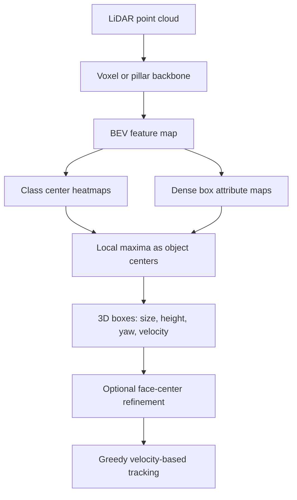

# CenterPoint (Yin et al., 2021)

CenterPoint, introduced by Yin, Zhou, and Krahenbuhl in the CVPR 2021 paper "Center-based 3D Object Detection and Tracking," reframes LiDAR 3D detection around object centers. Instead of tiling the world with many oriented 3D anchors, CenterPoint predicts a heatmap of object centers in bird's-eye view and regresses each detected object's size, height, yaw, and velocity from the feature at the center point.

The method is important because it separates two problems that are often tangled together: how to encode a point cloud, and how to parameterize detections. CenterPoint can sit on top of backbones such as VoxelNet or [PointPillars](/cs/autonomous-driving/pointpillars). Its main claim is that a point-like center representation simplifies both 3D detection and 3D tracking, making it a natural bridge from [perception](/cs/autonomous-driving/perception-object-detection-and-segmentation) to [prediction](/cs/autonomous-driving/prediction-and-motion-forecasting).

## Definitions

An **anchor-based 3D detector** places many candidate boxes over a BEV feature map. Each anchor has a class, size prior, and yaw prior. Training then decides which anchors match ground-truth boxes. This creates target-assignment complexity because 3D boxes have orientation, size, and class-dependent geometry.

A **center-based 3D detector** instead treats each object as a point at its projected center. For each class $k$, the detector predicts a heatmap

$$
\hat{Y}\in[0,1]^{H\times W\times K},
$$

where local maxima indicate object centers. For each center, it predicts regression attributes:

$$
\hat{b}=(\Delta x,\Delta y,z,w,l,h,\sin\theta,\cos\theta,v_x,v_y).
$$

The offsets $\Delta x,\Delta y$ correct quantization caused by the feature-map stride. The height $z$ and dimensions $(w,l,h)$ reconstruct the 3D box. The sine-cosine yaw representation avoids discontinuity at $\theta=\pi$ and $\theta=-\pi$. Velocity enables simple tracking between frames.

A **Gaussian center target** spreads positive supervision around the annotated center rather than marking only one pixel. A common target for object $i$ with center $q_i$ is

$$
Y_{xyk} = \exp\left(-\frac{(x-q_{ix})^2+(y-q_{iy})^2}{2\sigma_i^2}\right)
$$

on the channel for class $k$. CenterPoint increases the effective positive region so the sparse BEV heatmap remains trainable.

The **second-stage refinement** samples features at the predicted box's center and face centers. It recovers local geometric information lost by stride and BEV compression, but is lighter than heavy 3D RoI pooling.

## Key results

The source paper reports state-of-the-art results on nuScenes and Waymo Open Dataset at publication time. In the abstract and introduction, the authors report 65.5 NDS and 63.8 AMOTA on nuScenes for a single model. They also report 58.0 mAP and 65.5 NDS on nuScenes, 71.8 and 66.4 level-2 mAPH for vehicle and pedestrian detection on Waymo, and near-real-time operation at 11 FPS on Waymo and 16 FPS on nuScenes. These numbers should be read as historical benchmark results for the paper's setting, not as a permanent leaderboard claim.

The key modeling result is that points are easier to assign than rotated boxes. A point has no width, length, or yaw, so the detector avoids many anchor-design choices. Once the center is found, box properties are direct regressions from local features.

CenterPoint's tracking rule is also simple. If the detector predicts the center at time $t$ and velocity $\hat{v}$, it estimates the previous center as

$$
\hat{c}_{t-1}=c_t-\hat{v}\Delta t.
$$

Tracks can then be linked greedily to nearby centers from the previous frame. This is not a complete multi-object tracking theory, but the paper's point is that a center representation makes tracking almost the same object as detection in time.

The architecture has four conceptual layers:

1. A 3D backbone encodes LiDAR into BEV features.
2. A center head predicts heatmaps and dense regression maps.
3. Optional second-stage refinement samples sparse point features on the predicted box.
4. A velocity-based association step links centers for tracking.

The method's strength is not that it removes all box geometry. It delays box geometry until after the detector has found likely object centers. This is often easier than asking every anchor at every location and yaw to compete during target assignment.

## Visual



| Design choice | Anchor-based 3D detector | CenterPoint |
|---|---|---|
| Positive target | Anchor/box IoU thresholds | Center heatmap peak |
| Orientation handling | Many yaw anchors or yaw bins | Regress $\sin\theta,\cos\theta$ |
| Tracking interface | Boxes plus separate tracker | Centers plus predicted velocity |
| Main tuning burden | Anchor sizes, rotations, IoU thresholds | Heatmap radius and regression losses |
| Compatible backbone | Voxel, pillar, BEV encoders | Voxel, pillar, BEV encoders |

## Worked example 1: Constructing a center target

Problem: A BEV detector has stride $s=0.5$ m per output cell. A car center in ego coordinates is $(x,y)=(12.3,-4.1)$ m. The grid origin is $(0,-20)$ m. Find the heatmap cell and the sub-cell offset.

1. Convert metric coordinates to grid coordinates:

$$
u=\frac{x-0}{0.5}=\frac{12.3}{0.5}=24.6,
$$

$$
v=\frac{y-(-20)}{0.5}=\frac{15.9}{0.5}=31.8.
$$

2. The integer center cell is

$$
(\lfloor u\rfloor,\lfloor v\rfloor)=(24,31).
$$

3. The sub-cell offset is

$$
(\Delta u,\Delta v)=(24.6-24,31.8-31)=(0.6,0.8).
$$

4. The heatmap target places a Gaussian peak around cell $(24,31)$ on the car channel.

5. The regression target at that cell includes $(0.6,0.8)$, plus the 3D box's height, size, yaw encoding, and velocity.

Answer: the center target is cell $(24,31)$ with offset $(0.6,0.8)$.

Check: Multiplying back by stride gives metric correction $(0.3,0.4)$ m, so the reconstructed center is $(12.0+0.3,-4.5+0.4)=(12.3,-4.1)$ m.

## Worked example 2: Greedy tracking with velocity

Problem: At time $t$, a detector reports a vehicle center $c_t=(18.0,2.0)$ m and velocity $\hat{v}=(4.0,0.5)$ m/s. Frames are $\Delta t=0.5$ s apart. Previous active tracks have centers $a=(16.1,1.8)$, $b=(14.0,5.0)$, and $c=(18.2,-2.0)$. Which track should be linked?

1. Predict where the current object was at the previous frame:

$$
\hat{c}_{t-1}=c_t-\hat{v}\Delta t=(18.0,2.0)-(4.0,0.5)(0.5).
$$

2. Compute the displacement:

$$
(4.0,0.5)(0.5)=(2.0,0.25).
$$

3. Therefore

$$
\hat{c}_{t-1}=(16.0,1.75).
$$

4. Distances to prior tracks are

$$
d_a=\sqrt{(16.0-16.1)^2+(1.75-1.8)^2}\approx0.112,
$$

$$
d_b=\sqrt{(16.0-14.0)^2+(1.75-5.0)^2}\approx3.82,
$$

$$
d_c=\sqrt{(16.0-18.2)^2+(1.75+2.0)^2}\approx4.35.
$$

5. The nearest previous center is track $a$.

Answer: link the detection to track $a$.

Check: The predicted previous position is physically consistent with a forward-moving vehicle; linking to $b$ or $c$ would require a large lateral jump.

## Code

```python
import torch
import torch.nn.functional as F

def gaussian_heatmap_target(height, width, centers, radius=2, device="cpu"):
    yy, xx = torch.meshgrid(
        torch.arange(height, device=device),
        torch.arange(width, device=device),
        indexing="ij",
    )
    heatmap = torch.zeros(height, width, device=device)
    sigma = max(radius / 3.0, 1e-6)
    for row, col in centers:
        g = torch.exp(-((xx - col) ** 2 + (yy - row) ** 2) / (2 * sigma ** 2))
        heatmap = torch.maximum(heatmap, g)
    return heatmap.clamp(max=1.0)

def focal_center_loss(logits, target, alpha=2.0, beta=4.0):
    pred = logits.sigmoid().clamp(1e-4, 1 - 1e-4)
    pos = target.eq(1.0).float()
    neg = target.lt(1.0).float()
    pos_loss = -((1 - pred) ** alpha) * pos * pred.log()
    neg_loss = -(pred ** alpha) * ((1 - target) ** beta) * neg * (1 - pred).log()
    return (pos_loss + neg_loss).mean()

target = gaussian_heatmap_target(64, 64, centers=[(24, 31), (40, 10)])
logits = torch.randn(64, 64)
print(focal_center_loss(logits, target))
```

## Common pitfalls

- Thinking center-based detection removes box regression. The center is only the target assignment; the method still predicts full 3D boxes.
- Using a heatmap radius that is too small. BEV centers are sparse, so one-pixel supervision can make learning unstable.
- Confusing detection velocity with a full motion forecast. CenterPoint's velocity is enough for short-term tracking, not long-horizon behavior prediction.
- Ignoring class-specific geometry. Pedestrians, cyclists, cars, buses, and trailers need different error tolerances.
- Comparing mAP, NDS, AMOTA, and MOTA as if they measure the same thing. Detection quality and tracking continuity are related but distinct.
- Treating greedy matching as universally safe. It works well when detection is strong and frame gaps are small; crowded scenes may still need robust association logic.

## Connections

- [PointPillars](/cs/autonomous-driving/pointpillars)
- [Perception, object detection, and segmentation](/cs/autonomous-driving/perception-object-detection-and-segmentation)
- [Prediction and motion forecasting](/cs/autonomous-driving/prediction-and-motion-forecasting)
- [Sensor fusion](/cs/autonomous-driving/sensor-fusion)
- [PnPNet](/cs/autonomous-driving/pnpnet)
- [Deep learning](/cs/deep-learning/)
- Further reading: CenterNet, CenterTrack, VoxelNet, SECOND, nuScenes detection and tracking metrics, and Waymo Open Dataset metrics.
