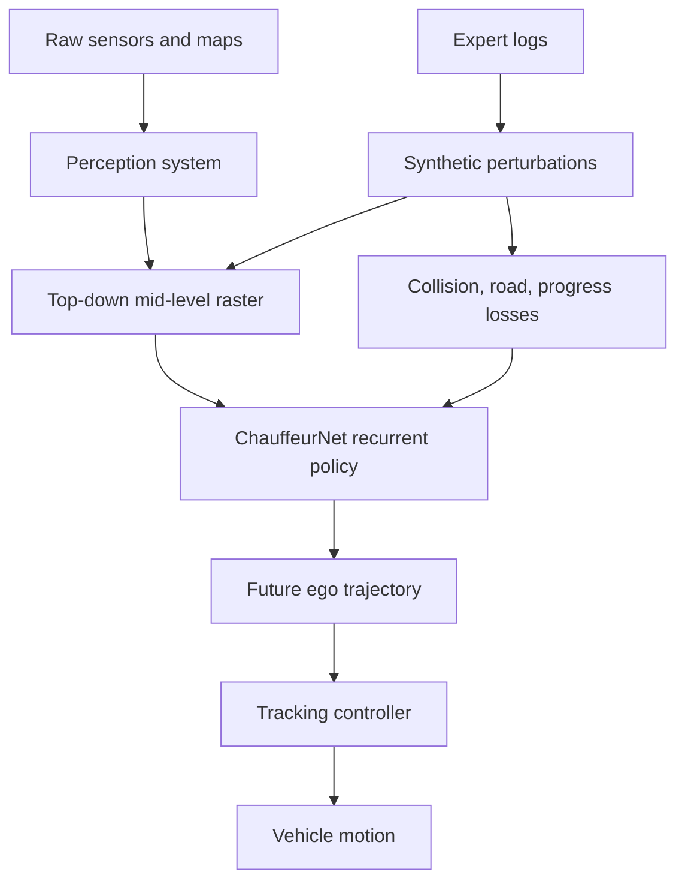

# ChauffeurNet (Bansal et al., 2018)

ChauffeurNet, introduced by Bansal, Krizhevsky, and Ogale in the 2018 arXiv paper "ChauffeurNet: Learning to Drive by Imitating the Best and Synthesizing the Worst," is a mid-to-mid imitation learning system from Waymo. It does not map raw camera pixels directly to steering. Instead, it consumes a top-down, mid-level scene representation produced by perception and maps, and outputs a future ego trajectory for a controller.

The paper is valuable because it states a hard-earned lesson clearly: even 30 million expert driving examples were not enough for pure behavior cloning in complex closed-loop driving. ChauffeurNet augments imitation with synthesized perturbations and extra losses that penalize undesirable events such as collisions, off-road motion, and lack of progress. It is an important bridge between [end-to-end driving](/cs/autonomous-driving/end-to-end-driving) and modular [motion planning](/cs/autonomous-driving/motion-planning).

## Definitions

**Behavior cloning** trains a policy $\pi_\theta$ to imitate expert actions:

$$
\min_\theta \sum_t \ell(\pi_\theta(o_t), a_t^\star).
$$

In driving, this can fail in closed loop because the learned policy visits states that the expert did not visit. Small errors accumulate, creating distribution shift.

**Mid-level input** is a structured representation between raw sensors and final controls. ChauffeurNet uses a top-down rendering of road geometry, route, traffic lights, and dynamic objects represented as oriented 2D boxes. This removes much of the perception burden but still leaves behavior and trajectory generation to the learned model.

**Mid-level output** is a planned trajectory rather than low-level steering and throttle:

$$
\hat{Y}=[(\hat{x}_1,\hat{y}_1),\dots,(\hat{x}_T,\hat{y}_T)].
$$

A conventional controller can then track that trajectory. This keeps actuation constraints and stabilization outside the neural policy.

**Synthetic perturbation** means taking expert driving data and shifting the ego trajectory into imperfect states: slightly off-center, close to collision, or pointed badly. The model is then trained to recover and avoid bad outcomes. Because the input is a top-down scene representation, these perturbations are easier to generate than if the input were raw camera images.

The loss is not only imitation. A simplified objective is

$$
L = L_{\mathrm{imit}}+\lambda_cL_{\mathrm{collision}}+\lambda_rL_{\mathrm{road}}+\lambda_pL_{\mathrm{progress}}.
$$

The exact paper has more details, but the principle is that closed-loop driving needs outcome-aware penalties, not only waypoint regression.

## Key results

The source abstract reports that pure imitation was insufficient even with 30 million real-world expert examples, corresponding to about 60 days of continual driving. ChauffeurNet improved robustness by combining perturbation-based data augmentation with additional losses that discourage collisions, off-road behavior, and lack of progress. The paper reports simulation ablations and real-world driving demonstrations, while carefully noting that highly interactive situations such as merging may still require reinforcement learning or richer simulation.

The key result is methodological: the training distribution must include mistakes if the learned driver is expected to recover from mistakes. Expert-only demonstrations mostly show successful driving. They do not teach what to do after drifting too close to a parked car or entering a narrow street at a bad pose.

ChauffeurNet also illustrates a practical compromise. Fully raw end-to-end driving asks one model to solve perception, prediction, planning, and control. A classical modular stack may require many hand-designed interfaces. ChauffeurNet keeps perception and control as modules, but learns the behavioral trajectory policy. This makes it a **mid-to-mid** system:

$$
\text{perception and map raster} \rightarrow \text{learned trajectory} \rightarrow \text{controller}.
$$

That interface is still influential. Many later systems, including [TransFuser](/cs/autonomous-driving/transfuser), [InterFuser](/cs/autonomous-driving/interfuser), and [UniAD](/cs/autonomous-driving/uniad), output waypoints or trajectories rather than raw actuator commands.

ChauffeurNet's inputs are also a lesson in sample complexity. A raw camera policy must learn what objects are, where the road is, how traffic lights matter, and how to drive. A mid-level raster gives the network object boxes, road structure, route, and traffic-light state in a coordinate frame directly relevant to planning. That does not make the problem easy, but it lets the learning capacity focus on behavior. The price is dependence on the upstream perception and mapping stack: if the raster is wrong, the policy may confidently plan from wrong facts.

The perturbation strategy can be viewed as an offline approximation to on-policy imitation learning. Methods such as DAgger query an expert in states visited by the learner. ChauffeurNet instead synthesizes non-expert states from logged data and defines losses that say why those states are bad. This is not as general as interacting with a perfect expert, but it is practical for real driving logs where deliberately collecting dangerous recovery demonstrations would be unacceptable.

The paper's caution about merging and highly interactive behavior remains important. Offline imitation plus perturbations can teach recovery and rule-following, but some interactions require exploring how other agents respond to ego. That need motivates later closed-loop simulation, reinforcement learning, world models, and interactive planning benchmarks.

Another practical detail is that ChauffeurNet's losses encode values that pure demonstrations leave implicit. Human drivers usually avoid collisions, stay on road, and make progress, but a supervised trajectory loss does not know which of those properties matters most when they conflict. By writing explicit losses, the designer makes the training objective closer to the planner's objective. This is still not a formal safety guarantee, because weights and labels can be wrong, but it is more honest than pretending that waypoint imitation alone captures all driving preferences.

## Visual



| Training signal | What it teaches | Why imitation alone misses it |
|---|---|---|
| Expert trajectory loss | Human-like nominal path | Expert logs rarely include recoveries |
| Collision loss | Avoid occupied space | Collisions are absent or rare in expert data |
| Road/off-route loss | Stay in drivable area | Off-road states are underrepresented |
| Progress loss | Avoid freezing | A safe-looking stopped policy can minimize some errors |
| Perturbations | Recovery from mistakes | Closed-loop errors create non-expert states |

## Worked example 1: Imitation loss with a perturbation

Problem: At a future step, the expert waypoint is $(10,0)$ m. A pure imitation model predicts $(9.5,0.2)$ from the expert state. After a synthetic lateral perturbation, it predicts $(9.0,1.5)$. Compute the squared waypoint errors.

1. Expert-state error:

$$
e_1=(9.5-10,0.2-0)=(-0.5,0.2).
$$

2. Squared error:

$$
\|e_1\|^2=(-0.5)^2+0.2^2=0.25+0.04=0.29.
$$

3. Perturbed-state error:

$$
e_2=(9.0-10,1.5-0)=(-1.0,1.5).
$$

4. Squared error:

$$
\|e_2\|^2=1.0+2.25=3.25.
$$

5. The perturbation creates a much stronger training signal.

Answer: the expert-state waypoint loss is 0.29, while the perturbed-state loss is 3.25.

Check: The perturbed case is not just noisier data; it teaches recovery from states the expert would normally avoid.

## Worked example 2: Adding a collision penalty

Problem: A trajectory has imitation loss $L_{\mathrm{imit}}=0.8$. It intersects an occupied box at two future time steps. The collision penalty is 5 per intersecting step, and $\lambda_c=0.4$. Compute the total loss ignoring other terms.

1. Collision loss before weighting:

$$
L_{\mathrm{collision}}=2\cdot5=10.
$$

2. Weighted collision term:

$$
\lambda_cL_{\mathrm{collision}}=0.4\cdot10=4.
$$

3. Total loss:

$$
L=0.8+4=4.8.
$$

Answer: the total loss is 4.8.

Check: The collision term dominates the small imitation error, which is the intended behavior when a human-like trajectory is unsafe under a perturbation.

## Code

```python
import torch
import torch.nn as nn

class TinyChauffeurNet(nn.Module):
    def __init__(self, channels=16, hidden=128, horizon=10):
        super().__init__()
        self.encoder = nn.Sequential(
            nn.Conv2d(channels, 32, 3, padding=1),
            nn.ReLU(),
            nn.Conv2d(32, 64, 3, stride=2, padding=1),
            nn.ReLU(),
            nn.AdaptiveAvgPool2d(1),
        )
        self.rnn = nn.GRUCell(64, hidden)
        self.out = nn.Linear(hidden, 2)
        self.horizon = horizon

    def forward(self, raster):
        z = self.encoder(raster).flatten(1)
        h = torch.zeros(raster.shape[0], 128, device=raster.device)
        waypoints = []
        for _ in range(self.horizon):
            h = self.rnn(z, h)
            waypoints.append(self.out(h))
        return torch.stack(waypoints, dim=1)

raster = torch.randn(4, 16, 200, 200)
model = TinyChauffeurNet()
print(model(raster).shape)
```

## Common pitfalls

- Calling ChauffeurNet raw end-to-end driving. It uses a mid-level input and a controller output stage.
- Assuming more expert data automatically fixes distribution shift. The paper explicitly reports that pure imitation failed despite very large data.
- Treating perturbations as ordinary noise. They are designed to expose bad states and recovery behavior.
- Penalizing only collisions and forgetting progress. A model can avoid collisions by stopping forever.
- Deploying trajectory outputs without checking controller feasibility. The controller still has acceleration, jerk, steering, and tire constraints.
- Interpreting real-world demonstrations as proof of unrestricted autonomy. The paper's claims are scoped and cautious.

## Connections

- [End-to-end driving](/cs/autonomous-driving/end-to-end-driving)
- [Motion planning](/cs/autonomous-driving/motion-planning)
- [Control, PID, MPC, Pure Pursuit, and Stanley](/cs/autonomous-driving/control-pid-mpc-pure-pursuit-stanley)
- [Simulation and data](/cs/autonomous-driving/simulation-and-data)
- [TransFuser](/cs/autonomous-driving/transfuser)
- [Learning by Cheating](/cs/autonomous-driving/learning-by-cheating)
- Further reading: DAgger, conditional imitation learning, ALVINN, NVIDIA PilotNet, ChauffeurNet, and closed-loop imitation learning.
