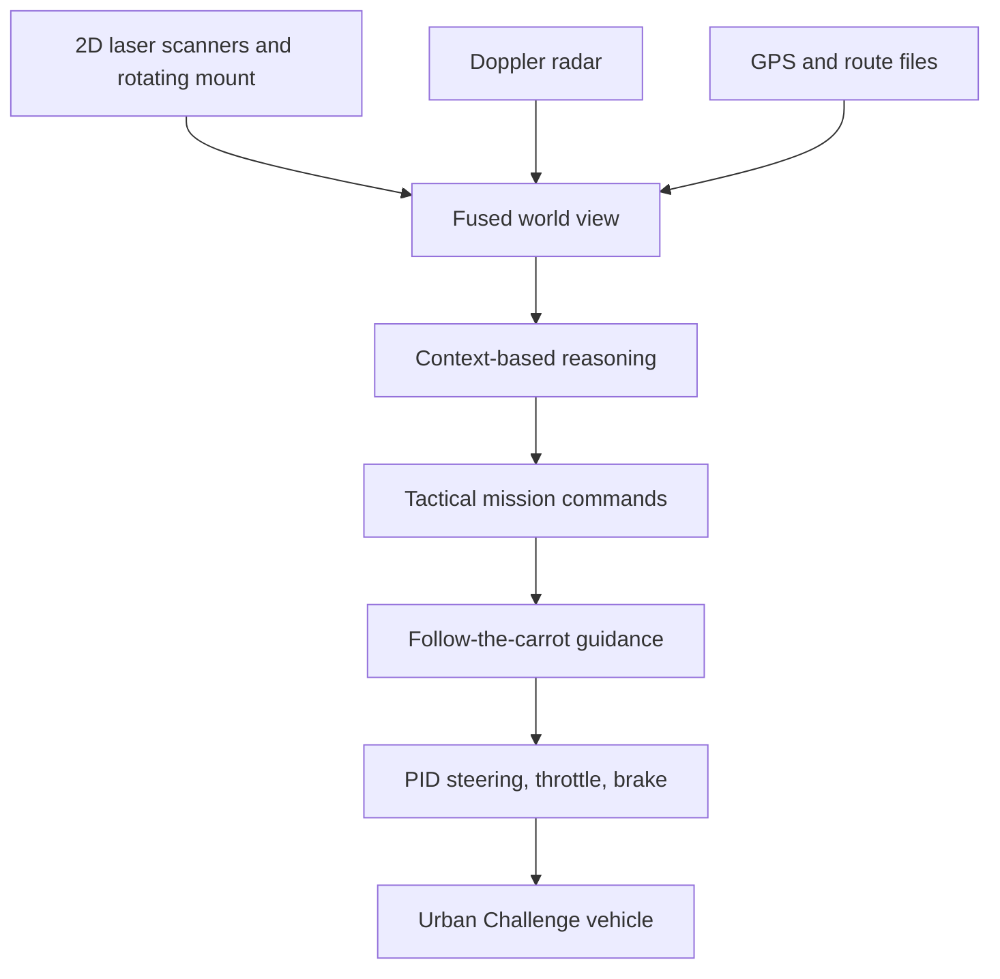

# DARPA Urban Challenge (Patz et al., 2008)

The DARPA Urban Challenge page summarizes Patz and collaborators' Journal of Field Robotics 2008 article "A Practical Approach to Robotic Design for the DARPA Urban Challenge." The paper describes TeamUCF's Knight Rider robot and a pragmatic architecture using multiple low-cost 2D laser scanners, a rotating mount for 3D coverage, radar, GPS, context-based reasoning, tactical mission commands, and PID control.

This historical page is useful because it shows autonomous driving before deep learning became dominant. The 2007 Urban Challenge required robots to navigate urban roads with traffic, stop signs, route networks, parking zones, and blocked roads. Many modern concepts in this wiki, including [ODD](/cs/autonomous-driving/sae-levels-and-operational-design-domain), [sensor fusion](/cs/autonomous-driving/sensor-fusion), [behavior planning](/cs/autonomous-driving/decision-making-and-behavior-planning), and [control](/cs/autonomous-driving/control-pid-mpc-pure-pursuit-stanley), were already present in classical form.

## Definitions

The **DARPA Urban Challenge** was a 2007 competition for autonomous vehicles in an urban environment. Vehicles had to follow California-style driving rules, interact with other vehicles, handle intersections, follow a mission, and operate without real-time human control except safety e-stop.

An **RNDF**, or Route Network Definition File, described the road network with waypoints, lane connectivity, and stop-sign locations. An **MDF**, or Mission Definition File, specified checkpoints to visit in order. In modern terms, RNDF/MDF were map and route inputs.

TeamUCF's architecture used:

- Multiple two-dimensional laser scanners.
- A rotating mount to obtain three-dimensional coverage.
- Range and intensity image processing.
- Doppler radar returns.
- GPS and navigation hardware.
- Context-based reasoning for tactical behavior.
- PID loops and follow-the-carrot guidance for control.

**Follow-the-carrot guidance** selects a lookahead point on the desired path and steers toward it. If the lookahead point is $g=(x_g,y_g)$ in the vehicle frame, a simple curvature command can be proportional to

$$
\kappa \approx \frac{2y_g}{x_g^2+y_g^2}.
$$

This is closely related to pure pursuit.

## Key results

The source abstract reports that the approach yielded a robot that reached the Urban Challenge finals and completed about 2 hours of the event before withdrawing due to a GPS data failure. It also states that the steering control used a relatively simple follow-the-carrot approach demonstrated at speeds of 60 mph, or 97 km/h.

The enduring result is systems engineering. The robot was not built from one massive learned model. It was a set of practical modules:

$$
\text{sensors}\rightarrow\text{world view}\rightarrow\text{reasoning}\rightarrow\text{tactical commands}\rightarrow\text{control}.
$$

The competition environment forced autonomy to be more than lane following. Vehicles needed to handle other traffic, blocked roads, intersections, stop precedence, and mission goals. Those remain central problems.

The paper also demonstrates early ODD thinking. The challenge had a specific road network, speed limits, rules, mission files, and safety procedures. This is not Level 5 autonomy; it is autonomy inside a competition-defined domain.

Modern systems differ in sensors, compute, maps, and learning methods, but the classical design still teaches useful lessons:

1. Robustness often comes from clear interfaces and fallback behavior.
2. Simpler controllers can work when upstream planning produces feasible paths.
3. Sensor failure, such as GPS failure, can dominate the mission outcome.
4. Route-network files and mission files are ancestors of HD map and route planning interfaces.

The paper also shows why autonomy is a system-of-systems problem. TeamUCF reused hardware where possible, selected sensors based on cost and robustness, and relied on a layered architecture because no single module could solve the competition. Perception had to produce a world view, reasoning had to interpret that world view in mission context, and control had to execute commands smoothly. This division remains recognizable in modern AV stacks even when the perception modules are neural networks.

The sensor setup is historically interesting. Multiple 2D scanners plus a rotating mount were a pragmatic substitute for expensive full 3D LiDAR. Radar added velocity cues and robustness. The fusion problem was not a deep-learning feature-fusion problem, but the goal was the same as today: combine complementary sensors into a world model that is reliable enough for planning. The difference is that many modern systems learn parts of the fusion, while DARPA-era systems relied more on geometry, filtering, and hand-designed reasoning.

The competition rules also forced behavior planning. Stop-sign precedence, traffic circles, parking lots, passing, following, and blocked roads require more than geometric path tracking. A vehicle can know where the lane is and still fail if it does not know when to yield. This is why the Urban Challenge remains a useful historical anchor for pages on [decision making](/cs/autonomous-driving/decision-making-and-behavior-planning) and [motion planning](/cs/autonomous-driving/motion-planning).

The reported GPS failure is a reminder that autonomy can fail outside the "AI" component. A perception model can be accurate and a planner can be reasonable, but if localization degrades beyond assumptions, the stack may no longer know which lane, checkpoint, or stop line applies. Modern safety cases therefore include sensor-health monitoring, localization uncertainty, graceful degradation, and minimum-risk maneuvers.

The Urban Challenge also illustrates why maps and missions must be separated. The RNDF described the road network, while the MDF specified the task for a particular run. Modern systems have the same split: a map can describe lanes and rules, while a route planner chooses which parts of that map to traverse. Mixing those concepts can create brittle systems that cannot replan when a road is blocked or a mission changes.

For students used to neural networks, the DARPA architecture is a useful baseline. It shows that perception, reasoning, and control can be understandable and testable even when performance is limited. Modern learned components should be judged against that systems standard: they need not only benchmark accuracy, but also clear failure modes, interfaces, and recovery behavior.

This historical comparison keeps modern deep-dive pages grounded: the names of the modules changed, but the vehicle still has to perceive, decide, plan, control, and fail safely.

That continuity is the main reason the page belongs here.

## Visual



| Classical component | Modern analogue |
|---|---|
| RNDF | HD map / lane graph |
| MDF | Route request / mission planner |
| Laser scanner fusion | LiDAR perception and occupancy |
| Context reasoning | Behavior planner / finite-state machine |
| Follow-the-carrot | Pure pursuit / path tracking |
| PID loops | Low-level longitudinal and lateral control |
| GPS failure handling | Localization health and fallback |

## Worked example 1: Follow-the-carrot curvature

Problem: A lookahead point in the vehicle frame is $g=(10,2)$ m. Use

$$
\kappa=\frac{2y_g}{x_g^2+y_g^2}
$$

to compute path curvature.

1. Numerator:

$$
2y_g=2(2)=4.
$$

2. Denominator:

$$
x_g^2+y_g^2=10^2+2^2=100+4=104.
$$

3. Curvature:

$$
\kappa=\frac{4}{104}=0.03846\ \mathrm{m}^{-1}.
$$

4. Turning radius:

$$
R=\frac{1}{\kappa}\approx26.0\ \mathrm{m}.
$$

Answer: the curvature is about $0.0385\ \mathrm{m}^{-1}$, corresponding to a 26 m radius.

Check: Because the point is mostly ahead and only 2 m lateral, the curvature is moderate.

## Worked example 2: Mission route with a blocked edge

Problem: An RNDF graph has route A-B-C-D, but edge B-C is blocked. Alternate edges are B-E and E-D. Find the replacement path from A to D.

1. Start at A and follow the route to B.

2. At B, the original next edge B-C is invalid.

3. The graph provides an alternate edge B-E.

4. From E, edge E-D reaches the goal.

Answer: the replacement path is A-B-E-D.

Check: This is the same class of problem modern route planners solve when construction or road closures invalidate the nominal route.

## Code

```python
import math

def follow_the_carrot_curvature(x_goal, y_goal):
    denom = x_goal * x_goal + y_goal * y_goal
    if denom < 1e-6:
        return 0.0
    return 2.0 * y_goal / denom

def steering_angle_from_curvature(curvature, wheelbase):
    return math.atan(wheelbase * curvature)

kappa = follow_the_carrot_curvature(10.0, 2.0)
delta = steering_angle_from_curvature(kappa, wheelbase=2.8)
print(kappa, math.degrees(delta))
```

## Common pitfalls

- Reading DARPA systems as obsolete because they predate deep learning. Their architecture and failure modes still matter.
- Treating RNDF routes as full semantic HD maps. They were sparse route-network definitions.
- Ignoring localization health. The paper's event ended because of GPS data failure, not because the controller was too simple.
- Assuming a simple controller is weak. Simple tracking can work well when the path is feasible and state estimates are reliable.
- Comparing competition autonomy directly with public-road deployment. The ODD and validation burden are different.
- Forgetting traffic interaction. The Urban Challenge already required passing, following, stop precedence, and blocked-road behavior.

## Connections

- [SAE levels and operational design domain](/cs/autonomous-driving/sae-levels-and-operational-design-domain)
- [Localization and HD maps](/cs/autonomous-driving/localization-and-hd-maps)
- [Sensor fusion](/cs/autonomous-driving/sensor-fusion)
- [Decision making and behavior planning](/cs/autonomous-driving/decision-making-and-behavior-planning)
- [Control, PID, MPC, Pure Pursuit, and Stanley](/cs/autonomous-driving/control-pid-mpc-pure-pursuit-stanley)
- [Motion planning](/cs/autonomous-driving/motion-planning)
- Further reading: DARPA Grand Challenge, DARPA Urban Challenge technical reports, Junior, Boss, Knight Rider, pure pursuit, and classical robotics architectures.
