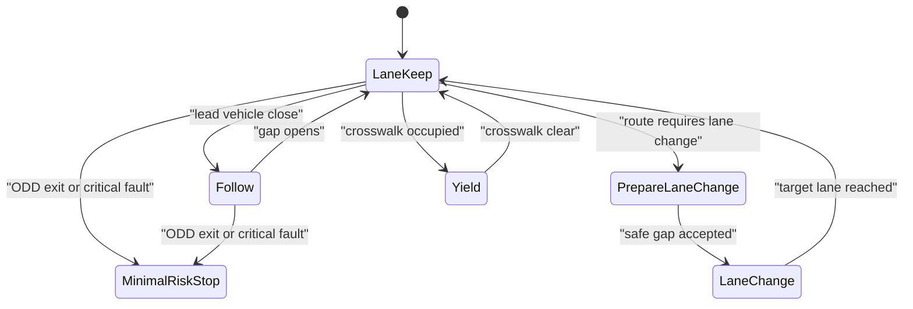

# Decision Making and Behavior Planning

Behavior planning chooses what kind of maneuver the vehicle should perform before motion planning computes the exact trajectory. It answers questions like: should the ego vehicle yield, proceed, change lanes, creep forward, stop for a pedestrian, pull over, or wait for a clearer gap? This layer gives structure to driving decisions that are too semantic for pure trajectory optimization but too concrete for route planning.


*Figure: A real autonomous vehicle grounds the driving stack in a physical platform. Image: [Wikimedia Commons](https://commons.wikimedia.org/wiki/File:Waymo_self-driving_car_front_view.gk.jpg), Grendelkhan, CC BY-SA 4.0.*

This page covers finite-state machines, behavior trees, POMDPs, rule-based and learned planners, and hybrid approaches. It connects the responsibility and ODD concepts from [SAE levels](/cs/autonomous-driving/sae-levels-and-operational-design-domain) to the algorithmic layers in [prediction](/cs/autonomous-driving/prediction-and-motion-forecasting), [motion planning](/cs/autonomous-driving/motion-planning), [control](/cs/autonomous-driving/control-pid-mpc-pure-pursuit-stanley), and [safety](/cs/autonomous-driving/safety-iso26262-sotif-scenario-testing).

## Definitions

A **behavior** is a tactical driving mode or maneuver class: lane keep, follow, yield, stop, nudge, merge, change lane, park, unprotected turn, or minimal-risk stop.

A **finite-state machine** models behavior as states and transitions. States encode current mode, and transitions fire when conditions are met. FSMs are transparent but can grow complex as scenarios multiply.

A **behavior tree** is a hierarchical control structure built from selectors, sequences, decorators, and action nodes. Behavior trees are common in robotics and games because they are modular and readable.

A **POMDP**, or partially observable Markov decision process, models decision-making under uncertainty. It has states, actions, observations, transition probabilities, observation probabilities, rewards, and a belief over hidden state. POMDPs are attractive for driving because intentions are hidden, but exact solutions are usually intractable for real urban scenes.

A **rule-based planner** encodes traffic rules, right-of-way logic, safety distances, and policy constraints explicitly. A **learning-based planner** learns decisions or costs from data, simulation, reinforcement learning, or imitation learning.

A **hybrid planner** combines rules, learned predictions, learned costs, and optimization. Many practical systems are hybrid because pure rules are brittle and pure learning is hard to validate.

**RSS**, Responsibility-Sensitive Safety, is a formal safety model proposed by Mobileye that defines longitudinal and lateral safe-distance rules under specified assumptions. It is not a complete planner, but it is an important reference for safety envelopes.

## Key results

Behavior planning often decomposes driving into three layers:

1. Route-level intent, such as "take the next right."
2. Tactical behavior, such as "prepare lane change" or "yield at crosswalk."
3. Continuous trajectory, such as a 4-second path with speed profile.

This decomposition improves interpretability, but the layers are coupled. A tactical decision can be invalid if no feasible trajectory exists, and a trajectory optimizer may reveal that a supposedly available gap is unsafe.

FSMs are easy to express. Let $s_t$ be the behavior state, $o_t$ observations, and $r_t$ route context. A transition function can be written:

$$
s_{t+1} = T(s_t, o_t, r_t).
$$

The difficulty is managing guard conditions, priority, hysteresis, and conflicting events. Without hysteresis, an FSM can oscillate between "follow" and "change lane" as a gap estimate flickers.

POMDPs represent uncertainty with a belief:

$$
b_t(x) = P(x_t=x \mid o_{1:t}, a_{1:t-1}).
$$

After action $a$ and observation $o$, the belief update is:

$$
b'(x') = \eta\ P(o \mid x',a)\sum_x P(x' \mid x,a)b(x),
$$

where $\eta$ normalizes the distribution. In AVs, hidden variables may include another driver's intent, pedestrian attention, traffic-light occlusion, or whether an object is debris or a bag.

Learning-based planners can imitate expert demonstrations by minimizing:

$$
\mathcal{L} = \sum_t \left\| a_t^{\mathrm{model}} - a_t^{\mathrm{expert}} \right\|^2
$$

or rank candidate trajectories according to expert choices. The risk is covariate shift: after a small mistake, the model enters states unlike the training data.

Rule-based versus learned is a false binary. Rules can enforce non-negotiable constraints such as stop lines and red lights; learned components can estimate intent, comfort, and human-like gap acceptance; optimization can generate smooth feasible motion.

Behavior planning also needs arbitration. Multiple behaviors can be simultaneously desirable: the route may require a lane change, a pedestrian may create a yield obligation, and a sensor fault may request degraded mode. A common design assigns priority to safety-critical and legal constraints before comfort or route progress. This priority structure should be explicit, tested, and logged. Otherwise a rare interaction between features can cause the vehicle to make a locally reasonable but globally unsafe choice.

Hysteresis and memory are part of correctness, not cosmetic smoothing. A behavior planner that forgets why it stopped may creep repeatedly into the same blocked intersection. A planner that changes its mind every frame can confuse other road users. State should capture commitments, timers, negotiations, and the reason for a maneuver when those facts affect safe behavior.

## Visual



## Worked example 1: Designing FSM transition guards

Problem: Design transition guards for a lane-change behavior from `LaneKeep` to `PrepareLaneChange` to `LaneChange`. The route requires being in the left lane within 300 m. The ego vehicle has speed 20 m/s. A safe target-lane gap requires at least 2.5 s behind and 2.0 s ahead.

1. Compute time to lane requirement if speed stays constant:

$$
t = \frac{300}{20}=15\ \mathrm{s}.
$$

2. A reasonable planner should prepare before the last instant. Suppose it starts preparing when time to requirement is below 20 s. The condition is met because 15 s is below 20 s.

3. Define `LaneKeep` to `PrepareLaneChange` guard:

$$
\mathrm{route\ requires\ lane} \land t_{\mathrm{requirement}} < 20\ \mathrm{s}.
$$

4. Define `PrepareLaneChange` to `LaneChange` guard:

$$
\mathrm{gap\ behind} \geq 2.5\ \mathrm{s}
\land
\mathrm{gap\ ahead} \geq 2.0\ \mathrm{s}
\land
\mathrm{target\ lane\ legal}
\land
\mathrm{no\ conflict}.
$$

5. Add hysteresis. If the gap flickers around the threshold, require the guard to hold for 0.5 s before transitioning.

Answer: the planner should enter `PrepareLaneChange` now, but only execute `LaneChange` after a stable safe gap exists.

Check: The behavior state is not equivalent to steering. `PrepareLaneChange` may adjust speed to create a gap before lateral motion begins.

## Worked example 2: Belief update for a pedestrian intention

Problem: A pedestrian near a crosswalk may either cross or wait. Prior belief is $P(\mathrm{cross})=0.4$ and $P(\mathrm{wait})=0.6$. The observation is that the pedestrian looks toward traffic and steps closer to the curb. Likelihoods are $P(o \mid \mathrm{cross})=0.8$ and $P(o \mid \mathrm{wait})=0.3$. Compute the posterior.

1. Compute unnormalized cross probability:

$$
\tilde{b}(\mathrm{cross}) = 0.8 \times 0.4 = 0.32.
$$

2. Compute unnormalized wait probability:

$$
\tilde{b}(\mathrm{wait}) = 0.3 \times 0.6 = 0.18.
$$

3. Normalize:

$$
Z = 0.32+0.18=0.50.
$$

4. Posterior cross probability:

$$
P(\mathrm{cross}\mid o)=\frac{0.32}{0.50}=0.64.
$$

5. Posterior wait probability:

$$
P(\mathrm{wait}\mid o)=\frac{0.18}{0.50}=0.36.
$$

Answer: the belief that the pedestrian will cross rises from 0.4 to 0.64.

Check: The observation is more likely under the crossing hypothesis, so the posterior shifts toward crossing but does not become certain.

## Code

```python
from enum import Enum, auto

class Behavior(Enum):
    LANE_KEEP = auto()
    PREPARE_LANE_CHANGE = auto()
    LANE_CHANGE = auto()
    YIELD = auto()
    MINIMAL_RISK_STOP = auto()

def next_behavior(state, ctx):
    if ctx["critical_fault"] or ctx["outside_odd"]:
        return Behavior.MINIMAL_RISK_STOP
    if ctx["crosswalk_occupied"]:
        return Behavior.YIELD
    if state == Behavior.LANE_KEEP:
        if ctx["route_requires_lane_change"] and ctx["time_to_lane_need_s"] < 20.0:
            return Behavior.PREPARE_LANE_CHANGE
    if state == Behavior.PREPARE_LANE_CHANGE:
        safe_gap = ctx["gap_behind_s"] >= 2.5 and ctx["gap_ahead_s"] >= 2.0
        if safe_gap and ctx["target_lane_legal"] and ctx["guard_stable_s"] >= 0.5:
            return Behavior.LANE_CHANGE
    if state == Behavior.LANE_CHANGE and ctx["target_lane_reached"]:
        return Behavior.LANE_KEEP
    return state

ctx = {
    "critical_fault": False,
    "outside_odd": False,
    "crosswalk_occupied": False,
    "route_requires_lane_change": True,
    "time_to_lane_need_s": 15.0,
    "gap_behind_s": 3.0,
    "gap_ahead_s": 2.5,
    "target_lane_legal": True,
    "guard_stable_s": 0.6,
    "target_lane_reached": False,
}
print(next_behavior(Behavior.PREPARE_LANE_CHANGE, ctx))
```

## Common pitfalls

- Encoding every case as another FSM state. Large flat state machines become hard to test and reason about.
- Omitting hysteresis. Noisy perception can make behavior oscillate between incompatible modes.
- Treating traffic law as the whole driving policy. Legal behavior can still be uncomfortable, confusing, or unsafe if poorly timed.
- Treating learned behavior as unconstrained. Learned planners still need rule compliance, safety envelopes, and fallback behavior.
- Ignoring planner-prediction coupling. Other agents react to the ego vehicle's choices.
- Making fallback a last-minute patch. Minimal-risk behavior should be designed and tested as part of the behavior system.

## Connections

- [SAE levels and operational design domain](/cs/autonomous-driving/sae-levels-and-operational-design-domain)
- [Prediction and motion forecasting](/cs/autonomous-driving/prediction-and-motion-forecasting)
- [Motion planning](/cs/autonomous-driving/motion-planning)
- [Control: PID, MPC, pure pursuit, and Stanley](/cs/autonomous-driving/control-pid-mpc-pure-pursuit-stanley)
- [Safety, ISO 26262, SOTIF, and scenario testing](/cs/autonomous-driving/safety-iso26262-sotif-scenario-testing)
- [Reinforcement learning](/cs/reinforcement-learning/)
- Further reading: behavior trees in robotics, POMDP planning, Mobileye RSS, imitation learning for driving, and rule-based motion planning in autonomous vehicles.
