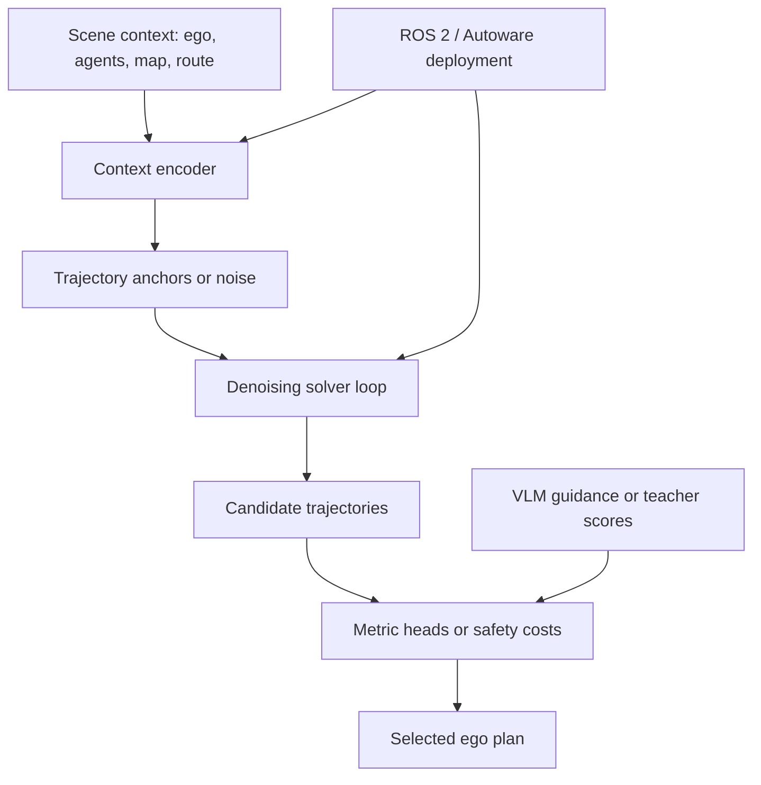

# Diffusion Planning for Driving (Hydra-MDP, DiffVLA, Autoware Benchmark)

Diffusion planning for driving uses iterative denoising, trajectory vocabularies, or generative policies to produce ego trajectories. This page synthesizes several source-folder papers: Hydra-MDP, DiffVLA, and the 2026 open-source modular benchmark for diffusion-based motion planning in Autoware/AWSIM. It also connects to broader work such as Diffusion Planner, DiffusionDrive, and diffusion world models.

This is a modern-context page. Classical [motion planning](/cs/autonomous-driving/motion-planning) often searches or optimizes over trajectories with explicit costs. Diffusion planners learn a trajectory distribution and sample or denoise candidate plans. That gives them a natural way to represent multimodality, but it raises deployment questions about latency, solver steps, closed-loop behavior, and safety constraints.

## Definitions

A **diffusion planner** starts from noisy trajectory variables and iteratively denoises them under scene context:

$$
x_{t-\Delta t}=F_\theta(x_t,c,t),
$$

where $x_t$ is a noisy trajectory and $c$ is context such as ego history, neighbor agents, lanes, route, traffic lights, and goal.

A **trajectory vocabulary** is a discrete set of representative trajectories, often built by clustering human driving data. Hydra-MDP and DiffVLA-style systems use vocabularies or anchors to represent multimodal candidate futures.

**Hydra-MDP** uses multi-target hydra-distillation: a student planner learns from human and rule-based teachers, with multiple heads corresponding to different evaluation metrics or costs. It achieved first place in the Navsim challenge according to the paper.

**DiffVLA** combines VLM guidance, hybrid sparse-dense perception, and diffusion-based planning. Its source abstract reports 45.0 PDMS in the Autonomous Grand Challenge 2025 setting.

The **Autoware modular benchmark** decomposes a monolithic ONNX diffusion planner into context encoder, DiT core, and turn indicator modules, then reimplements DPM-Solver++ in C++ as a ROS 2 node. Its source abstract reports 3.2x latency reduction from encoder caching and a 41 percent FDE reduction at $N=3$ when using second-order solving rather than first-order.

## Key results

The shared result is that diffusion is no longer only an offline planning benchmark idea. Papers are moving toward closed-loop and stack-integrated evaluation. The Autoware benchmark is especially important because it asks whether diffusion planners can survive production-stack constraints: ROS 2 communication, scheduling, ONNX/TensorRT deployment, solver parameter tuning, and real-time cycle budgets.

Diffusion planners are attractive because driving behavior is multimodal. At an intersection, multiple trajectories can be reasonable: stop, creep, yield, turn, or proceed. A regression planner trained with L2 loss tends to average modes. A diffusion planner can maintain a distribution over modes and choose among sampled candidates using learned or explicit scores.

The cost is iterative inference. If each denoising step calls a transformer, runtime scales with the number of steps:

$$
T_{\mathrm{plan}}\approx T_{\mathrm{encoder}}+N\,T_{\mathrm{denoise}}+T_{\mathrm{post}}.
$$

This is why solver choice, step count, caching, and modular deployment matter. A planner that is excellent at 20 steps may miss a 100 ms planning budget. The Autoware benchmark shows how moving the solver loop outside the graph allows runtime-configurable step count, solver order, and observability.

Hydra-MDP adds another lesson: learned planners should be aligned with closed-loop metrics, not only imitation distance. Distilling rule-based teacher scores into the planner lets the model learn costs for collision, drivable-area compliance, comfort, and other metrics without non-differentiable post-processing.

Diffusion planning also changes the meaning of "best trajectory." A deterministic planner often returns one optimized path. A diffusion planner can sample many plausible paths, score them, and select one. This is attractive in scenes where several choices are legal, such as merging, nudging around a parked vehicle, or yielding at an uncontrolled intersection. The planner can preserve alternatives longer instead of collapsing immediately to an average.

The sampling process must still be controlled. A trajectory distribution learned from human data may include aggressive or locally common behaviors that are not acceptable under the target safety policy. Candidate selection needs explicit constraints or learned metric heads. Hydra-MDP's multi-target heads and DiffVLA's VLM-guided planning are two attempts to shape the distribution toward safer and more semantically appropriate choices.

The Autoware benchmark adds an engineering point often missing from research papers: exported neural networks are not the whole planner. Solvers, schedulers, middleware, memory copies, and runtime configuration determine whether a model can run in a vehicle-like stack. Moving the denoising loop into native C++ and caching the context encoder are not just optimizations; they make solver behavior observable and tunable during closed-loop experiments.

The remaining hard problem is assurance. Even if a diffusion planner samples a comfortable, collision-free plan in simulation, a safety case needs bounds on failure modes, monitoring when denoising produces invalid trajectories, and fallback behavior when runtime budget is exceeded.

A deployment-oriented diffusion planner should therefore expose intermediate candidates and scores. If denoising produces a trajectory outside the drivable area, the stack should detect that before control. If the solver is interrupted after fewer steps than planned, the system should know whether the partial sample is usable. If all sampled candidates violate constraints, the planner should switch to a conservative fallback rather than choosing the least bad sample silently.

The solver comparison in the Autoware benchmark is valuable because it treats inference as part of the algorithm. DDIM, first-order DPM-Solver++, second-order DPM-Solver++, timestep schedules, and step counts are not interchangeable implementation details; they change the trajectory distribution under a fixed latency budget. For driving, inference-time choices can be safety-relevant.

Diffusion planning also pairs naturally with learned scoring heads. Sampling creates options; scoring selects behavior. The quality of the score function determines whether multimodality becomes robust planning or just random variation.

For students, the practical question is not "is diffusion better?" but "can the stack sample, score, verify, and execute a trajectory inside the available time budget?"

That framing keeps the method tied to vehicle constraints.

It also keeps benchmark scores in perspective.

## Visual



| System | Main idea | Deployment lesson |
|---|---|---|
| Hydra-MDP | Multi-target teacher-student distillation | Learn closed-loop metric costs |
| DiffVLA | VLM-guided sparse-dense diffusion planning | Use language guidance but preserve planner structure |
| Modular Autoware benchmark | External C++ solver and decomposed ONNX | Evaluate latency and solver choices in stack |
| DiffusionDrive/Diffusion Planner | Denoising trajectories | Step count and sampling quality trade off |

## Worked example 1: Runtime budget with denoising steps

Problem: A diffusion planner has encoder time 18 ms, denoising core time 9 ms per step, and post-processing time 4 ms. Compute total time for $N=3$, $N=7$, and $N=10$ steps. Which fit a 100 ms budget?

1. Formula:

$$
T=18+9N+4=22+9N.
$$

2. For $N=3$:

$$
T=22+27=49\ \mathrm{ms}.
$$

3. For $N=7$:

$$
T=22+63=85\ \mathrm{ms}.
$$

4. For $N=10$:

$$
T=22+90=112\ \mathrm{ms}.
$$

Answer: 3 and 7 steps fit the 100 ms budget; 10 steps does not.

Check: This explains why runtime-configurable solvers matter. The best benchmark step count may not fit the vehicle stack.

## Worked example 2: Distilling a rule-based collision score

Problem: A trajectory vocabulary has three candidates with teacher collision-safe labels $[1,0,1]$. A hydra head predicts probabilities $[0.8,0.3,0.4]$. Compute binary cross-entropy loss averaged over candidates.

1. BCE for candidate 1:

$$
-\log(0.8)=0.223.
$$

2. Candidate 2 has label 0:

$$
-\log(1-0.3)=-\log(0.7)=0.357.
$$

3. Candidate 3:

$$
-\log(0.4)=0.916.
$$

4. Average:

$$
L=\frac{0.223+0.357+0.916}{3}=0.499.
$$

Answer: the average collision-score distillation loss is about 0.499.

Check: Candidate 3 dominates the loss because the model assigned low safety probability to a safe teacher label.

## Code

```python
import torch

def diffusion_runtime_ms(encoder_ms, core_ms, post_ms, steps):
    return encoder_ms + core_ms * steps + post_ms

def bce_distillation(pred, target):
    pred = pred.clamp(1e-6, 1 - 1e-6)
    return -(target * pred.log() + (1 - target) * (1 - pred).log()).mean()

for n in [3, 7, 10]:
    print(n, diffusion_runtime_ms(18, 9, 4, n))

pred = torch.tensor([0.8, 0.3, 0.4])
target = torch.tensor([1.0, 0.0, 1.0])
print(bce_distillation(pred, target))
```

## Common pitfalls

- Evaluating diffusion planners only in open-loop replay.
- Ignoring middleware and deployment latency. ROS 2 and scheduling can change feasible step counts.
- Freezing solver parameters inside a monolithic exported graph.
- Assuming more denoising steps always improve closed-loop behavior under a fixed reaction budget.
- Treating VLM guidance as a replacement for collision and drivable-area checks.
- Optimizing imitation distance while ignoring closed-loop metrics.
- Forgetting that sampled trajectories still need a safety monitor and controller.

## Connections

- [Motion planning](/cs/autonomous-driving/motion-planning)
- [World Models for Driving](/cs/autonomous-driving/world-models-for-driving)
- [AutoVLA](/cs/autonomous-driving/autovla)
- [VAD](/cs/autonomous-driving/vad)
- [Simulation and data](/cs/autonomous-driving/simulation-and-data)
- [Safety, ISO 26262, SOTIF, and scenario testing](/cs/autonomous-driving/safety-iso26262-sotif-scenario-testing)
- Further reading: Hydra-MDP, DiffVLA, Diffusion Planner, DiffusionDrive, DPM-Solver++, DDIM, Autoware, AWSIM, and Navsim.
