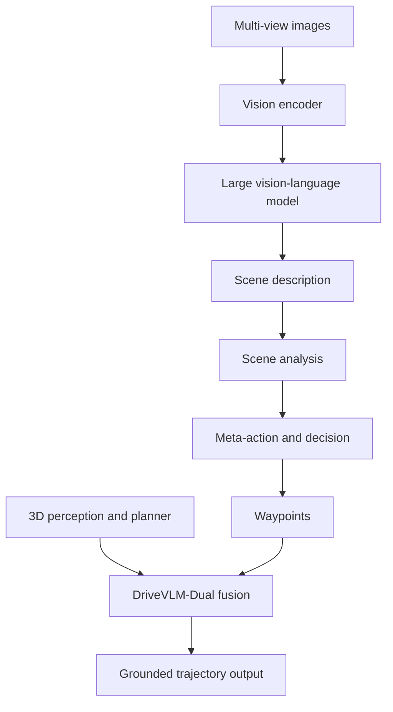

# DriveVLM (Tian et al., 2024)

DriveVLM, introduced by Tian, Gu, Li, Liu, Wang, Zhao, Zhan, Jia, Lang, and Zhao in "DriveVLM: The Convergence of Autonomous Driving and Large Vision-Language Models," uses a vision-language model for scene description, scene analysis, and hierarchical planning. The paper also proposes DriveVLM-Dual, a hybrid system that combines VLM reasoning with conventional 3D perception and planning modules.

The system reflects a recent shift in autonomous-driving research: language is no longer only a post-hoc explanation layer. It can become part of the driving policy's reasoning interface. DriveVLM is not a replacement for [perception](/cs/autonomous-driving/perception-object-detection-and-segmentation), [prediction](/cs/autonomous-driving/prediction-and-motion-forecasting), or [planning](/cs/autonomous-driving/motion-planning); its strongest form is a dual system that uses language reasoning where it helps and traditional modules where geometry and frequency matter.

## Definitions

A **vision-language model** maps image tokens and text tokens into a shared reasoning process. In DriveVLM, camera images are encoded and passed to an LLM-like module that outputs text and planning tokens.

DriveVLM organizes reasoning into three stages:

1. **Scene description:** describe weather, road type, lane conditions, and critical objects.
2. **Scene analysis:** reason about how critical objects affect ego behavior.
3. **Hierarchical planning:** produce meta-actions, decision descriptions, and future waypoints.

The planning chain can be written as

$$
I_{1:n}\rightarrow E_{\mathrm{scene}}\rightarrow A_{\mathrm{analysis}}\rightarrow (m,d,\hat{Y}),
$$

where $m$ is a meta-action, $d$ is a decision rationale, and $\hat{Y}$ is a waypoint sequence.

**DriveVLM-Dual** combines this slow reasoning module with a faster conventional driving pipeline. The paper compares this to fast and slow thinking: the VLM helps with complex semantic scenarios, while traditional perception and planning provide spatial grounding and high-frequency control.

The paper defines a **scene understanding and planning** task and introduces SUP-AD, an in-house dataset and evaluation setup for scene analysis and meta-action planning. The source also reports experiments on nuScenes.

## Key results

The source abstract reports that DriveVLM and DriveVLM-Dual were evaluated on nuScenes and the authors' SUP-AD dataset, and that DriveVLM-Dual was deployed on a production vehicle. The paper claims improved handling of complex and unpredictable driving conditions in its evaluation. These are paper-scoped results; the broader reliability of VLM driving systems remains an open research question.

The most important idea is hierarchy. VLMs are weak at exact geometry and can be slow, but strong at language-conditioned interpretation. DriveVLM therefore asks the model to reason in intermediate semantic steps rather than directly emit low-level controls. A generated plan might say: critical object is a parked police car blocking the right lane; slow down; shift left; then produce waypoints.

DriveVLM-Dual recognizes the limitations directly. Spatial grounding, real-time planning, and control are still better handled by specialized modules. The VLM can guide decisions, identify unusual objects, and provide explanations, while 3D detectors, occupancy networks, and planners preserve metric structure.

This dual design is a recurring pattern in post-2024 driving papers. Fully language-native control is attractive, but deployed systems need deterministic timing, calibrated perception, and fallback behavior. A hybrid system can use VLM reasoning as a high-level advisor rather than a single point of failure.

DriveVLM's chain is also a prompt-engineering and data-design statement. If the model is trained only to output waypoints, it may learn shortcut correlations. If it is trained to describe critical objects, analyze influence, and then plan, supervision can target intermediate reasoning. That can make failures more inspectable: an incorrect final plan can be traced to a missed object description, a wrong influence analysis, or a bad numeric waypoint.

The difficulty is that intermediate language is not automatically faithful. A model can produce a plausible rationale after choosing a trajectory for unrelated reasons. Therefore, a DriveVLM-style system should be evaluated for consistency between perception evidence, text reasoning, and action. For example, if the text says "left lane is clear," the perception module should support that claim. If the waypoints shift left, the route and lane geometry should allow it.

DriveVLM-Dual is the more practical design because it accepts that VLMs are weak at metric spatial reasoning. A traditional 3D detector or occupancy network can provide grounded object positions. A motion planner can enforce dynamics. The VLM can add commonsense and semantic interpretation, especially for unusual objects or complex human behavior. The open research problem is how to combine these components without creating an untestable chain of trust.

A useful way to read DriveVLM is as a semantic bottleneck. It asks the model to identify what matters in the scene before producing a plan. This can help with long-tail cases where object category alone is insufficient: a police car parked diagonally, a worker holding a sign, or a vehicle with hazard lights may require interpretation beyond bounding boxes. Language gives the system a vocabulary for those interpretations.

The bottleneck can also lose information. Text summaries may omit exact distance, velocity, or lane geometry. If the downstream planner trusts the summary too much, it can miss metric risk. That is why DriveVLM-Dual's grounding modules are not optional details; they compensate for information lost in language abstraction.

For evaluation, DriveVLM-style systems need consistency tests. The scene description, analysis, meta-action, and waypoints should agree with each other and with sensor evidence. A contradiction among those layers is itself a failure signal, even if the final route completion score is acceptable.

That consistency requirement is one reason hybrid VLM systems remain attractive: metric modules can challenge the language layer instead of silently trusting a fluent plan.

## Visual



| Stage | Example output | Risk if wrong |
|---|---|---|
| Scene description | "Right lane blocked by parked vehicle" | Missed or hallucinated object |
| Scene analysis | "Object blocks ego lane, left lane passable" | Bad causal interpretation |
| Meta-action | "Slow down and shift left" | Unsafe maneuver choice |
| Waypoints | Numeric future positions | Poor metric grounding |
| Dual-system grounding | Detector/planner consistency | Interface mismatch |

## Worked example 1: From object description to meta-action

Problem: The scene description says: ego is in the right lane at 8 m/s; a stopped truck occupies the right lane 25 m ahead; the left lane is clear for 40 m; the route continues straight. Produce a conservative hierarchical decision.

1. Identify critical object: stopped truck in ego lane.

2. Estimate time to object without braking:

$$
t=\frac{25}{8}=3.125\ \mathrm{s}.
$$

3. Determine available maneuver: left lane is clear for 40 m, so a left shift is plausible.

4. Conservative meta-action: slow down and prepare lane change left.

5. Decision description: reduce speed to increase margin, check left-lane clearance, move left if safe, then continue straight.

Answer: the plan should be "slow down, shift left if clearance remains, pass the stopped truck, and continue straight."

Check: A pure "go straight" action would collide with the truck. A pure "change left" action without slowing may be risky if the left-lane assessment changes.

## Worked example 2: Waypoint plausibility check

Problem: A VLM-generated waypoint sequence is $(2,0)$, $(4,0)$, $(6,0)$, $(8,0)$ over 4 seconds. A parked object begins at $x=7$ in the same lane. Does the sequence need refinement?

1. The last waypoint is $(8,0)$.

2. The obstacle starts at $x=7$ and shares $y=0$.

3. The final waypoint goes beyond the obstacle location in the same lane.

4. If the vehicle footprint and safety margin require stopping before $x=7$, then $(8,0)$ is unsafe.

5. A dual planner should either stop before the object or shift laterally into a clear lane.

Answer: yes, the sequence needs refinement.

Check: Language reasoning may identify the obstacle, but numeric waypoints still require geometric validation.

## Code

```python
from dataclasses import dataclass

@dataclass
class SceneFact:
    object_type: str
    distance_m: float
    lane: str
    ego_speed_mps: float
    adjacent_lane_clear_m: float

def hierarchical_drivevlm_policy(fact: SceneFact) -> dict:
    ttc = fact.distance_m / max(fact.ego_speed_mps, 1e-3)
    if fact.object_type == "stopped_vehicle" and fact.lane == "ego":
        if fact.adjacent_lane_clear_m > 30 and ttc < 5:
            return {"meta_action": "slow_down_and_change_left", "ttc": ttc}
        return {"meta_action": "slow_down_or_stop", "ttc": ttc}
    return {"meta_action": "continue", "ttc": ttc}

fact = SceneFact("stopped_vehicle", 25.0, "ego", 8.0, 40.0)
print(hierarchical_drivevlm_policy(fact))
```

## Common pitfalls

- Treating fluent explanations as reliable perception. VLMs can hallucinate or miss spatial details.
- Asking a VLM to output precise controls without geometric validation.
- Ignoring latency. Large VLM reasoning may be too slow for high-frequency control.
- Assuming a dual system is automatically safe. The VLM-to-planner interface must be tested.
- Overgeneralizing from SUP-AD or nuScenes experiments to unrestricted road autonomy.
- Confusing meta-actions with executable trajectories. A planner still has to satisfy kinematics and collision constraints.

## Connections

- [VLA for Driving Survey](/cs/autonomous-driving/vla-for-driving-survey)
- [MLLM for Driving Survey](/cs/autonomous-driving/mllm-for-driving-survey)
- [AutoVLA](/cs/autonomous-driving/autovla)
- [Decision making and behavior planning](/cs/autonomous-driving/decision-making-and-behavior-planning)
- [Motion planning](/cs/autonomous-driving/motion-planning)
- [Safety, ISO 26262, SOTIF, and scenario testing](/cs/autonomous-driving/safety-iso26262-sotif-scenario-testing)
- Further reading: DriveVLM, DriveLM, GPT-Driver, Dolphins, Senna, Reason2Drive, and language-conditioned planning.
