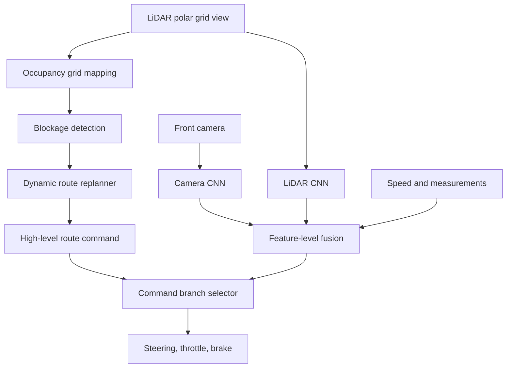

# Dynamic Conditional Imitation Learning (Eraqi et al., 2022)

Dynamic Conditional Imitation Learning, introduced by Eraqi, Moustafa, and Honer in IEEE Transactions on Intelligent Transportation Systems in 2022, extends conditional imitation learning with LiDAR-camera fusion, occupancy grid mapping, road-blockage avoidance, and dynamic route planning. It is not a single monolithic neural planner; it is a hybrid between learned command-conditioned control and explicit mapping/planning logic.

The paper addresses a weakness of early conditional imitation learning in CARLA: a model may follow lanes and obey high-level commands, yet fail to generalize to new towns, weather, and unexpected static road blockages. This page connects [end-to-end driving](/cs/autonomous-driving/end-to-end-driving), [sensor fusion](/cs/autonomous-driving/sensor-fusion), and [decision making](/cs/autonomous-driving/decision-making-and-behavior-planning).

## Definitions

**Conditional imitation learning** trains a driving network with a high-level command $c$:

$$
u_t = \pi_\theta(o_t, m_t, c_t),
$$

where $o_t$ is sensor observation, $m_t$ is a measurement vector such as speed, and $u_t$ contains steering, throttle, and brake. The command selects behavior such as follow lane, turn left, turn right, or go straight.

**Dynamic CIL** adds two major elements:

1. Feature-level fusion of camera and LiDAR.
2. Occupancy-grid-based route replanning around temporary road blockages.

An **occupancy grid map** is a top-down grid in which each cell stores whether space is free, occupied, or unknown. A probabilistic version stores log-odds:

$$
\ell_t(c)=\ell_{t-1}(c)+\log\frac{p(c\mid z_t)}{1-p(c\mid z_t)}-\ell_0(c),
$$

where $z_t$ is the sensor observation and $\ell_0$ is the prior log-odds.

The paper uses a polar grid view for LiDAR and a front-facing camera stream. Feature-level fusion lets the network use camera semantics and LiDAR geometry together. The global route planner then updates commands when a blockage invalidates the current route.

## Key results

The source abstract reports that the method improved weather consistency by about four times, autonomous driving success-rate generalization by 52 percent, global-route-planner success by 37 percent, road-blockage-avoidance success by 27 percent, and kilometers before collision with a static object by 1.5 times on the CARLA benchmark setup used by the paper. These numbers are scoped to the authors' simulator modifications and evaluation protocol.

The technical result is that "end-to-end" does not have to mean "no explicit planning." Dynamic CIL keeps a learned command-conditioned control policy, but it uses an occupancy grid to detect blockages and a route planner to change the command sequence. This is a practical response to a common failure: a neural policy trained to follow a route may not decide to reroute when the road is blocked.

The method also illustrates two levels of conditioning:

1. **Local command conditioning:** choose the network branch for immediate maneuver.
2. **Dynamic route conditioning:** update future commands based on map and obstacle changes.

The broader lesson is that learned driving policies need support from online world models. Static route commands are not enough when the environment changes. A temporary construction zone, parked truck, or lane closure can invalidate the planned path. Occupancy mapping gives the system a concrete representation for such changes.

Dynamic CIL is also a useful example of conservative engineering around a learned policy. The neural network is not asked to discover every behavior from pixels. It receives a command from a topological planner, fuses camera and LiDAR for local control, and can be corrected by occupancy-grid information. This design accepts that some parts of autonomy are easier to specify algorithmically than to learn from a limited benchmark dataset.

The LiDAR branch addresses a particular weakness of camera-only CIL: depth and obstacle proximity. A front camera may recognize texture and lane appearance, but range is ambiguous and weather-sensitive. A LiDAR polar grid view makes nearby obstacles more explicit. Feature-level fusion lets the policy use both types of information before the command-conditioned control head.

The route-replanning layer also changes evaluation. In the original CIL setting, a route command can be correct according to the static map but wrong because a lane is temporarily blocked. Dynamic CIL tests whether the system can update the route command after observing the blockage. This is closer to real driving, where construction, stopped vehicles, emergency scenes, and debris often require tactical rerouting.

The limitation is that the explicit components introduce their own thresholds and assumptions. Occupancy-grid resolution, blockage detection criteria, and route-graph connectivity can all affect behavior. A hybrid system should therefore be tested both as a neural policy and as an integrated map-planning-control loop.

The "dynamic" part is especially relevant to operational design domains. A model trained for clear, unblocked streets has a different ODD from a system that can detect partial lane closures and reroute. Adding blockage handling expands the scenario set, but only to the extent covered by the sensors, occupancy logic, and route graph. A construction zone with cones, workers, temporary signs, and human flaggers may require richer semantic understanding than an occupancy grid alone.

The paper also illustrates a recurring pattern in AV research: a learned controller may perform well on a benchmark's nominal tasks, then fail when the environment violates a hidden assumption. Here the hidden assumption is that the route remains traversable. Making that assumption explicit and adding a map update mechanism is a meaningful systems improvement even if the neural architecture itself is not the most modern.

In a production stack, one would also want confidence-aware replanning. If a blockage detector is uncertain, the vehicle might slow, request more observations, or choose a conservative stop rather than immediately rerouting. Dynamic CIL gives the basic mechanism; safety engineering determines how much authority it should have.

This makes the paper a compact example of stack integration: learning improves local control, LiDAR improves geometry, occupancy grids expose road changes, and route planning changes the command stream.

## Visual



| Component | Learned or explicit | Role |
|---|---|---|
| Camera encoder | Learned | Semantic visual features |
| LiDAR encoder | Learned | Geometry and range features |
| Command branches | Learned | Maneuver-conditioned control |
| Occupancy grid | Explicit mapping | Free/occupied road state |
| Blockage avoidance | Algorithmic | Detect blocked lane or road |
| Global replanner | Algorithmic | Change route and commands |

## Worked example 1: Updating log-odds occupancy

Problem: A grid cell has prior probability $p_0=0.5$, so prior log-odds $\ell_0=0$. A LiDAR observation suggests occupancy probability $p=0.8$. The previous log-odds is $\ell_{t-1}=0.4$. Compute the updated log-odds.

1. Observation log-odds:

$$
\log\frac{p}{1-p}=\log\frac{0.8}{0.2}=\log 4\approx1.386.
$$

2. Update rule with $\ell_0=0$:

$$
\ell_t=0.4+1.386-0=1.786.
$$

3. Convert back to probability:

$$
p_t=\frac{1}{1+\exp(-1.786)}\approx0.856.
$$

Answer: the cell probability rises to about 0.856.

Check: The probability increased because both the previous belief and new observation support occupancy.

## Worked example 2: Command update under blockage

Problem: A vehicle has a planned route A-B-C-D. The occupancy grid marks segment B-C as blocked. An alternate graph has edges A-B, B-E, E-D, and C-D. What route should the replanner return?

1. The original route contains blocked edge B-C, so it is invalid.

2. Remove B-C from the road graph.

3. From B, the available alternate edge is B-E.

4. From E, the edge E-D reaches the destination.

5. The new route is A-B-E-D.

Answer: the replanner should switch from A-B-C-D to A-B-E-D.

Check: The local command sequence must also change. If B-E requires a left turn, the high-level command sent to the CIL network must reflect that.

## Code

```python
import heapq

def shortest_path(graph, start, goal, blocked_edges):
    queue = [(0.0, start, [start])]
    seen = set()
    while queue:
        cost, node, path = heapq.heappop(queue)
        if node == goal:
            return path
        if node in seen:
            continue
        seen.add(node)
        for nxt, weight in graph.get(node, []):
            if (node, nxt) in blocked_edges:
                continue
            heapq.heappush(queue, (cost + weight, nxt, path + [nxt]))
    return None

graph = {
    "A": [("B", 1)],
    "B": [("C", 1), ("E", 1.2)],
    "C": [("D", 1)],
    "E": [("D", 1.1)],
}
print(shortest_path(graph, "A", "D", blocked_edges={("B", "C")}))
```

## Common pitfalls

- Treating command conditioning as route planning. Commands guide a local policy; they do not by themselves discover detours.
- Using camera-only CIL in weather or lighting shifts without additional robustness mechanisms.
- Assuming occupancy grids are perfect. LiDAR sparsity, moving objects, and threshold choices can create false blockages.
- Forgetting to update high-level commands after replanning.
- Comparing simulator percentages outside the paper's modified benchmark setup.
- Building an explicit planner but not testing its interaction with the learned controller.

## Connections

- [End-to-end driving](/cs/autonomous-driving/end-to-end-driving)
- [Decision making and behavior planning](/cs/autonomous-driving/decision-making-and-behavior-planning)
- [Sensor fusion](/cs/autonomous-driving/sensor-fusion)
- [Simulation and data](/cs/autonomous-driving/simulation-and-data)
- [Learning by Cheating](/cs/autonomous-driving/learning-by-cheating)
- [Motion planning](/cs/autonomous-driving/motion-planning)
- Further reading: Conditional Imitation Learning, CARLA, occupancy grid mapping, topological route planning, and hybrid learned-planning systems.
