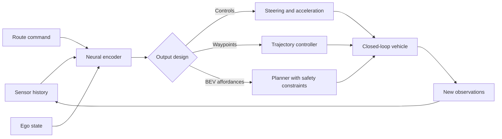

# End-to-End Driving

End-to-end driving uses learning to map sensor inputs, route commands, and context directly to driving actions or trajectories. The idea is old: ALVINN learned steering from camera images in the late 1980s, and modern systems have revived the approach with deep networks, large datasets, imitation learning, transformers, world models, and closed-loop simulation. The attraction is that the model can learn interactions that are hard to hand-code. The risk is that validation, interpretability, rare-event coverage, and safety arguments become much harder.

This page introduces imitation learning, conditional imitation learning, PilotNet-style models, world-model approaches, Tesla FSD as a public example of a heavily learned driving stack, and the distinction between pure end-to-end and modular learned systems. It complements the modular stack pages on [perception](/cs/autonomous-driving/perception-object-detection-and-segmentation), [prediction](/cs/autonomous-driving/prediction-and-motion-forecasting), [planning](/cs/autonomous-driving/motion-planning), and [safety](/cs/autonomous-driving/safety-iso26262-sotif-scenario-testing).

## Definitions

**End-to-end driving** usually means training a model to map observations directly to low-level controls or planned trajectories. The input may be camera images, lidar, radar, map context, navigation commands, ego state, and previous frames. The output may be steering, acceleration, waypoints, occupancy, cost maps, or a full trajectory.

**Imitation learning** trains a policy to match expert behavior. In driving, the expert may be a human driver, a safety driver, a rule-based planner, or a curated fleet log.

**Behavior cloning** is supervised imitation learning. It minimizes a loss between model output and expert action:

$$
\mathcal{L}_{\mathrm{BC}} = \sum_t \left\|\pi_\theta(o_t) - a_t^{\mathrm{expert}}\right\|^2.
$$

**Conditional imitation learning** adds a high-level command such as follow lane, turn left, turn right, or go straight. This avoids averaging incompatible maneuvers at intersections.

**PilotNet** refers to NVIDIA's end-to-end convolutional driving model that learned steering from front-camera images. **ALVINN** was an earlier neural-network lane-following system by Dean Pomerleau. These are historical anchors, not complete modern robotaxi stacks.

**World models** learn a latent model of environment dynamics and use it for planning or policy learning. Dreamer-style reinforcement learning systems learn compact latent dynamics, though direct deployment to real road autonomy requires substantially stronger safety engineering than game or simulator tasks.

**Closed-loop evaluation** tests a policy by letting it act and affect future states. **Open-loop evaluation** scores predictions or actions on logged data without changing the scene. End-to-end policies can look good open-loop and fail closed-loop because their own errors move them out of the expert data distribution.

## Key results

The classic behavior-cloning problem is covariate shift. Training data contains expert observations $o \sim d_{\mathrm{expert}}$, but deployment observations come from the learned policy distribution $d_{\pi}$. Small mistakes lead to states the expert rarely visited, and the model has little training signal there. Dataset aggregation methods such as DAgger address this by collecting expert labels on states induced by the learned policy.

End-to-end does not have to mean uninterpretable scalar controls. A model can output future waypoints, a BEV occupancy representation, affordances, cost maps, or candidate trajectories. These intermediate outputs can be more inspectable and easier to constrain than raw steering.

Conditional imitation learning solves a simple multimodality issue. Suppose a dataset contains equal examples of turning left and right from the same visual approach to an intersection. A model trained to output steering without route command may average the two and drive straight into an invalid region. Adding command $c$ changes the policy to:

$$
a_t = \pi_\theta(o_t, c_t).
$$

Modern learned driving stacks often mix modular and end-to-end ideas. Public descriptions of Tesla FSD emphasize large-scale fleet data, multi-camera neural networks, occupancy or vector-space representations, and learned planning components. Public descriptions of Waymo, Mobileye, Aurora, Zoox, and others vary, but production AVs generally retain safety monitors, fallback systems, and extensive validation infrastructure. The important foundational point is not which company is "pure" end-to-end; it is how learned components are constrained, tested, and integrated.

World models attempt to learn:

$$
p_\theta(z_{t+1} \mid z_t, a_t),
$$

where $z_t$ is a latent state. If the model can predict future occupancy, agent motion, and rewards, a planner can evaluate actions in latent space. The challenge is rare hazards: a world model trained mostly on normal driving may be overconfident on unusual construction, emergency vehicles, sensor faults, or adversarial inputs.

Evaluation is the bottleneck. End-to-end models can improve quickly under offline loss while regressing on rare closed-loop cases. A credible workflow therefore combines open-loop imitation metrics, closed-loop simulation, scenario suites, intervention analysis, safety monitors, and targeted data mining. The model may be learned, but the release process still needs requirements, versioned datasets, regression gates, and a clear ODD.

Safety wrappers are not an admission that learning failed. They are how learned behavior becomes part of an engineered system. Speed limits, collision checks, RSS-like envelopes, lane constraints, driver monitoring, and minimal-risk maneuvers can constrain a learned planner while still allowing it to handle nuanced interactions.

Training data also encodes driving culture and policy choices. Human demonstrations may include rolling stops, aggressive merges, or local habits that are not acceptable for an automated system. Imitation learning therefore needs data curation and policy filtering, not only more miles.

## Visual



## Worked example 1: Why route conditioning matters

Problem: At a T-intersection, a training set has two equally common expert actions from visually similar observations: steering $-10^\circ$ for left turns and $+10^\circ$ for right turns. A behavior-cloning model without route command minimizes mean squared steering error by predicting one value. What steering does it learn?

1. The loss for a constant prediction $\hat{a}$ over the two actions is:

$$
L(\hat{a}) = \frac{1}{2}(\hat{a} - (-10))^2 + \frac{1}{2}(\hat{a}-10)^2.
$$

2. Differentiate:

$$
\frac{dL}{d\hat{a}}
= \frac{1}{2}2(\hat{a}+10)+\frac{1}{2}2(\hat{a}-10)
= (\hat{a}+10)+(\hat{a}-10)
= 2\hat{a}.
$$

3. Set derivative to zero:

$$
2\hat{a}=0 \Rightarrow \hat{a}=0.
$$

Answer: the model predicts $0^\circ$, which means straight, even though neither expert action was straight.

Check: This is the averaging problem. With route command, the model can learn separate outputs for left and right.

## Worked example 2: Open-loop error compounding

Problem: A learned steering policy has an average lateral deviation growth of 0.10 m per second after small mistakes. If it starts centered in a 3.6 m lane and no correction occurs for 8 s, estimate lateral deviation and remaining margin to the lane boundary.

1. Lane half-width is:

$$
\frac{3.6}{2}=1.8\ \mathrm{m}.
$$

2. Lateral deviation after 8 s is:

$$
0.10 \times 8 = 0.80\ \mathrm{m}.
$$

3. Remaining margin to lane boundary:

$$
1.8 - 0.80 = 1.0\ \mathrm{m}.
$$

Answer: the vehicle is 0.8 m off center with about 1.0 m margin to the lane boundary.

Check: The policy may still be inside the lane, but this simple calculation ignores curvature, other traffic, and recovery dynamics. Closed-loop testing is needed because errors can grow nonlinearly.

## Code

```python
import torch
import torch.nn as nn

class ConditionalDrivingPolicy(nn.Module):
    def __init__(self, num_commands=4):
        super().__init__()
        self.image_encoder = nn.Sequential(
            nn.Conv2d(3, 16, kernel_size=5, stride=2),
            nn.ReLU(),
            nn.Conv2d(16, 32, kernel_size=5, stride=2),
            nn.ReLU(),
            nn.AdaptiveAvgPool2d((1, 1)),
        )
        self.command_embed = nn.Embedding(num_commands, 8)
        self.head = nn.Sequential(
            nn.Linear(32 + 8 + 2, 64),
            nn.ReLU(),
            nn.Linear(64, 3),  # steering, throttle, brake
        )

    def forward(self, image, command, ego_speed_and_yaw_rate):
        feat = self.image_encoder(image).flatten(1)
        cmd = self.command_embed(command)
        x = torch.cat([feat, cmd, ego_speed_and_yaw_rate], dim=1)
        return self.head(x)

model = ConditionalDrivingPolicy()
image = torch.randn(2, 3, 160, 320)
command = torch.tensor([1, 2])
ego = torch.tensor([[12.0, 0.01], [8.0, -0.02]])
print(model(image, command, ego).shape)
```

## Common pitfalls

- Treating open-loop imitation accuracy as proof of driving competence. Closed-loop distribution shift is the central problem.
- Outputting raw controls when waypoints or trajectories would be easier to constrain and inspect.
- Ignoring route conditioning. Without commands, multimodal intersections can collapse into unsafe averages.
- Training mostly on normal driving and expecting robust rare-event behavior. Safety-critical tails need targeted data, simulation, and validation.
- Using end-to-end as a reason to skip requirements, monitors, or fallback design. Learned policies still need safety envelopes.
- Overclaiming from company demos or public talks. Public architecture descriptions are incomplete and should not be treated as full internal designs.

## Connections

- [Perception, object detection, and segmentation](/cs/autonomous-driving/perception-object-detection-and-segmentation)
- [Prediction and motion forecasting](/cs/autonomous-driving/prediction-and-motion-forecasting)
- [Motion planning](/cs/autonomous-driving/motion-planning)
- [Safety, ISO 26262, SOTIF, and scenario testing](/cs/autonomous-driving/safety-iso26262-sotif-scenario-testing)
- [Deep learning](/cs/deep-learning/)
- [Reinforcement learning](/cs/reinforcement-learning/)
- Further reading: Pomerleau's ALVINN, NVIDIA PilotNet, conditional imitation learning for driving, DAgger, Dreamer world models, and public technical talks from major AV developers.
