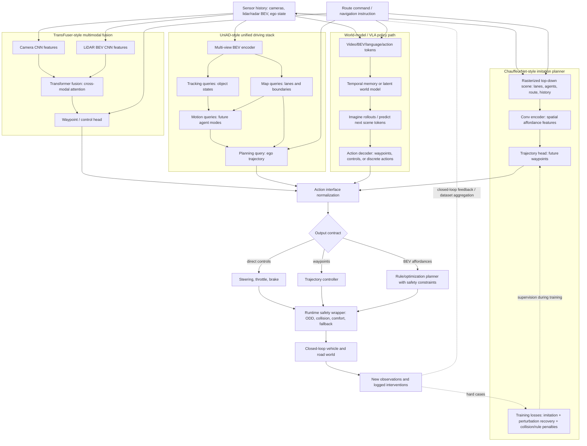

# End-to-End Driving

End-to-end driving uses learning to map sensor inputs, route commands, and context directly to driving actions or trajectories. The idea is old: ALVINN learned steering from camera images in the late 1980s, and modern systems have revived the approach with deep networks, large datasets, imitation learning, transformers, world models, and closed-loop simulation. The attraction is that the model can learn interactions that are hard to hand-code. The risk is that validation, interpretability, rare-event coverage, and safety arguments become much harder.

This page introduces imitation learning, conditional imitation learning, PilotNet-style models, world-model approaches, Tesla FSD as a public example of a heavily learned driving stack, and the distinction between pure end-to-end and modular learned systems. It complements the modular stack pages on [perception](/cs/autonomous-driving/perception-object-detection-and-segmentation), [prediction](/cs/autonomous-driving/prediction-and-motion-forecasting), [planning](/cs/autonomous-driving/motion-planning), and [safety](/cs/autonomous-driving/safety-iso26262-sotif-scenario-testing).

## Definitions

**End-to-end driving** usually means training a model to map observations directly to low-level controls or planned trajectories. The input may be camera images, lidar, radar, map context, navigation commands, ego state, and previous frames. The output may be steering, acceleration, waypoints, occupancy, cost maps, or a full trajectory.

**Imitation learning** trains a policy to match expert behavior. In driving, the expert may be a human driver, a safety driver, a rule-based planner, or a curated fleet log.

**Behavior cloning** is supervised imitation learning. It minimizes a loss between model output and expert action:

$$
\mathcal{L}_{\mathrm{BC}} = \sum_t \left\|\pi_\theta(o_t) - a_t^{\mathrm{expert}}\right\|^2.
$$

**Conditional imitation learning** adds a high-level command such as follow lane, turn left, turn right, or go straight. This avoids averaging incompatible maneuvers at intersections.

**PilotNet** refers to NVIDIA's end-to-end convolutional driving model that learned steering from front-camera images. **ALVINN** was an earlier neural-network lane-following system by Dean Pomerleau. These are historical anchors, not complete modern robotaxi stacks.

**World models** learn a latent model of environment dynamics and use it for planning or policy learning. Dreamer-style reinforcement learning systems learn compact latent dynamics, though direct deployment to real road autonomy requires substantially stronger safety engineering than game or simulator tasks.

**Closed-loop evaluation** tests a policy by letting it act and affect future states. **Open-loop evaluation** scores predictions or actions on logged data without changing the scene. End-to-end policies can look good open-loop and fail closed-loop because their own errors move them out of the expert data distribution.

## Key results

The classic behavior-cloning problem is covariate shift. Training data contains expert observations $o \sim d_{\mathrm{expert}}$, but deployment observations come from the learned policy distribution $d_{\pi}$. Small mistakes lead to states the expert rarely visited, and the model has little training signal there. Dataset aggregation methods such as DAgger address this by collecting expert labels on states induced by the learned policy.

End-to-end does not have to mean uninterpretable scalar controls. A model can output future waypoints, a BEV occupancy representation, affordances, cost maps, or candidate trajectories. These intermediate outputs can be more inspectable and easier to constrain than raw steering.

Conditional imitation learning solves a simple multimodality issue. Suppose a dataset contains equal examples of turning left and right from the same visual approach to an intersection. A model trained to output steering without route command may average the two and drive straight into an invalid region. Adding command $c$ changes the policy to:

$$
a_t = \pi_\theta(o_t, c_t).
$$

Modern learned driving stacks often mix modular and end-to-end ideas. Public descriptions of Tesla FSD emphasize large-scale fleet data, multi-camera neural networks, occupancy or vector-space representations, and learned planning components. Public descriptions of Waymo, Mobileye, Aurora, Zoox, and others vary, but production AVs generally retain safety monitors, fallback systems, and extensive validation infrastructure. The important foundational point is not which company is "pure" end-to-end; it is how learned components are constrained, tested, and integrated.

World models attempt to learn:

$$
p_\theta(z_{t+1} \mid z_t, a_t),
$$

where $z_t$ is a latent state. If the model can predict future occupancy, agent motion, and rewards, a planner can evaluate actions in latent space. The challenge is rare hazards: a world model trained mostly on normal driving may be overconfident on unusual construction, emergency vehicles, sensor faults, or adversarial inputs.

Evaluation is the bottleneck. End-to-end models can improve quickly under offline loss while regressing on rare closed-loop cases. A credible workflow therefore combines open-loop imitation metrics, closed-loop simulation, scenario suites, intervention analysis, safety monitors, and targeted data mining. The model may be learned, but the release process still needs requirements, versioned datasets, regression gates, and a clear ODD.

Safety wrappers are not an admission that learning failed. They are how learned behavior becomes part of an engineered system. Speed limits, collision checks, RSS-like envelopes, lane constraints, driver monitoring, and minimal-risk maneuvers can constrain a learned planner while still allowing it to handle nuanced interactions.

Training data also encodes driving culture and policy choices. Human demonstrations may include rolling stops, aggressive merges, or local habits that are not acceptable for an automated system. Imitation learning therefore needs data curation and policy filtering, not only more miles.

### Classical pipelines as the baseline

End-to-end systems should be compared against the classical autonomy stack they aim to simplify. The DARPA Urban Challenge work by Patz and collaborators [1] is useful because it predates modern deep learning but already contains the main system pattern: sensors, fused world view, context reasoning, tactical commands, path tracking, and PID control.

The competition architecture can be summarized as:

$$
\text{sensors}\rightarrow\text{world view}\rightarrow\text{reasoning}\rightarrow\text{tactical command}\rightarrow\text{control}.
$$

Route Network Definition Files acted like early lane graphs, Mission Definition Files acted like route goals, and context reasoning handled stop signs, blocked roads, passing, and intersections. A simple follow-the-carrot controller selected a lookahead point $g=(x_g,y_g)$ and used curvature:

$$
\kappa\approx\frac{2y_g}{x_g^2+y_g^2}.
$$

Worked example: if the lookahead point is $(10,2)$ m, then $\kappa=4/104=0.0385\ \mathrm{m}^{-1}$, a turning radius of about 26 m. The lesson is not that this controller is sufficient for modern robotaxis; it is that understandable interfaces and fallback behavior were already central before neural policies entered the stack.

### Mid-level and privileged imitation


*Figure: ChauffeurNet represents driving with mid-level inputs and planning-shaped outputs for robust imitation learning. From [Bansal et al., 2018](https://arxiv.org/abs/1812.03079) — embedded under educational fair use with attribution.*

Behavior cloning fails when closed-loop errors push the vehicle into states absent from expert logs. ChauffeurNet [2] addressed this by using a mid-level top-down scene representation, predicting future ego waypoints, synthesizing perturbations, and adding losses for collisions, off-road motion, and lack of progress:

$$
L=L_{\mathrm{imit}}+\lambda_cL_{\mathrm{collision}}+\lambda_rL_{\mathrm{road}}+\lambda_pL_{\mathrm{progress}}.
$$

This is still a learned driving policy, but it is not raw pixels to steering. The upstream stack provides boxes, road geometry, route, and traffic-light context; a controller tracks the predicted trajectory. That mid-to-mid interface remains influential because it gives the learner a planning-shaped input and a controllable output.

Learning by Cheating [3] used a different training decomposition. A privileged teacher first learns from simulator ground truth such as BEV lanes, objects, and traffic lights; a deployable camera-based student then distills that teacher:

$$
\text{expert demonstrations}\rightarrow\text{privileged teacher}\rightarrow\text{sensorimotor student}.
$$

The method is valuable as a supervision strategy, not as a claim that real vehicles may use privileged state. It separates "learn to act" from "learn to see" and gives the student command-conditioned waypoint labels in simulator states where ordinary demonstrations may provide only one branch.

Dynamic conditional imitation learning [4] shows how learned control can be embedded in explicit mapping and routing. It fuses camera and LiDAR features for command-conditioned control, maintains an occupancy grid, detects blockages, and replans the route when the current command stream becomes invalid. A log-odds occupancy update has the form:

$$
\ell_t(c)=\ell_{t-1}(c)+\log\frac{p(c\mid z_t)}{1-p(c\mid z_t)}-\ell_0(c).
$$

Compact pseudo-code for this hybrid pattern:

```python
features = fuse(camera_encoder(image), lidar_encoder(lidar_grid))
control = command_head(features, route_command, ego_state)
grid = update_occupancy(grid, lidar_grid)
if blocked(route_edge, grid):
    route_command = replan_route(map_graph, blocked_edges)
```

The common theme is that imitation learning improves when the training distribution includes mistakes, the output is a trajectory or waypoint sequence, and explicit system modules handle facts that are easier to specify than to infer.

### Transformer fusion for learned driving policies


*Figure: TransFuser uses multi-scale transformer fusion between camera and LiDAR features for waypoint-based driving. From [Chitta et al., 2022](https://arxiv.org/abs/2205.15997) — embedded under educational fair use with attribution.*


*Figure: InterFuser exposes interpretable sensor-fusion features that feed a safety-constrained driving controller. From [Shao et al., 2022](https://arxiv.org/abs/2207.14024) — embedded under educational fair use with attribution.*

Multi-modal end-to-end policies must decide where sensor streams meet. TransFuser [5] uses transformer attention to fuse camera and LiDAR features at multiple scales before predicting waypoints. Its contribution is global cross-modal context: a traffic light in an image, an obstacle in BEV, and the ego route may be far apart in feature coordinates but tightly related for driving.

Self-attention over concatenated image and LiDAR tokens computes:

$$
\mathrm{Attention}(Q,K,V)=\mathrm{softmax}\left(\frac{QK^\top}{\sqrt{d}}\right)V.
$$

If one scale has 64 image tokens and 64 LiDAR tokens, one attention head computes $(128)^2=16384$ pairwise scores. This explains both the appeal and the cost of transformer fusion.

InterFuser [6] adds a second lesson: a learned driving policy should expose intermediate signals that safety logic can inspect. It predicts waypoints plus interpretable features such as object density and traffic-rule signals, then uses a safety controller to filter or adjust the final action:

$$
\mathcal{U}_{\mathrm{safe}}=\{u:g_j(u,M_t)\le 0,\ j=1,\ldots,J\}.
$$

Worked example: if a proposed waypoint $(8,0)$ m is only $0.54$ m from an obstacle and the clearance threshold is $1.0$ m, the controller should reject or modify it. The intermediate "mind map" is useful only because it participates in the action interface; a post-hoc explanation with no operational role would be much weaker.

### Planning-oriented full-stack learning


*Figure: VAD connects BEV features, vectorized agent and map queries, ego planning, and vectorized planning constraints. From [Jiang et al., 2023](https://arxiv.org/abs/2303.12077) — embedded under educational fair use with attribution.*

Unified learned stacks try to train perception, prediction, and planning around the final ego plan rather than around isolated module metrics. UniAD [7] uses query-based transformer modules for tracks, map elements, motion forecasts, occupancy, and ego planning. A simplified information flow is:

$$
Q_{\mathrm{track}}\rightarrow Q_{\mathrm{motion}}\rightarrow Q_{\mathrm{ego}}\rightarrow \hat{Y}_{\mathrm{ego}}.
$$

This is not merely "many heads on one backbone." Track queries carry dynamic agents, map queries carry road structure, motion queries carry future hypotheses, occupancy gives dense risk, and the ego query attends to them before producing waypoints. The design makes the plan the organizing objective.

VAD [8] takes a vectorized route through the same problem. Instead of relying only on dense raster maps, it predicts agent and map vectors and applies explicit vector constraints for collision, boundary, and lane-direction consistency:

$$
\hat{Y}_{\mathrm{ego}}=f(q_{\mathrm{ego}},Q_a,Q_m,s_{\mathrm{ego}},c).
$$

A simple collision margin to predicted agent waypoints is:

$$
L_{\mathrm{coll}}=\frac{1}{T}\sum_t\max_i\max(0,r-\|\hat{y}_t-\hat{a}_{i,t}\|_2).
$$

Worked example: if an ego waypoint is $(5.0,1.0)$ m and a predicted agent waypoint is $(5.6,1.3)$ m, the distance is $\sqrt{0.45}=0.671$ m. With radius $r=1.0$ m, the violation is $0.329$ m. This is the classical planning instinct, written as a differentiable or trainable vector constraint inside a learned planner.

The practical tradeoff is complexity. Unified models can improve task coordination, but they are harder to train, debug, schedule, and validate. Production systems usually still need independent monitors and fallback behavior even when the main planner is learned.

### Generative planning and world models


*Figure: MILE shows how a learned world model can imagine multiple BEV semantic futures from driving context. From [Hu et al., 2022](https://arxiv.org/abs/2210.07729) — embedded under educational fair use with attribution.*


*Figure: DriveDreamer grounds a driving world model in structured traffic constraints and action-conditioned future video. From [Wang et al., 2023](https://arxiv.org/abs/2309.09777) — embedded under educational fair use with attribution.*


*Figure: GAIA-1 demonstrates generative world-model rollouts controlled by video prompts, text, and ego actions. From [Hu et al., 2023](https://arxiv.org/abs/2309.17080) — embedded under educational fair use with attribution.*

World models learn future scene distributions conditioned on observations, actions, maps, text, or traffic structure. DriveDreamer [9] and GAIA-1 [10] are representative generative driving systems: the first uses diffusion and traffic-structure conditioning, while the second uses latent sequence modeling with video, text, and action inputs. The planning-relevant object is an action-conditioned future:

$$
p_\theta(s_{t+1:t+T}\mid s_{\le t},a^{\mathrm{ego}}_{t:t+T},c).
$$

Rendering realism is not enough. A world model used for planning must preserve geometry, traffic rules, and causal reaction. If ego braking and ego acceleration generate the same future, the model is not action-grounded enough to evaluate plans.

Diffusion planners generate ego trajectories by iterative denoising:

$$
x_{t-\Delta t}=F_\theta(x_t,c,t),
$$

then score or constrain the resulting candidates. Hydra-MDP [11] uses multi-target teacher-student distillation so a learned planner can absorb human and rule-based planning signals. DiffVLA [12] combines VLM guidance with sparse-dense diffusion planning. A 2026 Autoware/AWSIM benchmark [13] showed why deployment details matter by decomposing a monolithic diffusion planner, moving the solver loop into C++, and measuring solver order, step count, and latency inside ROS 2.

Runtime is part of the algorithm. If the context encoder takes 18 ms, each denoising step takes 9 ms, and post-processing takes 4 ms, then:

$$
T_{\mathrm{plan}}=18+9N+4=22+9N.
$$

Three steps take 49 ms, seven take 85 ms, and ten take 112 ms. Under a 100 ms planning budget, the ten-step version is not deployable no matter how good it looks offline. A diffusion planner needs candidate scoring, constraint checks, and a fallback when no sampled trajectory is safe or the solver overruns.

## Visual




*Figure: UniAD organizes perception, prediction, mapping, occupancy, and planning around the final ego trajectory. From [Hu et al., 2023](https://arxiv.org/abs/2212.10156) — embedded under educational fair use with attribution.*

This diagram compares end-to-end driving families by their internal contracts. ChauffeurNet uses rasterized top-down inputs and imitation losses, TransFuser fuses camera and lidar features with attention, UniAD exposes tracking/map/motion/planning queries, and world-model or VLA systems route tokens through memory and rollout before a safety wrapper turns outputs into vehicle motion.

## Worked example 1: Why route conditioning matters

Problem: At a T-intersection, a training set has two equally common expert actions from visually similar observations: steering $-10^\circ$ for left turns and $+10^\circ$ for right turns. A behavior-cloning model without route command minimizes mean squared steering error by predicting one value. What steering does it learn?

1. The loss for a constant prediction $\hat{a}$ over the two actions is:

$$
L(\hat{a}) = \frac{1}{2}(\hat{a} - (-10))^2 + \frac{1}{2}(\hat{a}-10)^2.
$$

2. Differentiate:

$$
\frac{dL}{d\hat{a}}
= \frac{1}{2}2(\hat{a}+10)+\frac{1}{2}2(\hat{a}-10)
= (\hat{a}+10)+(\hat{a}-10)
= 2\hat{a}.
$$

3. Set derivative to zero:

$$
2\hat{a}=0 \Rightarrow \hat{a}=0.
$$

Answer: the model predicts $0^\circ$, which means straight, even though neither expert action was straight.

Check: This is the averaging problem. With route command, the model can learn separate outputs for left and right.

## Worked example 2: Open-loop error compounding

Problem: A learned steering policy has an average lateral deviation growth of 0.10 m per second after small mistakes. If it starts centered in a 3.6 m lane and no correction occurs for 8 s, estimate lateral deviation and remaining margin to the lane boundary.

1. Lane half-width is:

$$
\frac{3.6}{2}=1.8\ \mathrm{m}.
$$

2. Lateral deviation after 8 s is:

$$
0.10 \times 8 = 0.80\ \mathrm{m}.
$$

3. Remaining margin to lane boundary:

$$
1.8 - 0.80 = 1.0\ \mathrm{m}.
$$

Answer: the vehicle is 0.8 m off center with about 1.0 m margin to the lane boundary.

Check: The policy may still be inside the lane, but this simple calculation ignores curvature, other traffic, and recovery dynamics. Closed-loop testing is needed because errors can grow nonlinearly.

## Code

```python
import torch
import torch.nn as nn

class ConditionalDrivingPolicy(nn.Module):
    def __init__(self, num_commands=4):
        super().__init__()
        self.image_encoder = nn.Sequential(
            nn.Conv2d(3, 16, kernel_size=5, stride=2),
            nn.ReLU(),
            nn.Conv2d(16, 32, kernel_size=5, stride=2),
            nn.ReLU(),
            nn.AdaptiveAvgPool2d((1, 1)),
        )
        self.command_embed = nn.Embedding(num_commands, 8)
        self.head = nn.Sequential(
            nn.Linear(32 + 8 + 2, 64),
            nn.ReLU(),
            nn.Linear(64, 3),  # steering, throttle, brake
        )

    def forward(self, image, command, ego_speed_and_yaw_rate):
        feat = self.image_encoder(image).flatten(1)
        cmd = self.command_embed(command)
        x = torch.cat([feat, cmd, ego_speed_and_yaw_rate], dim=1)
        return self.head(x)

model = ConditionalDrivingPolicy()
image = torch.randn(2, 3, 160, 320)
command = torch.tensor([1, 2])
ego = torch.tensor([[12.0, 0.01], [8.0, -0.02]])
print(model(image, command, ego).shape)
```

## Common pitfalls

- Treating open-loop imitation accuracy as proof of driving competence. Closed-loop distribution shift is the central problem.
- Outputting raw controls when waypoints or trajectories would be easier to constrain and inspect.
- Ignoring route conditioning. Without commands, multimodal intersections can collapse into unsafe averages.
- Training mostly on normal driving and expecting robust rare-event behavior. Safety-critical tails need targeted data, simulation, and validation.
- Using end-to-end as a reason to skip requirements, monitors, or fallback design. Learned policies still need safety envelopes.
- Overclaiming from company demos or public talks. Public architecture descriptions are incomplete and should not be treated as full internal designs.

## Connections

- [Perception, object detection, and segmentation](/cs/autonomous-driving/perception-object-detection-and-segmentation)
- [Prediction and motion forecasting](/cs/autonomous-driving/prediction-and-motion-forecasting)
- [Motion planning](/cs/autonomous-driving/motion-planning)
- [Safety, ISO 26262, SOTIF, and scenario testing](/cs/autonomous-driving/safety-iso26262-sotif-scenario-testing)
- [Deep learning](/cs/deep-learning/)
- [Reinforcement learning](/cs/reinforcement-learning/)
- Further reading: Pomerleau's ALVINN, NVIDIA PilotNet, conditional imitation learning for driving, DAgger, Dreamer world models, and public technical talks from major AV developers.

## References

[1] J. Patz et al. *A Practical Approach to Robotic Design for the DARPA Urban Challenge*. Journal of Field Robotics, 2008.
[2] M. Bansal, A. Krizhevsky, A. Ogale. *ChauffeurNet: Learning to Drive by Imitating the Best and Synthesizing the Worst*. arXiv, 2018.
[3] D. Chen, B. Zhou, V. Koltun. *Learning by Cheating*. CoRL 2019.
[4] H. M. Eraqi, M. N. Moustafa, J. Honer. *Dynamic Conditional Imitation Learning for Autonomous Driving*. IEEE Transactions on Intelligent Transportation Systems, 2022.
[5] P. Chitta, A. Prakash, B. Jaeger, Z. Yu, K. Renz, A. Geiger. *TransFuser: Imitation with Transformer-Based Sensor Fusion for Autonomous Driving*. 2022.
[6] H. Shao, L. Wang, R. Chen, H. Li, Y. Liu. *Safety-Enhanced Autonomous Driving Using Interpretable Sensor Fusion Transformer*. CoRL 2022.
[7] Y. Hu et al. *Planning-oriented Autonomous Driving*. CVPR 2023.
[8] B. Jiang et al. *VAD: Vectorized Scene Representation for Efficient Autonomous Driving*. 2023.
[9] X. Wang et al. *DriveDreamer: Towards Real-world-driven World Models for Autonomous Driving*. 2023.
[10] A. Hu, L. Russell, H. Yeo, M. Murez, G. Fedoseev, A. Kendall et al. *GAIA-1: A Generative World Model for Autonomous Driving*. 2023.
[11] Z. Li, K. Li, S. Wang, S. Lan, Z. Yu, Y. Ji, Z. Li, Z. Zhu, J. Kautz, Z. Wu, Y.-G. Jiang, J. M. Alvarez. *Hydra-MDP: End-to-end Multimodal Planning with Multi-target Hydra-Distillation*. arXiv, 2024.
[12] A. Jiang, Y. Gao, Z. Sun, Y. Wang, J. Wang, J. Chai, Q. Cao, Y. Heng, H. Jiang, Y. Dong, Z. Zhang, X. Guo, H. Sun, H. Zhao. *DiffVLA: Vision-Language Guided Diffusion Planning for Autonomous Driving*. arXiv, 2025.
[13] Y. Li, S. Thompson, Y. Zhang, E. Javanmardi, M. Tsukada. *An Open-Source Modular Benchmark for Diffusion-Based Motion Planning in Closed-Loop Autonomous Driving*. arXiv, 2026.
