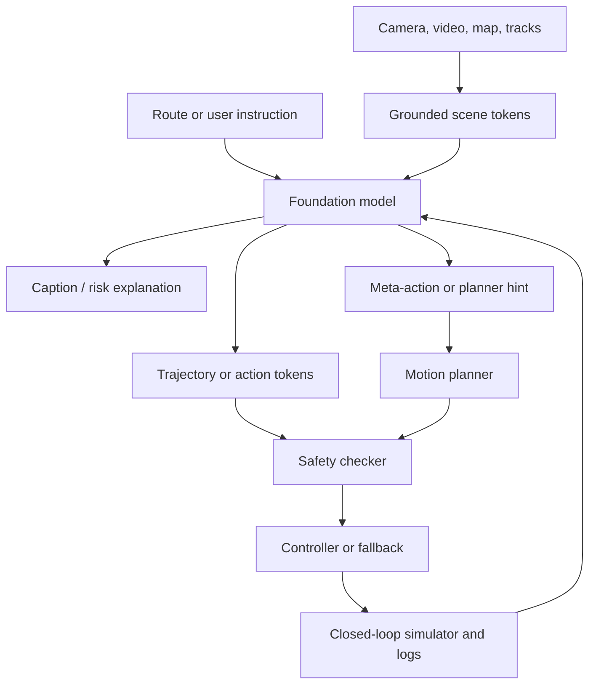

# Foundation Models for Driving

Foundation models for driving use large multimodal models, vision-language models, language agents, or vision-language-action policies to reason about traffic scenes and sometimes produce driving actions. They are not a replacement for the rest of the AV stack. Their useful role is to add semantic reasoning, instruction following, explanation, data annotation, and high-level decision support while staying grounded by calibrated perception, maps, planning constraints, and safety monitors.

This page covers multimodal large language models for driving, vision-language-action models, action interfaces, hybrid VLM-plus-planner designs, and closed-loop evaluation for language agents. It complements [end-to-end driving](/cs/autonomous-driving/end-to-end-driving), [decision making](/cs/autonomous-driving/decision-making-and-behavior-planning), [motion planning](/cs/autonomous-driving/motion-planning), [simulation and data](/cs/autonomous-driving/simulation-and-data), and [safety](/cs/autonomous-driving/safety-iso26262-sotif-scenario-testing).

## Definitions

A **large language model** maps text tokens to text tokens. A **multimodal large language model**, or MLLM, also consumes images, video, map features, object tracks, LiDAR-derived tokens, or tool outputs. The driving surveys emphasize that MLLMs can help with scene understanding, map and transportation tasks, user interaction, data generation, and planning support [1].

A **vision-language model** maps visual observations and text prompts into shared reasoning. In driving, it may answer questions such as "who has priority?", identify unusual hazards, explain a planner decision, or produce a high-level maneuver.

A **vision-language-action model**, or VLA model, connects visual perception, language reasoning, and action generation. A driving VLA can be written abstractly as [2]:

$$
a_{1:T}=\pi_\theta(I_{1:n},s_{\mathrm{ego}},\tau_{\mathrm{text}},m),
$$

where $I_{1:n}$ are images or video frames, $s_{\mathrm{ego}}$ is ego state, $\tau_{\mathrm{text}}$ is an instruction or route prompt, and $m$ is optional map context.

An **action interface** is the authority boundary between a foundation model and the vehicle. Common interfaces include captions, risk explanations, meta-actions, planner-cost hints, trajectory tokens, continuous waypoints, and direct controls. Higher action authority requires stronger latency, grounding, calibration, and safety evidence.

**Grounding** means tying a language claim to sensor or tool evidence. "The left lane is clear" should be supported by tracked objects, lane geometry, blind-spot state, and uncertainty, not only by a fluent model response.

## Key Results

### Semantic reasoning with metric grounding

Driving MLLMs are most credible when they improve the semantic layer of autonomy without pretending to be metric sensors. The survey literature [1] groups useful roles into scene captioning, driving question answering, risk explanation, map or route assistance, planner advice, and data-engine support. These tasks are valuable because boxes and lanes do not always capture why a scene matters: a blocked lane, a worker gesture, a temporary sign, or a confusing intersection may need semantic interpretation.

The risk is hallucination and weak spatial grounding. A model can produce a confident answer that is unsupported by the calibrated scene state. A practical system should attach provenance to claims:

$$
\text{claim} \rightarrow \{\text{sensor evidence},\text{map fact},\text{rule check},\text{uncertainty}\}.
$$

Worked example: an MLLM says, "stop because the traffic light is red." If the traffic-light classifier has $p_{\mathrm{red}}=0.55$ and the system requires $p_{\mathrm{red}}\ge 0.8$ for confident red-light explanations, the answer is not grounded. The behavior planner may still slow under uncertainty, but the language layer should not overstate the evidence.

### Hierarchical language-guided planning

Hybrid VLM driving systems use language reasoning as a high-level semantic interface while keeping metric perception and trajectory generation in specialized modules. DriveVLM [3] follows this pattern: it asks the model to produce scene description, scene analysis, meta-action, decision rationale, and waypoints, then proposes a dual architecture that combines VLM reasoning with conventional 3D perception and planning.

A compact planning chain is:

$$
I_{1:n}\rightarrow E_{\mathrm{scene}}\rightarrow A_{\mathrm{analysis}}\rightarrow (m,d,\hat{Y}),
$$

where $m$ is a meta-action, $d$ is a decision description, and $\hat{Y}$ is a waypoint sequence. This hierarchy is useful for debugging: a bad final trajectory can be traced to a missed object description, a wrong influence analysis, or a poorly grounded numeric plan.

Worked example: ego travels at 8 m/s, a stopped truck is 25 m ahead in the ego lane, and the left lane is clear for 40 m. The time to the truck without braking is:

$$
t=\frac{25}{8}=3.125\ \mathrm{s}.
$$

A reasonable high-level decision is "slow down and prepare a left lane change if the left-lane clearance remains valid." A dual planner must still verify lane geometry, vehicle dynamics, adjacent-lane traffic, and route legality before executing any waypoints.

### Vision-language-action policies

VLA systems add an action channel to the language model. The VLA survey [2] describes an arc from explainers, to reasoning advisors, to action-generating systems. The distinction matters: a model that captions a scene is not a driving policy; a model that outputs a meta-action still needs a planner; a model that outputs trajectories needs direct safety checks.

AutoVLA [4] is a representative action-generating design. It tokenizes continuous trajectories into discrete feasible action tokens, trains both fast and slow reasoning modes, and applies reinforcement fine-tuning to balance planning quality and reasoning cost. If the trajectory vocabulary is:

$$
\mathcal{V}=\{v_1,\ldots,v_K\},
$$

then an expert trajectory $Y$ can be assigned to the nearest token:

$$
z^\star=\arg\min_k d(Y,v_k).
$$

The language model then generates action tokens as part of an autoregressive sequence:

$$
\text{visual tokens},\text{text command}
\rightarrow
\text{optional reasoning tokens}
\rightarrow
\text{action tokens}.
$$

Worked example: candidate endpoints are $v_1=(5,0)$, $v_2=(5,1)$, and $v_3=(3,0)$. If the expert endpoint is $(4.6,0.8)$, distances are approximately $0.894$, $0.447$, and $1.789$, so the assigned action token is $v_2$. The token constrains the output to a known maneuver family, but it does not guarantee the selected maneuver is safe in the current scene.

### Authority levels and the action gap

Foundation models for driving should be classified by authority:

| Authority | Output | Typical use | Main safety question |
|---|---|---|---|
| Advisory | Caption, QA, explanation | Human or offline review | Is the answer grounded? |
| Low control authority | Meta-action or planner hint | Behavior planning support | Can a deterministic planner reject it? |
| Medium authority | Cost weights or candidate trajectory | Learned-planner proposal | Are constraints independently checked? |
| High authority | Waypoints or controls | End-to-end policy | What prevents unsafe actuation? |

The **action gap** appears when text and physical behavior disagree. A model may say "yield to the pedestrian" while its waypoints pass through the crosswalk. VLA evaluation must inspect both modalities:

$$
\mathrm{score}=f(\mathrm{safety},\mathrm{route},\mathrm{comfort},\mathrm{language\ fidelity},\mathrm{instruction\ following}).
$$

Worked example: a VLA outputs "yield" but proposes $(2,0)$, $(4,0)$, and $(6,0)$ while a pedestrian occupies the crosswalk at $x=5$, $y=0$. The text is correct, but the action contradicts it. This is a failed driving output even if a language-only metric would reward the sentence.

### Closed-loop evaluation for language agents

Static prompts cannot reveal how a language-based driver behaves when its decisions change future traffic. LimSim++ [5] is an example of infrastructure for closed-loop MLLM driving agents: it builds prompts from scenario state and images, runs an MLLM decision loop, converts text decisions to primitives or trajectories, updates the simulator, and evaluates route completion, safety, comfort, and rule compliance.

The platform loop is:

$$
\text{simulate}\rightarrow\text{prompt}\rightarrow\text{reason}\rightarrow\text{decide}\rightarrow\text{control}\rightarrow\text{evaluate}.
$$

Route completion alone is not enough:

$$
R=\frac{L_{\mathrm{completed}}}{L_{\mathrm{total}}}.
$$

An unsafe agent can complete a route by forcing through conflicts. Closed-loop scores need penalties for collisions, red-light violations, off-road motion, deadlock, harsh braking, and unreasonable delay.

Pseudo-code for a conservative MLLM-agent wrapper:

```python
prompt = build_prompt(scene_state, camera_views, route_goal)
decision = mllm_driver(prompt)
candidate = action_interface(decision, ego_state)

if not grounded(decision, scene_state):
    candidate = conservative_fallback()
if not feasible(candidate, vehicle_limits, map_geometry):
    candidate = planner_repair_or_stop(candidate)
if collision_risk(candidate, predicted_occupancy):
    candidate = minimal_risk_maneuver()

sim.step(candidate)
metrics.update(sim.state)
```

This wrapper is not a safety proof. It states the engineering shape of the problem: language decisions need grounding, conversion to motion, feasibility checks, independent risk checks, and fallback behavior.

## Visual



## Worked Example: Fast Versus Slow Reasoning

Problem: in a simple lane-following scene, a fast VLA mode gets planning reward $0.92$ using 5 generated tokens. A slow reasoning mode gets planning reward $0.94$ using 45 generated tokens. The efficiency-adjusted reward is:

$$
R'=R-0.001N.
$$

1. Fast mode:

$$
R'_f=0.92-0.001(5)=0.915.
$$

2. Slow mode:

$$
R'_s=0.94-0.001(45)=0.895.
$$

Answer: fast mode is preferred for this simple scene. In a rare or ambiguous scene, the raw planning improvement from slow reasoning would need to exceed the latency and token-cost penalty.

## Common Pitfalls

- Treating fluent explanations as perception ground truth. Language must be grounded in sensors, maps, and uncertainty.
- Giving an MLLM direct action authority before defining latency, fallback, and safety-monitor boundaries.
- Scoring text answers without checking trajectory safety.
- Asking a language model for centimeter-level geometry without calibrated tools.
- Assuming chain-of-thought is always beneficial. Extra reasoning can add latency and hallucination surface.
- Letting passenger instructions override traffic law or safety constraints.
- Treating closed-loop simulator success as public-road validation. It is necessary evidence, not sufficient evidence.

## Connections

- [End-to-end driving](/cs/autonomous-driving/end-to-end-driving)
- [Decision making and behavior planning](/cs/autonomous-driving/decision-making-and-behavior-planning)
- [Motion planning](/cs/autonomous-driving/motion-planning)
- [Simulation and data](/cs/autonomous-driving/simulation-and-data)
- [Safety, ISO 26262, SOTIF, and scenario testing](/cs/autonomous-driving/safety-iso26262-sotif-scenario-testing)
- [V2X and connected vehicles](/cs/autonomous-driving/v2x-and-connected-vehicles)
- Further reading: DriveLM, NuScenes-QA, Talk2Car, BDD-X, GPT-Driver, DriveAgent, Senna, OpenDriveVLA, DiffVLA, and language-conditioned planning.

## References

[1] C. Cui et al. *A Survey on Multimodal Large Language Models for Autonomous Driving*. WACV Workshops, 2024.
[2] A. Jiang et al. *A Survey on Vision-Language-Action Models for Autonomous Driving*. 2025.
[3] X. Tian, J. Gu, B. Li, Y. Liu, Y. Wang, Z. Zhao, Y. Zhan, P. Jia, X. Lang, H. Zhao. *DriveVLM: The Convergence of Autonomous Driving and Large Vision-Language Models*. 2024.
[4] X. Zhou, X. Cai, Y. Zhao, B. Zhang, S. Huang, J. Zhou, Y. Ma. *AutoVLA: A Vision-Language-Action Model for End-to-End Autonomous Driving with Adaptive Reasoning and Reinforcement Fine-Tuning*. NeurIPS 2025.
[5] Y. Fu, Y. Lei, L. Wen, P. Cai, J. Mao, M. Dou, B. Shi, Y. Qiao. *LimSim++: A Closed-Loop Platform for Deploying Multimodal LLM-Driven Autonomous Driving Agents*. IEEE Intelligent Vehicles Symposium, 2024.
