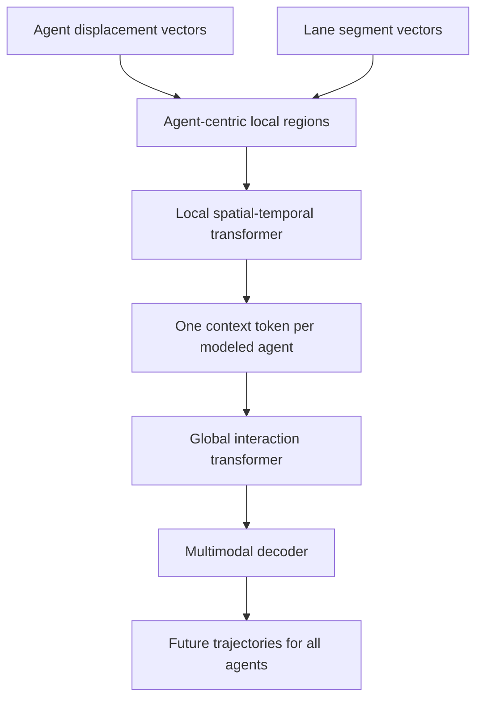

# HiVT (Zhou et al., 2022)

HiVT, introduced by Zhou, Ye, Wang, Wu, and Lu in the CVPR 2022 paper "HiVT: Hierarchical Vector Transformer for Multi-Agent Motion Prediction," is a vectorized motion forecasting model designed for fast multi-agent prediction. It keeps the sparse vector representation popularized by systems such as [VectorNet](/cs/autonomous-driving/vectornet), but reorganizes the transformer computation so local context is extracted around each agent before global interaction is modeled among agent-centric regions.

The central motivation is real-time forecasting. An autonomous vehicle rarely needs a single target-agent prediction; it needs plausible futures for many nearby vehicles, cyclists, and pedestrians every planning cycle. A naive target-centric model may re-normalize and re-run the whole scene once per agent. HiVT instead predicts multiple agents in one forward pass while using translation-invariant scene features and rotation-invariant spatial modules.

## Definitions

A **vectorized entity** is a compact geometric object extracted from agent trajectories or map elements. Agent histories become displacement vectors. Lane segments become directed vectors. Each vector has semantic and geometric attributes.

A **target-centric normalization** re-centers and rotates the scene around one target agent. It is effective for one-agent forecasting because the model sees a consistent coordinate frame, but it becomes expensive if repeated for every agent in a crowded scene.

A **translation-invariant representation** avoids absolute positions when encoding local geometry. Instead of using $p_i$, it uses differences such as

$$
\Delta p_t^i=p_t^i-p_{t-1}^i
$$

for agent motion and

$$
\Delta \ell = \ell_1-\ell_0
$$

for lane segments. Relative position vectors between entities preserve spatial relationships without making the representation depend on the global origin.

A **rotation-invariant spatial module** uses geometric relationships in a way that does not change the prediction merely because the coordinate frame is rotated. In practice, a model may use distances, relative headings, rotated local frames, or attention terms designed around relative geometry.

HiVT's hierarchy has two stages:

1. **Local context extraction:** for each modeled agent, gather nearby agent vectors and lane vectors into an agent-centric local region.
2. **Global interaction modeling:** exchange information among the local regions so agents can react to each other beyond the local receptive field.

The decoder produces multimodal trajectories for all modeled agents:

$$
\hat{Y}_{i,k}=[(\hat{x}_{i,k,1},\hat{y}_{i,k,1}),\dots,(\hat{x}_{i,k,T},\hat{y}_{i,k,T})],
$$

where $i$ indexes agents and $k$ indexes trajectory modes.

## Key results

The paper reports state-of-the-art performance on the Argoverse motion forecasting benchmark at publication time, with a small model size and fast multi-agent prediction. The abstract emphasizes three design goals: decompose local and global reasoning, respect translation/rotation symmetries, and predict multiple agents in one forward pass.

The main computational issue is attention complexity. Suppose there are $N$ agents, $T$ history steps, and $L$ lane segments. A direct transformer over all spatiotemporal entities has cost on the order of

$$
O((NT+L)^2).
$$

HiVT reduces this pressure by first aggregating locally for each agent and then passing messages among $N$ agent-level context tokens. The model still captures long-range interaction, but it avoids indiscriminate all-to-all attention over every point and lane segment.

The conceptual result is that symmetry is not just mathematical elegance; it is deployment efficiency. If the model respects translation and rotation structure, it does not need to relearn equivalent scenes at every map coordinate and heading. If it predicts all agents at once, the planner gets a scene-consistent set of futures rather than many independently normalized target predictions.

HiVT is especially relevant to [motion planning](/cs/autonomous-driving/motion-planning). A planner cares about joint behavior: if one car yields, another may proceed; if a pedestrian starts crossing, multiple vehicles may slow. A multi-agent predictor that shares global context can express such dependencies better than isolated per-agent predictors.

The hierarchy also changes how one should debug the model. If short-range lane following or local neighbor reactions fail, the local context module is the first suspect. If agents make individually plausible predictions but jointly inconsistent ones, the global interaction module is the likely bottleneck. This split is valuable in engineering practice because forecasting failures are otherwise difficult to attribute: a wrong future can come from missing map context, wrong agent history, insufficient social interaction, or bad mode scoring.

HiVT's invariance choices are not cosmetic. Driving logs are collected in many cities, map frames, and sensor poses. A model that depends heavily on absolute map coordinates can memorize dataset geography rather than learn traffic behavior. A model that mishandles rotation may require target-centric reprocessing for every agent. By using relative positions and rotation-aware spatial learning, HiVT pushes more of the computation toward reusable geometric relationships. That helps explain why later scene-centric predictors often preserve relative geometry and predict many agents together.

The evaluation setting is still open-loop forecasting. Strong Argoverse numbers mean the logged future was often among the model's plausible futures, but they do not prove that a downstream ego planner will behave safely. In deployment, forecasts must be calibrated, multimodal probabilities must be meaningful, and the planner must remain robust when the true human behavior is outside the top predicted mode.

## Visual



| Question | Target-centric repeated model | HiVT-style hierarchical model |
|---|---|---|
| Predict many agents? | Re-run per target | Single forward pass |
| Local map context | Recomputed per target | Extracted in agent regions |
| Long-range interaction | Often expensive | Agent-level global messages |
| Coordinate robustness | From normalization | From invariant representation |
| Main risk | Inconsistent independent futures | More complex architecture |

## Worked example 1: Translation invariance by relative motion

Problem: Agent A has history positions $(10,5)$, $(12,5)$, $(14,6)$. The same scene is shifted by $(100,-30)$, so the positions become $(110,-25)$, $(112,-25)$, $(114,-24)$. Show that displacement encoding is translation invariant.

1. Compute the original displacements:

$$
\Delta p_1=(12,5)-(10,5)=(2,0),
$$

$$
\Delta p_2=(14,6)-(12,5)=(2,1).
$$

2. Compute the shifted displacements:

$$
\Delta p'_1=(112,-25)-(110,-25)=(2,0),
$$

$$
\Delta p'_2=(114,-24)-(112,-25)=(2,1).
$$

3. The displacement sequences are identical.

4. Therefore a model that uses only these displacement vectors for local motion sees the same motion pattern after a global translation.

Answer: both scenes encode agent motion as $[(2,0),(2,1)]$.

Check: The absolute locations changed dramatically, but relative motion did not. This is the invariance HiVT exploits.

## Worked example 2: Attention cost reduction

Problem: A scene has $N=20$ agents, each with $T=20$ history vectors, and $L=300$ lane vectors. Compare the token count of direct all-to-all attention with a simplified hierarchy that compresses each agent's local region to one token before global interaction.

1. Direct attention sees

$$
NT+L=20\cdot20+300=700
$$

tokens.

2. Quadratic attention has about

$$
700^2=490000
$$

pairwise token interactions per layer.

3. A hierarchy still does local work, but global interaction among agent context tokens uses only $N=20$ tokens.

4. The global attention pair count is

$$
20^2=400.
$$

5. The reduction in global all-to-all interactions is

$$
\frac{490000}{400}=1225.
$$

Answer: the global stage is about 1,225 times smaller in pair count in this simplified comparison.

Check: This does not mean the whole model is 1,225 times faster because local extraction still costs compute. It shows why compressing before global attention is attractive.

## Code

```python
import torch
import torch.nn as nn

class TinyHiVTBlock(nn.Module):
    def __init__(self, dim=64, heads=4):
        super().__init__()
        self.local = nn.MultiheadAttention(dim, heads, batch_first=True)
        self.global_attn = nn.MultiheadAttention(dim, heads, batch_first=True)
        self.decoder = nn.Linear(dim, 6 * 2)  # six future xy waypoints

    def forward(self, local_tokens):
        # local_tokens: [batch, agents, local_entities, dim]
        b, n, m, d = local_tokens.shape
        flat = local_tokens.reshape(b * n, m, d)
        local_context, _ = self.local(flat, flat, flat)
        agent_tokens = local_context.mean(dim=1).reshape(b, n, d)
        scene_tokens, _ = self.global_attn(agent_tokens, agent_tokens, agent_tokens)
        return self.decoder(scene_tokens).reshape(b, n, 6, 2)

tokens = torch.randn(2, 20, 64, 64)
model = TinyHiVTBlock()
future = model(tokens)
print(future.shape)
```

## Common pitfalls

- Equating vectorized input with HiVT. HiVT's contribution is the hierarchical transformer and invariance design, not merely using vectors.
- Predicting each agent independently after global context. The point is multi-agent scene reasoning, not many isolated decoders.
- Forgetting map-agent interaction. Agent history alone cannot determine legal turns, lane following, or crosswalk behavior.
- Using absolute coordinates in features that are supposed to be invariant. One absolute field can break the intended symmetry.
- Treating fast forecasting as a luxury. Prediction latency directly affects planning reaction time.
- Assuming multimodal output is optional. In traffic scenes, several futures can be reasonable; a single averaged trajectory is often unsafe.

## Connections

- [Prediction and motion forecasting](/cs/autonomous-driving/prediction-and-motion-forecasting)
- [VectorNet](/cs/autonomous-driving/vectornet)
- [LaneGCN](/cs/autonomous-driving/lanegcn)
- [Motion planning](/cs/autonomous-driving/motion-planning)
- [Decision making and behavior planning](/cs/autonomous-driving/decision-making-and-behavior-planning)
- [Deep learning](/cs/deep-learning/)
- Further reading: Argoverse forecasting, TNT, DenseTNT, Wayformer, MTR, QCNet, and scene-centric forecasting.
