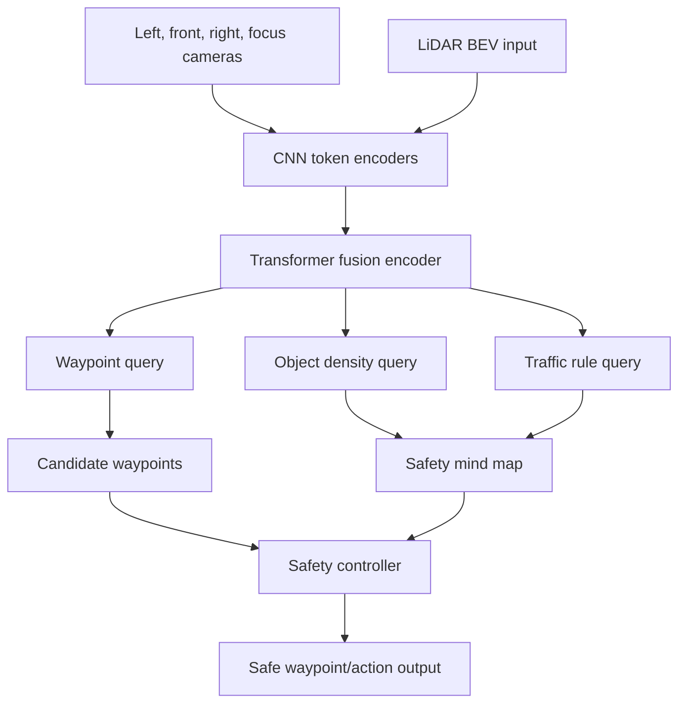

# InterFuser (Shao et al., 2022)

InterFuser, introduced by Shao, Wang, Chen, Li, and Liu in the CoRL 2022 paper "Safety-Enhanced Autonomous Driving Using Interpretable Sensor Fusion Transformer," extends transformer-based sensor fusion for end-to-end driving with interpretable intermediate outputs and a safety controller. The model fuses multi-view camera and LiDAR inputs, predicts waypoints and semantic intermediate features, then constrains actions using a safety heuristic.

The paper sits naturally after [TransFuser](/cs/autonomous-driving/transfuser). Both use transformer fusion in CARLA-style closed-loop driving. InterFuser's distinguishing emphasis is interpretability and safety: the model should expose a "safety mind map" rather than produce only opaque waypoints.

## Definitions

**Multi-view multi-modal fusion** means the model consumes several camera views plus LiDAR. The views provide semantic and traffic-signal information; LiDAR provides geometry. A transformer encoder lets tokens from all views and modalities interact.

An **interpretable intermediate feature** is a prediction that a human or downstream rule can inspect. InterFuser predicts features such as object density maps and traffic-rule signals in addition to waypoints.

The paper uses the phrase **safety mind map** for intermediate scene information that reveals why a driving action is produced and supports safety constraints. A simplified mind-map output is

$$
M_t = \{D_t, R_t, \hat{Y}_t\},
$$

where $D_t$ is an object density map, $R_t$ is traffic-rule information, and $\hat{Y}_t$ is the waypoint trajectory.

A **safe action set** is a set of candidate actions or waypoints that satisfy constraints. Abstractly,

$$
\mathcal{U}_{\mathrm{safe}}=\{u: g_j(u,M_t)\le 0,\ j=1,\dots,J\}.
$$

The safety controller adjusts or filters the neural output so the selected action is more consistent with detected objects, traffic rules, and forecast hazards.

## Key results

The source abstract reports that InterFuser ranked first on the public CARLA leaderboard at the time and outperformed prior methods on CARLA benchmarks with complex and adversarial urban scenarios. The main contribution is not only leaderboard performance; it is the combination of transformer fusion, interpretable outputs, and a safety controller.

InterFuser makes a specific critique of many end-to-end driving policies: if the network outputs only controls or waypoints, failure analysis is difficult. Did it miss a pedestrian, misunderstand a traffic light, or choose a risky maneuver despite seeing the object? Intermediate outputs provide diagnostic structure.

The architecture can be summarized as:

1. Extract tokens from multi-view RGB images and LiDAR.
2. Fuse tokens with a transformer encoder.
3. Use decoder queries to predict waypoints, object density, and traffic-rule signals.
4. Recover scene information from the interpretable predictions.
5. Use a safety controller to constrain final actions.

This is a hybrid design. Like end-to-end policies, it learns from data and fuses raw-ish sensor representations. Like modular systems, it exposes intermediate scene representations and applies constraints. This makes it a useful case study for [safety, SOTIF, and scenario testing](/cs/autonomous-driving/safety-iso26262-sotif-scenario-testing): interpretability is not a full safety case, but it can make debugging and constraint enforcement more concrete.

The "mind map" idea should be read as an interface contract. If the model says a waypoint is safe, the intermediate features should give some evidence: where objects are, which traffic rule applies, and what the immediate risk map looks like. That evidence can be compared against simulator ground truth or labeled logs. When the vehicle fails, engineers can ask whether the model failed to perceive, failed to reason, or failed to obey the safety controller.

InterFuser also highlights a tension in learned safety. A hard rule-based controller can prevent some unsafe actions, but it may also create conservative or jerky behavior if the intermediate predictions are noisy. A purely learned policy can be smoother but opaque. InterFuser chooses a middle ground: learn the scene representation and waypoints, then use interpretable outputs to constrain the final action. This is attractive for research, but the quality of the constraint depends on calibration and timing.

The adversarial-event framing is important. Rare events such as a pedestrian emerging from the side or a vehicle running a red light require global context across views and modalities. A single forward camera may not see enough; a single LiDAR representation may miss semantic cues. Multi-view, multi-modal transformer fusion gives the model a chance to associate distant traffic lights, side objects, and ego route context before generating the final plan.

In production terms, InterFuser-like designs would still need independent monitors. The safety controller is part of the learned stack, not an external assurance argument. A robust vehicle would cross-check its output with separate collision checking, traffic-rule monitoring, localization health, and fallback policies.

The model is also a useful response to a common criticism of end-to-end learning: opaque policies are hard to improve after failures. If InterFuser predicts an incorrect traffic-rule signal, that can be logged and targeted with data. If the object density map misses a pedestrian, the perception-like auxiliary task can be debugged. If those intermediate features are correct but the waypoint is unsafe, the planner or safety controller is at fault. This decomposition does not remove learning risk, but it gives engineers handles for failure analysis.

InterFuser's use of multiple camera views also matters for urban scenes. A focus or front view may read traffic lights, while side views may catch vehicles entering from cross traffic. LiDAR contributes geometric occupancy. A transformer over all tokens is a way to let these pieces vote on the driving decision before a waypoint is produced.

The important lesson is that interpretability is most useful when the intermediate signal has an operational role. InterFuser's density and rule outputs are not only explanations; they are inputs to the safety controller.

## Visual



| Output | Interpretable role | Safety use |
|---|---|---|
| Waypoints | Intended ego motion | Candidate trajectory |
| Object density map | Where obstacles may be | Collision constraints |
| Traffic-rule signal | Stop, light, priority cues | Rule compliance |
| Tracker forecast | Approximate future occupancy | Time-dependent safety check |

## Worked example 1: Filtering a waypoint by obstacle distance

Problem: A model proposes waypoint $(8,0)$ m. An object density map indicates an obstacle centered at $(7.5,0.2)$ m. A safety controller requires at least 1.0 m clearance. Is the waypoint accepted?

1. Compute displacement:

$$
\Delta=(8-7.5,0-0.2)=(0.5,-0.2).
$$

2. Compute distance:

$$
d=\sqrt{0.5^2+(-0.2)^2}=\sqrt{0.25+0.04}=\sqrt{0.29}\approx0.539.
$$

3. Compare with threshold:

$$
0.539 < 1.0.
$$

Answer: the waypoint is rejected or modified by the safety controller.

Check: This simple distance check is not a complete vehicle footprint collision check, but it illustrates how an interpretable map can constrain neural outputs.

## Worked example 2: Choosing between two candidate trajectories

Problem: Candidate A has imitation cost 1.0 and safety penalty 5.0. Candidate B has imitation cost 1.4 and safety penalty 0.5. The controller uses total cost $J=L+2S$. Which candidate is selected?

1. Candidate A:

$$
J_A=1.0+2(5.0)=11.0.
$$

2. Candidate B:

$$
J_B=1.4+2(0.5)=2.4.
$$

3. Lower cost wins.

Answer: choose candidate B.

Check: The selected trajectory is less imitation-like but much safer under the chosen penalty. This reflects InterFuser's motivation to constrain actions rather than blindly follow the neural waypoint.

## Code

```python
import torch

def safety_filter(candidates, obstacle_xy, min_clearance=1.0):
    # candidates: [K, T, 2], obstacle_xy: [M, 2]
    diff = candidates[:, :, None, :] - obstacle_xy[None, None, :, :]
    dist = torch.linalg.norm(diff, dim=-1)
    min_dist = dist.amin(dim=(1, 2))
    valid = min_dist >= min_clearance
    if valid.any():
        return candidates[valid][0], valid
    # fallback: choose the candidate with the largest minimum clearance
    return candidates[min_dist.argmax()], valid

candidates = torch.tensor([
    [[2., 0.], [4., 0.], [8., 0.]],
    [[2., 0.], [4., 0.8], [8., 1.5]],
])
obstacles = torch.tensor([[7.5, 0.2]])
chosen, valid = safety_filter(candidates, obstacles)
print(chosen, valid)
```

## Common pitfalls

- Treating interpretability as proof of safety. A mind map helps inspection and constraints, but validation is still required.
- Using auxiliary outputs that are not calibrated. A density map must be reliable enough for the controller's assumptions.
- Assuming the safety controller can rescue arbitrary bad predictions. It can filter or adjust, but it has limited authority.
- Ignoring timing. Object density at the current frame is not enough for future collision risk.
- Comparing CARLA leaderboard rankings across versions without checking benchmark protocol.
- Confusing InterFuser with TransFuser. InterFuser adds interpretable features and safety constraints to transformer fusion.

## Connections

- [TransFuser](/cs/autonomous-driving/transfuser)
- [Sensor fusion](/cs/autonomous-driving/sensor-fusion)
- [End-to-end driving](/cs/autonomous-driving/end-to-end-driving)
- [Safety, ISO 26262, SOTIF, and scenario testing](/cs/autonomous-driving/safety-iso26262-sotif-scenario-testing)
- [Simulation and data](/cs/autonomous-driving/simulation-and-data)
- [Adversarial and physical attacks on AV](/cs/autonomous-driving/adversarial-and-physical-attacks-on-av)
- Further reading: InterFuser, TransFuser, NEAT, LBC, CARLA leaderboard, and interpretable auxiliary tasks for driving.
