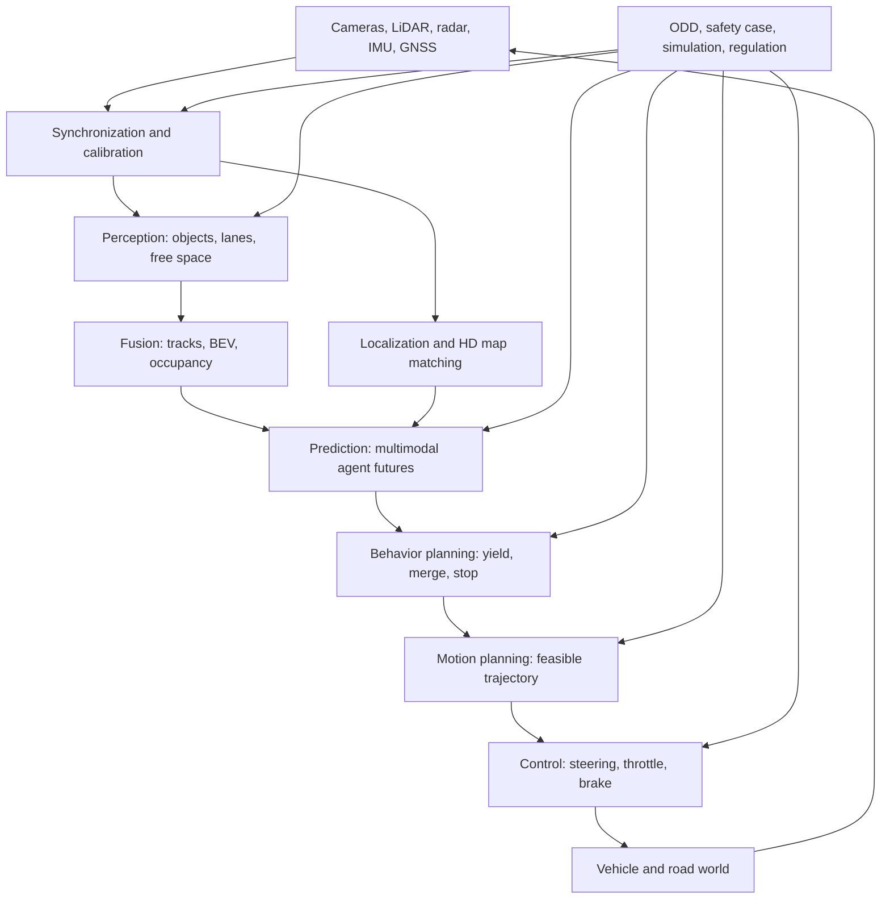

# Autonomous Driving

Autonomous driving is a system-of-systems problem: sensors measure the world, perception turns measurements into objects and free space, prediction estimates what other agents may do, planning chooses a safe and useful maneuver, control tracks the motion, and safety engineering constrains the whole stack inside a defined operational design domain. A self-driving vehicle is not a single model, a single sensor, or a single benchmark score. It is an integrated cyber-physical system that must work under uncertainty, latency, hardware faults, ambiguous road rules, unusual human behavior, and changing weather.

This foundational section gives SJ Wiki a stable base for later paper and textbook deep-dives. The emphasis is practical and architectural: what each layer does, what math it relies on, what can go wrong, and how the layers connect. The pages use standard public terminology such as SAE J3016 automation levels, ODD, ISO 26262, SOTIF, sensor fusion, BEV representations, motion forecasting, model predictive control, and scenario-based validation.

## Definitions

An **autonomous vehicle**, in this section, is a road vehicle with software and hardware that can perform some or all of the dynamic driving task under specified conditions. The phrase is informal; precise responsibility depends on the SAE automation level and the operational design domain.

The **ego vehicle** is the vehicle whose autonomy stack is being designed or analyzed. Other road users are **agents**: vehicles, pedestrians, cyclists, scooters, emergency vehicles, construction workers, and sometimes animals or unusual moving objects.

The **autonomous-driving stack** is the collection of modules that turns sensor inputs and route goals into vehicle motion. A common modular stack is:

1. Sensing and synchronization.
2. Perception and tracking.
3. Sensor fusion and scene representation.
4. Localization and mapping.
5. Prediction and motion forecasting.
6. Behavior planning.
7. Motion planning.
8. Control.
9. Safety monitoring, fallback, simulation, validation, and operations.

An **operational design domain**, or ODD, is the set of conditions under which an automated feature is designed to operate. ODD includes road type, geography, speed range, weather, lighting, map availability, sensor health, traffic conditions, and sometimes remote-assistance constraints.

**SAE levels** describe responsibility allocation from Level 0, no driving automation, through Level 5, full automation. The most common confusion is between Level 2 and Level 4: a Level 2 system can steer and control speed but still require human supervision, while a Level 4 system may operate only in a narrow geofence but must handle the driving task and fallback inside that ODD.

**Perception** estimates the current scene. **Prediction** estimates possible future agent motion. **Planning** chooses what the ego should do. **Control** sends commands to track the chosen trajectory. **Safety engineering** defines the constraints, evidence, and fallback behavior that keep the stack from being only a demo.

## Key results

The central architectural result is that autonomy is a closed-loop estimation and control problem under uncertainty:

$$
\mathrm{sensors}
\rightarrow
\mathrm{state\ estimate}
\rightarrow
\mathrm{future\ hypotheses}
\rightarrow
\mathrm{trajectory}
\rightarrow
\mathrm{actuation}
\rightarrow
\mathrm{new\ world}.
$$

Every arrow has delay, uncertainty, and failure modes. A planner that assumes perfect perception will be unsafe. A perception model that ignores planning needs may optimize the wrong metrics. A controller that ignores actuator limits cannot rescue an infeasible trajectory. A safety case that ignores the ODD is too vague to be useful.

The modular stack remains a useful teaching structure even as learned end-to-end systems become more important. Public AV systems differ in architecture. Waymo is commonly described as using a highly engineered stack with lidar, radar, cameras, maps, simulation, and safety processes. Tesla's public technical messaging emphasizes camera-centric perception, fleet data, learned occupancy or vector representations, and increasingly learned planning. Mobileye is associated with camera-forward perception, REM mapping, and RSS. Cruise, Aurora, Zoox, and others have public materials showing variations on sensor-rich robotaxi or trucking stacks. These public descriptions are incomplete, so this wiki treats them as examples of design emphasis rather than precise internal blueprints.

A useful mental model is that each layer changes the representation:

| Layer | Input | Output | Main uncertainty |
|---|---|---|---|
| Sensors | Photons, radio waves, inertial motion | Images, point clouds, radar targets, IMU/GNSS samples | Noise, occlusion, calibration, weather |
| Perception | Sensor data | Objects, lanes, signs, free space | False positives, false negatives, class ambiguity |
| Fusion | Multiple estimates | Unified BEV, tracks, occupancy | Timing, association, correlated failures |
| Localization | Motion and landmarks | Ego pose with covariance | Drift, map mismatch, GNSS multipath |
| Prediction | Tracks and map | Multimodal future trajectories | Hidden intent, interaction, long horizon |
| Planning | Goals and predictions | Maneuver and trajectory | Rule ambiguity, feasibility, risk tradeoffs |
| Control | Trajectory and state | Steering, throttle, brake | Delay, tire limits, actuator saturation |
| Safety | Requirements and evidence | Constraints, fallback, release decision | ODD gaps, rare events, validation limits |

The page set produced here is:

1. [Autonomous Driving](/cs/autonomous-driving/intro) — this hub: scope, stack diagram, taxonomy, and reading order.
2. [SAE Levels and Operational Design Domain](/cs/autonomous-driving/sae-levels-and-operational-design-domain) — SAE J3016 levels, ODD definition, fallback responsibility, and regulatory caveats.
3. [Sensors, Cameras, LiDAR, Radar, and IMU](/cs/autonomous-driving/sensors-cameras-lidar-radar-imu) — sensor types, strengths, weaknesses, calibration, and weather failure modes.
4. [Perception, Object Detection, and Segmentation](/cs/autonomous-driving/perception-object-detection-and-segmentation) — 2D and 3D detection, segmentation, lane perception, IoU, precision, recall, and mAP.
5. [Depth Estimation and Stereo Vision](/cs/autonomous-driving/depth-estimation-and-stereo-vision) — stereo geometry, monocular depth, self-supervised depth, and depth completion.
6. [Sensor Fusion](/cs/autonomous-driving/sensor-fusion) — early, mid, late fusion, BEV, occupancy, calibration, and multi-sensor uncertainty.
7. [Localization and HD Maps](/cs/autonomous-driving/localization-and-hd-maps) — GNSS, IMU, SLAM, GraphSLAM, vector maps, lanelets, and map-light driving.
8. [Prediction and Motion Forecasting](/cs/autonomous-driving/prediction-and-motion-forecasting) — constant-velocity baselines, multimodal forecasting, social models, and datasets.
9. [Motion Planning](/cs/autonomous-driving/motion-planning) — A*, Hybrid A*, RRT, MPC, iLQR, trajectory optimization, and lattice planners.
10. [Decision Making and Behavior Planning](/cs/autonomous-driving/decision-making-and-behavior-planning) — finite-state machines, behavior trees, POMDPs, rule-based and learned policies.
11. [Control, PID, MPC, Pure Pursuit, and Stanley](/cs/autonomous-driving/control-pid-mpc-pure-pursuit-stanley) — longitudinal and lateral control, bicycle models, and tracking laws.
12. [End-to-End Driving](/cs/autonomous-driving/end-to-end-driving) — ALVINN, PilotNet, imitation learning, conditional policies, world models, and validation issues.
13. [Simulation and Data](/cs/autonomous-driving/simulation-and-data) — CARLA, DRIVE Sim, AirSim, SVL, log replay, closed-loop simulation, and data engines.
14. [Safety, ISO 26262, SOTIF, and Scenario Testing](/cs/autonomous-driving/safety-iso26262-sotif-scenario-testing) — ASIL, SOTIF, RSS, safety cases, scenario testing, and edge-case mining.
15. [V2X and Connected Vehicles](/cs/autonomous-driving/v2x-and-connected-vehicles) — DSRC, C-V2X, V2V, V2I, V2P, V2N, cooperative perception, security, and latency.
16. [Adversarial and Physical Attacks on AV](/cs/autonomous-driving/adversarial-and-physical-attacks-on-av) — adversarial patches, lidar spoofing, jamming, GNSS spoofing, V2X attacks, and defenses.

17. [Foundation Models for Driving](/cs/autonomous-driving/foundation-models-for-driving) - MLLMs, VLMs, VLA policies, action interfaces, grounding, and closed-loop evaluation.

## Visual



## Worked example 1: Classifying an AV feature claim

Problem: A vehicle feature is advertised as handling highway driving. It centers in the lane, maintains distance, changes lanes after driver confirmation, and requires the driver to keep eyes on the road. It disengages if lane markings disappear. Classify the automation responsibility and identify the ODD dimensions that should be stated.

1. Check lateral and longitudinal control. The feature steers and controls speed, so both axes are supported.
2. Check environment monitoring. The driver must keep eyes on the road, so the human monitors the driving environment.
3. Check fallback. The feature disengages when lane markings disappear, and the driver is expected to take over.
4. Compare to SAE levels. A system that controls both axes but requires human supervision and fallback is Level 2.
5. List ODD dimensions. At minimum, the feature should state road type, lane-marking requirements, speed range, weather and visibility assumptions, driver-monitoring requirements, supported regions, and sensor-health requirements.

Answer: this is a Level 2 driver-support feature, not a Level 3 or Level 4 automated driving system. Its ODD should be described as a highway driver-assistance domain with visible lane markings, driver supervision, and specified environmental limits.

Check: The key evidence is not that the vehicle steers smoothly. The key evidence is that monitoring and fallback remain the driver's responsibility.

## Worked example 2: Tracing one stack cycle

Problem: The ego vehicle approaches a crosswalk at 12 m/s. Cameras detect a pedestrian near the curb, lidar gives a range of 28 m, radar has no useful return, the map says the crosswalk begins 25 m ahead, and prediction assigns 60 percent probability that the pedestrian will enter the crosswalk. Trace one stack-level decision.

1. Perception output: pedestrian class with image detection, lidar-supported range near 28 m, and crosswalk geometry from the map.
2. Fusion output: a pedestrian track near the crosswalk with uncertainty. Radar absence should not delete the pedestrian because pedestrians may have weak radar returns.
3. Prediction output: two modes are plausible: wait with probability 40 percent and cross with probability 60 percent.
4. Behavior planning output: because the pedestrian may enter a marked crosswalk, select a yield or prepare-to-yield behavior rather than assertive pass.
5. Motion planning output: generate a comfortable deceleration trajectory that can stop before the crosswalk while preserving a fallback if the pedestrian waits.
6. Control output: track the deceleration profile with braking commands, respecting jerk and following traffic constraints.
7. Safety monitor: verify that time-to-crosswalk and stopping distance remain sufficient.

For a simple stopping-distance check with comfortable deceleration $a=3$ m/s²:

$$
d_{\mathrm{stop}}=\frac{v^2}{2a}
=\frac{12^2}{2(3)}
=\frac{144}{6}
=24\ \mathrm{m}.
$$

Answer: the stack should prepare to stop because the crosswalk starts 25 m ahead and comfortable stopping distance is about 24 m before adding delay and margin. A real system would add reaction, actuator delay, road friction, and uncertainty margins, so it should begin braking promptly.

Check: If the pedestrian does not cross, the planner can release braking later. If the pedestrian does cross, waiting too long may leave no comfortable stopping margin.

## Code

```python
from dataclasses import dataclass

@dataclass
class SceneSummary:
    speed_mps: float
    crosswalk_distance_m: float
    pedestrian_near_crosswalk: bool
    pedestrian_cross_prob: float
    comfortable_decel_mps2: float
    delay_margin_m: float

def choose_crosswalk_behavior(scene: SceneSummary) -> str:
    stopping_distance = scene.speed_mps ** 2 / (2.0 * scene.comfortable_decel_mps2)
    required_distance = stopping_distance + scene.delay_margin_m
    if not scene.pedestrian_near_crosswalk:
        return "proceed"
    if scene.pedestrian_cross_prob >= 0.5 and required_distance >= 0.8 * scene.crosswalk_distance_m:
        return "yield"
    if scene.pedestrian_cross_prob >= 0.2:
        return "prepare_to_yield"
    return "proceed_with_caution"

scene = SceneSummary(
    speed_mps=12.0,
    crosswalk_distance_m=25.0,
    pedestrian_near_crosswalk=True,
    pedestrian_cross_prob=0.60,
    comfortable_decel_mps2=3.0,
    delay_margin_m=3.0,
)

print(choose_crosswalk_behavior(scene))
```

## Common pitfalls

- Treating autonomy as one neural-network score. Real systems require sensing, estimation, planning, control, validation, fallback, and operations.
- Talking about SAE levels without ODD. Level claims are meaningless without operating conditions and fallback responsibility.
- Optimizing perception benchmarks without planning relevance. A high mAP detector can still fail if it is late, miscalibrated, or poorly calibrated in confidence.
- Treating maps as either magic or useless. HD maps are powerful priors but require freshness, localization, and fallback when observations disagree.
- Using open-loop logs to validate closed-loop behavior. Planning and control must be tested where ego actions change the world.
- Assuming safety is proven by miles. Scenario coverage, safety cases, standards, edge-case mining, and field monitoring are all needed.
- Overstating public knowledge of commercial systems. Use public materials as design examples, not as complete architecture documentation.

## Connections

- [SAE levels and operational design domain](/cs/autonomous-driving/sae-levels-and-operational-design-domain)
- [Sensors, cameras, LiDAR, radar, and IMU](/cs/autonomous-driving/sensors-cameras-lidar-radar-imu)
- [Sensor fusion](/cs/autonomous-driving/sensor-fusion)
- [Motion planning](/cs/autonomous-driving/motion-planning)
- [Safety, ISO 26262, SOTIF, and scenario testing](/cs/autonomous-driving/safety-iso26262-sotif-scenario-testing)
- [Deep learning](/cs/deep-learning/)
- [Reinforcement learning](/cs/reinforcement-learning/)
- [Embedded systems](/cs/embedded/)
- [Engineering math](/math/engineering-math/)
- [Signals and systems](/physics/signals-systems/)
- Further reading: SAE J3016, Thrun et al. *Probabilistic Robotics*, Pomerleau's ALVINN, NVIDIA PilotNet, Mobileye RSS, CARLA, Waymo Open Dataset, Argoverse, nuScenes, ISO 26262, and ISO 21448.
