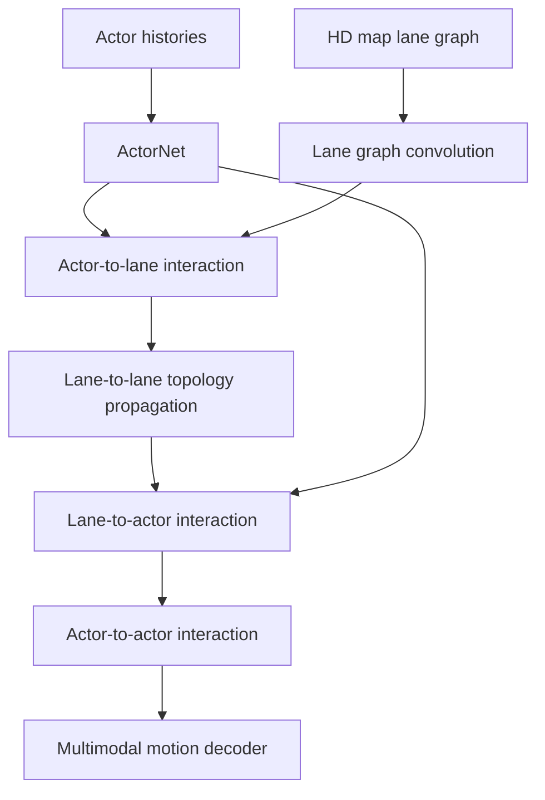

# LaneGCN (Liang et al., 2020)

LaneGCN, introduced by Liang, Yang, Hu, Chen, Liao, Feng, and Urtasun in the ECCV 2020 paper "Learning Lane Graph Representations for Motion Forecasting," is a motion forecasting architecture that treats the HD map as a lane graph instead of a raster image. It explicitly models lane topology with multiple adjacency matrices and combines lane-to-lane, actor-to-lane, lane-to-actor, and actor-to-actor interactions.

The model belongs next to [VectorNet](/cs/autonomous-driving/vectornet) and [HiVT](/cs/autonomous-driving/hivt). All three reject the idea that map context should be only a colored BEV image. LaneGCN is especially focused on the map graph: predecessors, successors, left neighbors, and right neighbors encode driving constraints that a plain CNN must infer indirectly from pixels.

## Definitions

A **lane graph** is a directed graph $G=(V,E)$ whose nodes are lane segments and whose edges encode topological relationships. A lane segment node can store geometry, direction, turn type, traffic-control attributes, and local coordinate features.

LaneGCN uses several adjacency types. Typical relationships include:

- **Successor:** the next lane segment along the legal direction of travel.
- **Predecessor:** the previous lane segment.
- **Left neighbor:** an adjacent lane to the left.
- **Right neighbor:** an adjacent lane to the right.

Instead of using one adjacency matrix $A$, LaneGCN uses a set $\{A_r\}$ indexed by relation type $r$. A graph convolution update can be written abstractly as

$$
h_i^{(\ell+1)}
= \phi\left(W_0h_i^{(\ell)}+\sum_r\sum_{j\in\mathcal{N}_r(i)} W_rh_j^{(\ell)}\right),
$$

where $\mathcal{N}_r(i)$ is the set of neighbors of node $i$ under relation $r$.

The model also uses **along-lane dilation**. Instead of only sending messages to immediate successors and predecessors, it lets information travel multiple steps along the lane graph. This helps a vehicle know that a downstream lane curves, merges, or reaches an intersection.

An **actor** is a dynamic traffic participant, such as a vehicle, cyclist, or pedestrian. LaneGCN uses an ActorNet to encode actor history and a map network to encode lane features. It then performs four interaction stages:

$$
\mathrm{A2L},\quad \mathrm{L2L},\quad \mathrm{L2A},\quad \mathrm{A2A}.
$$

These mean actor-to-lane, lane-to-lane, lane-to-actor, and actor-to-actor message passing.

## Key results

The source abstract states that LaneGCN significantly outperformed prior state of the art on the Argoverse motion forecasting benchmark at publication time. Its main contribution is structural rather than a single metric: it demonstrates that preserving lane topology can improve motion forecasting because road users are constrained by the lane graph.

The key result can be summarized as:

$$
\text{forecasting quality} \approx
\text{actor motion history}
+ \text{map topology}
+ \text{actor-map interaction}.
$$

Raster maps can show where lanes are, but a CNN must learn graph relations from image patterns. LaneGCN gives the model direct graph operators. A vehicle's future path can follow successor edges. A lane change can be represented by left or right neighbor edges. A turn can be encoded in lane segment attributes.

The four interaction stages are useful because they match the causal structure of the scene:

1. Actors influence lane relevance. A stopped car makes its lane important.
2. Lanes propagate map topology. A route through an intersection spans many lane segments.
3. Lanes influence actors. Lane direction and connectivity restrict feasible motion.
4. Actors influence each other. Yielding, following, and merging are social interactions.

LaneGCN is not a complete planner. It forecasts other agents, usually using observed histories and map context. A downstream planner still has to select an ego trajectory under [decision making](/cs/autonomous-driving/decision-making-and-behavior-planning), [motion planning](/cs/autonomous-driving/motion-planning), and [control](/cs/autonomous-driving/control-pid-mpc-pure-pursuit-stanley) constraints. But by outputting map-consistent futures, it reduces the planner's uncertainty.

Architecturally, LaneGCN is also a useful comparison point for later transformer systems. It does not need a large language model, a raster BEV decoder, or an end-to-end planner to show the value of structure. The lane graph is a strong inductive bias: legal motion usually follows successor edges, lane changes usually pass through neighbor edges, and intersections are represented by branching topology. This bias helps data efficiency because the network does not have to rediscover basic road connectivity from pixels alone.

The actor-map interaction stages should be read as a design pattern. In a driving scene, actors decide which lanes matter, lanes constrain actors, and actors constrain each other. A parked vehicle occupying a lane changes the relevance of adjacent lanes. A lane ending ahead changes the likelihood of a merge. A leading vehicle braking changes the following vehicle's future even when the lane geometry is unchanged. LaneGCN makes these information flows explicit enough that later vector and query-based systems can be understood as generalizations rather than unrelated architectures.

For evaluation, LaneGCN belongs to the Argoverse-style forecasting tradition where metrics such as average displacement error, final displacement error, and miss rate are computed against logged futures. These metrics are useful, but they are open-loop: the ego vehicle does not react to the forecast, and the forecasted agent does not react to ego. A planning stack should therefore treat LaneGCN outputs as hypotheses that still need safety margins, interaction reasoning, and closed-loop validation.

In practice, the lane graph should be cached and validated carefully because map topology errors directly affect forecast modes.

## Visual



| Lane relation | Meaning | Forecasting use |
|---|---|---|
| Predecessor | Segment behind in travel direction | Recover approach context |
| Successor | Segment ahead in travel direction | Predict route continuation |
| Left neighbor | Adjacent lane to the left | Model lane-change options |
| Right neighbor | Adjacent lane to the right | Model lane-change options |
| Dilated successor | Several steps ahead | See intersection or merge structure |

## Worked example 1: Propagating through a lane graph

Problem: A lane graph has three segments $L_1\to L_2\to L_3$. Their scalar features are $h_1=1$, $h_2=2$, and $h_3=4$. A simplified successor graph update is

$$
h_i' = h_i + 0.5\sum_{j\in\mathrm{succ}(i)} h_j.
$$

Compute the updated features.

1. Segment $L_1$ has successor $L_2$, so

$$
h_1'=1+0.5(2)=2.
$$

2. Segment $L_2$ has successor $L_3$, so

$$
h_2'=2+0.5(4)=4.
$$

3. Segment $L_3$ has no successor, so

$$
h_3'=4+0=4.
$$

Answer: the updated features are $(2,4,4)$.

Check: Downstream information moved upstream one step. $L_1$ now carries some information about $L_2$, and $L_2$ carries some information about $L_3$.

## Worked example 2: Choosing plausible forecast branches

Problem: A car is centered in lane $L_2$. The lane graph says $L_2$ has a straight successor $L_3$ and a left-neighbor lane $L_5$, but no right neighbor. The model proposes three futures: straight in $L_3$, left lane change into $L_5$, and right lane change into $L_7$. Which futures are map-supported?

1. Straight continuation is supported because $L_3$ is a successor of $L_2$.

2. Left lane change is supported because $L_5$ is a left neighbor of $L_2$.

3. Right lane change is not supported by the graph because there is no right neighbor.

4. A learning model may still assign a small probability to unusual behavior, but the map graph gives strong evidence against the right-lane future.

Answer: the straight and left-lane-change futures are map-supported; the right-lane-change future is not.

Check: This does not prove the car will not move right. It says the HD map does not provide a legal adjacent lane on the right, so the planner should treat that mode carefully.

## Code

```python
import torch
import torch.nn as nn

class MultiRelationLaneConv(nn.Module):
    def __init__(self, dim, relations):
        super().__init__()
        self.self_proj = nn.Linear(dim, dim)
        self.rel_proj = nn.ModuleDict({r: nn.Linear(dim, dim, bias=False) for r in relations})

    def forward(self, x, edge_index):
        # x: [nodes, dim]; edge_index[r]: [2, edges] as src, dst
        out = self.self_proj(x)
        for rel, edges in edge_index.items():
            src, dst = edges
            msg = self.rel_proj[rel](x[src])
            out.index_add_(0, dst, msg)
        return torch.relu(out)

x = torch.randn(5, 32)
edges = {
    "succ": torch.tensor([[0, 1, 2], [1, 2, 3]]),
    "left": torch.tensor([[1, 2], [4, 4]]),
}
conv = MultiRelationLaneConv(32, relations=["succ", "left"])
print(conv(x, edges).shape)
```

## Common pitfalls

- Building the graph from lane centerlines but dropping direction. Directed topology is the point of LaneGCN.
- Treating left/right neighbors as successors. Lane changes and lane following are different maneuvers.
- Forgetting actor-map interaction. A lane graph alone does not say which lane matters for a specific actor.
- Over-trusting map topology. Construction, parked vehicles, temporary cones, and map staleness can invalidate a legal lane.
- Evaluating only one averaged trajectory. LaneGCN is useful because several map-supported futures may exist.
- Confusing LaneGCN with a route planner. It forecasts agent motion; route and ego planning are downstream tasks.

## Connections

- [Prediction and motion forecasting](/cs/autonomous-driving/prediction-and-motion-forecasting)
- [Localization and HD maps](/cs/autonomous-driving/localization-and-hd-maps)
- [VectorNet](/cs/autonomous-driving/vectornet)
- [HiVT](/cs/autonomous-driving/hivt)
- [Motion planning](/cs/autonomous-driving/motion-planning)
- [Graph neural networks](/cs/deep-learning/)
- Further reading: Argoverse, LaneGCN, VectorNet, TNT, DenseTNT, MTR, and graph-based map representations.
