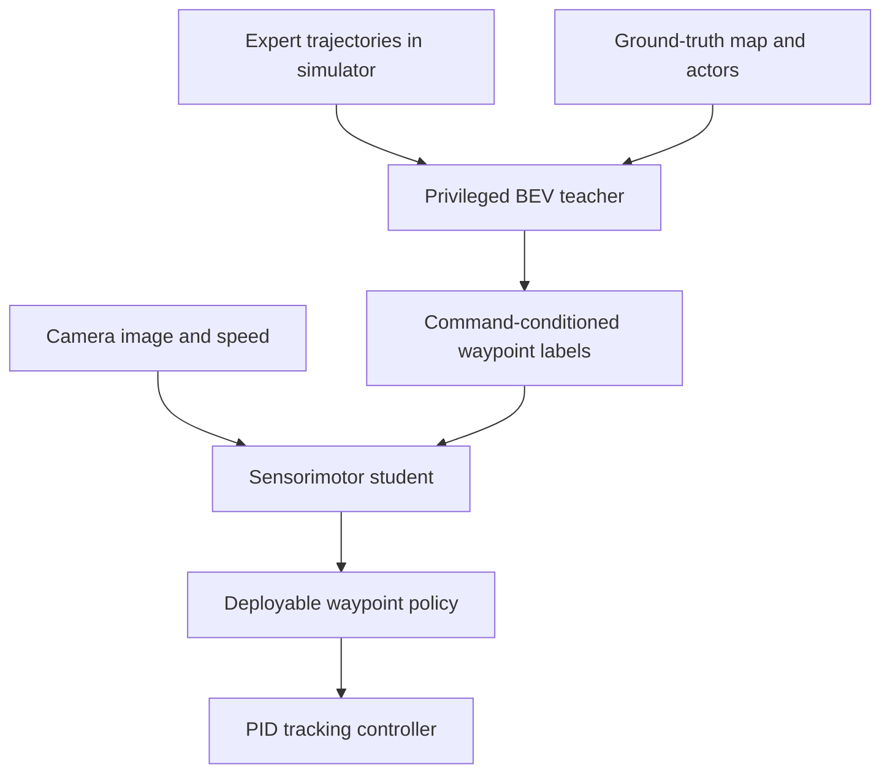

# Learning by Cheating (Chen et al., 2019)

Learning by Cheating, introduced by Chen, Zhou, and Koltun at CoRL 2019, is a two-stage imitation learning method for vision-based urban driving in CARLA. The idea is intentionally provocative: first train a privileged agent that "cheats" by seeing ground-truth simulator state, then use that agent as a teacher for a sensorimotor agent that sees only legitimate camera input.

The page belongs between [end-to-end driving](/cs/autonomous-driving/end-to-end-driving), [simulation and data](/cs/autonomous-driving/simulation-and-data), and [ChauffeurNet](/cs/autonomous-driving/chauffeurnet). The method does not claim that real vehicles can use privileged state. It uses privileged state during training to separate learning to act from learning to see, then distills the policy into a camera-based student.

## Definitions

A **privileged agent** is a training-time policy with access to information unavailable at test time. In CARLA, that can include ground-truth lane layout, traffic-light state, vehicle positions, and pedestrian positions in a BEV map.

A **sensorimotor agent** is the deployable policy. It maps real sensor input, such as a front-facing camera image and speed, to waypoints or controls. It does not receive the privileged simulator state.

The training decomposition is:

$$
\text{expert demonstrations}
\rightarrow
\text{privileged teacher}
\rightarrow
\text{vision student}.
$$

This is a form of **privileged distillation**. The teacher learns a robust policy using clean state. The student learns to imitate the teacher using raw observations.

The paper uses waypoint prediction. A policy outputs command-conditioned waypoint sequences:

$$
\hat{Y}^{(c)} = f_\theta(o,v,c),
$$

where $o$ is observation, $v$ is ego speed, and $c$ is a high-level navigation command such as left, right, straight, or follow lane.

A **soft-argmax waypoint head** predicts heatmaps over BEV cells and converts each heatmap into a continuous waypoint:

$$
\hat{w}=\sum_{x,y} [x,y]\frac{\exp(H_{xy})}{\sum_{u,v}\exp(H_{uv})}.
$$

For the privileged teacher, heatmaps align naturally with the BEV map. For the student, image features must learn the same driving-relevant structure.

## Key results

The source abstract reports that Learning by Cheating substantially outperformed prior state of the art on the CARLA benchmark and NoCrash benchmark at publication time. It reports 100 percent success rate on all tasks in the original CARLA benchmark, a new record on NoCrash, and an order-of-magnitude reduction in infractions compared with the prior state of the art. These are historical simulator benchmark claims, not real-world autonomy claims.

The core result is the training decomposition. Direct image-to-driving imitation is hard because the network must learn perception and control simultaneously. By giving the teacher privileged BEV state, the first stage largely removes perception difficulty. The teacher can focus on action. The student then receives dense supervision from a stronger policy, including command-conditioned outputs for branches not taken in the original demonstrations.

This produces three practical advantages:

1. The privileged teacher can use data augmentation in BEV space.
2. The teacher can provide on-policy supervision when the student visits new states.
3. The teacher can supervise all command branches, not only the route actually driven in a demonstration.

This last point is subtle. At an intersection, a human demonstration may only show "turn left." A command-conditioned privileged teacher can also answer "what would you do if the command were straight?" and "what would you do if the command were right?" for the same state. That increases supervision density.

The limitation is also clear: this method depends on simulation or another source of privileged training labels. If the simulator's privileged state, dynamics, or expert differs from the real world, the student can inherit those biases. It is a training strategy, not a replacement for validation.

The method is best understood as a way to improve supervision density. A single human demonstration provides one action for one state. A privileged teacher can provide actions for many command branches and can be queried when the student drifts from the demonstration distribution. That turns a fixed dataset into a more interactive source of labels. The idea is especially attractive in simulation because ground-truth state is cheap, while real-world counterfactual labels are expensive or impossible.

The separation between teacher and student also gives a debugging advantage. If the privileged teacher fails, the problem is likely action learning, route interpretation, or simulator expert quality. If the teacher succeeds but the student fails, the problem is likely visual perception, domain shift, or distillation. Direct camera-to-control behavior cloning often mixes these failures together, making it harder to know what to fix.

There is a safety caveat. A student can imitate the teacher's average behavior without inheriting the teacher's internal certainty. If the camera image is ambiguous, the student may output confident waypoints anyway. Practical use would need uncertainty estimates, fallback behavior, and tests under visual corruptions, weather shifts, and unusual traffic participants.

Learning by Cheating also helps explain why CARLA became such an important research tool. The method needs privileged state, on-policy rollouts, and repeatable hazardous situations. These are difficult or unsafe to obtain on public roads. Simulation makes the teacher possible and makes student mistakes cheap. The downside is the sim-to-real gap: camera appearance, traffic-agent behavior, and rare-event distributions may not match the real world. A student trained this way should therefore be evaluated as a simulator-trained policy, not as evidence that camera-only urban driving is solved.

The method's conceptual legacy is broader than its exact architecture. Many later systems use privileged teachers, expert autopilots, offline rollouts, or auxiliary BEV supervision to train deployable policies that see less at test time than their teachers saw during training.

For readers, the key habit is to ask what information is available at training time, what information is available at deployment time, and whether the distillation step preserves the behavior that matters for safety.

## Visual



| Stage | Input | Output | Purpose |
|---|---|---|---|
| Expert data | Simulator demonstrations | State-action traces | Initial supervision |
| Privileged teacher | Ground-truth BEV state | Robust waypoints | Learn to act |
| Student offline imitation | Camera plus teacher labels | Vision policy | Learn to see |
| Student on-policy imitation | Student rollouts plus teacher queries | Recovery behavior | Reduce distribution shift |

## Worked example 1: Soft-argmax waypoint

Problem: A one-dimensional heatmap over positions $x=0,1,2$ has unnormalized probabilities $[1,2,1]$ after exponentiation. Compute the soft-argmax waypoint.

1. Sum the weights:

$$
Z=1+2+1=4.
$$

2. Normalize:

$$
p=[1/4,2/4,1/4]=[0.25,0.5,0.25].
$$

3. Compute expected position:

$$
\hat{x}=0(0.25)+1(0.5)+2(0.25)=0+0.5+0.5=1.0.
$$

Answer: the continuous waypoint is $x=1.0$.

Check: The heatmap is symmetric around $x=1$, so the soft-argmax should return the center.

## Worked example 2: Branch supervision at an intersection

Problem: A command-conditioned policy has four branches: left, right, straight, and follow lane. A logged expert demonstration at an intersection contains only the left command. A privileged teacher can produce waypoint labels for all four branches in the same state. How many branch labels does this add compared with ordinary behavior cloning?

1. Ordinary behavior cloning observes one command branch: left.

2. Privileged teacher supervision can label four branches.

3. Additional branch labels:

$$
4-1=3.
$$

4. The supervision multiplier is

$$
\frac{4}{1}=4.
$$

Answer: the teacher adds 3 extra branch labels and gives 4 times as many command-branch labels for that state.

Check: This does not create new physical states, but it does improve command coverage in a state that already exists.

## Code

```python
import torch
import torch.nn.functional as F

def soft_argmax_2d(logits):
    # logits: [batch, height, width]
    b, h, w = logits.shape
    prob = F.softmax(logits.reshape(b, -1), dim=-1).reshape(b, h, w)
    yy, xx = torch.meshgrid(
        torch.arange(h, device=logits.device),
        torch.arange(w, device=logits.device),
        indexing="ij",
    )
    x = (prob * xx).sum(dim=(1, 2))
    y = (prob * yy).sum(dim=(1, 2))
    return torch.stack([x, y], dim=-1)

teacher_heatmaps = torch.randn(8, 4, 32, 32)  # batch, command, H, W
all_branch_waypoints = torch.stack(
    [soft_argmax_2d(teacher_heatmaps[:, c]) for c in range(4)],
    dim=1,
)
print(all_branch_waypoints.shape)
```

## Common pitfalls

- Thinking the final policy cheats. Only the teacher uses privileged state; the deployed student uses sensor input.
- Treating simulator success as real-world proof. The method depends on simulator fidelity and transfer.
- Forgetting on-policy supervision. Offline distillation alone does not solve distribution shift.
- Assuming privileged teachers are always available. Real-world logs rarely include perfect actor state and map truth.
- Distilling only the demonstrated branch. The method gains strength from supervising counterfactual command branches.
- Ignoring the controller. Waypoints still need a tracking controller with vehicle limits.

## Connections

- [End-to-end driving](/cs/autonomous-driving/end-to-end-driving)
- [Simulation and data](/cs/autonomous-driving/simulation-and-data)
- [ChauffeurNet](/cs/autonomous-driving/chauffeurnet)
- [Dynamic Conditional Imitation Learning](/cs/autonomous-driving/dynamic-conditional-imitation-learning)
- [TransFuser](/cs/autonomous-driving/transfuser)
- [Control, PID, MPC, Pure Pursuit, and Stanley](/cs/autonomous-driving/control-pid-mpc-pure-pursuit-stanley)
- Further reading: CILRS, NoCrash, CARLA, DAgger, privileged learning, and student-teacher distillation.
